# خواننده تلگرام

<!-- TOP_NAV START -->

<a href="https://github.com/HypoIReMIA/aio-downloader/blob/main/telegram/content/archive_1.md" style="display:inline-block; padding:6px 12px; margin:0 4px; background-color:#2ea44f; color:white; text-decoration:none; border-radius:4px; font-weight:bold;">صفحه بعد</a>

<!-- TOP_NAV END -->

<!-- MSG START -->

---
📅 بروزرسانی: 1405/03/12 03:38
---

## VahidOOnLine — post 243296

  <a href="telegram/content/VahidOOnLine_243296_1780358928.mp4" target="_blank">🎬 Download video</a>

♦️به گزارش رویترز، مقامات عراقی روز دوشنبه، ۱۱ خردادماه، اعلام کردند یک کشتی باری به نام «ساریسکا» در فاصله ۷۴ کیلومتر (۴۰ مایل دریایی) در جنوب شرقی بندر «ام‌قصر» عراق در خلیج فارس، هدف دو انفجار پی‌درپی قرار گرفته است. بر اساس بیانیه‌ای که شبکه خبر صداوسیما اعلام شد، نیروی دریایی سپاه مسئولیت این حمله را بر عهده گرفت و اعلام کرد که این کشتی را در یک «عملیات تلافی‌جوئی» با «یک موشک کروز» هدف قرار داده است. پیش از این، سازمان تجارت دریایی بریتانیا (UKMTO) گزارش داده بود که یک پرتابه به سمت راست کشتی برخورد و انفجار بزرگی ایجاد کرده است؛ مقامات عراقی نیز تایید کردند که انفجار دوم ناشی از یک حمله پهپادی بوده و آتش‌سوزی ناشی از این حملات در نهایت بر روی عرشه کشتی تحت کنترل درآمده است.
‌🇸🇦 Indypersian

🤖 @VahidOOnLine

## VahidOOnLine — post 243295

  <a href="telegram/content/VahidOOnLine_243295_1780358929.mp4" target="_blank">🎬 Download video</a>

مهدی تاج، رییس فدراسیون فوتبال، درباره محل کمپ تیم ملی گفت کمپ تیخوانای مکزیک خیلی بهتر از توسان آریزونای آمریکا است.
او با رد نگرانی‌ها درباره میزان تبهکاری در این شهر گفت ما دفاعی از آن‌ها نداریم و دادن مواد مخدر به همدیگر منتفی است و قرار نیست مردم آن‌جا را اصلاح و ارشاد کنیم.
‌🏁 🇬🇧 IranintlTV

🤖 @VahidOOnLine

## VahidOOnLine — post 243294

♦️به گزارش خبرگزاری فارس، سعید آجرلو، عضو تیم رسانه‌ای هیئت مذاکره‌کننده جمهوری اسلامی، با تشریح جزئیات آخرین پیشنهاد ارسالی آمریکا به تهران مدعی شد که واشنگتن در جدیدترین ویرایش متنی خود از موضع اولیه مبنی بر انتقال یا دفع مواد هسته‌ای ایران عقب‌نشینی کرده است. او با اشاره به اینکه در مراحل نخست مذاکرات، آمریکایی‌ها خواستار انتقال مواد غنی‌شده به ایالات متحده بودند و ایران این درخواست را رد کرد، افزود که در متن اخیر صرفا عباراتی چون «تعیین تکلیف»، «سرنوشت مواد» یا «حل‌وفصل مسئله» مطرح شده است. آجرلو به تداوم اختلافات درباره تنگه هرمز نیز اشاره کرد.
‌🇸🇦 Indypersian

🤖 @VahidOOnLine

## VahidOOnLine — post 243293

  

♦️به گزارش روزنامه ایران، وزارت آموزش عمومی مکزیک (SEP) به طور رسمی اعلام کرد که فرایند صدور مجوزهای حرفه‌ای و موقت پزشکی برای کادر درمانی تیم‌های ملی خارجی آغاز شده اما پرونده کادر پزشکی تیم ملی ایران هنوز به تأیید نهایی نرسیده و در دست بررسی است. بر اساس آیین‌نامه نظارتی دولت مکزیک، اداره کل مشاغل حرفه‌ای این کشور (DGP) به منظور قانونمند کردن خدمات درمانی در طول مسابقات، مجوزهای موقتی با اعتبار سه ماهه صادر می‌کند. این بازه زمانی، نه تنها روزهای برگزاری مسابقات (از ۲۲ خرداد تا ۱۴ تیر ۱۴۰۵) را پوشش می‌دهد، بلکه بازه اردویی پیش از جام جهانی و ریکاوری (احیا) پس از آن را نیز تضمین می‌کند.«خوزه عمر سانچس مولینا»، رئیس این اداره کل، اعلام کرده است که در مرحله دوم این طرح، پزشکان ۱۲ تیم بزرگ جهان از جمله اسپانیا، اروگوئه، کلمبیا، ژاپن، سوئد و کره جنوبی مجوزهای رسمی خود را دریافت کرده‌اند. با این حال، نام ایران در این فهرست دیده نمی‌شود؛ مقامات مکزیکی تأکید کرده‌اند که پرونده کادر درمانی ایران کماکان باز است و صدور اعتبارنامه‌ها منوط به تکمیل و ارائه کامل مدارک و مستندات پزشکی از سوی فدراسیون فوتبال جمهوری اسلامی ایران خواهد بود. روزنامه ایران می‌نویسد، حالا فدراسیون فوتبال که درگیر حل بحران ویزای چندبار ورود بازیکنان به آمریکاست، باید هرچه سریع‌تر فرایند ارسال و تکمیل مدارک پزشکی کاروان خود را به سرانجام برساند و اگر فدراسیون نتواند در مدت زمان اعلامی مجوز فعالیت پزشکان تیم را بگیرد، احتمالا شاهد استفاده از پزشکان مکزیکی در کمپ تیم ایران خواهیم بود.
‌🇸🇦 Indypersian

🤖 @VahidOOnLine

## VahidOOnLine — post 243292

  

♦️بانک مرکزی نرخ تورم نقطه به نقطه در اردیبهشت ماه را ۷۷.۲ درصد اعلام کرد.بنابر اعلام روابط عمومی بانک مرکزی، شاخص بهای کالاها و خدمات مصرفی در مناطق شهری ایران (شاخص تورم) در اردیبهشت ماه ۱۴۰۵ به عدد ۶۶۷.۵ رسید که نسبت به ماه قبل معادل ۸.۵ درصد افزایش داشت.نرخ تورم در ۱۲ ماه منتهی به اردیبهشت ماه ۱۴۰۵ نیز نسبت به ۱۲ ماه منتهی به اردیبهشت ماه ۱۴۰۴ معادل ۵۳.۹ درصد شد.
‌🇸🇦 Indypersian

🤖 @VahidOOnLine

## VahidOOnLine — post 243291

  

محمدباقر قالیباف در تماس با نبیه بری، رییس مجلس لبنان، گفت که چنانچه توافقی برای پایان جنگ بین جمهوری اسلامی و آمریکا شکل بگیرد شامل توقف حملات در همه جبهه‌ها به ویژه لبنان خواهد بود. او افزود: « پیوند جمهوری اسلامی و لبنان ناگسستنی است و جان ما و شما یکی است.»
‌🏁 🇬🇧 IranintlTV

🤖 @VahidOOnLine

## VahidOOnLine — post 243290

  <a href="telegram/content/VahidOOnLine_243290_1780358932.mp4" target="_blank">🎬 Download video</a>

♦️جعفر پناه‌پور، محیط‌‌بان و عکاس حیات وحش، روز دوشنبه ۱۱ خردادماه، ویدیویی از یک پلنگ ایرانی را که در میان پوشش گیاهی پارک ملی گلستان دیده می‌شود، در اینستاگرام منتشر کرد.

پارک ملی گلستان یکی از مهم‌ترین زیستگاه‌های این گونه ارزشمند به شمار می‌رود و نقش مهمی در حفاظت از آن دارد.

پلنگ ایرانی در فهرست گونه‌های در معرض خطر قرار دارد و پارک ملی گلستان با تنوع زیستی کم‌نظیر خود، از مهم‌ترین مناطق حفاظت‌شده کشور برای حفظ و بقای این گونه محسوب می‌شود.
‌🇸🇦 Indypersian

🤖 @VahidOOnLine

## VahidOOnLine — post 243289

  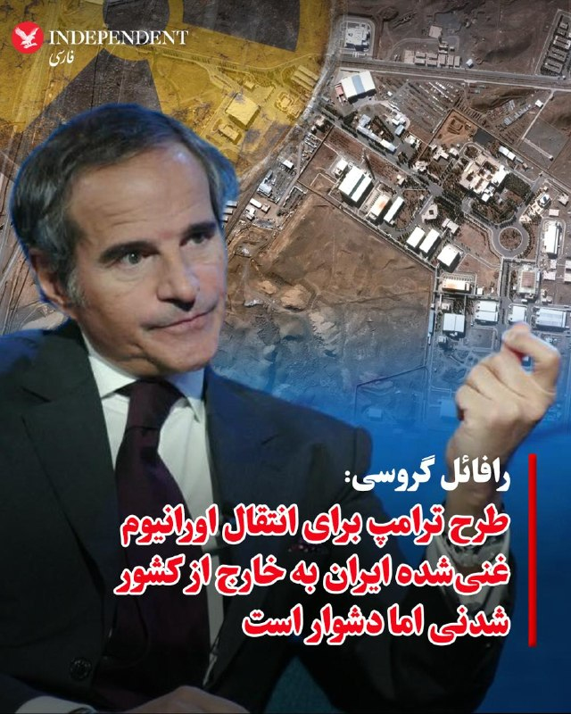

♦️رافائل گروسی، مدیرکل آژانس بین‌المللی انرژی اتمی، در گفتگو با «الجزیره» در پاسخ به سوالی درباره طرح دونالد ترامپ مبنی بر خارج کردن اورانیوم غنی‌شده از ایران گفت: «این کار دشوار است، اما غیرممکن نیست.» گروسی با اشاره به چالش‌های فنی این اقدام توضیح داد: «انتقال این مواد آسان نیست، زیرا به شکل گاز است و آلودگی بالایی دارد. بنابراین عملیات ساده‌ای نخواهد بود، اما با این حال قابل انجام است.» او همچنین به گزینه‌های جایگزین دیگر اشاره کرد و افزود: «گزینه‌های دیگری نیز وجود دارد که پیش‌تر مورد بررسی قرار گرفته‌اند، مانند رقیق‌سازی این مواد. از آنجا که ایران اکنون اورانیوم را تا ۶۰ درصد غنی‌سازی کرده و به درجه نظامی (۹۰ درصد) بسیار نزدیک شده است، رقیق‌سازی آن به سطوح بسیار پایین‌تر می‌تواند مدیریت این پرونده را آسان‌تر کند.»
‌🇸🇦 Indypersian

🤖 @VahidOOnLine

## VahidOOnLine — post 243288

  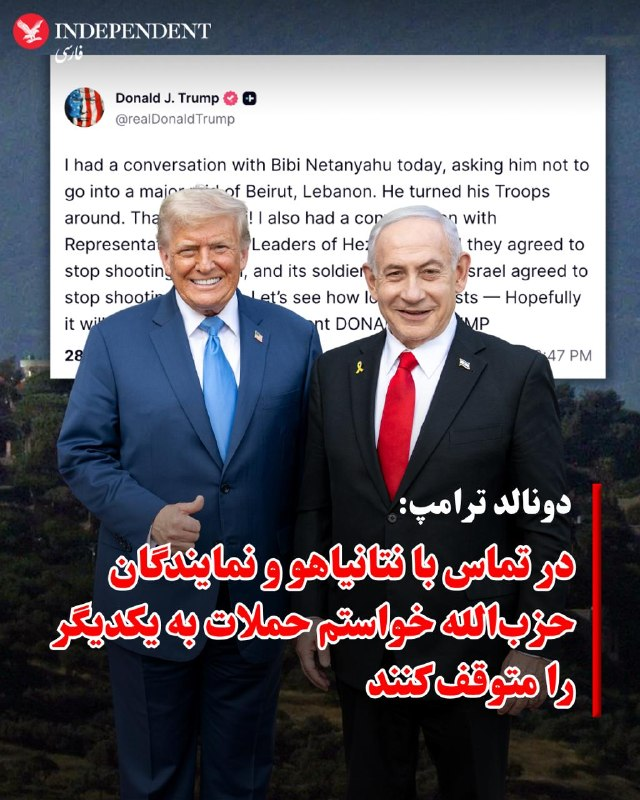

♦️دونالد ترامپ، رئیس‌جمهوری آمریکا، با انتشار پیامی در شبکه اجتماعی «تروث سوشال» درباره جزئیات رایزنی‌های خود برای توقف درگیری‌ها در لبنان نوشت: «امروز گفتگویی با بنیامین نتانیاهو داشتم و از او خواستم که دست به یک حمله بزرگ در بیروت نزند، او نیروهایش را بازگرداند.» ترامپ افزود: «من همچنین گفتگویی با نمایندگان رهبران حزب‌الله داشتم و آن‌ها موافقت کردند که شلیک به سمت اسرائیل و سربازانش را متوقف کنند. به همین ترتیب، اسرائیل هم موافقت کرد که شلیک به سمت آن‌ها را متوقف کند.» رئیس‌جمهوری آمریکا در پایان پیام خود با ابراز امیدواری نسبت به پایداری این وضعیت نوشت: «ببینیم این وضعیت چقدر دوام می‌آورد. امیدوارم که برای همیشه باشد».
‌🇸🇦 Indypersian

🤖 @VahidOOnLine

## VahidOOnLine — post 243287

  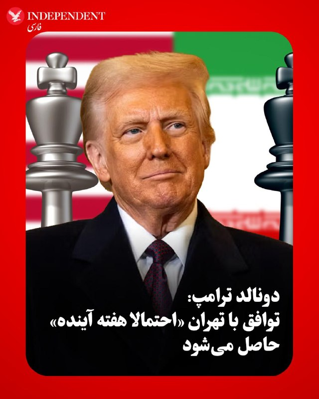

♦️دونالد ترامپ، رئیس‌جمهوری آمریکا، در گفتگوی تلفنی با شبکه خبری «ای‌بی‌سی نیوز» اعلام کرد که به نظر او، توافق با تهران برای تمدید آتش‌بس و بازگشایی تنگه هرمز «طی هفته آینده» حاصل خواهد شد. ترامپ روز دوشنبه در گفتگو با جاناتان کارل، خبرنگار ارشد این شبکه در واشنگتن، با ابراز خوش‌بینی گفت: «اوضاع خوب به نظر می‌رسد.» رئیس‌جمهوری آمریکا با اشاره به تنش‌های اخیر افزود: «امروز مشکل کوچکی پیش آمد، اما همان‌طور که احتمالا پیش‌تر متوجه شدید، من خیلی سریع آن را برطرف کردم.» او توضیح داد که این مشکل ناشی از ناراحتی و عصبانیت مقام‌های ایران از حملات اسرائیل به لبنان بوده است؛ ترامپ در تشریح نحوه حل این بحران گفت: «من با حزب‌الله صحبت کردم و گفتم تیراندازی نکنید؛ با بنیامین نتانیاهو، نخست‌وزیر اسرائیل هم صحبت کردم و گفتم تیراندازی نکنید، و هر دو طرف شلیک به یکدیگر را متوقف کردند.»
‌🇸🇦 Indypersian

🤖 @VahidOOnLine

## VahidOOnLine — post 243286

♦️مهدی تاج، رئیس فدراسیون فوتبال، در گفتگو با صداوسیما در پاسخ به ابهامات و نگرانی‌ها درباره ناامنی شهر «تیخوانا» در مکزیک و حضور گسترده گروه‌های بزرگ مخدر در این منطقه گفت: «ما کار به موادفروش‌ها نداریم و نمی‌خواهیم بروم آنجا اصلاحشان کنیم». تاج با رد آمارهای مربوط به ناامنی این شهر مدعی شد که طبق گفتگوهایش با سفیر و استاندار منطقه، شرایط مناسب است و افزود: «در همه‌جا جرم و جنایت هست.»
‌🇸🇦 Indypersian

🤖 @VahidOOnLine

## VahidOOnLine — post 243285

  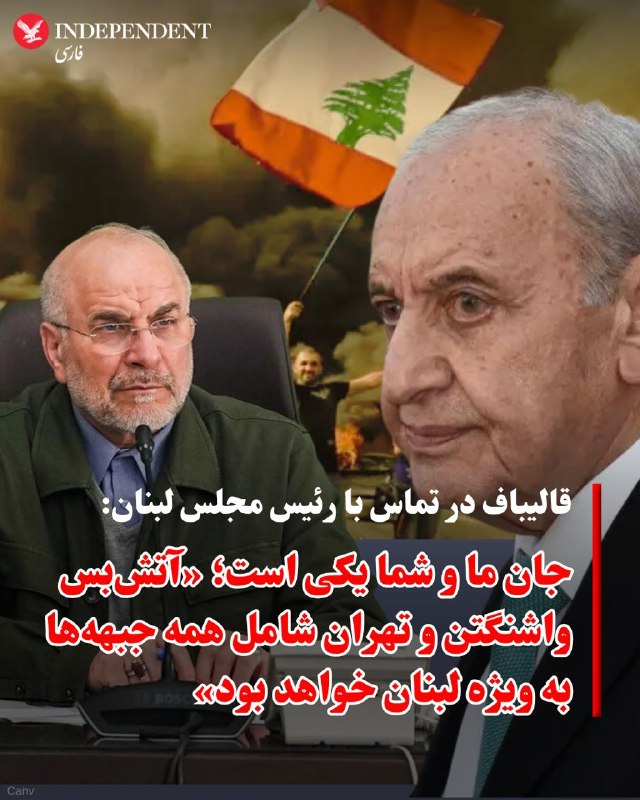

♦️ به گزارش فارس، خبرگزاری وابسته به سپاه، محمدباقر قالیباف، رئیس مجلس شورای اسلامی روز دوشنبه، در تماس تلفنی با نبیه بری، رئیس مجلس لبنان با تاکید به اینکه «پیوند جمهوری اسلامی و لبنان ناگسستنی است» گفت: «جان ما و شما یکی است و چنانچه توافقی برای پایان جنگ بین ایران و آمریکا شکل بگیرد، این آتش‌بس شامل توقف حملات در همه جبهه‌ها به‌ویژه لبنان خواهد بود.» قالیباف با اشاره به اینکه در دو روز گذشته توقف حملات اسرائیل با جدیت دنبال شده است، گفت در صورت تداوم این حملات، تهران نه‌تنها روند گفتگوها را متوقف می‌کند، بلکه در برابر این اقدامات خواهد ایستاد. براساس این گزارش، در مقابل، رئیس مجلس لبنان با تقدیر از تلاش‌های جمهوری اسلامی، تاکید کرد که لبنان هرگز مواضع تهران را در این مرحله حساس فراموش نخواهد کرد.
‌🇸🇦 Indypersian

🤖 @VahidOOnLine

## VahidOOnLine — post 243284

  <a href="telegram/content/VahidOOnLine_243284_1780358934.mp4" target="_blank">🎬 Download video</a>

♦️مهدی تاج، رئیس فدراسیون فوتبال، در گفتگو با صداوسیما، با اشاره به هزینه‌های سنگین ارزی و دشواری‌های هماهنگ کردن بازی‌های تدارکاتی برای تیم ملی اعلام کرد: «ما ۱۰۰ هزار دلار به مالی دادیم که بیاید. پول هواپیمایشان را دادیم، پول هتلشان را هم دادیم. در این شرایط بازی هماهنگ کردن خیلی سخت است». بر اساس گزارش‌ها، تیم ملی که تاکنون موفق به بازی با هیچ‌کدام از تیم‌های راه‌یافته به جام جهانی نشده و پس از لغو مسابقات با اسپانیا، پرتغال، مقدونیه و آنگولا، حتی ناچار به انجام بازی درون‌تیمی و دیدار با گامبیا (تیم ۱۱۶ دنیا) شده بود، قرار است روز پنجشنبه ۱۴ خرداد در آنتالیا به مصاف مالی برود.
‌🇸🇦 Indypersian

🤖 @VahidOOnLine

## VahidOOnLine — post 243283

  

♦️خبرگزاری صداوسیما، روز دوشنبه، به نقل از روابط عمومی سپاه قم اعلام کرد که دو عضو این نهاد به نام‌های «حسین رمضانیان فردویی» و «محمد اویسی»، بر اثر «انفجار پرتابه‌های باقی‌مانده از جنگ اخیر» در جبهه‌های دفاعی این استان کشته شده‌اند. پیش از این نیز، سپاه انصارالمهدی زنجان، ۱۱ اردیبهشت خبر داد که حین «عملیات خنثی‌سازی مهمات عمل‌نکرده» جنگ چهل روزه، ۱۴ نفر از نیروهایش کشته شده‌اند. بر این اساس، تعداد تلفات سپاه در دوره آتش‌بس موقت جاری میان واشنگتن با تهران، دستکم به ۱۶ نفر افزایش یافت.
‌🇸🇦 Indypersian

🤖 @VahidOOnLine

## VahidOOnLine — post 243282

  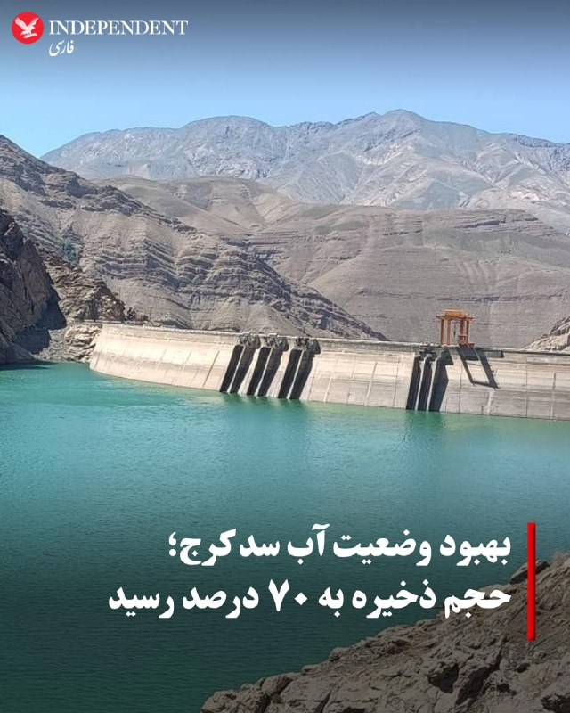

♦️به گزارش انتخاب، با افزایش بارندگی‌ها و بهبود چشمگیر ورودی آب، میزان پرشدن مخزن سد امیرکبیر (کرج) به حدود ۷۰ درصد ظرفیت خود رسیده است که این موضوع پس از سال‌ها خشکسالی و کاهش مداوم ذخایر، «نویدبخش بهبود وضعیت منابع آبی» برای میلیون‌ها ساکن پایتخت و استان البرز است. این سد با ظرفیت بیش از ۱۸۰ میلیون مترمکعب، از اصلی‌ترین منابع تامین آب شرب تهران و کرج به شمار می‌رود و اگرچه افت محسوس سال‌های گذشته را تا حدی جبران کرده، اما کارشناسان حوزه آب همچنان تاکید دارند که این بهبود نسبی نباید موجب غفلت از مدیریت مصرف و ضرورت صرفه‌جویی در جامعه شود.
‌🇸🇦 Indypersian

🤖 @VahidOOnLine

## VahidOOnLine — post 243281

  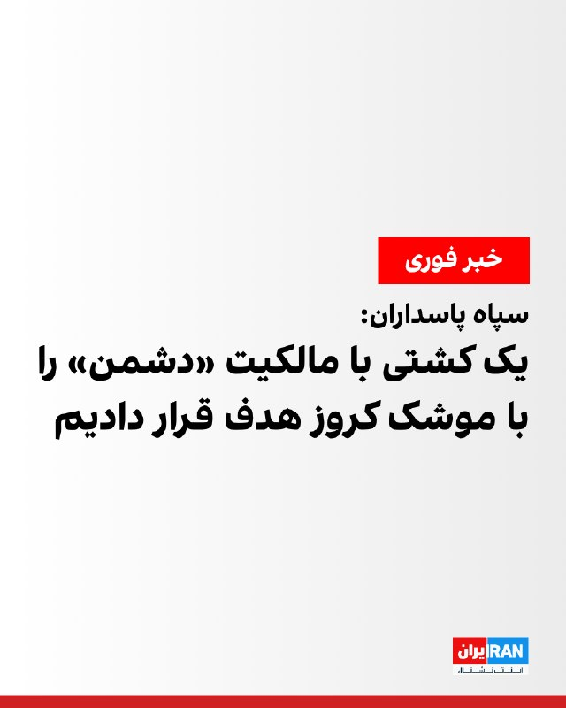

روابط عمومی نیروی دریایی سپاه اعلام کرد که در پی حمله ارتش آمریکا به کشتی ایرانی «لیان استار» در محدوده دریای عمان، نیروی دریایی سپاه طی یک عملیات مقابله به مثل، کشتی «ام‌اس‌سی. ساریسکا» با مالکیت «دشمن آمریکایی-اسرائیلی» را با موشک کروز مورد هدف قرار داد.
‌🏁 🇬🇧 IranintlTV

🤖 @VahidOOnLine

## VahidOOnLine — post 243280

  <a href="telegram/content/VahidOOnLine_243280_1780358937.mp4" target="_blank">🎬 Download video</a>

♦️ روابط عمومی سپاه، روز دوشنبه، ۱۱ خردادماه، با انتشار تصاویری از شلیک موشک، خبر از هدف قرار دادن یک کشتی «با مالکیت آمریکا و اسرائیل» در محدوده دریای عمان داد. سپاه نوشت: در پی حمله ارتش آمریکا به کشتی ایرانی «لیان استار» در محدوده دریای عمان، نیروی دریایی سپاه طی یک عملیات مقابله به مثل، کشتی «msc. sariska» با مالکیت امریکا و اسرائیل را با موشک کروز مورد هدف قرار داد. نیروی دریایی سپاه اعلام کرد: «هر گونه حمله امریکا در این منطقه با پاسخ قاطع روبرو خواهد شد».
‌🇸🇦 Indypersian

🤖 @VahidOOnLine

## VahidOOnLine — post 243279

  

بنیامین نتانیاهو، نخست‌وزیر اسرائیل، در شبکه ایکس نوشت: با ترامپ گفت‌وگو کردم و به او گفتم اگر حزب‌الله حملات خود به شهرها و غیرنظامیان ما را متوقف نکند، اسرائیل اهداف «تروریستی» را در بیروت هدف قرار خواهد داد.
او افزود: این موضع ما همچنان پابرجاست و همزمان ارتش اسرائیل طبق برنامه، به عملیات خود در جنوب لبنان ادامه می‌دهد.
‌🏁 🇬🇧 IranintlTV

🤖 @VahidOOnLine

## VahidOOnLine — post 243278

  

♦️بنیامین نتانیاهو، نخست‌وزیر اسرائیل، شامگاه دوشنبه ۱۱ خرداد ماه اعلام کرد در گفتگوی تلفنی با دونالد ترامپ، رئیس‌جمهوری آمریکا، به او گفته است که در صورت ادامه حملات حزب‌الله، اسرائیل اهدافی را در بیروت هدف قرار خواهد داد.

دفتر نخست‌وزیر اسرائیل روز دوشنبه در بیانیه‌ای به نقل از نتانیاهو اعلام کرد: «امشب با رئیس‌جمهوری ترامپ صحبت کردم و به او گفتم اگر حزب‌الله حمله به شهرها و شهروندان ما را متوقف نکند، اسرائیل اهداف تروریستی را در بیروت هدف قرار خواهد داد.»
نتانیاهو افزود: «موضع ما در این زمینه تغییری نکرده است.»

او همچنین تاکید کرد ارتش اسرائیل به عملیات خود در جنوب لبنان طبق برنامه ادامه خواهد داد.

این اظهارات ساعاتی پس از آن مطرح شد که ترامپ در شبکه اجتماعی تروث سوشال از توافق برای توقف درگیری‌ها میان اسرائیل و حزب‌الله خبر داد و اعلام کرد نیروهای اسرائیلی که به گفته او در مسیر حمله به بیروت بودند، بازگردانده شده‌اند.
‌🇸🇦 Indypersian

🤖 @VahidOOnLine

## VahidOOnLine — post 243277

♦️ویدیویی از لحظه حمله هوایی به «شرکت تولید پنجره دوجداره آسا» در جریان جنگ اخیر ایران و آمریکا و اسرائیل مورد توجه کاربران شبکه‌های اجتماعی قرار گرفته است.
رسانه‌های رسمی ایران، روز ۲۵ اسفند ماه سال گذشته از حمله به این شرکت تولیدی خبر داده بودند، اما به دلیل قطع اینترنت در ۸۸ روز گذشته، تصاویر این حمله به تازگی منتشر شده است.
گزارش شده است که دو حمله پیاپی این کارخانه را هدف قرار داده اما دوربین‌های مداربسته فقط تصاویر حمله اول را ثبت کردند.
به گزارش خبرگزاری دولتی دانشجو، پس از حملات هوایی تولید این کارخانه که حدود ۱۰۰ کارگر داشت، به دلیل خسارات گسترده متوقف شده است.
‌🇸🇦 Indypersian

🤖 @VahidOOnLine

## WithYashar — post 13225

https://t.me/boost/withyashar

بوست دار میریزه ۳۸۰ تا دیگه لازم داره. لطفاً این پیام رو برای تمام دوستانتون که تلگرام پرمیوم(تیک) دارن بفرستین و ازشون خواهش کنین که چنل رو بوست کنن ❤️‍🩹چیزی‌ تا ایموجی آزاد بشه🤰🫃🏻

## WithYashar — post 13224

  <a href="telegram/content/WithYashar_13224_1780358939.mp4" target="_blank">🎬 Download video</a>

مردم شهر…
@withyashar

## WithYashar — post 13223

ادعای آکسیوس: درگیری نتانیاهو و ترامپ بالا گرفت

ترامپ امروز در تماس تلفنی با نتانیاهو عصبانی شد:
"تو کاملاً دیوانه‌ای. اگر من نبودم، الان تو زندان بودی.
من دارم از تو محافظت می‌کنم.
الان همه از تو متنفرند. همه به خاطر این موضوع از اسرائیل متنفرند. تو چه غلطی داری می‌کنی؟"

@withyashar

## WithYashar — post 13222

هگست وزیر جنگ آمریکا: آماده‌ایم به جنگ برگردیم
@withyashar

## WithYashar — post 13220

  

ترامپ در تروث : «من امروز با بیبی نتانیاهو گفت‌وگو کردم و از او خواستم وارد یک یورش گسترده به بیروت، لبنان نشود. او نیروهایش را متوقف کرد و بازگرداند. از تو ممنونم بیبی!

همچنین با نمایندگان رهبران حزب‌الله گفت‌وگو کردم و آنها موافقت کردند که تیراندازی به سمت اسرائیل و نیروهایش را متوقف کنند. به همین ترتیب، اسرائیل نیز موافقت کرد که به آنها شلیک نکند.

باید دید این وضعیت چه‌قدر دوام می‌آورد, امیدواریم برای همیشه باقی بماند!

رئیس‌جمهور دونالد جی. ترامپ»
@withyashar

## WithYashar — post 13219

ترامپ به ABC: با اسرائیل و حزب‌الله گفت‌وگو کردم و به آنها گفتم که دیگر بس است.

من هنوز با این توافق موافقت نکرده‌ام و هنوز باید چند امتیاز دیگر بگیرم.

کار ساده‌ای نیست. شما درباره یک کشور واقعاً بزرگ صحبت می‌کنید، آنها یک کشور بسیار بزرگ هستند که می‌خواهد توافق کند. خصومت فوق‌العاده‌ای وجود دارد، واقعاً.

او ادامه داد: «بنابراین این کار برای آنها آسان نیست. در واقع از منظر ما هم آسان نیست. اما ما داریم آنچه را که نیاز داریم به دست می‌آوریم.»

مردم ایران مرا دوست دارند زیرا رژیم را عوض کردم
@withyashar

## WithYashar — post 13218

ترامپ به ای‌بی‌سی نیوز:
احتمال داره طی یک هفته آینده با ایران به توافق برسیم، همه چیز خیلی خوب پیش میره؛ توافق صلح با ایران میتونه حتی بهتر از یک پیروزی نظامی باشه.
@withyashar

## WithYashar — post 13217

  

توییت جدید کاخ سفید: به ترامپ اعتماد کنید. فقط بنشینید و آرام باشید، در نهایت همه‌چیز خوب پیش خواهد رفت همیشه همین‌طور بوده است!
رئیس‌جمهور دونالد جی. ترامپ
@withyashar

## WithYashar — post 13216

WarRoom with YASHAR pinned «پست شد اینستاگرام سر‌ساعت https://www.instagram.com/p/DZDi1pCEfvI/?igsh=MWN3ZWNhdWxqbmk0OA== لطفاً این پست را استوری کنید و برای تمام افراد مرتبط با شاهزاده رضا پهلوی و شخص خود ایشان و تمامی پیجهای ایشان ارسال کنید.»

## WithYashar — post 13215

شروط حزب الله برای آتش بس:

آتش بس فراگیر در تمامی مناطق لبنان
عقب نشینی کامل ارتش اسرائیل از جنوب لبنان
عدم تجاوز به خاک کشور

در غیر اینصورت حزب الله اعلام کرده توافقی در کار نیست.
@withyashar

## WithYashar — post 13214

## WithYashar — post 13213

قالیباف در تماس تلفنی با همتای لبنانی:
مصمم هستیم در سراسر لبنان آتش بس برقرار کنیم. در دو روز گذشته به طور جدی به دنبال توقف حملات اسرائیل بودیم. اگر جنایات اسرائیل در لبنان ادامه پیدا کنه، مذاکرات رو متوقف می‌کنیم و در مقابل آن می‌ایستیم.
@withyashar

## WithYashar — post 13212

محمد رضا شاه پهلوی چرا اونجوری شد ؟ مگه مردم چیزیشون کم بود ؟ نه ! چون بیشتر ما حسودیم چشم دیدن همو نداریم ! حالا اینو تو کل تاریخ هم بری ‌میبینی ! تو یه شهر کوچیک میبینی ! میبینی که همون دوستاتن که میفروشنت ! اگه مهارجت کرده باشی میبینی که فقط خودی بهت میزنه ! 😞و این داستان ادامه دارد…

## WithYashar — post 13211

داداش مثل اینکه کون خیلیارو سوزوندی دارن جر میدن خودشونو

## WithYashar — post 13210

هم اکنون شلیک موشک از سمت حزب الله به شمال اسرائیل
@withyashar

## WithYashar — post 13209

نتانیاهو :موضع ما در حمله به بیروت تغییری نکرده است.
@withyashar

## WithYashar — post 13208

حزب‌الله پیشنهاد آتش‌بس جزئی را رد کرد
@withyashar

## WithYashar — post 13207

نیروی دریایی ۳پا کشتی «msc. sariska» با مالکیت  امریکایی اسرائیلی را هدف قرار داد.
@withyashar

## WithYashar — post 13206

@withyashar مسیر ما

## WithYashar — post 13205

## mwarmonitor — post 10015

یک زلزله بزرگ با قدرت ۶.۵ ریشتر جنوب ایتالیا را لرزاند.

## mwarmonitor — post 10014

«نه فقط کله‌زرد، بلکه تو زرد از آب دراومد»

## mwarmonitor — post 10013

"You're fucking crazy":
خشم شدید ترامپ از نتانیاهو در تماس تلفنی مربوط به لبنان

📝نویسندگان: باراک راوید، مارک کاپوتو

🔰به گفته دو مقام آمریکایی و یک منبع سومِ مطلع، پرزیدنت ترامپ روز دوشنبه در یک تماس تلفنیِ پر از الفاظ رکیک، به دلیل تشدید تنش‌های اسرائیل در لبنان، به بنیامین نتانیاهو، نخست‌وزیر اسرائیل، به‌شدت تاخت.

📌چرا این موضوع اهمیت دارد؟
پیش از این تماس در روز دوشنبه، ایران تهدید کرده بود که به دلیل اقدامات اسرائیل در لبنان، مذاکرات خود با ایالات متحده را متوقف خواهد کرد. به گفته دو تن از منابع، ترامپ در این تماس نتانیاهو را «دیوانه» خطاب کرد و او را به نمک‌نشناسی متهم نمود. او همچنین مانع از اجرای طرح اسرائیل برای حمله به بیروت شد.

پشت صحنه ماجرا
انزوای اسرائیل: یک مقام آمریکایی گفت ترامپ به نتانیاهو هشدار داده است که عملی کردن تهدیدهایش مبنی بر بمباران پایتخت لبنان، اسرائیل را در جهان منزوی‌تر خواهد کرد.
ادعای ترامپ درباره دادگاه نتانیاهو: دو تن از منابع اعلام کردند ترامپ ادعا کرده که به دور نگه داشتن نتانیاهو از زندان کمک کرده است؛ که این اشاره‌ای است به حمایت‌های او از نتانیاهو در طول پرونده محاکمه‌اش به اتهام فساد مالی.
خلاصه اظهارات ترامپ به نتانیاهو از زبان یک مقام آمریکایی:
«تو بدجوری دیوونه‌ای. اگر من نبودم الان تو زندان بودی. دارم باامت رو نجات میدم. الان همه ازت متنفرن. به خاطر این کارها، همه دارن از اسرائیل متنفر میشن.»
یک منبع دومِ مطلع از این تماس نیز گفت که ترامپ «به‌شدت عصبی» بود و در بخشی از مکالمه با فریاد به نتانیاهو گفت: «داری چه غلطی می‌کنی؟»
دلایل اصلی تنش
به گفته این مقام آمریکایی، ترامپ می‌دانست که حزب‌الله به سمت اسرائیل شلیک کرده و اسرائیل نیاز به دفاع از خود دارد، اما احساس می‌کرد که نتانیاهو در روزهای اخیر به شکلی نامتناسب در حال تشدید تنش‌ها است.
علاوه بر تهدیدها علیه بیروت، اسرائیل عملیات زمینی خود را در جنوب لبنان گسترش داده است.
یک مقام آمریکایی دیگر گفت ترامپ از اینکه اسرائیل غیرنظامیان زیادی را در لبنان کشته، نگران است و با شیوه اسرائیلی‌ها برای تخریب کامل ساختمان‌ها جهت از بین بردن تنها یک فرمانده حزب‌الله، مخالفت کرده است.
وضعیت فعلی
یک مقام اسرائیلی به آکسیوس گفت که اسرائیل دیگر برنامه‌ای برای حمله به اهداف حزب‌الله در بیروت ندارد.
تحلیل ماجرا (پشت پرده)
ترامپ و نتانیاهو در گذشته نیز چندین تماس تلفنی متشنج داشته‌اند، اما همچنان در موضوع ایران و مسائل دیگر همکاری نزدیکی با یکدیگر دارند. با این حال، یک مقام مسئول گفت این یکی از بدترین تماس‌های ترامپ با نتانیاهو از زمان بازگشت او به کاخ سفید بوده است.
به نظر می‌رسد خشم ترامپ ناشی از این بوده که تصمیم نتانیاهو برای تشدید تنش در لبنان، مذاکرات او با ایران را در آستانه فروپاشی قرار داده بود. پس از این تماس، ترامپ در شبکه اجتماعی «تروث سوشال» پست کرد که مذاکرات با ایران «با سرعتی بالا در حال جریان است».
موضع طرف مقابل
نتانیاهو پس از این تماس بیانیه‌ای صادر کرد و گفت به ترامپ اعلام کرده است که اگر حزب‌الله دست از حمله به اسرائیل برندارد، اسرائیل به اهدافی در بیروت حمله خواهد کرد و در عین حال، اسرائیل به عملیات خود در جنوب لبنان ادامه خواهد داد.
نتانیاهو نوشت: «موضع ما تغییر نکرده است.»
اما مقام دوم آمریکایی ادعا کرد که در واقعیت، ترامپ در این تماس نتانیاهو را «مرعوب و تسلیم» کرده است. به گفته این مقام، بیبی (نتانیاهو) در پاسخ گفته است: «باشه، باشه، فقط مطمئن شو که همه چیز روبه‌راه میشه.»
دفتر نتانیاهو به درخواست آکسیوس برای اظهار نظر در این باره پاسخی نداد.
مواردی که باید زیر نظر داشت
منابع به آکسیوس می‌گویند تفاهم‌نامه‌ای که ایالات متحده و ایران در حال مذاکره روی آن هستند، خواهان پایان یافتن درگیری‌ها در لبنان است. همین موضوع، علت تماس متشنج قبلی میان ترامپ و نتانیاهو نیز بوده است.

@mwarmonitor

## mwarmonitor — post 10012

  <a href="telegram/content/mwarmonitor_10012_1780358943.mp4" target="_blank">🎬 Download video</a>

🔸تصاویر حمله به تأسیسات نفت و گاز ایران در عسلویه در جریان جنگ اخیر.

@mwarmonitor

## mwarmonitor — post 10011

  

🔴«امروز با بی‌بی نتانیاهو گفتگو کردم و از او خواستم که حمله گسترده‌ای به بیروت در لبنان انجام ندهد. او نیروهایش را بازگرداند. ممنونم بی‌بی! من همچنین گفتگویی با نمایندگان رهبران حزب‌الله داشتم و آن‌ها موافقت کردند که شلیک به سمت اسرائیل و سربازانش را متوقف کنند. به همین ترتیب، اسرائیل نیز موافقت کرد که شلیک به سمت آن‌ها را متوقف کند. بیایید ببینیم این وضعیت چقدر دوام خواهد آورد — امیدوارم برای همیشه (تا ابد) باشد!

رئیس‌جمهور دونالد جی. ترامپ»

@mwarmonitor

## mwarmonitor — post 10010

  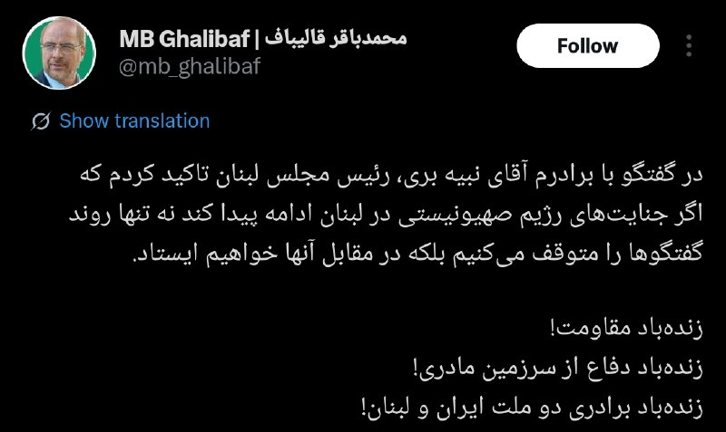

📝 اینکه قالیباف با وقاحت از «برادری دو ملت ایران و لبنان» و «دفاع از سرزمین مادری» دم می‌زند، اوج یک کمدی تهوع‌آور است. این انگل‌زادگان سیاسی در حالی برای توقف گفتگوها و ایستادگی حماسی نسخه می‌پیچند که هیچ رابطه دیپلماتیک واقعی میان ملت لبنان و آن‌ها وجود ندارد؛ سفیر بی‌کفایتشان حتی پس از اخراج، با وقاحت تمام در بیروت ماند تا در بغل صیغه‌های شیعه حزب‌الله به ریش هر دو ملت بخندد. حقیقت تلخ این تئاتر مضحک آن است که جمهوری اسلامی و حزب‌الله مانند یک تومور سرطانی و بی‌درمان، شیره جان دو ملت را می‌مکند؛ قالیباف و هم‌فکرانش نگران مردم مظلوم لبنان نیستند، بلکه تنها واهمه آن‌ها، نابودی همان نطفه سرطانی و دست‌پرورده‌ای است که بقای ایدئولوژیک و سفره‌های غارتگری‌شان به آن وابسته‌ است.

@mwarmonitor

## mwarmonitor — post 10009

🔴بر اساس گزارش ABC، یک فرد مسلح در یک کلینیک پزشکی در منطقه پلیکن نَروز در استان ساسکاچوان کانادا گزارش شده است. پلیس اعلام کرد فرد مظنون لباس کاملاً سیاه بر تن دارد و صورتش پوشیده است.

@mwarmonitor

## mwarmonitor — post 10008

  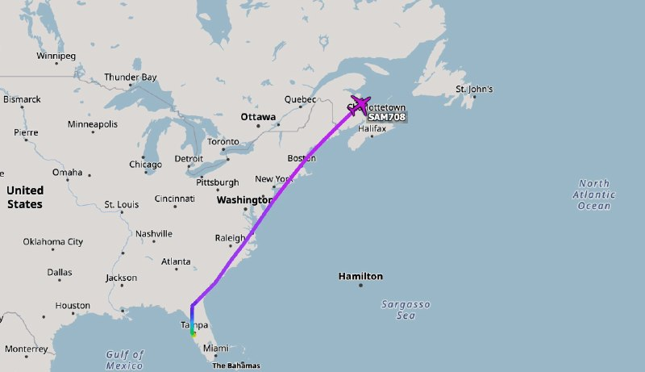

USAF نیروی هوایی ایالات متحده –✈️ جابه‌جایی‌های ویژه (VIP)

✈️یک فروند Boeing C-40 Clipper
شماره رجیستر: AE11F6 01-0041 – SAM 708

🔴پرواز SAM 708 از پایگاه هوایی مک‌دیل به مقصد فرودگاه اشتوتگارت در آلمان انجام شد؛ که به‌احتمال زیاد حامل برد کوپر، فرمانده فرماندهی مرکزی ایالات متحده (USCENTCOM) بوده است.

@mwarmonitor

## mwarmonitor — post 10007

🔴اعلام آتش‌بس از سوی دونالد ترامپ، رئیس‌جمهور ایالات متحده، پس از تلاش‌های فشرده ایران، میانجی‌گری فعال قطر و نقش کلیدی نبیه بری، رئیس مجلس لبنان، صورت گرفت.
🔸در این چارچوب، علی حسن خلیل، دستیار سیاسی بری، هم‌اکنون در دوحه حضور دارد تا پیگیری رایزنی‌های جاری را انجام دهد. الجزیره

@mwarmonitor

## mwarmonitor — post 10006

🔴فرماندهی مرکزی ایالات متحده (سنتکام) سی‌امین دوره رزمایش «همکاری منطقه‌ای» را میزبانی می‌کند

🔰تامپا، فلوریدا — فرماندهی مرکزی ایالات متحده (CENTCOM) سی‌امین دوره از رزمایش «همکاری منطقه‌ای» (Regional Cooperation) را در تاریخ ۱ ژوئن در فورت هریسون، ایالت مونتانا آغاز کرد.

🔸رزمایش همکاری منطقه‌ای، بزرگترین تمرین آموزشی سنتکام با کشورهای آسیای مرکزی و جنوبی است که پیشینه آن به سال ۱۹۹۶ بازمی‌گردد و با هدف ارتقای امنیت، ثبات و قابلیت همکاری متقابل در منطقه طراحی شده است.

🔹دریادار برد کوپر، فرمانده سنتکام گفت:
«آموزش مشترک به مدت سه دهه، نشان‌دهنده یک نقطه عطف بزرگ و گواهی بر اعتماد و همکاری دیرینه میان ایالات متحده و شرکای منطقه‌ای ما است. ما منافع مشترکی در آموزش و آماده‌سازی نیروهای خود برای طیف وسیعی از شرایط اضطراری داریم.»
طی دو هفته آینده، بیش از ۳۵۰ پرسنل نظامی از ۱۰ کشور و ۱۰ واحد گارد ملی ایالات متحده در تمرینات یکپارچه‌ای شرکت خواهند کرد که برای بهبود پاسخ‌های تاکتیکی به تهدیدات امنیتی متعارف و نامتعارف طراحی شده‌اند.
🔸این رزمایش ۱۱ روزه شامل سناریوهای پست فرماندهی، آموزش میدانی و امنیت سایبری خواهد بود که به شرکت‌کنندگان فرصتی برای هماهنگی و آموزش در یک محیط یادگیری را می‌دهد.

📌کوپر افزود: «وقتی با هم آموزش می‌بینیم و کار می‌کنیم، روابطمان را قوی‌تر کرده و باعث پیشرفت یکدیگر می‌شویم.»

@mwarmonitor

## mwarmonitor — post 10005

🔴کانال ۱۲ اسرائیل به نقل از منابع: تماس تلفنی میان ترامپ و نتانیاهو بیش از یک ساعت است که ادامه دارد. @mwarmonitor

## mwarmonitor — post 10004

🔴ترامپ در پی تهدید ایران به ترک مذاکرات، نتانیاهو را در مورد لبنان مهار کرد

📝نویسنده: باراک راوید AXIOS

🔰رئیس‌جمهور ترامپ روز دوشنبه، پس از آنکه ایران تهدید کرد در اعتراض به اقدامات اسرائیل در لبنان مذاکرات خود با آمریکا را متوقف خواهد کرد، طرح بنیامین نتانیاهو، نخست‌وزیر اسرائیل، برای بمباران اهداف حزب‌الله در بیروت را متوقف کرد.
یک مقام اسرائیلی به آکسیوس گفت که حملات برنامه‌ریزی‌شده به بیروت انجام نخواهد شد.

🔸چرا این موضوع مهم است؟
تصمیم ترامپ برای مهار نتانیاهو سیگنال واضحی بود نشان‌دهنده اینکه او نمی‌خواهد متحد کلیدی‌اش مانع از دستیابی به توافق با ایران شود.
ترامپ روز دوشنبه پس از تماس تلفنی خود با نتانیاهو ادعا کرد که مذاکرات با ایران «با سرعت بالایی در حال پیشرفت است».

جریان خبر چیست؟
روز دوشنبه، نتانیاهو در بیانیه‌ای مشترک با اسرائیل کاتس، وزیر دفاع، تهدید کرد که «در پی نقض مکرر آتش‌بس» توسط این گروه شبه‌نظامی تحت حمایت ایران، اهداف حزب‌الله در ضاحیه بیروت را بمباران خواهد کرد.
در پاسخ، عباس عراقچی، وزیر امور خارجه ایران، در هشدار خود در شبکه اجتماعی اکس (X) اعلام کرد که اقدامات اسرائیل در لبنان نقض آتش‌بس میان آمریکا و ایران است و آمریکا و اسرائیل «عواقب هرگونه نقض توافق» را متحمل خواهند شد.
مقامات ایرانی به خبرگزاری نیمه‌رسمی تسنیم گفتند تا زمانی که اسرائیل حملات خود در لبنان را متوقف نکند، هیچ مذاکره‌ای با آمریکا انجام نخواهد شد و تهدید به تلافی در تنگه هرمز و احتمالاً «جبهه‌های دیگر» کردند.
ساعاتی بعد، ترامپ با نتانیاهو گفتگو کرد. او سپس در پستی در شبکه اجتماعی «تروث سوشال» مدعی شد که اسرائیل و حزب‌الله حمله به یکدیگر را متوقف خواهند کرد.
آخرین تحولات
سفارت لبنان در واشنگتن بعداً اعلام کرد که حزب‌الله پیشنهاد آمریکا برای «توقف متقابل حملات» را پذیرفته است و ترامپ به سفیر لبنان گفته که موافقت نتانیاهو را جلب کرده است.
این توافق که توسط مارکو روبیو، وزیر امور خارجه پیشنهاد شده بود، شامل تعلیق حملات برنامه‌ریزی‌شده اسرائیل به بیروت در ازای متوقف شدن حملات حزب‌الله به اسرائیل است.
هنوز نه اسرائیل و نه حزب‌الله پذیرش چنین پیشنهادی را تایید نکرده‌اند. اعلامیه‌های قبلی دولت ترامپ درباره آتش‌بس در لبنان، بیشتر روی کاغذ وجود داشته است تا در واقعیت.
پشت پرده
ایالات متحده هفته‌هاست که به عنوان بخشی از یک تلاش گسترده‌تر برای تنش‌زدایی، از اسرائیل خواسته است به بیروت حمله نکند؛ اما یک مقام آمریکایی روز یکشنبه اشاره کرد که ممکن است این موضع تعدیل شود.
این مقام به آکسیوس گفت: «آمریکا انتظار ندارد اسرائیل حملات مداوم یک سازمان تروریستی علیه غیرنظامیانش را تحمل کند.»
به نظر می‌رسید اسرائیل روز دوشنبه آماده انجام حملات گسترده است. ارتش اسرائیل در بیانیه‌ای به زبان عربی از «تمامی ساکنان منطقه ضاحیه در بیروت» خواست تا برای امنیت خود این منطقه را تخلیه کنند.
اسرائیل همچنین عملیات زمینی خود را در جنوب لبنان گسترش داده است، در حالی که حزب‌الله به شلیک پهپاد و موشک به داخل اسرائیل ادامه می‌دهد.
بررسی دقیق‌تر
حوالی ظهر روز دوشنبه، ترامپ تماس تلفنی طولانی‌مدتی با نتانیاهو داشت تا درباره بحران فزاینده در لبنان و مذاکرات با ایران گفتگو کند.
پیش از این تماس، یک مقام ارشد آمریکایی به آکسیوس گفت ترامپ احساس می‌کند تهدیدهای نتانیاهو برای حمله به بیروت زیاده‌روی است.
ترامپ پس از آن نوشت: «من تماس بسیار سازنده‌ای با بی‌بی نتانیاهو، نخست‌وزیر اسرائیل داشتم و هیچ نیرویی به بیروت نخواهد رفت و هر نیرویی که در راه بوده، در حال حاضر بازگردانده شده است.»
اسرائیل قصد اعزام نیرو به بیروت را نداشت، بلکه هدفش انجام حملات هوایی گسترده‌ای بود که می‌توانست ساختمان‌ها را در حومه جنوبی بیروت، جایی که برخی از مقرهای حزب‌الله در آن قرار دارد، تخریب کند.
نکات جالب توجه
ترامپ همچنین مدعی شد که تماس «بسیار خوبی» با «نمایندگان عالی‌رتبه» حزب‌الله داشته است که موافقت کرده‌اند «همه تیراندازی‌ها متوقف شود - اسرائیل به آن‌ها حمله نخواهد کرد و آن‌ها نیز به اسرائیل حمله نخواهند کرد.»
مشخص نیست منظور او کدام نمایندگان بوده است.
علی حمدان، مشاور ارشد نبیه بری، رئیس پارلمان لبنان به آکسیوس گفت که بری روز یکشنبه به دولت ترامپ اعلام کرده بود حزب‌الله برای آتش‌بس کامل و فوری با اسرائیل آماده است و متعهد شده که اجرای آن را تضمین کند.
مقامات آمریکایی باور نداشتند که نتانیاهو یک آتش‌بس کامل را بپذیرد و تلاش ناموفقی برای یک آتش‌بس ناپدید و موقت انجام داده بودند.
گام بعدی چیست؟
به گفته یک مقام آمریکایی، گفتگوهای برنامه‌ریزی‌شده میان دیپلمات‌های اسرائیلی و لبنانی در روز سه‌شنبه در واشنگتن طبق برنامه انجام خواهد شد.

@mwarmonitor

## mwarmonitor — post 10003

🔴سازمان UKMTO گزارش داد که یک کشتی کانتینربر (با نام MSC SARISKA V) چند ساعت پس از ترک بندر ام‌القصر عراق، در خلیج فارس هدف برخورد یک پرتابه قرار گرفته است. @mwarmonitor

## mwarmonitor — post 10002

🔴رسانه‌های اسرائیلی: در حال حاضر سکوت بر دفتر نخست‌وزیر حاکم است. این واقعیت که یک رئیس‌جمهور آمریکایی—هرچقدر هم که طرفدار اسرائیل باشد—کشور را اداره می‌کند، باید همه ما را نگران کند.

@mwarmonitor

## mwarmonitor — post 10001

  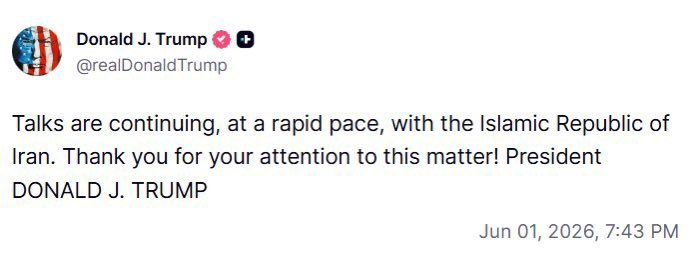

«گفتگوها با جمهوری اسلامی ایران با سرعتی بالا در حال جریان است. از توجه شما به این موضوع سپاسگزارم! رئیس‌جمهور دونالد جی. ترامپ»

@mwarmonitor

## mwarmonitor — post 10000

🔸وزارت امور خارجه ایران: ایالات متحده و اسرائیل از زمان اعلام آتش‌بس در ۱۹ مارس، بارها آن را نقض کرده‌اند؛ از جمله با حمله به کشتی‌های تجاری ایرانی، نقض حاکمیت لبنان و آواره کردن میلیون‌ها غیرنظامی لبنانی.

🔹ایران، آمریکا را مستقیماً مسئول نقض آتش‌بس در هر دو کشور ایران و لبنان می‌داند.

🔹ایران نسبت به پیامدهای خطرناک این نقض‌ها هشدار می‌دهد و تأکید می‌کند که حق دفاع از خود را با هر وسیله‌ای و در هر زمان و مکانی که لازم باشد برای خود محفوظ می‌دارد.

@mwarmonitor

## mwarmonitor — post 9999

  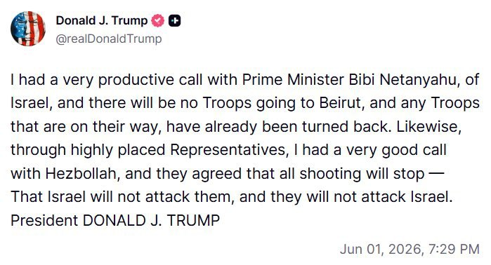

خب همینطور که پیشینی کرده بودم

## mwarmonitor — post 9998

خب همینطور که پیشینی کرده بودم

## mwarmonitor — post 9997

🔴اقدامات جدید پدافند غیرعامل در فردو:

🔸بین ۱۰ تا ۱۸ مه، ایران اقدامات جدیدی از نوع پدافند غیرعامل در قالب تپه‌های خاکی/سنگی و سایر موانع در مسیرهای منتهی به ورودی‌های تونل تأسیسات زیرزمینی (که قبلاً آسیب دیده/تخریب شده) فردو ایجاد کرده است.
🔹چیدمان متناوب این تپه‌ها و موانع بسیار دقیق است و مجموعه‌ای از مسیرهای زیگزاگی (چیکن/پیچ‌دار) ایجاد می‌کند. این موضوع نشان می‌دهد که هدف آن‌ها صرفاً انسداد مسیر نیست، بلکه بیشتر برای جلوگیری از ورود و خروج سریع خودروها طراحی شده و می‌تواند حرکت نیروهای مهاجم در صورت حضور در محل را دشوار کند.
🔸این نحوه قرارگیری همچنین نشان می‌دهد که ایران همچنان قصد دسترسی به محل را دارد، زیرا در غیر این صورت احتمالاً مانند موارد قبلی در مسیرهای منتهی به تونل‌های اصفهان، کل جاده‌ها با خاکریز مسدود می‌شد.
این مسیرهای زیگزاگی در ورودی شرقی ممکن است موقتی بوده و تا ۲۶ مه دوباره برداشته شده باشند، اما این موضوع نیاز به تصاویر دقیق‌تر دارد.
🔹این ورودی قبلاً توسط ایران پر شده بود و در ژوئن ۲۰۲۵ توسط اسرائیل هدف قرار گرفت که منجر به ایجاد یک دهانه (گودال) شد، اما هیچ نشانه‌ای از نفوذ به بالای ورودی تونل دیده نشد.
🔸بر اساس تصاویر تا ۲۶ مه، به نظر می‌رسد همه ورودی‌های تونل همچنان مدفون باقی مانده‌اند.

@mwarmonitor

## mwarmonitor — post 9996

  

📷 Photo

## FoxNewsTwitter — post 342490

  <a href="telegram/content/FoxNewsTwitter_342490_1780358949.mp4" target="_blank">🎬 Download video</a>

Fox News (Twitter/X)

"These are the guys who are making sure that America stays America."

Rep. Brandon Gill praised ICE and Border Patrol agents for their role in defending U.S. sovereignty and keeping communities safe.

"ICE and Border Patrol are on the front lines of not only defending American sovereignty, but keeping our communities safe," Gill said.

Gill's comments came during an event honoring the heroism of ICE officers during a 2025 sniper attack on a Dallas ICE facility, during which two detainees were killed.

## FoxNewsTwitter — post 342489

  <a href="telegram/content/FoxNewsTwitter_342489_1780358951.mp4" target="_blank">🎬 Download video</a>

Fox News (Twitter/X)

Karen Bass isn't holding back as the Los Angeles mayoral race heats up.

One day before the primary election, Bass dismissed Spencer Pratt as a "reality TV star villain" with "no track record," arguing he lacks the experience needed for the job.

"I know he has no idea how the city government is run," Bass said as she contrasted Pratt's candidacy with her own record in office.

## FoxNewsTwitter — post 342488

  <a href="telegram/content/FoxNewsTwitter_342488_1780358954.mp4" target="_blank">🎬 Download video</a>

Fox News (Twitter/X)

FOX NEWS REPORT: President Trump signals "rapid" progress on Iran peace talks after the weekend's military strikes, while Maine Democratic Senate candidate Graham Platner faces yet another scandal. FOX News' @BillMelugin_ reports.

## FoxNewsTwitter — post 342487

  <a href="telegram/content/FoxNewsTwitter_342487_1780358956.mp4" target="_blank">🎬 Download video</a>

Fox News (Twitter/X)

RT @WillCainShow: 🔥MULLIN: WE CAN PROTECT OUR BUILDINGS. CAN YOU PROTECT YOUR STREETS?

As anti-I.C.E. protests intensified at Delaney Hall, federal officials say they asked a basic question: Can local authorities keep federal employees safe?

@SecMullinDHS says when the answer appeared to be no, DHS considered reallocating CBP resources from Newark Airport. Today, he says state and local officials are cooperating—and that's why the officers remain in place.

@willcain | @FoxNews

## FoxNewsTwitter — post 342486

  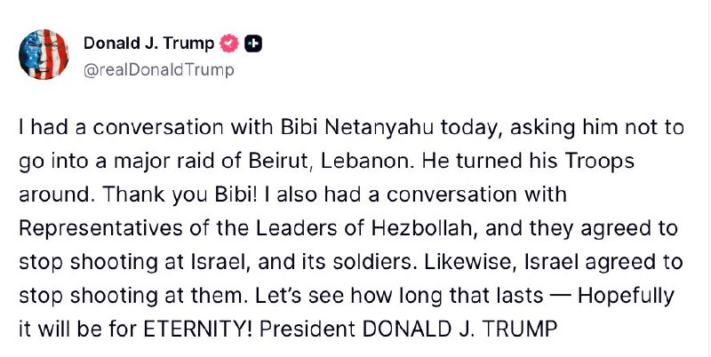

Fox News (Twitter/X)

JUST IN: President Trump says he spoke with Israeli Prime Minister Benjamin Netanyahu and persuaded him to turn Israeli troops around before a major operation in Lebanon.

Trump also says he spoke with representatives of Hezbollah's leadership, who agreed to stop "shooting at Israel," while Israel agreed to stop firing in return.

"Let's see how long that lasts," Trump wrote. "Hopefully it will be for ETERNITY!"

## FoxNewsTwitter — post 342485

  

Fox News (Twitter/X)

A sexually suggestive Kik profile linked to Maine Senate candidate Graham Platner is still active — despite his campaign saying he deleted the app long ago.

Kik has been labeled a "predator's paradise" by the National Center on Sexual Exploitation over concerns about child exploitation and predatory behavior on the platform. It is unclear who Platner messaged on the platform, but there is no evidence he communicated with minors.

The Wall Street Journal previously reported that Platner sent sexually explicit messages to multiple women while married to his wife, Amy Gertner. After the allegations surfaced, Gertner released a video defending her husband and blasting media coverage as "gossip."

Through it all, Platner remains a candidate for the U.S. Senate.

## FoxNewsTwitter — post 342481

Fox News (Twitter/X)

RT @BillMelugin_: BREAKING: The US Department of Transportation confirms to @FoxNews that they have issued a subpoena to the state of NY after they allege the state has refused to cooperate with their investigation into Jing Shen Dong, the bus driver who allegedly caused a crash that killed five people in Stafford County, VA on Friday morning. DOT says Dong is a naturalized US citizen who was born in China, doesn't speak English, and received his commercial driver's license (CDL) from the state of New York.

DOT says the subpoena is a result of not being able to "obtain the requested documents through other reasonable means."

DOT is demanding that New York turn over records on Dong's CDL, his entry level driving training, and the driving school he attended. DOT says those documents must be turned over by Wednesday at 10AM ET, or face consequences/penalties.

## FoxNewsTwitter — post 342480

  

Fox News (Twitter/X)

WATCH LIVE: DHS Secretary Mullin holds a press conference https://twitter.com/i/broadcasts/1DGleeDWYLVJL

## FoxNewsTwitter — post 342479

  <a href="telegram/content/FoxNewsTwitter_342479_1780358961.mp4" target="_blank">🎬 Download video</a>

Fox News (Twitter/X)

NEW: A Brooklyn man is being charged with threatening to assault and murder an ICE officer outside the Delaney Hall detention facility.

The suspect, identified as 27-year-old Nicholas Matthew Scelfo of Brooklyn, New York, was arrested for influencing, impeding, and retaliating against a federal officer by threat.

Scelfo, who was caught on video allegedly threatening to kill an ICE officer and his family outside a New Jersey detention center, has now been arrested.

"I'll kill your whole f---ing family... Your children, your wife — all dead."

"Told you. FBI just arrested the man who threatened to kill ICE officers and their families. FAFO," Acting AG Blanche posted on X.

## FoxNewsTwitter — post 342478

  

Fox News (Twitter/X)

HAPPY BIRTHDAY! Legendary actor and producer Morgan Freeman is celebrating his 89th birthday, marking nearly six decades in entertainment and a career that has helped define generations of film.

## FoxNewsTwitter — post 342477

  

Fox News (Twitter/X)

BREAKING: President Trump announces that no troops will go to Lebanon and Hezbollah has agreed "all shooting will stop" after a "very productive" call with Israeli Prime Minister Netanyahu and Hezbollah.

"Israel will not attack them, and they will not attack Israel."

## FoxNewsTwitter — post 342476

  

Fox News (Twitter/X)

BREAKING: Trump tries to calm Israel-Hezbollah fighting with Iran deal on the line, saying the terror group 'agreed that all shooting will stop'

## FoxNewsTwitter — post 342475

  

Fox News (Twitter/X)

RT @FoxTrueCrime: A Utah judge granted Tyler Robinson's defense's motion for an order to show cause after his attorneys accused prosecutors of violating the court's gag order through media interviews in the Charlie Kirk assassination case.

An evidentiary hearing lands June 12 — putting the state's own legal team under the microscope before trial even begins.

Both sides will have 90 minutes to present arguments at that hearing, when Robinson is expected to appear in person.

Credit: Rick Egan/The Salt Lake Tribune via Pool

## FoxNewsTwitter — post 342473

Fox News (Twitter/X)

BREAKING: Utah judge denies Tyler Robinson's latest request to hold secret hearings in Charlie Kirk assassination case

## FoxNewsTwitter — post 342472

  <a href="telegram/content/FoxNewsTwitter_342472_1780358966.mp4" target="_blank">🎬 Download video</a>

Fox News (Twitter/X)

JUST IN: Sheridan Gorman's family blames sanctuary policies and "failed removal policies" for the murder of their daughter, allegedly by an illegal immigrant with a criminal background.

Speaking outside the Cook County courthouse following a discovery hearing, Sheridan's father, Thomas Gorman, says failed border enforcement, removal policies, and local cooperation allowed Jose Medina to remain in the country and ultimately cross paths with his daughter.

"Jose Medina is responsible for what he did to Sheridan, but he did not get to Sheridan himself."

"He got there through a broken system, through failed border enforcement, failed removal policies, failed local cooperation, and sanctuary policies that put ideology before safety."

"American families deserve to be protected in their own country."

## FoxNewsTwitter — post 342471

  <a href="telegram/content/FoxNewsTwitter_342471_1780358968.mp4" target="_blank">🎬 Download video</a>

Fox News (Twitter/X)

BREAKING: Iran is halting its indirect talks with U.S. negotiators in protest against Israel's attacks on Hezbollah in Lebanon, Iranian state-linked media reported Monday.

Iran's Tasnim news agency, linked to the Iranian Revolutionary Guard Corps, reported that Tehran is cutting off talks due to the "continued crimes of the Zionist regime in Lebanon."

The report comes after Iranian Foreign Minister Abbas Araghchi posted to social media saying Lebanon must be included in the ongoing ceasefire between the U.S. and Iran.

"The United States and Israel bear responsibility for the consequences of any breach of the truce," Araghchi wrote.

@TreyYingst reports the latest.

## pm_afshaa — post 92083

  <a href="telegram/content/pm_afshaa_92083_1780358971.webm" target="_blank">🎬 Download video</a>

🔴ترامپ: من هنوز با این توافق موافقت نکردم چون هنوز باید چند امتیاز دیگر بگیرم.

💧 Rainbet.com the #1 Non-KYC Crypto Casino & Sportsbook @rainbetcom

😁 @Pm_Afshaa

## pm_afshaa — post 92082

  <a href="telegram/content/pm_afshaa_92082_1780358972.webm" target="_blank">🎬 Download video</a>

🔴آکسیوس: ترامپ امروز در تماس تلفنی با نتانیاهو عصبانی شد و گفت:

"تو کاملاً دیوانه‌ای. اگه من نبودم، الان تو زندان بودی. من دارم از تو محافظت میکنم. الان همه از تو متنفرند. همه بخاطر این موضوع از اسرائیل متنفرند. تو چه غلطی داری میکنی؟"

💧 Rainbet.com the #1 Non-KYC Crypto Casino & Sportsbook @rainbetcom

😁 @Pm_Afshaa

## pm_afshaa — post 92081

  <a href="telegram/content/pm_afshaa_92081_1780358972.webm" target="_blank">🎬 Download video</a>

🔴پست جدید ترامپ در تروث سوشال:

امروز با نتانیاهو گفت‌وگویی داشتم و ازش خواستم وارد حمله بزرگ به بیروت نشه. او نیروهایش رو برگردوند. ممنون بی‌بی!

همچنین با نمایندگان رهبران حزب‌الله گفت‌وگو کردم و آنها پذیرفتند که تیراندازی به اسرائیل و سربازانش رو متوقف کنند. به همین ترتیب، اسرائیل هم پذیرفت که تیراندازی به آنها رو متوقف کنه.

باید دید این وضعیت چقدر دووم میاره؛ امیدوارم تا ابد ادامه داشته باشه!

💧 Rainbet.com the #1 Non-KYC Crypto Casino & Sportsbook @rainbetcom

😁 @Pm_Afshaa

## pm_afshaa — post 92080

  <a href="telegram/content/pm_afshaa_92080_1780358973.webm" target="_blank">🎬 Download video</a>

🔴ترامپ به ای‌بی‌سی نیوز:
احتمال داره طی یک هفته آینده با ایران به توافق برسیم، همه چیز خیلی خوب پیش میره؛ توافق صلح با ایران میتونه حتی بهتر از یک پیروزی نظامی باشه.

💧 Rainbet.com the #1 Non-KYC Crypto Casino & Sportsbook @rainbetcom

😁 @Pm_Afshaa

## pm_afshaa — post 92079

  <a href="telegram/content/pm_afshaa_92079_1780358974.webm" target="_blank">🎬 Download video</a>

🔴ترامپ: امروز زنگ زدم به حزب الله گفتم توقف حملات. چند دقیقه بعد با نتانیاهو تماس گرفتم و گفتم توقف حملات. اونا هر دو جنگ رو متوقف کردن.

💧 Rainbet.com the #1 Non-KYC Crypto Casino & Sportsbook @rainbetcom

😁 @Pm_Afshaa

## pm_afshaa — post 92078

  <a href="telegram/content/pm_afshaa_92078_1780358974.webm" target="_blank">🎬 Download video</a>

🔴خبرنگار الجزیره: حمله اسرائیل به لبنان مانع از دستیابی به توافق شده بود.

پس از فشار آمریکا و عقب‌نشینی اسرائیل، اکنون درها باز شده تا مذاکرات به مسیر طبیعی و مثبت خود بازگردد و چیز زیادی باقی نمانده.

💧 Rainbet.com the #1 Non-KYC Crypto Casino & Sportsbook @rainbetcom

😁 @Pm_Afshaa

## pm_afshaa — post 92077

  <a href="telegram/content/pm_afshaa_92077_1780358975.webm" target="_blank">🎬 Download video</a>

🔴قالیباف در تماس تلفنی با همتای لبنانی:
مصمم هستیم در سراسر لبنان آتش بس برقرار کنیم. در دو روز گذشته به طور جدی به دنبال توقف حملات اسرائیل بودیم. اگر جنایات اسرائیل در لبنان ادامه پیدا کنه، مذاکرات رو متوقف می‌کنیم و در مقابل آن می‌ایستیم.

💧 Rainbet.com the #1 Non-KYC Crypto Casino & Sportsbook @rainbetcom

😁 @Pm_Afshaa

## pm_afshaa — post 92076

  <a href="telegram/content/pm_afshaa_92076_1780358976.webm" target="_blank">🎬 Download video</a>

🔴سخنگوی ارتش اسرائیل:
در پی هشدارهایی که چندی پیش در منطقه متولا فعال شد، یک پرتاب در نزدیکی نیروهای ارتش اسرائیل که در جنوب لبنان فعال بودند سقوط کرد، تلفات جانی نداشت.

💧 Rainbet.com the #1 Non-KYC Crypto Casino & Sportsbook @rainbetcom

😁 @Pm_Afshaa

## pm_afshaa — post 92074

بعد از گفت‌وگوی تاثیرگذار و موفق ترامپ و نتانیاهو راجع‌به آتش‌بس اسرائیل و لبنان، هم‌اکنون جنگنده‌های اسرائیلی دارن جنوب لبنان رو بمباران میکنن.

💧 Rainbet.com the #1 Non-KYC Crypto Casino & Sportsbook @rainbetcom

😁 @Pm_Afshaa

## pm_afshaa — post 92073

حمله پهپادی حزب الله به اسراییل

💧 Rainbet.com the #1 Non-KYC Crypto Casino & Sportsbook @rainbetcom

😁 @Pm_Afshaa

## pm_afshaa — post 92072

حزب‌الله درخواست اتش بس آمریکا رو رد کرد

نماینده حزب‌الله در پارلمان لبنان:
پیشنهاد آمریکا مبنی بر توقف عملیات مقاومت در مقابل عدم حمله اسرائیل به ضاحیه جنوبی بیروت غیرقابل قبول است.

💧 Rainbet.com the #1 Non-KYC Crypto Casino & Sportsbook @rainbetcom

😁 @Pm_Afshaa

## pm_afshaa — post 92071

حملات سنگین اسراییل به لبنان

💧 Rainbet.com the #1 Non-KYC Crypto Casino & Sportsbook @rainbetcom

😁 @Pm_Afshaa

## pm_afshaa — post 92070

رئیس کمیسیون امنیت ملی مجلس: اگر جنگ در لبنان به صورت کامل متوقف نشود، روزهای تاریکی در انتظار آمریکا و اسرائیل خواهد بود

💧 Rainbet.com the #1 Non-KYC Crypto Casino & Sportsbook @rainbetcom

😁 @Pm_Afshaa

## pm_afshaa — post 92069

  <a href="telegram/content/pm_afshaa_92069_1780358976.webm" target="_blank">🎬 Download video</a>

🔴آکسیوس: ترامپ روز دوشنبه نقشه نتانیاهو، برای بمباران اهداف حزب‌الله در بیروت رو پس از اون متوقف کرد که جمهوری اسلامی تهدید کرد به دلیل اقدامات اسرائیل در لبنان، مذاکرات با آمریکا رو رها میکنه.

تصمیم ترامپ برای مهار نتانیاهو سیگنال واضحی بود مبنی بر اینکه اون نمیخواد متحد کلیدی‌اش مانع توافق با جمهوری اسلامی بشه.

یک مقام ارشد آمریکایی گفت که ترامپ احساس میکنه تهدیدهای نتانیاهو برای حمله به بیروت داره از حد می‌گذره.

💧 Rainbet.com the #1 Non-KYC Crypto Casino & Sportsbook @rainbetcom

😁 @Pm_Afshaa

## pm_afshaa — post 92068

  <a href="telegram/content/pm_afshaa_92068_1780358977.webm" target="_blank">🎬 Download video</a>

🔴نتانیاهو: من امروز عصر با ترامپ صحبت کردم و بهش گفتم که اگر حزب الله حملات خودش رو به شهرها و شهروندان ما متوقف نکنه، اسرائیل به اهداف تروریستی در بیروت حمله خواهد کرد.

موضع ما در این مورد بدون تغییر باقی می‌ماند. در عین حال، ارتش اسرائیل طبق برنامه در جنوب لبنان به عملیات خود ادامه خواهد داد.

💧 Rainbet.com the #1 Non-KYC Crypto Casino & Sportsbook @rainbetcom

😁 @Pm_Afshaa

## pm_afshaa — post 92067

🔴بیانیه سفارت لبنان در واشنگتن: اگر اسرائیل حملاتش به ضاحیه بیروت (جنوب پایتخت) رو متوقف کنه، حزب‌الله هم متقابلاً حمله‌ای انجام نمیده و آتش‌بسی که ترامپ گفته برقرار خواهد بود

💧 Rainbet.com the #1 Non-KYC Crypto Casino & Sportsbook @rainbetcom

😁 @Pm_Afshaa

## pm_afshaa — post 92066

#مهم
عزیزای دلم همگی الان چنل زاپاس‌مون رو جوین بشید کانال تحت ریپورت شدیده اگه چیزی شد زاپاس رو داشته باشید فعالیت میاد اونور
👇

https://t.me/pmtvzapas
https://t.me/pmtvzapas

## pm_afshaa — post 92064

🔴کاتز ، وزیر دفاع اسرائیل : در لبنان هیچ آتش بسی نداریم ، اسرائیل تا جایی که نیاز باشد پیشروی خواهد کرد

💧 Rainbet.com the #1 Non-KYC Crypto Casino & Sportsbook @rainbetcom

😁 @Pm_Afshaa

## pm_afshaa — post 92063

  <a href="telegram/content/pm_afshaa_92063_1780358978.webm" target="_blank">🎬 Download video</a>

🔴سفارت لبنان در واشنگتن:
دولت لبنان در دور کردن حزب‌الله از تشدید تنش‌های بیشتر موفق عمل کرد.

ترامپ به سفیر ما اعلام کرد که نتانیاهو با آتش‌بس موافقت کرده.

💧 Rainbet.com the #1 Non-KYC Crypto Casino & Sportsbook @rainbetcom

😁 @Pm_Afshaa

## iaghapour — post 2649

  

🧑‍💻 اکثر برنامه‌نویس‌ها دانش فنی فوق العاده ای دارن اما مشکلشون انگلیسیه!

🚫 چون نمیتونن:
▫️توی میتینگ راحت صحبت کنن
◾️داکیومنت‌ها رو سریع بخونن
▫️توی مصاحبه خارجی خوب عمل کنن
◾️یا با تیم بین‌المللی ارتباط بگیرن

برای همین کانال «لرنوبیت» رو ساختیم؛
آموزش انگلیسی مخصوص برنامه‌نویس‌ها و بچه‌های تکنولوژی 👇

🔹 اصطلاحات واقعی دنیای برنامه‌نویسی
🔹 مکالمه کاری و میتینگ
🔹 داکیومنت و کامنت‌نویسی
🔹 آمادگی مصاحبه و کار ریموت

Debug your English. Upgrade your career 🚀

🆔 @learnobit
🆔 @learnobit
🆔 @learnobit

## iaghapour — post 2648

  

⭕️ معرفی GenyConnect؛ جایگزین مدرن v2rayN برای مدیریت پروکسی

نرم‌افزار GenyConnect یک کلاینت تونلینگ و VPN مدرن (با کاربردی شبیه به برنامه محبوب v2rayN) است که با تمرکز بر عملکرد بالا، حریم خصوصی و کنترل دقیق ترافیک طراحی شده است. ویژگی مهم این ابزار، وابسته‌نبودن به یک پروتکل خاص است؛ به این معنی که می‌تواند به عنوان یک بستر یکپارچه برای موتورهای مختلف تونلینگ عمل کند.

🔹 مسیریابی پیشرفته: امکان تعیین مسیر ترافیک بر اساس لیست سفید، دامنه‌های خاص، و حتی مسیریابی در سطح اپلیکیشن‌ها و پروسه‌های سیستم.

🔸 سبک و شفاف: این ابزار با کمترین مصرف منابع سخت‌افزاری کار می‌کند و اطلاعات کاملی از وضعیت شبکه، لاگ‌های زنده و آمارهای لحظه‌ای ترافیک را به شما نمایش می‌دهد.

🔹 انعطاف در پلتفرم‌ها: برخلاف برخی کلاینت‌ها که فقط مختص یک سیستم‌عامل هستند، این برنامه به صورت یکپارچه برای ویندوز، مک، لینوکس و اندروید در دسترس است.

🔗 اطلاعات بیشتر در گیت‌هاب پروژه

🆔 @iAghapour

## iaghapour — post 2647

  

⭕️ تون‌کوین به (Gram) تغییر نام می‌دهد!

پاول دورف در کانال رسمی خود خبر بسیار مهمی برای کاربران و سرمایه‌گذاران شبکه TON اعلام کرد. بر اساس این اطلاعیه، ارز دیجیتال بومی این شبکه قرار است با یک ری‌برندینگ بزرگ، نام فعلی خود را کنار گذاشته و به نام اصلی و اولیه‌اش یعنی Gram تغییر کند.

نکات کلیدی که دورف در این پست به آن‌ها اشاره کرده است:

🔹 بازگشت به ایده اولیه: دورف یادآوری کرده که Gram نام اصلی ارز شبکه در اولین وایت‌پیپر این پروژه بود. او این اتفاق را بازگشت به ریشه‌ها و شروع یک فصل جدید توصیف کرده است.

🔸 زمان‌بندی انتقال: فرایند این تغییر نام و انتقال، حدود ۳ هفته زمان خواهد برد.

🔹 نام بلاک‌چین تغییر نمی‌کند: با وجود تغییر نام ارز بومی (از Toncoin به Gram)، نام خود شبکه بلاک‌چین همچنان TON باقی خواهد ماند.

🔸 قدم چهارم از یک نقشه راه: این ری‌برندینگ تنها یک تغییر اسم ساده نیست، بلکه به گفته دورف، راه را برای اتفاقات مهم بعدی هموار می‌کند و قدم چهارم از یک برنامه ۷ مرحله‌ای برای «عظمت دوباره بخشیدن به TON» است.

🆔 @iAghapour

## DEJradio — post 5234

  <a href="telegram/content/DEJradio_5234_1780358980.mp4" target="_blank">🎬 Download video</a>

🚨
🔸 محل جلسه خامنه‌ای و فرماندهان ارشد چگونه لو رفت؟

#موشعلی #حذف_هدفمند
@DEJradio

## DEJradio — post 5233

  <a href="telegram/content/DEJradio_5233_1780358983.mp4" target="_blank">🎬 Download video</a>

🚨🎥 اعتراض کامیونداران به افزایش بهای گازوئیل و خرابی جاده‌ها

افزایش ۴۵ درصدی قیمت گازوئیل پس از آغاز جنگ ۴۰ روزه به یکی از مشکلات اساسی رانندگان تریلی تبدیل شده است اما این فقط بخشی از مشکلات آنهاست، زیرا کمبود سوخت در جایگاه‌های بین راهی باعث شده آنها مجبور شوند ساعت‌ها در صف‌های طولانی معطل شوند.

از سویی دیگر خرابی جاده‌ها نیز سبب شده تا مخارج جانبی آنها برای خرید و تعویض قطعات افزایش پیدا کند، آنهم در شرایطی که قطعه و دستمزد تعمیرکار سر به فلک می‌کشد.

#کامیونداران #اعتراضات_سراسری
@DEJradio

## DEJradio — post 5232

  <a href="telegram/content/DEJradio_5232_1780358986.mp4" target="_blank">🎬 Download video</a>

🚨
🔸 خبر ۲۱
دوشنبه ۱۱ خرداد ۱۴۰۵

#خبر۲۱
@DEJradio

## DEJradio — post 5231

  <a href="telegram/content/DEJradio_5231_1780358988.mp4" target="_blank">🎬 Download video</a>

🤡
🔺 سه ماه پس از کشته شدن علی خامنه‌ای، شماری از هواداران نظام به مذاکره با قاتلان رهبرشان اعتراض کردند.

این اعتراضات به درگیری در تجمعات شبانه کشیده است. برخی مداحان حکومت را به دلیل تلاش برای توافق با آمریکا به چالش کشیده‌اند، در مقابل نیروهای امنیتی هواداران نظام را که مخالف توافق‌اند ضرب و شتم کرده‌اند.

#موشعلی #تجمعات_حکومتی
@DEJradio

## DEJradio — post 5230

  <a href="telegram/content/DEJradio_5230_1780358991.mp4" target="_blank">🎬 Download video</a>

🚨
🔸 جمهوری اسلامی بزرگترین دشمن زنان ایران

*پژمان گلچین، پژوهشگر فلسفه

#زنان_ایران #جمهوری_اسلامی
@DEJradio

## DEJradio — post 5229

  <a href="telegram/content/DEJradio_5229_1780358994.webm" target="_blank">🎬 Download video</a>

🔺📢 خبرگزاری تسنیم وابسته به سـ.ـپاه پاسداران در واکنش به حمله اسرائیل به مواضع حـ.زب‎الله در جنوب لبنان نوشت، با توجه به تداوم جنگ در لبنان و با عنایت به اینکه لبنان جزو پیش شرط‌های آتش‌بس بوده و هم اینک این آتش‌بس در همه جبهه‌ها از جمله لبنان نقض شده است، تیم مذاکره‌کننده ایرانی «گفتگوها و تبادل متون از طریق میانجی» را متوقف می‌کند.

#حزب_الله_لبنان

## DEJradio — post 5228

  <a href="telegram/content/DEJradio_5228_1780358994.webm" target="_blank">🎬 Download video</a>

🔺📷 ارتش اسرائیل با اعلام قبلی مواضع گروه تروریستی حـ.ـزب‌الله در جنوب بیروت (ضاحیه) را بمباران کرد. بنیامین نتانیاهو نخست وزیر اسرائیل در پیامی هشدار داد «اجازه نمی‌دهیم حزب‌الله به شهروندان اسرائیلی حمله کند و در بیروت در امان بماند.»

علی عبداللهی، فرمانده قرارگاه مرکزی خاتم‌الانبیا، در واکنش به صدور هشدار تخلیه برای شهروندان جنوب بیروت گفت: «با توجه به نقض مکرر آتش‌بس توسط اسرائیل، در صورت عملی‌شدن این تهدید به ساکنان بخش‌های شمالی و شهرک‌های نظامی در اسرائیل هشدار می‌دهیم اگر نمی‌خواهند آسیب ببینند منطقه را ترک نمایند.»

#ارتش_اسرائیل #حزب_الله_لبنان
@DEJradio

## DEJradio — post 5227

  <a href="telegram/content/DEJradio_5227_1780358995.mp4" target="_blank">🎬 Download video</a>

🔺📢 اعتراض یک راننده کامیون به مشکلات معیشتی

یک راننده کامیون از تهران با انتقاد از وضعیت زندگی خودش و همکارانش می‌گوید، سعید مصطفوی رئیس صنف کامیونداران به‌جای رسیدگی به مشکلات و چالش‌های شخصی و صنفی رانندگان شدیدا مانع از کسب درآمد آنها می‌شود و مشغول چرب زبانی و چاپلوسی در مقابل سردمداران رژیم است.

#کامیونداران
@DEJradio

## DEJradio — post 5226

  <a href="telegram/content/DEJradio_5226_1780358997.mp4" target="_blank">🎬 Download video</a>

🛩️
🔥 جنگ ۴۰ روزه؛
بمباران تاسیسات نفتی بندر عسلویه

#جنگ۴۰روزه
@DEJradio

## DEJradio — post 5225

  <a href="telegram/content/DEJradio_5225_1780358999.mp4" target="_blank">🎬 Download video</a>

🚨
🔸 #تمام_رخ
در شطرنج، اگه به‌موقع حمله نکنی، خب حریف حمله می‌کنه!
و ممکنه تا آخر بازی فقط مجبور به دفاع بشی 🛡♟

حمله‌ی پیش‌دستانه یعنی قبل از این‌که حریف نقشه‌اش رو کامل کنه، تو ضربه‌ی اول رو بزنی و ابتکار عمل رو به دست بگیری.

اما برای یک حمله‌ی پیش‌دستانه‌ی خوب، زمان‌بندی همه‌چیزه! ⏰
@DEJradio

## DEJradio — post 5224

  <a href="telegram/content/DEJradio_5224_1780359002.webm" target="_blank">🎬 Download video</a>

🔥
🔺 یک کشتی باری غول‌پیکر با پرچم پاناما دوشنبه ۱۱ خرداد ۱۴۰۵ در آب‌های سرزمینی عراق در معرض انفجار قرار گرفته است.

منابع عربی گزارش دادند کشتی MSC SARISKA V پس از تخلیه محموله خود در بندر ام‌القصر عراق، در آب‌های عراق بر اثر یک انفجار دچار آسیب شد.
مشخص نیست این کشتی هدف پرتابه قرار گرفته است یا به مین‌های دریایی برخورد کرده است.

#انفجار #عراق
@DEJradio

## DEJradio — post 5223

  <a href="telegram/content/DEJradio_5223_1780359003.webm" target="_blank">🎬 Download video</a>

🚨
🔸 «زیرصدا»

قسمت اول؛ یانگ تریو
پخش از تلویزیون دژ یکشنبه‌ها، بازپخش پنجشنبه‌ها بعد از خبر ۲۱⁩

@DEJradio

## DEJradio — post 5222

  <a href="telegram/content/DEJradio_5222_1780359003.mp4" target="_blank">🎬 Download video</a>

🚨
⭕️ نتانیاهو دستور داد به اهداف حزب‌الله در حومۀ جنوبی بیروت حمله شود

بنیامین نتانیاهو، نخست‌وزیر اسرائیل روز دوشنبه اعلام کرد به ارتش این کشور دستور داده تا مواضع حزب‌الله را در حومۀ جنوبی بیروت هدف بگیرد.
نتانیاهو و یسرائیل کاتس، وزیر دفاع اسرائیل خبر دادند این تصمیم در پی نقض‌ مکرر آتش‌بس توسط حزب‌الله گرفته شد.
بنا بر گزارش‌ها مقامات اسرائیل دور تازۀ حملات به جنوب بیروت، را در پی هماهنگی با مقامات آمریکا سرگرفتند.
حومۀ جنوبی بیروت از مهم‌ترین پایگاه‌های حزب‌الله در پایتخت لبنان به شمار می‌رود.
این منطقه در ماه‌های پیشین بارها توسط اسرائیل مورد حمله قرار گرفته بود.
در پی پادرمیانی آمریکا برای مذاکره میان لبنان و اسرائیل، آتش‌بسی موقت در این منطقه برقرار شده و حملات قطع شده بود.

#خبر #دژ #بنیامین_نتانیاهو #بیروت
@DEJradio

## DEJradio — post 5220

💀
🚨 حسن قایی مشهور به «حاج رائف» از تروریست‌های ارشد گروه حـ.ـزب‌الله لبنان روز دوشنبه ۱۱ خرداد ۱۴۰۵ در حمله هوایی اسرائیل کشته شد.

او در پوشش ورزشکار ملی‌پوش لبنان به مسابقات بین‌المللی پاورلیفتینگ اعزام می‌شد.

#حسن_قایی #حزب_الله_لبنان #حذف_هدفمند
@DEJradio

## DEJradio — post 5219

  <a href="telegram/content/DEJradio_5219_1780359005.webm" target="_blank">🎬 Download video</a>

🔺🎤 مأموریت ویژه عراقچی و قالیباف در دوحه

گفت‌وگو با شهرام خلدی، پژوهشگر مطالعات خاورمیانه

#مذاکرات #دوحه
@DEJradio

## DEJradio — post 5218

  <a href="telegram/content/DEJradio_5218_1780359006.webm" target="_blank">🎬 Download video</a>

🔺📢 یکی از اماکنی که در جریان خیزش ملی از آن برای استقرار سرکوبگران و تیراندازی به مردم استفاده شد مجتمع تجاری «کسا» در خیابان پیروزی (شرق تهران) بود.

یک شاهدان عینی به «دژ» می‌گوید که ۱۸ دی‌ماه ۱۴۰۴، شاهد بوده که از روی پشت‌بام این مجتمع تجاری به سمت مردم تیراندازی شد. او شمار تک‌تیراندازان را سه تا چهار نفر عنوان می‌کند.

او می‌گوید که جمعیت به‌قدری زیاد بود که امکان کنترل آن وجود نداشت. به گفته همین فرد، برق منطقه را قطع کردند و سپس شروع به هدف قرار دادن مردم کردند.
او همچنین می‌گوید که به دلیل قطع آنتن موبایل‌ها امکان اطلاع‌رسانی وجود نداشت.

#دی۱۴۰۴ #سرکوب
@DEJradio

## DEJradio — post 5217

  <a href="telegram/content/DEJradio_5217_1780359006.webm" target="_blank">🎬 Download video</a>

🔺📷 منابع میدانی از استان لرستان گزارش دادند یکی از عوامل اصلی سرکوب مردم در خیزش ملی دی‌ماه ۱۴۰۴ در خرم‌آباد سرهنگ پاسدار بازنشسته قباد اصل‌مرز است.

او همچنین مخبر سـ.ـپاه است و سردسته اراذل و اوباش ۶۰۰ تا ۷۰۰ نفری که هدایت آنها در تجمعات شبانه را هم بر عهده دارد.

او در سال ۱۴۰۱ نیز در سرکوب مردم ازنا و الیگودرز میدان‌دار بود.
قباد اصل‌مرز با نام مستعار «ابوحسام» سابقه حضور در جنگ سوریه در حمایت از رژیم بشار اسد را دارد.

#کارزار_شناسایی_سرکوبگران #جنگ
@DEJradio

## DEJradio — post 5216

⭕️ مراسم سالانۀ مرگ خمینی بدون مهمان خارجی، بی سخنرانی حسن خمینی و با پیام رهبر نامرئی برگزار می‌شود

مسئولان برگزاری مراسم سالانۀ مرگ روح‌الله خمینی، نخستین رهبر نظام اعلام کردند امسال مهمان خارجی در این مراسم حضور ندارد و حسن خمینی، نوۀ او نیز سخنرانی نمی‌کند.
آخوند محمدعلی انصاری، از برگزارکنندگان مراسم گفت امسال «پیامی» از مجتبی خامنه‌ای خوانده می‌شود.
این چهرۀ نزدیک به خانوادۀ خمینی افزود امسال امکان حضور گستردۀ هواداران رژیم نیز نمی‌تواند مانند سال‌های گذشته فراهم شود.
در سال‌های پیشین رژیم این مراسم را با حضور مقام‌های ارشد، برخی سفرا و سخنرانی علی خامنه‌ای و حسن خمینی برگزار می‌کرد و تبلیغات بسیاری در مورد آن انجام می‌شد.
منابعی به دژ گفتند رژیم همچنان از تجمع مقامات و نیروهای نظامی و لو رفتن مکان و مسیرهای رفت‌وآمد آنها به‌شدت وحشت دارد.

#خبر #دژ #خمینی
@DEJradio

## DEJradio — post 5215

⭕️ مقام وزارت خارجۀ رژیم: تبادل پیام با آمریکا در فضای بدگمانی ادامه دارد

اسماعیل بقائی، سخنگوی وزارت امور خارجۀ جمهوری اسلامی، گفت تبادل پیام میان تهران و واشینگتن همچنان در فضای «بدگمانی شدید» ادامه دارد.
او مدعی شد آمریکا با پیام‌های متناقض و تغییر مواضع، روند گفت‌وگوها را طولانی‌تر کرده است.
بقائی همچنین ادعا کرد آتش‌بس در لبنان بخشی جدایی‌ناپذیر از هرگونه توافق و پایان جنگ است.
رسانه‌های غربی روز شنبه از سختگیرانه‌تر شدن مفاد تفاهم‌نامۀ پیشنهادی توسط ترامپ خبر داده بودند.

#خبر #دژ #مذاکرات
@DEJradio

## mamlekate — post 103605

  <a href="telegram/content/mamlekate_103605_1780359007.mp4" target="_blank">🎬 Download video</a>

باباش رو ثبت‌نام کرده پویش جانفدا حالا واکنشش

@mamlekate

## VahidOnline — post 75864

پیام‌های دریافتی درباره قطع شدن موقت خطوط تلفن همراه در بعضی از شهرهای استان‌های فارس، بوشهر و هرمزگان و...
از حدد ساعت ۲

▪️ شیراز کلا قطع شده انگار
نه میشه زنگ زد نه میشه کاری کرد

▪️ کل تلفن های همراه توی شیراز قطع شده
تمام اینترنت ها قطع شده
مشخص نیست چرا اینجوری شده
نه ایرانسل نه همراه اول نه رایتل آنتن نداره

▪️ وحید از حدود ساعت ۲:۱۰ تا همین الان انتن گوشی ها و اینترنت خانگی و هر چیز مخابراتی توی شیراز پرید
همین الان [۲:۳۰] همراه اول وصل شد با سرعت کم. ایرانسل وصل نیست

▪️ شیراز خط گوشی بیشتر از ۲۰ دقیقه رفت
از ساعتای ۲:۱۰ دقیقه تا ۲:۳۰
ایرانسل هنوز نیومده

آپدیت:
ایرانسل هم وصل شد
ولی همگی 3G هستن

سلام وحید جان بندرخمیر هم از ساعت 2 همه چیز قطع شده الان به زور وصل شدم بهتون اطلاع بدم

اصفهان هم دقایقی خط همه رفت

تو شیراز یک دفعه همه انتن ها پرید. حتی نت مودم خونه مون هم کاملا قطع شد
الان بعد از حدود نیم ساعت دوباره انتن ها اومد

وحید فکر کردم فقط واسه من اینطوریه نت خونگی مبینت ما هم قطع شده خوزستان سربندر

از شهرستان های فارس نیم ساعت همه انتن ها رفت و اینترنت مخابرات هم کار نمیکرد الان اینترنت مخابرات اومد و انتن همراه اول هم با سرعت کم اومد ایرانسل قطعه

نت و انتن و... کامل توی بندر ماهشهر پریده
اهواز هم همینطور

سلام بندرگناوه چند دقیقه کلا همه چی قطع نه زنگ نه حتی شبکه داخلی همه چی بسته شد

بندر ساعت ۲ بامداد تقریبا آنتن ها رفت
و بعد برگشت خط 3g شده اما اینترنت کار نمیکنه
الان فقط اینترنت فیبر وصل شده

دقیقا راس ساعت ۲ کل دیتا سنتر شیراز قطع شد
تلفن همراه کاملا بدون آنتن
تقریبا ۳۰ دقیقه شد که وصل شد

همین الان حدود نیم ساعت در نورآباد ممسنی همه چی پریددد نت و آنتن و خط و همه چی😐

شیراز از ساعت 2 تا 2:30 انتن همه اپراتور ها قطع شد

بندرعباس هم همینطور، قطع شد وحید جان تا الان

اینترنت و انتن های تلفن همراه تو قشم کلا قطع شد یهو
تقریبا ۱۰ دقیقه قطع شد
هم انتن هم اینترنت همراه

بوشهر اینترنت مخابرات و ایرانسل هی ده دقیقه ده دقیقه قطع میشه
خیلیاهم کلا قطع شدن از اشناهام

شیراز بعد از نیم ساعت وصل شد
کل سرویس های ایرانسل و همراه اول و شاتل حتی اینترنت مخابرات قطع بود

خط ایرانسل هم برگشت

وحید سلام و خسته نباشی، اینترنت و خطا برای ده دقیقه کامل قطع شدن هم بوشهر هم بندرعباس، بوشهر وصل شده و نت همراه ضعیفه منتهی بندرعباس اینترنت ایرانسل قطع شده

وحید اصلا همه‌ی استان فارس همین شد
من فسا هستم منم قطع شدم
دقیقا از ۲:۰۲ تا ۲:۳۶ قطع شدم

وحید بوشهر هم کلا قطع شد الان وصل شده و خیلی ضعیفه یه نیم ساعتی کلا آنتن نبود

میناب هم یه ۲۰ ۲۵ دقیقه ای کلا انتن نبود

بندرعباس: ایرانسل کلا قطعه، همراه هم قطع و وصله

سلام اقا وحید داخل بندر دیلم استان بوشهر ما از ساعت ۱:۴۵ دقیقه هیچی انتن نداشتیم چه ایرانسل چه همراه الان درست شد تازه نت رو h هست

با تمام سیم‌کارت‌ها ما الان وصل شدیم

مرودشتم کامل قطع شده بود همه چی الان وصل شد

سلام وجید جان
ما برازجان هستیم
برای ما هم نت ایرانسل، همراه اول و رایتل و مخابرات کلا قطع شد
الان که برگشتن 3G هستن

سلام از جنوب استان فارس پیام میدم اینترنت خانگی و همراه و همچنین آنتن از ساعت ۲ تا حدود ۳۰ دقیقه کاملا قطع بود

بوانات برا یه نیم ساعتی انتن پرید

سلام توی یزد هم آنتن همراه اول کلا قطع شد، فکر کردم باگ گوشی خودمه، اما الان که گزارشات رو دیدم ظاهرا چیز دیگه ای بوده

درود وقت بخیر شیراز حدود ۲:۱۰ دقیقه کل خط ها انتن و اینترنتشون پرید و بعد از حدود نیم ساعت با سرعت بسیار کمی وصل شد
تشکر وحید جان

سلام وحید خط بستک و کل غرب استان هرمزگان بعد ۲۰ دقیقه وصل شد

سلام وحید جان بندرعباس الان 45 دقیقس که همه چی قطعه آنتن ایرانسل اومده ولی روشن نمیشه همه چی پریده فقط فیبر نوری وصله فعلا

سلام وحید جان :استان بوشهر :کنگان از ساعت ۲:۲۳نت ایرانسل و مخابرات پریده و هنوز وصل نشده خدا میدونه چیکار میکنن.

شهرستان قیر و کارزین هم ایرانسل هم همراه وصل شد اما مودم مخابرات از ساعت ۲ قطع

درود. از لاهیجان پیام میدم. اینجا هم امروز اینترنت مخابرات دو بار برای چند دقیقه رفت و بعدش با سرعت خیلی کمی وصل شد.

اصفهان هم حدود ساعت دو انتن قطع شد‌ ولی چند دقیقه بعد برگشت

سلام داخل اهواز کل آنتن ها قطع شد و سریعا به حالت قبل برگشت

مجدد همه چیز پرید توی بندر ماهشهر باز الان وصل شد

وسط بازی بودم پرید بیرون انتن رفت فکر کردم خودم اینجوری ام از ساعت دو
الان وصل شدم دیدم بچه ها هم نیستن هیچ کدوم نوراباد ممسنی

📡 @VahidOnline

## VahidOnline — post 75863

  

دونالد ترامپ، رئیس‌جمهوری آمریکا، در گفتگوی تلفنی با شبکه خبری «ای‌بی‌سی نیوز» اعلام کرد که به نظر او، توافق با تهران برای تمدید آتش‌بس و بازگشایی تنگه هرمز «طی هفته آینده» حاصل خواهد شد.
ترامپ روز دوشنبه در گفتگو با جاناتان کارل، خبرنگار ارشد این شبکه در واشنگتن، با ابراز خوش‌بینی گفت: «اوضاع خوب به نظر می‌رسد.»
رئیس‌جمهوری آمریکا با اشاره به تنش‌های اخیر افزود: «امروز مشکل کوچکی پیش آمد، اما همان‌طور که احتمالا پیش‌تر متوجه شدید، من خیلی سریع آن را برطرف کردم.»
او توضیح داد که این مشکل ناشی از ناراحتی و عصبانیت مقام‌های ایران از حملات اسرائیل به لبنان بوده است؛ ترامپ در تشریح نحوه حل این بحران گفت: «من با حزب‌الله صحبت کردم و گفتم تیراندازی نکنید؛ با بنیامین نتانیاهو، نخست‌وزیر اسرائیل هم صحبت کردم و گفتم تیراندازی نکنید، و هر دو طرف شلیک به یکدیگر را متوقف کردند.»
@VahidOOnLine

📡 @VahidOnline

## VahidOnline — post 75862

  

پست ترامپ، ترجمه ماشین:
امروز با بی‌بی نتانیاهو گفت‌وگویی داشتم و از او خواستم وارد یک حمله بزرگ به بیروتِ لبنان نشود. او نیروهایش را برگرداند. ممنون بی‌بی!

همچنین با نمایندگان رهبران حزب‌الله گفت‌وگو کردم و آن‌ها پذیرفتند که تیراندازی به اسرائیل و سربازانش را متوقف کنند. به همین ترتیب، اسرائیل هم پذیرفت که تیراندازی به آن‌ها را متوقف کند.

ببینیم این وضعیت چقدر دوام می‌آورد — امیدوارم تا ابد ادامه داشته باشد!

رئیس‌جمهور دونالد ج. ترامپ
realDonaldTrump
خیلی شبیه به پست چند ساعت پیشش به نظر می‌رسه. به نظر می‌رسه همون رو بازنویسی کرده ولی قبلی رو حذف نکرده.
نظر چت‌ جی‌پی‌تی:

در اصلِ پیام، تفاوت محتواییِ بنیادی ندارد:
هر دو می‌گویند ترامپ با نتانیاهو صحبت کرده، نیروهای اسرائیلی از رفتن به بیروت منصرف شده‌اند، و از طریق نمایندگان/واسطه‌ها با حزب‌الله هم درباره توقف درگیری صحبت شده است. گزارش‌های خبری هم نسخه اول را با همین مضمون منتشر کرده‌اند.

اما متن دوم از چند جهت مهم بازنویسی و تنظیم‌شده‌تر است:

۱. ترامپ نقش خودش را پررنگ‌تر کرده

در متن اول می‌گوید:
تماس بسیار سازنده‌ای با نتانیاهو داشتم و نیروها به بیروت نمی‌روند...

اما در متن دوم می‌گوید:
از نتانیاهو خواستم وارد یک یورش بزرگ به بیروت نشود. او نیروهایش را برگرداند. ممنون بی‌بی!

یعنی متن دوم بیشتر این برداشت را القا می‌کند که ترامپ شخصا جلوی حمله بزرگ به بیروت را گرفته و نتانیاهو به درخواست او عمل کرده است.

۲. عبارت «حمله/یورش بزرگ به بیروت» اضافه شده

در متن اول فقط می‌گوید:
نیروها به بیروت نمی‌روند.

در متن دوم می‌گوید:
وارد یک major raid of Beirut, Lebanon نشود.

این مهم است، چون متن دوم وضعیت را جدی‌تر و عملیاتی‌تر تصویر می‌کند: نه فقط «نرفتن نیروها»، بلکه جلوگیری از یک عملیات بزرگ در بیروت.

۳. تماس با حزب‌الله با احتیاط بیشتری بیان شده
متن اول می‌گوید:
I had a very good call with Hezbollah
یعنی ظاهرا «تماس خیلی خوبی با حزب‌الله داشتم».

اما متن دوم می‌گوید:
I also had a conversation with Representatives of the Leaders of Hezbollah

یعنی «با نمایندگان رهبران حزب‌الله صحبت کردم».

این تغییر احتمالا برای این است که مستقیم نگویند ترامپ با خود حزب‌الله «تماس خیلی خوب» داشته؛ متن دوم آن را رسمی‌تر و غیرمستقیم‌تر می‌کند.

۴. تعهد حزب‌الله محدودتر و دقیق‌تر بیان شده
در متن اول:
all shooting will stop — Israel will not attack them, and they will not attack Israel
یعنی «همه تیراندازی‌ها متوقف می‌شود؛ اسرائیل به آنها حمله نمی‌کند و آنها به اسرائیل حمله نمی‌کنند.»

در متن دوم:
they agreed to stop shooting at Israel, and its soldiers. Likewise, Israel agreed to stop shooting at them.

اینجا حزب‌الله مشخصا متعهد می‌شود به اسرائیل و سربازانش شلیک نکند و اسرائیل هم به آنها شلیک نکند.
تفاوت ظریف این است که متن اول از «attack» استفاده می‌کند که گسترده‌تر است؛ متن دوم بیشتر روی «shooting» تمرکز دارد که ممکن است محدودتر از «حمله» باشد.

۵. متن دوم تردید و شکنندگی توافق را اضافه می‌کند

متن اول قاطعانه تمام می‌شود. اما متن دوم اضافه می‌کند:
Let’s see how long that lasts — Hopefully it will be for ETERNITY!
یعنی: «ببینیم چقدر دوام می‌آورد؛ امیدوارم برای همیشه باشد.»

این جمله نشان می‌دهد ترامپ خودش هم دوام توافق را قطعی نمی‌داند و بیشتر حالت آرزویی/نمایشی به آن می‌دهد.

جمع‌بندی کوتاه
متن اول بیشتر شبیه اعلام رسمی یک توافق فوری است.
متن دوم بیشتر شبیه بازنویسی سیاسی‌تر و شخصی‌تر همان پیام است؛ در آن ترامپ نقش خودش را برجسته‌تر کرده، تماس با حزب‌الله را غیرمستقیم‌تر توصیف کرده، عبارت «یورش بزرگ به بیروت» را اضافه کرده، و در پایان هم درباره دوام توافق تردید نشان داده است.

📡 @VahidOnline

## VahidOnline — post 75861

  

خبرگزاری جمهوری اسلامی، ایرنا، روز دوشنبه ۱۱ خرداد از کشته‌شدن دو سپاهی در قم خبر داد.

این خبرگزاری ادعا کرد که این دو بر اثر «انفجار پرتابه‌های باقی‌مانده از جنگ اخیر» کشته شده‌اند.

طبق این گزارش، سپاه این دو نفر را حسین رمضانیان فردویی و محمد اویسی معرفی و محل کشته شدن آن‌ها را منطقه فردو، در استان قم اعلام کرد.

با این آمار تعداد تلفات سپاه در دوره آتش‌بس جاری میان جمهوری اسلامی با آمریکا و اسرائیل، و در خارج از درگیری‌های اخیر، دستکم به ۱۶ نفر افزایش یافته است.
@VahidHeadline

📡 @VahidOnline

## VahidOnline — post 75859

  <a href="telegram/content/VahidOnline_75859_1780359010.mp4" target="_blank">🎬 Download video</a>

روابط عمومی سپاه اعلام کرد که در پی حمله ارتش آمریکا به کشتی ایرانی «لیان استار» در محدوده دریای عمان، نیروی دریایی سپاه طی یک عملیات مقابله به مثل، کشتی «ام‌اس‌سی. ساریسکا» با مالکیت «دشمن آمریکایی-اسرائیلی» را با موشک کروز مورد هدف قرار داد
IranIntlbrk

📡 @VahidOnline

## VahidOnline — post 75858

  

اعلام دونالد ترامپ مبنی بر موافقت بنیامین نتانیاهو با توقف گسیل نظامیان به بیروت، در شامگاه دوشنبه ۱۱ خرداد ماه، با واکنش منفی چند چهره شاخص سیاسی در اسرائیل مواجه شد.

ایتامار بن‌گویر، وزیر امنیت ملی اسرائیل، با انتقاد از این تصمیم گفت: «زمان آن رسیده که به ترامپ نه بگوییم.»

همزمان نفتالی بنت، نخست‌وزیر پیشین اسرائیل، نیز در پیامی دولت این کشور را به ناتوانی در حفظ امنیت متهم کرد. او با اشاره به حوادث امنیتی در اورشلیم، بیت‌شمش، لبنان و غزه نوشت: «مکان‌ها متفاوت هستند، اما داستان یکی است؛ دولتی که کنترل بر حاکمیت اسرائیل را از دست داده است.»
بنت همچنین گفت: «هرج‌ومرج در همه‌جا دیده می‌شود و ما امنیت را به شهروندان اسرائیل بازخواهیم گرداند.»

یائیر لاپید، رهبر مخالفان دولت اسرائیل، نیز با انتقاد از نتانیاهو، تصمیم او را «اعلام تبدیل اسرائیل به یک دولت تحت‌الحمایه کامل» توصیف کرد.
@VahidOOnLine
دفتر نخست‌وزیر اسرائیل در بیانیه‌ای به نقل از نتانیاهو اعلام کرد: «امشب با رئیس‌جمهوری ترامپ صحبت کردم و به او گفتم اگر حزب‌الله حمله به شهرها و شهروندان ما را متوقف نکند، اسرائیل اهداف تروریستی را در بیروت هدف قرار خواهد داد.»
نتانیاهو افزود: «موضع ما در این زمینه تغییری نکرده است.»

او همچنین تاکید کرد ارتش اسرائیل به عملیات خود در جنوب لبنان طبق برنامه ادامه خواهد داد.
@VahidOOnLine

📡 @VahidOnline

## VahidOnline — post 75857

  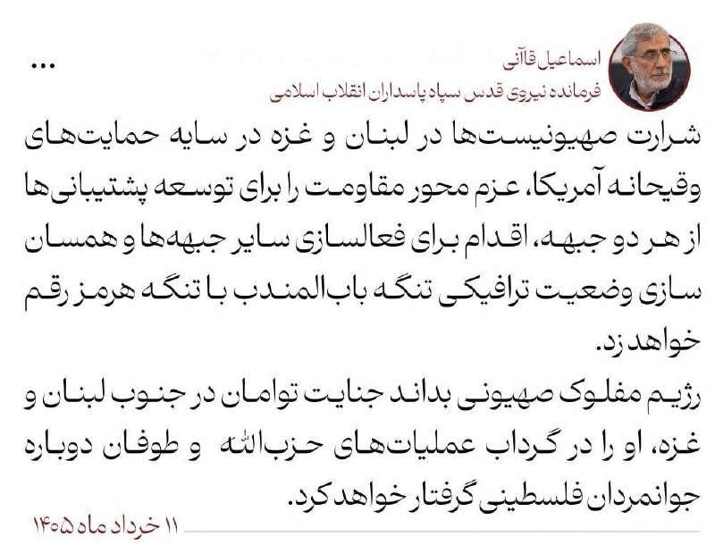

قاآنی: ادامه حملات به لبنان و غزه، باب‌المندب را به تنگه هرمز تبدیل خواهد کرد

اسماعیل قاآنی، فرمانده نیروی قدس سپاه پاسداران، شامگاه دوشنبه ۱۱ خرداد ماه در پیامی که رسانه‌های دولتی ایران منتشر کرده‌اند، نوشت جنگ اسرائیل در لبنان و غزه «در سایه حمایت‌های وقیحانه آمریکا، عزم محور مقاومت را برای توسعه پشتیبانی‌ها از هر دو جبهه، اقدام برای فعال‌سازی سایر جبهه‌ها و همسان‌سازی وضعیت ترافیکی تنگه باب‌المندب با تنگه هرمز رقم خواهد زد.»

فرمانده نیروی قدس سپاه همچنین هشدار داد که ادامه عملیات اسرائیل در جنوب لبنان و غزه، این کشور را با واکنش‌های گسترده‌تری از سوی حزب‌الله و گروه‌های فلسطینی روبه‌رو خواهد کرد.
@VahidOOnLine

📡 @VahidOnline

## VahidOnline — post 75856

  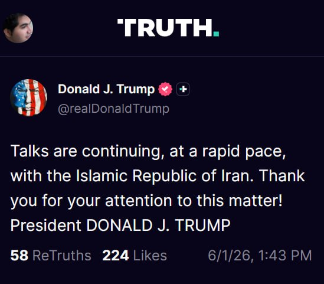

ترامپ: مذاکرات با جمهوری اسلامی ایران با سرعتی بالا ادامه دارد.
از توجه شما به این موضوع سپاسگزارم!

رئیس‌جمهور دونالد جی. ترامپ
realDonaldTrump
این دفعه گفت "جمهوری اسلامی ایران"

📡 @VahidOnline

## VahidOnline — post 75855

  

ترامپ: اسرائیل و حزب‌الله پذیرفتند حمله‌ها متوقف شود

ترجمه ماشین:
من تماس بسیار سازنده‌ای با نخست‌وزیر اسرائیل، بی‌بی نتانیاهو، داشتم و هیچ نیرویی به بیروت اعزام نخواهد شد؛ و هر نیرویی هم که در مسیر بوده، همین حالا بازگردانده شده است.
همچنین، از طریق نمایندگان بلندپایه، تماس بسیار خوبی با حزب‌الله داشتم و آن‌ها پذیرفتند که همه تیراندازی‌ها متوقف شود — اینکه اسرائیل به آن‌ها حمله نکند و آن‌ها هم به اسرائیل حمله نکنند.

رئیس‌جمهور دونالد جی. ترامپ
realDonaldTrump

📡 @VahidOnline

## VahidOnline — post 75854

  

ترامپ: محاصره را حفظ می‌کنیم

توییت‌های خبرنگار NBC، ترجمه ماشین:
تازه: رئیس‌جمهور ترامپ به من گفت که درباره گزارش‌ها مبنی بر تعلیق مذاکرات ایران با آمریکا، چیزی از ایران نشنیده است؛ اما اگر درست باشد، اشکالی ندارد:
«فکر می‌کنم اگر حقیقت را بخواهید، زیادی حرف زده‌ایم. به نظرم سکوت کردن خیلی خوب خواهد بود، و این می‌تواند برای مدتی طولانی باشد.»

او ادامه داد: «این به آن معنا نیست که قرار است برویم و همه‌جا آنجا بمب بریزیم. فقط سکوت می‌کنیم. محاصره را حفظ می‌کنیم. محاصره یک تکه فولاد است.»

آیا می‌تواند آن‌ها را آن‌قدر منتظر بگذارد تا کوتاه بیایند؟
«فکر می‌کنم تا هر وقت که بخواهند می‌توانم صبر کنم. آن‌ها دارند ثروت هنگفتی از دست می‌دهند...»

همچنین وقتی از نویسنده کتاب «هنر معامله» درباره گزارش‌های تعلیق مذاکرات پرسیدم به نظر می‌رسید با اکراه نوعی احترام برای مذاکره‌کنندگان ایرانی قائل است:
«این حرف مناسبی است، چون آن‌ها مذاکره‌کنندگان بهتری هستند تا جنگجو.»
GarrettHaake
الان هم:
ترامپ و نتانیاهو دارند تلفنی صحبت میکنند.
J74wabx

📡 @VahidOnline

## VahidOnline — post 75853

  

هم‌زمان با صدور هشدار تخلیه از سوی ارتش اسراییل برای ساکنان حومه جنوبی بیروت، فرمانده قرارگاه مرکزی خاتم‌الانبیا به ساکنان مناطق شمالی اسراییل هشدار داد که در صورت عملی شدن تهدیدهای اسراییل علیه لبنان، برای جلوگیری از آسیب، این مناطق را ترک کنند.

علی عبداللهی، فرمانده قرارگاه مرکزی خاتم‌الانبیا، اعلام کرد بنیامین نتانیاهو «در ادامه شرارت‌های خود در منطقه»، ضاحیه و بیروت را به بمباران تهدید کرده و برای ساکنان این مناطق هشدار تخلیه صادر کرده است.

او افزود: «با توجه به نقض مکرر آتش‌بس توسط اسراییل، در صورت عملی شدن این تهدید، به ساکنان بخش‌های شمالی و شهرک‌های نظامی در سرزمین‌های اشغالی هشدار می‌دهیم اگر نمی‌خواهند آسیب ببینند منطقه را ترک کنند.»
@VahidHeadline

📡 @VahidOnline

## VahidOnline — post 75852

  <a href="telegram/content/VahidOnline_75852_1780359012.mp4" target="_blank">🎬 Download video</a>

«حمید سلیمیان» در حال نواختن تنبک
#حمید_سلیمیان، متأهل و پدر یک پسر چهارماهه شامگاه ۱۸ دی‌ماه ۱۴۰۴ در جریان اعتراضات در زرین‌شهر اصفهان با شلیک مستقیم گلوله جنگی جان خود را از دست داد.
حمید سلیمیان راننده یکی از شرکت‌های فولاد بود و به گفته نزدیکانش به موسیقی علاقه فراوانی داشت او تنبک و سنتور می‌نواخت.
@VahidHeadline

📡 @VahidOnline

## VahidOnline — post 75843

هم‌زمان با تشدید حملات نظامی اسراییل به لبنان، مقام‌های جمهوری اسلامی بار دیگر تاکید کردند که هرگونه آتش‌بس میان ایران و آمریکا باید شامل همه جبهه‌های درگیری، به‌ویژه لبنان، باشد و هشدار دادند ادامه حملات به این کشور می‌تواند پیامدهایی در پی داشته باشد.

بنیامین نتانیاهو، نخست‌وزیر اسراییل، روز دوشنبه ۱۱ خرداد ۱۴۰۵، اعلام کرد که به ارتش این کشور دستور داده است اهداف متعلق به حزب‌الله در ضاحیه، حومه جنوبی بیروت، را هدف قرار دهد. او در یک پیام ویدیویی گفت: «هیچ وضعیتی وجود نخواهد داشت که حزب‌الله شهرها و شهروندان ما را هدف قرار دهد اما مقرهای تروریستی آن در ضاحیه بیروت از حمله مصون بماند.»

دفتر نخست‌وزیر اسراییل در بیانیه‌ای اعلام کرد نتانیاهو و یسراییل کاتس، وزیر دفاع این کشور، در پی آنچه «نقض مکرر آتش‌بس از سوی حزب‌الله» و «حملات علیه شهرها و شهروندان اسراییل» خوانده شده، به ارتش دستور حمله به «اهداف تروریستی» در حومه جنوبی بیروت را داده‌اند.

نتانیاهو همچنین گفت عملیات زمینی ارتش اسراییل در لبنان در حال گسترش است. اسراییل در جنوب لبنان منطقه‌ای امنیتی ایجاد کرده و می‌گوید هدف از آن جلوگیری از حملات حزب‌الله به مناطق شمالی این کشور است.

در واکنش به این تحولات، عباس عراقچی، وزیر امور خارجه جمهوری اسلامی، در شبکه ایکس نوشت: «آتش‌بس میان ایران و آمریکا، بدون هیچ ابهامی، آتش‌بسی در تمام جبهه‌ها، از جمله لبنان، است.» او افزود نقض آتش‌بس در هر جبهه‌ای «به معنای نقض آتش‌بس در تمامی جبهه‌ها» خواهد بود.
عراقچی همچنین آمریکا و اسراییل را مسوول پیامدهای هرگونه نقض این آتش‌بس دانست. جمهوری اسلامی پیش از این نیز بارها اعلام کرده بود که آتش‌بس میان ایران و آمریکا باید سایر جبهه‌های درگیری، به‌ویژه لبنان، را نیز در بر بگیرد.

ابوالفضل شکارچی، سخنگوی نیروهای مسلح جمهوری اسلامی، نیز به اسراییل هشدار داد که «تداوم جنایات در لبنان برای نیروهای مسلح ایران قابل تحمل نخواهد بود.»

هم‌زمان، محمدباقر قالیباف، رییس مجلس شورای اسلامی و رییس هیات مذاکره‌کننده ایران با آمریکا، با اشاره به آنچه «محاصره دریایی و تشدید جنایات جنگی در لبنان» خواند، این اقدامات را «شواهد آشکار عدم پایبندی آمریکا به آتش‌بس» توصیف کرد.
قالیباف در پیامی به زبان انگلیسی در شبکه ایکس، بدون اشاره به جزییات بیشتر، نوشت: «هر انتخابی بهایی دارد و زمان پرداخت آن فرا می‌رسد. همه‌چیز در نهایت سر جای خود قرار خواهد گرفت.»

این اظهارات در حالی مطرح می‌شود که عملیات نظامی اسراییل علیه حزب‌الله، از گروه‌های مورد حمایت جمهوری اسلامی در منطقه، شدت گرفته است. با وجود تاکید مکرر تهران بر ضرورت گنجاندن لبنان در هر توافق آتش‌بس میان ایران و آمریکا، این مطالبه تاکنون محقق نشده است.
اسماعیل بقایی، سخنگوی وزارت امور خارجه جمهوری اسلامی، نیز روز دوشنبه در نشست خبری هفتگی خود گفت: «ما تاکید کردیم و کماکان تاکید داریم بر این نکته که آتش‌بس در لبنان بخش لاینفک هرگونه آتش‌بس و هرگونه توافق نهایی برای خاتمه جنگ است.»
او همچنین حملات اسراییل به لبنان را از عوامل ایجاد تاخیر در روند دیپلماتیک برای پایان دادن به جنگ میان ایران و آمریکا دانست و بار دیگر بر ضرورت برقراری آتش‌بس در لبنان به عنوان بخشی جدایی‌ناپذیر از هر توافق نهایی تاکید کرد.
@VahidHeadline
تازه‌تر:
خبرگزاری تسنیم، وابسته به سپاه پاسداران، گزارش داد که جمهوری اسلامی در واکنش به ادامه حملات اسراییل به لبنان و آنچه «نقض آتش‌بس در همه جبهه‌ها» خوانده شده، روند گفت‌وگوها و تبادل پیام با آمریکا از طریق میانجی‌ها را متوقف خواهد کرد.
تسنیم همچنین مدعی شده است که ایران و گروه‌های هم‌پیمان آن در «جبهه مقاومت» در حال بررسی اقداماتی از جمله انسداد تنگه هرمز و فعال‌سازی سایر جبهه‌ها از جمله تنگه باب‌المندب هستند. این گزارش می‌گوید این اقدامات با هدف واکنش به حملات اسراییل و حامیان آن در دستور کار قرار گرفته است.
@VahidHeadline
ارتش اسرائیل در بیانیه‌ای به ساکنان منطقه ضاحیه در جنوب بیروت هشدار داد و از آن‌ها خواست برای حفظ جان خود این منطقه را تخلیه کنند.
در این بیانیه آمده است اگر حزب‌الله به شلیک راکت به سوی شهرها و شهرک‌های اسرائیل ادامه دهد، ارتش اسرائیل اهدافی را در ضاحیه جنوبی هدف قرار خواهد داد.
در ادامه تاکید شده است دولت اسرائیل با مردم لبنان در حال جنگ نیست، بلکه با سازمان تروریستی حزب‌الله می‌جنگد.
@VahidOOnLine
در پی اعلام خبرگزاری تسنیم مبنی بر توقف «گفتگوها و تبادل متون از طریق میانجی» میان تهران و واشنگتن، بهای جهانی نفت بیش از ۵ درصد افزایش یافت و به بالاترین سطح خود در هفته‌های اخیر رسید.
@VahidOOnLine

📡 @VahidOnline

## IranIntlTV — post 340132

  <a href="telegram/content/IranIntlTV_340132_1780359012.mp4" target="_blank">🎬 Download video</a>

نشست سالانه مجمع آمریکایی-یهودیان ۲۰۲۶ با حضور بیش از دو هزار فعال، دیپلمات، سیاستمدار و رهبران مدنی از کشورهای مختلف برگزار می‌شود. مسیح علینژاد، روزنامه‌نگار و فعال حقوق بشر، نیز در این نشست سخنرانی کرد.

گزارش مرضیه حسینی، خبرنگار ایران‌اینترنشنال و گفت‌وگو با مسیح علینژاد
@iranintltv

## IranIntlTV — post 340131

  <a href="telegram/content/IranIntlTV_340131_1780359014.mp4" target="_blank">🎬 Download video</a>

در آستانه جام جهانی ۲۰۲۶، ممنوعیت ورود پرچم شیر و خورشید به ورزشگاه‌ها، به مناقشه‌ای تازه میان شماری از ایرانیان مخالف جمهوری اسلامی و فیفا تبدیل شده است؛ مناقشه‌ای که از مرز ورزش فراتر رفته و به بحثی درباره هویت و وحدت رسیده است. نیلوفر منصوری, خبرنگار ایران اینترنشنال، در لس‌آنجلس با شماری از ایرانیان در این ارتباط گفت‌وگو کرده است. لس‌آنجلس میزبان دو بازی ایران با نیوزیلند و بلژیک در جام جهانی خواهد بود.
@iranintltv

## IranIntlTV — post 340130

  <a href="telegram/content/IranIntlTV_340130_1780359017.mp4" target="_blank">🎬 Download video</a>

مهدی تاج، رییس فدراسیون فوتبال، درباره محل کمپ تیم ملی گفت کمپ تیخوانای مکزیک خیلی بهتر از توسان آریزونای آمریکا است.
او با رد نگرانی‌ها درباره میزان تبهکاری در این شهر گفت ما دفاعی از آن‌ها نداریم و دادن مواد مخدر به همدیگر منتفی است و قرار نیست مردم آن‌جا را اصلاح و ارشاد کنیم.

## IranIntlTV — post 340129

  <a href="telegram/content/IranIntlTV_340129_1780359019.mp4" target="_blank">🎬 Download video</a>

یک منبع آگاه به ایران‌اینترنشنال گفته دست‌کم ۱۰ زندانی سیاسی در بند زنان زندان اوین به‌دلیل اعتراض به موج اعدام‌ها از حق تماس و ملاقات محروم شده‌اند.

براساس این گزارش، شماری از زندانیان نیز در اعتراض به این شرایط دست به اعتصاب غذا زده‌اند.

گفت‌وگو با پگاه هاشمی، پژوهشگر حقوق
@iranintltv

## IranIntlTV — post 340128

  <a href="telegram/content/IranIntlTV_340128_1780359021.mp4" target="_blank">🎬 Download video</a>

روزنامه شرق از تشدید برخوردهای انضباطی در دانشگاه‌های ایران و صدور احکام اخراج و تعلیق خبر داد.

دانشجویان می‌گویند این احکام با استناد به اتهاماتی از جمله فعالیت در فضای مجازی و برهم زدن نظم دانشگاه و بدون ارائه مستندات شفاف صادر شده است.

گفت‌وگو با حسین قاضیان، جامعه‌شناس
@iranintltv

## IranIntlTV — post 340127

  <a href="telegram/content/IranIntlTV_340127_1780359023.mp4" target="_blank">🎬 Download video</a>

مقام‌ها و نزدیکان خامنه‌ای پس از مرگ او صف کشیده‌اند تا جلوی دوربین خاطره تعریف کنند. یکی از این خاطره‌ها ادعا می‌کند که خامنه‌ای در سال ۱۳۸۲ برایش بشکن زده و با دست خود حرکتی شبیه «لایک» نشان داده است.

این روایت تا چه اندازه واقعی است و چرا این روزها چنین خاطره‌هایی از رهبر پیشین جمهوری اسلامی بازگو می‌شود؟

کامبیز حسینی در «برنامه» به این موضوع می‌پردازد.

«یک ایران صدای شما را می‌شنود»
دوشنبه تا پنجشنبه ۱۱ شب تهران
از تلویزیون ایران اینترنشنال

تماشای نسخه کامل این قسمت از «برنامه» در یوتیوب:
https://youtu.be/tuyTTtgx84o
@iranintltv

## IranIntlTV — post 340126

  <a href="telegram/content/IranIntlTV_340126_1780359025.mp4" target="_blank">🎬 Download video</a>

مهربان از تهران: هیچ ایرانی موافق تفاهم با آمریکا نیست؛ ما آدم‌های قبل از کشتار نیستیم

«یک ایران صدای شما را می‌شنود»
دوشنبه تا پنجشنبه ۱۱ شب تهران
از تلویزیون ایران اینترنشنال

تماشای نسخه کامل این قسمت از «برنامه» در یوتیوب:
https://youtu.be/tuyTTtgx84o
@iranintltv

## IranIntlTV — post 340125

  <a href="telegram/content/IranIntlTV_340125_1780359027.mp4" target="_blank">🎬 Download video</a>

حسین از تهران: جمهوری اسلامی راست می‌گه شکست‌ناپذیره؛ مدام شکست می‌خوره، اما نمی‌پذیره!

«یک ایران صدای شما را می‌شنود»
دوشنبه تا پنجشنبه ۱۱ شب تهران
از تلویزیون ایران اینترنشنال

تماشای نسخه کامل این قسمت از «برنامه» در یوتیوب:
https://youtu.be/tuyTTtgx84o
@iranintltv

## IranIntlTV — post 340124

  <a href="telegram/content/IranIntlTV_340124_1780359030.mp4" target="_blank">🎬 Download video</a>

بهاره از تورنتو: چرا توافق و مذاکره به رگ غیرت «ارزشی‌ها» برنمی‌خورد؟

«یک ایران صدای شما را می‌شنود»
دوشنبه تا پنجشنبه ۱۱ شب تهران
از تلویزیون ایران اینترنشنال

تماشای نسخه کامل این قسمت از «برنامه» در یوتیوب:
https://youtu.be/tuyTTtgx84o
@iranintltv

## IranIntlTV — post 340123

  <a href="telegram/content/IranIntlTV_340123_1780359032.mp4" target="_blank">🎬 Download video</a>

یوسف از اسرائیل: توافقی نمی شود؛ما اسرائیلی ها اجازه نمی‌دهیم نتانیاهو مردم ایران را بفروشد

«یک ایران صدای شما را می‌شنود»
دوشنبه تا پنجشنبه ۱۱ شب تهران
از تلویزیون ایران اینترنشنال

تماشای نسخه کامل این قسمت از «برنامه» در یوتیوب:
https://youtu.be/tuyTTtgx84o
@iranintltv

## IranIntlTV — post 340122

  

محمدباقر قالیباف در تماس با نبیه بری، رییس مجلس لبنان، گفت که چنانچه توافقی برای پایان جنگ بین جمهوری اسلامی و آمریکا شکل بگیرد شامل توقف حملات در همه جبهه‌ها به ویژه لبنان خواهد بود. او افزود: « پیوند جمهوری اسلامی و لبنان ناگسستنی است و جان ما و شما یکی است.»
https://iranintl.com/202606018473

## IranIntlTV — post 340121

  <a href="https://t.me/IranintlTV/340121" target="_blank">📎 Download file</a>

🎧نسخه صوتی سیاست با مراد ویسی: جمهوری زیرزمینی اسلامی
@iranintlTV

## IranIntlTV — post 340120

  <a href="telegram/content/IranIntlTV_340120_1780359035.mp4" target="_blank">🎬 Download video</a>

مراد ویسی، تحلیل‌گر ارشد ایران‌اینترنشنال، گفت: «یکی از عواملی که پس از شکست‌های پیاپی در جنگ می‌تواند پایه‌های یک حکومت را متزلزل کند، انباشته شدن آثار آن شکست‌ها و تبدیل شدنشان به نارضایتی گسترده است؛ همان‌طور که شکست‌های روسیه در جنگ‌های ۱۹۰۵ و ۱۹۱۴ زمینه‌ساز انقلاب ۱۹۱۷ شد. مجموعه شکست‌های سال‌های اخیر جمهوری اسلامی از غزه تا لبنان و سوریه و کشته شدن رهبران و فرماندهان ارشد نظام، می‌تواند سقوط مشابهی را برای نظام رقم بزند»
@iranintltv

## IranIntlTV — post 340119

  <a href="telegram/content/IranIntlTV_340119_1780359037.mp4" target="_blank">🎬 Download video</a>

وزیر خارجه جمهوری اسلامی ادامه جنگ در لبنان را نقض آتش‌بس در همه جبهه‌ها دانسته است. در همین حال، نخست‌وزیر اسرائیل از تشدید عملیات نظامی برای هدف قرار دادن زیرساخت‌های حزب‌الله خبر داد.
@iranintltv

## IranIntlTV — post 340118

  <a href="telegram/content/IranIntlTV_340118_1780359039.mp4" target="_blank">🎬 Download video</a>

مراد ویسی، تحلیل‌گر ارشد ایران‌اینترنشنال، گفت: «تشدید حملات اسرائیل به حزب‌الله و گسترش جنگ در لبنان، جمهوری اسلامی را در موقعیت دشواری قرار داده؛ چون همواره بر توقف جنگ در همه جبهه‌ها و گنجاندن لبنان و حزب‌الله در توافق کلی تاکید کرده بود. همزمان پیشروی ارتش اسرائیل تا رودخانه لیتانی و تصرف قلعه تاریخی شقیف و ارتفاعات آن، اهمیت نظامی و اطلاعاتی تحولات جنوب لبنان را برجسته‌تر کرده است.»
@iranintltv

## IranIntlTV — post 340117

  <a href="https://t.me/IranintlTV/340117" target="_blank">📎 Download file</a>

🎧نسخه صوتی برنامه با کامبیز حسینی | چرا سرنوشت ایران باید به لبنان گره بخورد؟
@iranintlTV

## IranIntlTV — post 340116

  <a href="telegram/content/IranIntlTV_340116_1780359042.mp4" target="_blank">🎬 Download video</a>

ویدیویی که به‌تازگی از تصاویر دوربین مداربسته پالایشگاه عسلویه در شبکه‌های اجتماعی منتشر شده، نشان می‌دهد اسرائیل و آمریکا در جنگ اخیر، در حمله به این پالایشگاه، نقطه‌زنی کرده‌اند.

گزارش‌های منتشرشده حاکی است این تصاویر مربوط به شرکت‌های مستقر در سایت پتروشیمی منطقه پارس است.

نفت آنلاین، رسانه صنعت نفت ایران، در پی انتشار این ویدیو خواستار برخورد شدید نهادهای امنیتی با منتشرکنندگان آن و برکناری مدیرعامل شرکت صاحب این دوربین شد.
@iranintltv

## IranIntlTV — post 340115

  <a href="telegram/content/IranIntlTV_340115_1780359043.mp4" target="_blank">🎬 Download video</a>

فرماندهی مرکزی آمریکا اعلام کرد نیروهای این کشور دو موشک بالستیک شلیک‌شده از سوی جمهوری اسلامی به سمت پایگاه‌های آمریکا در کویت را رهگیری و منهدم کردند. سنتکام گفت هیچ نیروی آمریکایی آسیب ندید. مصر، قطر و عربستان نیز این حمله را محکوم کردند.
@iranintltv

## IranIntlTV — post 340114

  <a href="telegram/content/IranIntlTV_340114_1780359045.mp4" target="_blank">🎬 Download video</a>

مراد ویسی، تحلیل‌گر ارشد ایران‌اینترنشنال، گفت: «بعد از ضربات شدید جنگ‌های ۱۲ روزه و ۴۰ روزه جمهوری اسلامی تقریبا تبدیل به یک حکومت زیر‌زمینی شده است. رهبر جدید هنوز پنهان است و رونمایی نشده و بسیاری از مقامات و فرماندهان ارشد هم زندگی مخفیانه دارند و اکثر اوقات در مخفیگاه‌ها هستند. نهادهای حکومتی نیز کارکرد عادی خود را از دست داه‌اند.»
@iranintltv

## IranIntlTV — post 340113

  

🔻‌مهدی تاج، رییس فدراسیون فوتبال در گفتگویی تلویزیونی گفت که برای بازی تدارکاتی تیم ملی با مالی،‌ چندین صد هزار دلار پرداخت شده است: «ما ۱۰۰ هزار دلار به مالی دادیم که بیاید، پول هواپیمایشان را دادیم، پول هتلشان را هم دادیم. در این شرایط بازی هماهنگ کردن خیلی سخت است.»

🔹تیم ملی فوتبال در مسیر آماده‌سازی برای جام جهانی، بازی تدارکاتی مناسبی نداشته است؛ پس قرعه‌کشی فدراسیون فوتبال مدعی شد با اسپانیا و پرتغال دیدار دوستانه خواهد داشت، اما در پی جنگ ایران، این مسابقات از سوی این دو کشور لغو شد، پس از این گفته شد مقدونیه و آنگولا حریفان تدارکاتی تیم ملی هستند که آنها هم این بازی را لغو کردند.

🔹در پی این اتفاقات، تیم ملی ۴ بار با خودش بازی کرد و در نهایت در اردوی آنتالیا، با گامبیا، تیم ۱۱۶ دنیا بازی کرد.

🔹تیم ملی تاکنون نتوانسته با هیچ کدام از تیم‌های راه‌یافته به جام جهانی ۲۰۲۶ بازی کند.

🔹فدراسیون فوتبال اعلام کرده بازی با مالی، پنجشنبه ۱۴ خرداد در آنتالیا برگزار خواهد شد.

@iranintltvsport

## Shin_Persian — post 6391

OSINTdefender ✓ @sentdefender
Mon, 01 Jun 2026 23:25:45 UTC

Major ballistic missile attack underway against the Ukrainian capital of Kyiv.

فارسی

حمله موشکی بالستیک گسترده‌ای علیه کی‌یف، پایتخت اوکراین، در جریان است.

𝕏 · @shin_persian

## Shin_Persian — post 6390

  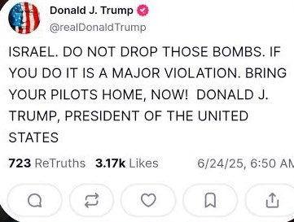

Shin ✓ @hey_itsmyturn
Mon, 01 Jun 2026 23:31:06 UTC

Looks like I have to remind some people who stopped Israel from continuing the strikes and maybe finishing the Islamic regime back in 2025.

Now Google how many Iranians were hanged since June 2025.

Will leave you with your conscience and red MAGA hats.

فارسی

به نظر می‌رسد باید به برخی افراد یادآوری کنم که چه کسانی در سال ۲۰۲۵ مانع از ادامه حملات اسرائیل و شاید تمام کردن کار رژیم اسلامی شدند.

حالا در گوگل جستجو کنید که از ژوئن ۲۰۲۵ تاکنون چه تعداد ایرانی اعدام (آویخته) شده‌اند.

شما را با وجدانتان و کلاه‌های قرمز MAGA تنها می‌گذارم.

𝕏 · @shin_persian

## Shin_Persian — post 6388

↩️ Quoted tweet: Shin ✓ @hey_itsmyturn Mon, 01 Jun 2026 22:30:46 UTC @WhiteHouse Yeah, about that, NO. Even if he attacks the Islamic Regime right fucking now, his dumb pause led to numerous executions since the "ceasefire", so, no, I won't "Trust in Trump"…

## Shin_Persian — post 6387

↩️ Quoted tweet:
Shin ✓ @hey_itsmyturn
Mon, 01 Jun 2026 22:30:46 UTC

@WhiteHouse Yeah, about that, NO.
Even if he attacks the Islamic Regime right fucking now, his dumb pause led to numerous executions since the "ceasefire", so, no, I won't "Trust in Trump" and his promised "Help".

↩️ توییت نقل‌قول شده — برای پاسخ، پست زیر را ببینید.

فارسی

@WhiteHouse آره، در این مورد، نه.
حتی اگر او همین الان هم به رژیم اسلامی حمله کند، وقفه احمقانه‌اش منجر به اعدام‌های متعددی از زمان «آتش‌بس» شده است، بنابراین، نه، من به ترامپ و «کمک» وعده داده شده‌اش «اعتماد» نخواهم کرد.

𝕏 · @shin_persian

## Shin_Persian — post 6386

  

Shin ✓ @hey_itsmyturn
Mon, 01 Jun 2026 22:35:53 UTC

Sirens in Golan, Hermon
#Israel 🇮🇱

فارسی

آژیرهای خطر در جولان، حرمون
#Israel 🇮🇱

𝕏 · @shin_persian

## Shin_Persian — post 6385

  

Shin ✓ @hey_itsmyturn
Mon, 01 Jun 2026 22:26:14 UTC

Some sources on the explosion, and one guy looking for, well, god knows what xD

فارسی

برخی منابع درباره انفجار، و یک نفر که به دنبال، خب، خدا می‌داند چه می‌گردد xD

𝕏 · @shin_persian

## Shin_Persian — post 6384

Shin ✓ @hey_itsmyturn
Mon, 01 Jun 2026 22:24:16 UTC

Blast sound in Sana'a, Yemen

فارسی

صدای انفجار در صنعا، یمن

𝕏 · @shin_persian

## Shin_Persian — post 6383

Open Source Intel ✓ @Osint613
Mon, 01 Jun 2026 20:41:36 UTC

British Airways suspends all flights to Israel until October 24.

فارسی

بریتیش ایرویز تمامی پروازهای خود به اسرائیل را تا ۲۴ اکتبر به حالت تعلیق درآورد.

𝕏 · @shin_persian

## Shin_Persian — post 6382

  

🔁 Quoting above tweet: Shin ✓ @hey_itsmyturn Mon, 01 Jun 2026 21:14:21 UTC Hezbollah MP Hassan Fadlallah: "We reject the American proposal, received hours ago through intermediaries, which stipulates a cessation of Hezbollah operations in exchange for Israel…

## Shin_Persian — post 6381

🔁 Quoting above tweet:
Shin ✓ @hey_itsmyturn
Mon, 01 Jun 2026 21:14:21 UTC

Hezbollah MP Hassan Fadlallah:

"We reject the American proposal, received hours ago through intermediaries, which stipulates a cessation of Hezbollah operations in exchange for Israel not bombing the southern suburbs.

Our steadfast position is that any comprehensive ceasefire, as a pathway for the enemy's withdrawal from our land, must be part of the solution.

A complete ceasefire, no return to the pre-March 2nd status quo, and no such thing as 'freedom of movement for Israel'. "

[Source: Hezballah-affiliated Telegram channels]

فارسی

حسن فضل‌الله، نماینده پارلمان از فراکسیون حزب‌الله:

«ما پیشنهاد آمریکا را که ساعاتی پیش از طریق میانجی‌ها دریافت شد و بر توقف عملیات حزب‌الله در ازای عدم بمباران ضاحیه جنوبی توسط اسرائیل تصریح دارد، رد می‌کنیم.

موضع استوار ما این است که هرگونه آتش‌بس جامع، به عنوان مسیری برای عقب‌نشینی دشمن از خاک ما، باید بخشی از راه حل باشد.

آتش‌بس کامل، عدم بازگشت به وضعیت پیش از ۲ مارس، و چیزی به نام "آزادی عمل برای اسرائیل" وجود نخواهد داشت.»

[منبع: کانال‌های تلگرامی وابسته به حزب‌الله]

𝕏 · @shin_persian

## Shin_Persian — post 6380

  

↩️ Quoted tweet: Open Source Intel ✓ @Osint613 Mon, 01 Jun 2026 17:32:55 UTC Trump: “I had a very productive call with Prime Minister Bibi Netanyahu, of Israel, and there will be no Troops going to Beirut, and any Troops that are on their way, have already…

## Shin_Persian — post 6379

↩️ Quoted tweet:
Open Source Intel ✓ @Osint613
Mon, 01 Jun 2026 17:32:55 UTC

Trump: “I had a very productive call with Prime Minister Bibi Netanyahu, of Israel, and there will be no Troops going to Beirut, and any Troops that are on their way, have already been turned back. Likewise, through highly placed Representatives, I had a very good call with

↩️ توییت نقل‌قول شده — برای پاسخ، پست زیر را ببینید.

فارسی

ترامپ: «من تماس بسیار سازنده‌ای با بی‌بی نتانیاهو، نخست‌وزیر اسرائیل داشتم و هیچگونه نیروی نظامی (نیروهای ارتش) به بیروت اعزام نخواهد شد، و هر نیرویی که در راه بوده، در حال حاضر بازگردانده شده است. به همین ترتیب، از طریق نمایندگان عالی‌رتبه، تماس بسیار خوبی با...»

𝕏 · @shin_persian

## Shin_Persian — post 6378

  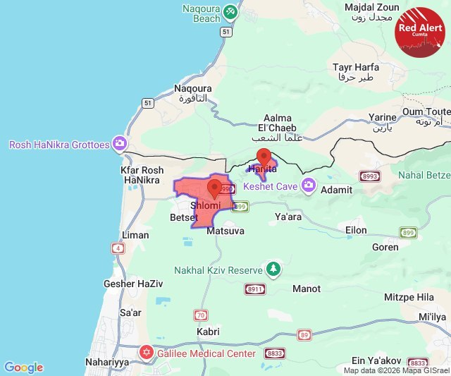

Shin ✓ @hey_itsmyturn
Mon, 01 Jun 2026 20:54:47 UTC

Sirens in Shlomi, #Israel 🇮🇱

فارسی

آژیرهای خطر در شلومی، #Israel 🇮🇱

𝕏 · @shin_persian

## Shin_Persian — post 6377

  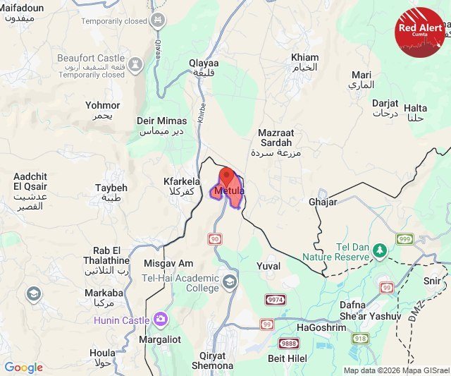

Shin ✓ @hey_itsmyturn
Mon, 01 Jun 2026 20:38:42 UTC

Looks like Hezbollah heard Trump loud and clear.
Sirens in Metula, #Israel 🇮🇱

فارسی

به نظر می‌رسد حزب‌الله پیام ترامپ را رسا و واضح شنیده است.
آژیرهای خطر در متولا، #Israel 🇮🇱

𝕏 · @shin_persian

## Shin_Persian — post 6375

Shin ✓ @hey_itsmyturn Mon, 01 Jun 2026 19:02:58 UTC Regime media report last night 2 IRGC's Basij terrorists were killed following the detonation of UXO in a "military position" in Qom Province 1. Hossein Ramezanian Fordoii 2. Mohammad Oveisi Fordoii …

## Shin_Persian — post 6374

Shin ✓ @hey_itsmyturn
Mon, 01 Jun 2026 19:02:58 UTC

Regime media report last night 2 IRGC's Basij terrorists were killed following the detonation of UXO in a "military position" in Qom Province

1. Hossein Ramezanian Fordoii
2. Mohammad Oveisi Fordoii

Yet, I have 2 different names:
Both from IRGC QF's 840th unit (weird huh? QF operates out of Iran, not inside the country)
1. Ali Qomi
2. Sorush Mohammadi

#Iran

فارسی

رسانه‌های رژیم گزارش می‌دهند که شب گذشته ۲ تروریست بسیج سپاه پاسداران (IRGC) در پی انفجار مهمات عمل‌نکرده (UXO) در یک «موضع نظامی» در استان قم کشته شدند.

۱. حسین رمضانیان فردویی
۲. محمد اویسی فردویی

با این حال، من ۲ نام متفاوت دارم:
هر دو از واحد ۸۴۰ نیروی قدس سپاه پاسداران (عجیبه نه؟ نیروی قدس خارج از ایران فعالیت می‌کند، نه داخل کشور)
۱. علی قمی
۲. سروش محمدی

#Iran

𝕏 · @shin_persian

## Shin_Persian — post 6373

🔁 Quoting above tweet:
Shin ✓ @hey_itsmyturn
Mon, 01 Jun 2026 18:33:09 UTC

THE PRESIDENT OF THE UNITED STATES OF AMERICA had a "VERY GOOD CALL WITH HEZBOLLAH", which is a designated FTO (Foreign Terror Organization)
(https://www.state.gov/foreign-terrorist-organizations)

Cool.

فارسی

رئیس‌جمهور ایالات متحده آمریکا یک «تماس بسیار خوب با حزب‌الله» داشت، که یک FTO (سازمان تروریستی خارجی) تعیین شده است.
(https://www.state.gov/foreign-terrorist-organizations)

عالیه.

𝕏 · @shin_persian

## Shin_Persian — post 6372

  

↩️ Quoted tweet: Open Source Intel ✓ @Osint613 Mon, 01 Jun 2026 17:32:55 UTC Trump: “I had a very productive call with Prime Minister Bibi Netanyahu, of Israel, and there will be no Troops going to Beirut, and any Troops that are on their way, have already…

## Shin_Persian — post 6371

↩️ Quoted tweet:
Open Source Intel ✓ @Osint613
Mon, 01 Jun 2026 17:32:55 UTC

Trump: “I had a very productive call with Prime Minister Bibi Netanyahu, of Israel, and there will be no Troops going to Beirut, and any Troops that are on their way, have already been turned back. Likewise, through highly placed Representatives, I had a very good call with

↩️ توییت نقل‌قول شده — برای پاسخ، پست زیر را ببینید.

فارسی

ترامپ: «من تماس بسیار سازنده‌ای با بی‌بی نتانیاهو، نخست‌وزیر اسرائیل داشتم و هیچ نیروی نظامی به بیروت اعزام نخواهد شد و هر نیرویی که در راه است، پیش‌تر بازگردانده شده است. به همین ترتیب، از طریق نمایندگان عالی‌رتبه، تماس بسیار خوبی با مابقی داشتم...»

𝕏 · @shin_persian

## Iliaen — post 4439

بامداد سه‌شنبه؛ سیگنال تمام اپراتورهای تلفن همراه و همچنین تمام سرویس‌دهندگان اینترنت خانگی به صورت همزمان در شهر شیراز و چند شهر دیگر استان فارس، همچنین شهرهای خط ساحلی جنوب کشور در حدود ساعت ۰۲:۰۰ صبح به مدت تقریباً ۲۰ دقیقه “کاملاً قطع” شد.

به عبارت دیگر هیچ دستگاه تلفن همراهی آنتن نداشت، هیچ وای‌فایی متصل نبود و هیچ امکانی برای ارتباط حتی با شماره‌های اضطراری میسر نبود.

قطع برنامه‌ریزی شده جهت یک اقدام امنیتی، تست زیرساخت، حمله گسترده سایبری یا مسائل مرتبط به جنگ الکترونیک؛ مشخص نیست چه در آن ۲۰ دقیقه چه رخ داد.

@iliaen

## reutersworldchannel — post 151527

  

Iran halting indirect talks with US over Israel's Lebanon incursion, Tasnim says

ran is halting indirect negotiations with the U.S. ​after Israel ordered troops to push deeper into Lebanon to battle Tehran-backed Hezbollah, the Iranian news agency Tasnim said on Monday, complicating diplomatic efforts to end three months of war.

Tasnim said the Islamic Republic's ‌negotiating team was stopping exchanging messages with Washington through mediators over attacks on Lebanon, where the U.S.-Israeli war against Iran has reignited Israel's conflict with Hezbollah. read more

## ManotoTV — post 105898

  <a href="telegram/content/ManotoTV_105898_1780359055.mp4" target="_blank">🎬 Download video</a>

سخنان عزت‌الله همایون‌فر، ادیب و سیاستمدار، درباره روحیه قوی ملت ایران و ریشه‌های آن در سی قرن تاریخ کشور

## ManotoTV — post 105890

  <a href="telegram/content/ManotoTV_105890_1780359057.mp4" target="_blank">🎬 Download video</a>

حمله گزارش‌شده آمریکا به اهدافی در جنوب ایران، از نظر دامنه محدود بود، اما از نظر پیام نظامی اهمیت داشت. بر اساس روایت آمریکا، این حمله پس از سرنگونی یک پهپاد آمریکایی بر فراز آب‌های بین‌المللی انجام شد و سایت‌های راداری و مراکز فرماندهی و کنترل پهپادی جمهوری اسلامی در سیریک و جزیره قشم را هدف قرار داد.

## FarsiVOA — post 219325

🔺دونالد ترامپ: با نتانیاهو و نمایندگان حزب‌الله صحبت کردم

▪️دونالد ترامپ، رئيس‌جمهوری آمریکا، عصر دوشنبه در تروت‌سوشال نوشت که با نخست وزیر اسرائيل، بنیامین نتانیاهو صحبت کرده است تا به بیروت حمله بزرگی نکند.

⬇️ بیشتر بخوانید:
https://ir.voanews.com/a/8156191.html
@FarsiVOA

## FarsiVOA — post 219324

Farsi VOA pinned «🔺نتانیاهو پس از تماس با پرزیدنت ترامپ؛ ارتش اسرائیل «به عملیات خود در جنوب لبنان طبق برنامه ادامه می‌دهد» ▪️بنیامین نتانیاهو، نخست‌وزیر اسرائیل، روز دوشنبه ۱۱ خرداد اعلام کرد در گفت‌وگو با دونالد ترامپ، رئیس جمهوری ایالات متحده، تأکید کرد در صورتی که حزب‌الله…»

## FarsiVOA — post 219323

🔺دونالد ترامپ به‌ ای‌بی‌سی نیوز: احتمال دارد تفاهم‌نامه با جمهوری اسلامی هفته آینده امضا شود؛ مشکلی امروز پیش آمد که برطرف شد

▪️دونالد ترامپ، رئیس‌جمهوری آمریکا گفت این احتمال وجود دارد که هفته آینده با جمهوری اسلامی توافقی برای تمدید آتش‌بس و بازگشایی تنگه هرمز امضا شود.

⬇️ بیشتر بخوانید:
https://ir.voanews.com/a/8156190.html
@FarsiVOA

## FarsiVOA — post 219322

  <a href="telegram/content/FarsiVOA_219322_1780359059.mp4" target="_blank">🎬 Download video</a>

⚡️فلاکت اقتصادی، فرسایش اجتماعی در ایران؛ گفت‌وگو با امین قضایی
@FarsiVOA

## FarsiVOA — post 219321

  <a href="telegram/content/FarsiVOA_219321_1780359060.mp4" target="_blank">🎬 Download video</a>

⚡️تشدید سرکوب دانشجویان و ادامه بی‌وقفه اعدام‌ها؛ واکنش کاربران شبکه‌های اجتماعی
@FarsiVOA

## FarsiVOA — post 219320

🔺قانون‌گذار آمریکایی: ۸۰ درصد مردم ایران از جمهوری اسلامی متنفرند؛ اگر رژیم اورانیوم را تحویل ندهد در نهایت سقوط می‌کند

▪️پت فالون، عضو جمهوری‌خواه مجلس نمایندگان آمریکا، روز دوشنبه در شبکه اجتماعی ایکس نوشت که جمهوری اسلامی «ایران اورانیوم را تا ۶۰ درصد که درجه تسلیحاتی است، غنی‌سازی می‌کند.»

⬇️ بیشتر بخوانید:
https://ir.voanews.com/a/8156184.html?ghgh=
@FarsiVOA

## FarsiVOA — post 219319

⚡️جنگ در ایران؛ پیامدها و چالش‌های تازه برای میلیون‌ها مهاجر افغان
@FarsiVOA

## FarsiVOA — post 219318

  <a href="telegram/content/FarsiVOA_219318_1780359061.mp4" target="_blank">🎬 Download video</a>

⚡️چرا جمهوری اسلامی به رغم «بدگمانی» مذاکره با آمریکا را ترک نمی‌کند؟ گفت‌وگو با فرزانه روستایی
@FarsiVOA

## FarsiVOA — post 219317

  <a href="telegram/content/FarsiVOA_219317_1780359062.mp4" target="_blank">🎬 Download video</a>

⚡️پیشروی اسرائیل و تضعیف پایگاه حزب‌الله؛ گفت‌وگو با حسن هاشمیان
@FarsiVOA

## FarsiVOA — post 219316

  <a href="telegram/content/FarsiVOA_219316_1780359063.mp4" target="_blank">🎬 Download video</a>

⚡️گزارش نرگس صبا در برنامه تفسیر خبر از مقایسه نمودارهای قیمت جهانی نفت و تنش آفرینی سپاه در تنگه هرمز
@FarsiVOA

## FarsiVOA — post 219315

  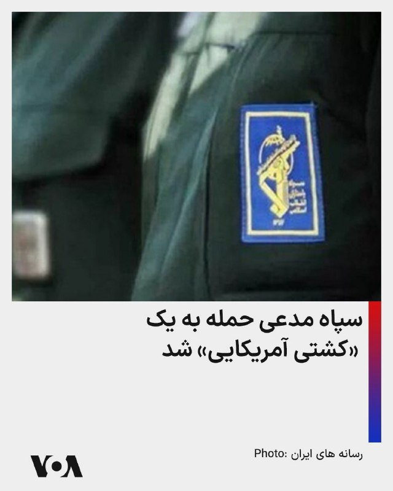

⚡️خبرگزاری‌های حکومتی در ایران شامگاه دوشنبه ۱۱ خرداد حوالی ساعت ۱۱:۳۰ شب به وقت تهران به نقل از روابط عمومی سپاه مدعی شدند که نیروی دریایی آن به یک «کشتی آمریکایی» به نام «ساریسکا» را در دریای عمان هدف قرار داده است. این در حالی است که آژانس «عملیات تجارت دریایی بریتانیا» در این روز از حمله‌ای به یک کشتی تجاری در جنوب شرقی عراق خبر داده بود. براساس ادعای مطرح شده سپاه، این حمله به تلافی حمله آمریکا به کشتی ایرانی «لیان استار»و در محدوده دریای عمان با موشک کروز صورت گرفته است. بیانیه سپاه به جزئیات و زمان این حمله ادعایی اشاره‌ای نکرده است. ایالات متحده و شمار دیگری از کشورها سپاه پاسداران را در فهرست سازمان‌های تروریستی قرار داده‌اند.
@FarsiVOA

## FarsiVOA — post 219314

  <a href="telegram/content/FarsiVOA_219314_1780359064.mp4" target="_blank">🎬 Download video</a>

⚡️بابک دربیکی در برنامه تفسیر خبر: هدف واشنگتن تغییر رفتار حکومت اسلامی است
@FarsiVOA

## FarsiVOA — post 219313

🔺نتانیاهو پس از تماس با پرزیدنت ترامپ؛ ارتش اسرائیل «به عملیات خود در جنوب لبنان طبق برنامه ادامه می‌دهد»

▪️بنیامین نتانیاهو، نخست‌وزیر اسرائیل، روز دوشنبه ۱۱ خرداد اعلام کرد در گفت‌وگو با دونالد ترامپ، رئیس جمهوری ایالات متحده، تأکید کرد در صورتی که حزب‌الله به حملات خود علیه شهرها و شهروندان اسرائیلی ادامه دهد، اسرائیل اهداف وابسته به این گروه در بیروت را هدف قرار خواهد داد.

⬇️ بیشتر بخوانید:
https://ir.voanews.com/a/netanyahu-says-if-hezbollah-does-not-cease-attacking-israel-will-target-strongholds-in-beirut/8156170.html
@FarsiVOA

## FarsiVOA — post 219312

  <a href="telegram/content/FarsiVOA_219312_1780359065.mp4" target="_blank">🎬 Download video</a>

⚡️ویکتوریا آزاد در برنامه تفسیر خبر: من حملات آمریکا و اسرائیل را محکوم نمی‌کنم
@FarsiVOA

## FarsiVOA — post 219311

🔺خبرگزاری جمهوری اسلامی از کشته شدن دو عضو سپاه در قم خبر داد؛ تلفات سپاه در «آتش‌بس» افزایش یافت

▪️خبرگزاری جمهوری اسلامی، ایرنا، روز دوشنبه ۱۱ خرداد از کشته‌شدن دو سپاهی در قم خبر داد.

⬇️ بیشتر بخوانید:
https://ir.voanews.com/a/8156168.html
@FarsiVOA

## FarsiVOA — post 219310

  <a href="telegram/content/FarsiVOA_219310_1780359066.mp4" target="_blank">🎬 Download video</a>

⚡️رضا غیبی در برنامه تفسیر خبر: باید دید جامعه تا کجا می‌تواند شرایط فعلی را تحمل کند
@FardiVOA

## FarsiVOA — post 219309

🔺ترامپ از توقف حملات متقابل میان اسرائیل و حزب‌الله لبنان خبر داد

◾️دونالد ترامپ رئیس‌جمهوری ایالات متحده اطلاع داد که اسرائیل و حزب‌الله لبنان موافقت کردند، حملات علیه یکدیگر را متوقف کنند.

⬇️ بیشتر بخوانید:
https://ir.voanews.com/a/lebanon-israel-hezbollah-ceasefire-iran-/8156156.html
@FarsiVOA

## FarsiVOA — post 219308

🔺آمریکا عواید سکه‌های یادبود جام جهانی ۲۰۲۶ را به فرزندان نظامیان اختصاص می‌دهد

◾️وزارت خزانه‌داری ایالات متحده و ضرابخانه آمریکا روز دوشنبه ۱۱ خرداد اعلام کردند که برنامه تولید سکه‌های یادبود جام جهانی فوتبال ۲۰۲۶ آغاز خواهد شد، و تمامی درآمدهای اضافی حاصل از فروش این سکه‌ها به برنامه‌های فوتبال جوانان برای فرزندان خانواده‌های نظامیان آمریکایی اختصاص می‌یابد.

⬇️ بیشتر بخوانید:

https://ir.voanews.com/a/us-treasury-us-mint-launch-fifa-coins-with-all-proceeds-to-military-families-youth-soccer/8156126.html

## FarsiVOA — post 219305

هواگردهای «ام‌وی-۲۲بی اوسپری» متعلق به نیروی تفنگداران دریایی آمریکا، توانایی‌های عملیاتی خود را بر عرشه ناو «یواس‌اس ایوو جیما» به نمایش گذاشتند. این عملیات بخشی از یک ماموریت به نام «ساوترن اسپیر» بود.

@FarsiVOA

## DW_Farsi — post 125397

🔶 نرخ تورم سالانه در ایران از ۵۷‌درصد عبور کرد

مرکز آمار ایران روز دوشنبه، ۱۱ خرداد، با انتشار آمار و ارقامی، نرخ تورم نقطه به نقطه تا پایان اردیبهشت ماه را ۸۳.۹ درصد اعلام کرد که بیشترین تورم تجربه شده از سال ۱۴۰۰ به این سو است.

منظور از تورم نقطه به نقطه، درصد تغییر عدد شاخص قیمت نسبت به ماه مشابه سال گذشته است.

تورم نقطه به نقطه در اردیبهشت امسال در حالی در مرز ۸۴ درصد شدن قرار گرفت که در فروردین ماه این شاخص ۱۰.۴ واحد درصد کمتر و ۷۳.۵ درصد محاسبه شده بود.

تورم سالانه نیز با رسیدن به ۵۷.۵ درصد به رقمی رسید که در تاریخ گزارش‌دهی مرکز آمار ایران و بانک مرکزی بی‌سابقه است.

گزارش مرکز آمار ایران همچنین می‌گوید که نرخ تورم نقطه به نقطه خوراکی‌ها و آشامیدنی‌ها به رقم بی‌سابقه ۱۲۹.۸ درصد در دهه‌های اخیر رسید.

سایت خبرآنلاین این افزایش بی‌سابقه نرخ تورم را مستقیما محصول حذف ارز ترجیحی توصیف کرده است.

به گزارش این سایت آمارهای بالای نرخ تورم از سال ۱۴۰۱ به این سو عمدتاَ حاصل اجرای سیاست شوک درمانی ارزی در دولت‌های سیزدهم و چهاردهم بوده است، "این در حالی است که هم در دولت پیش و هم در دولت فعلی، دست اندرکاران وعده کنترل فشارها بر سفره‌های مردم را دادند اما در عمل مردم بر اثر اجرای «یک سیاست» در دو دوره، بیشترین فشار معیشتی را تحمل کردند".

حذف ارز ترجیحی گرچه با هدف از بین‌بردن فساد ناشی از وجود ارز چند نرخی در بازار دنبال شده است، ولی مناسبات نابسامان بین‌المللی و معضلات ریشه‌دار اقتصادی ایران، از فساد سیستماتیک و رانت‌خوری گرفته تا تسلط اختاپوسی هولدینگ‌های خصولتی بر اقتصاد کاهش دائم ارزش پول ملی، و به‌ویژه اثرات تحریم‌ها و پیامدهای دو جنگ اخیر وضعیت معیشتی مردم را به بدترین حالت در یک صد سال اخیر رسانده‌اند.

در این میان اعطای کالابرگ یک میلیون تومانی در ماه به دهک‌های معینی از جامعه تاثیر اندکی در مهار نرخ تورم و بهبود معیشت این اقشار دارد و حالا شماری از اقتصاددانان هشدار می‌دهند که بیش از ۴۰ میلیون جمعیت ایران به زیر خط فقر کشیده شده‌‌اند.
@dw_farsi

## DW_Farsi — post 125396

  <a href="telegram/content/DW_Farsi_125396_1780359067.mp4" target="_blank">🎬 Download video</a>

🎥 هجوم ملخ‌ها به ایران

تصاویر منتشرشده در شبکه‌های اجتماعی از حضور گسترده ملخ‌ها در مشهد خبر می‌دهد. همزمان، خبرگزاری تسنیم، نزدیک به حکومت، از "هجوم ملخ‌های مراکشی" به شرق ایران و تهدید معیشت هزاران خانوار گزارش داده است.
@dw_farsi

## DW_Farsi — post 125395

🔶 ترامپ: در لبنان آتش‌بس می‌شود و مذاکرات با ایران ادامه دارد

دونالد ترامپ، رئیس‌جمهور آمریکا، می‌گوید که "گفت‌وگوها با جمهوری اسلامی ایران با سرعت زیادی ادامه دارد".

او این اظهارات را در شبکه اجتماعی تروث سوشال (Truth Social) و اندکی پس از پیام قبلی‌اش مطرح کرد که در آن از دستیابی به یک توافق جدید آتش‌بس میان اسرائیل و حزب‌الله خبر داده بود.

ترامپ در این پیام ضمن تایید یک تماس "سازنده" با بنیامین نتانیاهو، نخست‌وزیر اسرائیل در روز دوشنبه، نوشت که در نتیجه این تماس "هیچ نیرویی به بیروت اعزام نخواهد شد؛ و هر نیرویی هم که در مسیر بوده، همین حالا بازگردانده شده است".

او همچنین تصریح کرد که از طریق نمایندگان بلندپایه، با حزب‌الله نیز "تماس بسیار خوبی" داشته و "آن‌ها پذیرفتند که همه تیراندازی‌ها متوقف شود ، اینکه اسرائیل به آن‌ها حمله نکند و آن‌ها هم به اسرائیل حمله نکنند".

سایت خبری روزنامه اسرائیلی یعودیت آخرونت ( Ynet) از قول یک مقام اسرائیلی تایید کرد که این کشور به درخواست ایالات متحده، حملات برنامه‌ریزی‌شده خود به بیروت را به تعویق انداخته است. به گفته این منبع، واشنگتن در حال پیشبرد یک ابتکار آتش‌بس بوده و از اسرائیل خواسته است فعلاً دست نگه دارد.

اعلام ترامپ دائر بر موافقت اسرائیل و حزب‌الله با توقف درگیری‌ها، تنها چند ساعت پس از آن صورت گرفت که تهران از زبان رسانه نزدیک به سپاه (تسنیم) تهدید کرده بود در صورت متوقف نشدن حملات ارتش اسرائیل (IDF) در لبنان، مذاکرات با آمریکا را ترک خواهد کرد.

همزمان فرمانده قرارگاه مرکزی خاتم‌الانبیا نیز در واکنش به گسترش عملیات اسرائیل در لبنان و هشدار تخلیه از سوی ارتش این کشور برای ساکنان حومه جنوبی بیروت، متقابلا به ساکنان مناطق شمالی اسراییل "هشدار" داد که "در صورت عملی شدن تهدیدهای اسرائیل علیه لبنان، برای جلوگیری از آسیب، این مناطق را ترک کنند".

علی عبداللهی، در بیانیه خود با متهم‌کردن نخست‌وزیر اسرائیل به "ادامه شرارت‌ها در منطقه"، افزود: «با توجه به نقض مکرر آتش‌بس توسط اسراییل، در صورت عملی شدن این تهدید، به ساکنان بخش‌های شمالی و شهرک‌های نظامی در سرزمین‌های اشغالی هشدار می‌دهیم اگر نمی‌خواهند آسیب ببینند منطقه را ترک کنند.»

به نوشته تایمز اسرائیل، به نظر می‌رسد این روند رخدادها تلاش‌های آمریکا برای جدا نگه داشتن جنگ لبنان از رویارویی خود با ایران را تضعیف می‌کند. جمهوری اسلامی اصرار داشته است که این دو موضوع به یکدیگر مرتبط هستند؛ زیرا در پی حفاظت از متحد خود، حزب‌الله، و حفظ نفوذش بر تحولات لبنان است.
@dw_farsi

## DW_Farsi — post 125394

🔶 "بی‌اطلاعی" ترامپ از تعلیق مذاکرات؛ جلوگیری از حمله به بیروت

دونالد ترامپ، رئیس جمهور آمریکا روز دوشنبه، اول ژوئن در مصاحبه با شبکه ان بی سی، در باره برخی خبرهای رسانه‌های نزدیک به حکومت ایران دائر بر لغو تبادلات پیام‌های مذاکراتی برای توافق با تهران، گفت که در این باره گزارشی دریافت نکرده است.
او گفت: «من چنین چیزی نشنیده‌ام، نمی‌دانم که آیا صحت دارد یا خیر. اگر این‌طور باشد، چیز خوبی خواهد بود ، ما خیلی صحبت کرده‌ایم، شاید بیش از حد.»

ترامپ بعداَ تصریح کرد که "این به آن معنا نیست که ما شروع به بمباران خواهیم کرد. ما فقط سکوت خواهیم کرد. ما محاصره را حفظ می‌کنیم".

رئیس جمهور آمریکا در پاسخ به این پرسش که آیا چنین اقدامی از سوی ایران پیامدی برای تهران خواهد داشت یا خیر، گفت: «نه! مشکلی نیست. آن‌ها مذاکره‌کنندگان بسیار خوبی هستند.»

ترامپ همچنین در پاسخ به این سوال که آیا می‌تواند منتظر خروج ایران (از مذاکرات) بماند، گفت: «فکر می‌کنم می‌توانم تا هر زمان که بخواهند صبر کنم. آنها دارند ثروت زیادی را از دست می‌دهند.»

ساعاتی قبل از این اظهارات ترامپ، خبرگزاری تسنیم، نزدیک به سپاه پاسداران، نوشت که "کسب اطلاع" کرده است که "با توجه به تداوم جنایات رژیم صهیونیستی در لبنان و با عنایت به اینکه لبنان جزو پیش شرط‌های آتش‌بس بوده است و هم اینک این آتش‌بس در همه جبهه‌ها از جمله لبنان نقض شده است، تیم مذاکره‌کننده ایرانی گفتگوها و تبادل متون از طریق میانجی را متوقف می‌کند".

در ادامه خبر تسنیم گفته می‌شود که "توقف فوری عملیات تجاوزکارانه و وحشیانه ارتش اسرائیل در غزه و لبنان و ضرورت عقب‌نشینی کامل از مناطق اشغال شده در لبنان توسط مسئولان و مذاکره‌کنندگان ایرانی مورد تاکید قرار گرفته و تا زمانی که نظر ایران و مقاومت در این زمینه تامین نشود، گفتگویی در کار نخواهد بود".

تسنیم همچنین تهدید کرده است که "جبهه مقاومت و ایران عزم خود را برای انسداد کامل تنگه هرمز، و فعال کردن سایر جبهه‌ها از جمله تنگه باب‌المندب، به منظور تنبیه صهیونیست‌ها و حامیانش در دستور کار قرار داده‌اند".

همزمان فرمانده قرارگاه مرکزی خاتم‌الانبیا در واکنش به گسترش عملیات اسرائیل در لبنان و هشدار تخلیه از سوی ارتش این کشور برای ساکنان حومه جنوبی بیروت، به ساکنان مناطق شمالی اسراییل هشدار داد که "در صورت عملی شدن تهدیدهای اسراییل علیه لبنان، برای جلوگیری از آسیب، این مناطق را ترک کنند".

علی عبداللهی، در بیانیه خود با متهم‌کردن نخست‌وزیر اسرائیل به "ادامه شرارت‌ها در منطقه"، افزود: «با توجه به نقض مکرر آتش‌بس توسط اسراییل، در صورت عملی شدن این تهدید، به ساکنان بخش‌های شمالی و شهرک‌های نظامی در سرزمین‌های اشغالی هشدار می‌دهیم اگر نمی‌خواهند آسیب ببینند منطقه را ترک کنند.»
@dw_farsi

## DW_Farsi — post 125392

🔶 ارتش اسرائیل: یک فرمانده حماس پزشک بیهوشی بود

ارتش اسرائیل روز دوشنبه، اول ژوئن اعلام کرد پزشکی که در بمباران روز شنبه گذشته در دیرالبلح در مرکز نوار غزه جان خود را از دست داد، در واقع در یک جایگاه مهم در شاخه نظامی جنبش مقاومت اسلامی (حماس) داشته است.

نیروهای دفاعی اسرائیل (IDF) فرد کشته‌شده را «جمال ابوعون» معرفی کرده‌اند؛ کسی که رئیس بخش بیهوشی در بیمارستان یافا بوده است. ارتش اسرائیل او را "تروریست" و "فرمانده دسته‌ای از شاخه نظامی حماس، یعنی گردان‌های عزالدین قسام" توصیف کرده است.

در بیانیه ارتش آمده است: «او نیروهای حماس را هدایت می‌کرد و در طراحی و پیشبرد عملیات علیه نیروهای ارتش اسرائیل و دولت اسرائیل نقش داشت. همچنین در دوره اخیر در تلاش‌های حماس برای تثبیت، بازسازی و تقویت توان خود مشارکت داشته است؛ اقدامی که نقض توافق آتش‌بس محسوب می‌شود.»

بر اساس این بیانیه، این پزشک هدف یک "حمله هدفمند" از سوی ارتش اسرائیل بوده و فعالیت‌های او نمونه‌ای دیگر از "استفاده ابزاری حماس از موقعیت‌های غیرنظامی برای پیشبرد فعالیت‌های نظامی" عنوان شده است.

گزارش‌ها می‌گویند ابوعون در حمله به یک ایست بازرسی پلیس داخلی حماس کشته شد؛ حمله‌ای که در آن سه نفر دیگر نیز زخمی شدند.

در همین حال، آخرین آمار منتشرشده از سوی وزارت بهداشت غزه نشان می‌دهد از زمان آتش‌بس در غزه در ماه اکتبر تاکنون ۹۲۲ نفر کشته و ۲٬۸۱۱ نفر زخمی شده‌اند. همچنین مجموع تلفات از آغاز جنگ تاکنون به ۷۲٬۹۳۸ کشته و ۱۷۲٬۹۱۹ زخمی رسیده است.

این وزارتخانه که تحت کنترل گروه تروریستی حماس است، همچنین اعلام کرده از زمان اجرای آتش‌بس در ۱۱ اکتبر ۲۰۲۵ تاکنون ۹۳۲ کشته و ۲٬۸۵۹ زخمی ثبت شده است. در ۲۴ ساعت گذشته نیز دو نفر کشته و ۴۰ نفر زخمی شده‌اند.

در ادامه گزارش آمده است از زمان آغاز حمله نظامی اسرائیل پس از حملات ۷ اکتبر ۲۰۲۳ که حدود ۱۲۰۰ کشته و نزدیک به ۲۵۰ گروگان برجای گذاشت (بر اساس آمار رسمی اسرائیل)، تاکنون ۷۲۹۴۱ کشته و ۱۷۲۹۶۷ زخمی در غزه ثبت شده است.

علاوه بر سازمان ملل مقام‌های اسرائیل نیز آمار حماس را نزدیک به واقعیت اعلام کرده‌اند.
@dw_farsi

## DW_Farsi — post 125391

🔶 کارزار روایت‌ها؛ هشتگ "وقتی شما نبودید" از چه می‌گوید؟

🔻 گزارشی از آبان سرایی

جنگ‌ها تنها در آسمان و بر زمین رخ نمی‌دهند، میدان‌های دیگری هم دارند که در آن بازیگران مختلف می‌کوشند نگرش خود را به روایت مسلط تبدیل کنند.

در ساعات اخیر پس از پایان درگیری‌ها و بازگشت نسبی دسترسی به اینترنت، هشتگی با عنوان "وقتی شما نبودید" به یکی از نمودهای این کشمکش‌های روایی تبدیل شده است؛ هشتگی که در نگاه نخست قرار بود برای کاربران داخل ایران روایت کند در روزهایی که به دلیل قطع اینترنت از فضای مجازی محروم بودند، ایرانیان بیرون از مرزهای کشور چه مواضعی داشته‌اند. اما این کارزار به سرعت بستری برای طرح روایتی معکوس شد؛ برآمدن صدای کسانی که در همان روزها زیر چنگال واقعیت جنگ و پیامدهای آن زیستند.

قطع گسترده اینترنت در دوماه اخیر، شکافی ارتباط بی‌سابقه‌ای میان ایرانیان ساکن داخل و دیاسپورای خارج ایجاد کرد؛ گسستی که بسیاری از کاربران معتقدند در سایه بی‌خبری از واقعیت جاری در ایران به شکاف روایت‌ها تبدیل شد.

در این خلا اطلاعاتی‌، فضای رسانه‌ای وشبکه‌های مجازی در اختیار فارسی‌زبان خارج از کشور به یکی از مهم‌ترین عرصه‌های تولید و گردش روایت‌ها بدل شد؛ از کسانی که حملات را فرصتی برای تغییر سیاسی می‌دانستند تا کسانی که نسبت به پیامدهای انسانی و اجتماعی جنگ هشدار می‌دادند.

هشتگ "وقتی شما نبودید" در واقع تلاشی برای بازگرداندن همان لحظات به حافظه جمعی است و هم‌زمان افراد داخل ایران از همین هشتگ استفاده می‌کنند تا بگویند در روزهایی که دیگران از دور درباره جنگ سخن می‌گفتند، آنها در متن واقعه زندگی می‌کردند.

در یکی از پست‌های منتشرشده در این هشتگ آمده است: "وقتی شما نبودید، ما هنوز نمی‌توانیم توضیح دهیم در آن روزها چه گذشت. آنچه از وقایع دیدید حتی نوک کوه یخ هم نیست." در پست دیگری کاربری نوشته است: "شما به اسم ما حرف می‌زنید، در حالی که از آنچه اینجا می‌گذرد خبر ندارید."
@dw_farsi

## DW_Farsi — post 125390

🔶 ژاپن از ایران خواست برای حصول توافق با آمریکا "حداکثر انعطاف‌پذیری" را نشان دهد

تاکایچی سانائه، نخست‌وزیر ژاپن، از مسعود پزشکیان، رئیس جمهور ایران خواسته است تا هرچه سریع‌تر با ایالات متحده به توافق برسد و شرایط را برای عبور و مرور آزادانه کشتی‌ها در تنگه هرمز فراهم کند.

به گزارش خبرگزاری ژاپنی کیودو، تاکایچی دوشنبه‌شب به مدت ۱۵ دقیقه به صورت تلفنی با پزشکیان گفت‌وگو کرد.

او ضمن تأکید بر این موضع که "تنش‌زدایی از طریق گفتگو از بالاترین اهمیت برخوردار است" ابراز امیدواری کرده است که "تهران به نشان دادن حداکثر انعطاف‌پذیری ادامه داده و با واشنگتن به یک توافق نهایی دست یابد".

وی بار دیگر خواستار عبور آزادانه و امن کشتی‌های همه کشورها، از جمله ژاپن و سایر کشورهای آسیایی، در سریع‌ترین زمان ممکن از تنگه هرمز شد.

دومقام توافق کردند که در تماس نزدیک با یکدیگر در گفت‌وگو باقی بمانند. این گفت‌وگوی تلفنی، اولین گفت‌وگوی آن‌ها در حدود یک ماه گذشته بود؛ آخرین آن‌ها در تاریخ ۳۰ آوریل انجام شده بود.

تاکایچی پس از این گفت‌وگوها اعلام کرد که بار دیگر موضع اصولی ژاپن را به دونالد ترامپ، رئیس‌جمهور آمریکا، منتقل کرده است. وی افزود که همچنین بر هماهنگی با رهبران سایر کشورها از جمله کره جنوبی و فیلیپین در جهت کاهش تنش‌ها در منطقه تأکید کرده است. او گفت که به تلاش‌های دیپلماتیک فعالانه خود ادامه خواهد داد.

روایت ایران از گفت‌وگوی پزشکیان و تاکایچی سانائه در رسانه‌ای ایران بازتاب یافته است.

بنا بر این روایت، پزشکیان از باور "جمهوری اسلامی ایران به دیپلماسی به عنوان "مؤثرترین راهکار برای حل مسائل" یاد کرده و آمریکا را به "عدول از تعهدات خود و همچنین اقدامات بی‌ثبات‌کننده" اسرائیل متهم کرده که به گفته او "روندهای دیپلماتیک را با چالش مواجه کرده‌اند".

پزشکیان همچنین با اشاره به تحولات منطقه، نقض مکرر آتش‌بس در لبنان، تداوم آوارگی شهروندان لبنانی و حمایت‌های سیاسی و نظامی آمریکا از اقدامات رژیم صهیونیستی را نگران‌کننده توصیف کرد و خواستار ایفای مسئولیت مؤثر جامعه جهانی در توقف این روند شد.

پزشکیان در ادامه "با تأکید بر اهمیت امنیت و آزادی کشتیرانی در آبراه‌های بین‌المللی" گفته است که "جمهوری اسلامی ایران آمادگی کامل برای تسهیل عبور و مرور دریایی را دارد... و تهران موضوع تردد کشتی‌های مرتبط با ژاپن را با جدیت پیگیری خواهد کرد و تلاش خواهد شد که مسیر عبور کشتی‌های ژاپنی بدون مشکل و با سهولت بیشتری فراهم شود.

پزشکیان در ادامه ابراز امیدوار کرده است که "با بازگشت شرایط عادی، زمینه بهره‌گیری از توانمندی‌های فنی و مهندسی ژاپن در پروژه‌های بازسازی و توسعه پالایشگاه‌ها، بنادر و زیرساخت‌های اقتصادی آسیب دیده ایران بیش از پیش فراهم شود".

او در ادامه خواستار مساعدت دولت ژاپن برای تسهیل بهره‌برداری از منابع مالی و دارایی‌های ایران در ژاپن به‌منظور تأمین کالاهای اساسی، تجهیزات پزشکی و دارو شد.

ژاپن حدود ۹۵ درصد از نفت خود را از خاورمیانه وارد می‌کند که بیشتر آن از تنگه هرمز عبور می کند؛ از آغاز جنگ آمریکا و اسرائیل علیه ایران، بیش از ۴۰ کشتی ژاپنی در این سوی تنگه منتظر اجازه نیروهای نظامی تهران برای عبور بوده‌اند.

مینورو کیهارا دبیر ارشد کابینه ژاپن پس از برقراری آتش‌بس میان ایران و آمریکا، اعلام کرده بود که کاهش تنش واقعی در خاورمیانه از اهمیت بالایی برخوردار است و توکیو انتظار دارد که به زودی از طریق تلاش‌های دیپلماتیک، "توافق نهایی" حاصل شود.
@dw_farsi

## DW_Farsi — post 125389

🔶 هرمز، سوئز، پاناما؛ چرا فقط اولی نمی‌تواند عوارض بگیرد؟

🔻گزارشی از Nik Martin

حکومت ایران، پس از انتشار گزارش‌هایی مبنی بر آغاز دریافت تا دو میلیون دلار از هر کشتی برای "عبور ایمن" از تنگه هرمز، به اخاذی و تهدید امنیت انرژی جهان متهم شد.

تنگه هرمز که میان ایران و عمان قرار دارد، حیاتی‌ترین گذرگاه انرژی جهان به شمار می‌رود. پیش از جنگ ایران، یک‌پنجم نفت و گاز مصرفی جهان از این مسیر عبور می‌کرد.

جمهوری اسلامی این هزینه‌ها را غرامت جنگی برای خسارت‌های ناشی از حملات آمریکا و اسرائیل به ایران دانسته و همچنین آن را با پرداخت "خدمات ناوبری"، حفاظت از محیط زیست و تقویت امنیت توجیه می‌کند.

ایران همچنین اعلام کرده است که در حال تدوین پیش‌نویس یک پروتکل مشترک با عمان است که کشتی‌ها را پیش از عبور از تنگه هرمز، ملزم به اخذ مجوز می‌کند.
@dw_farsi

## DW_Farsi — post 125388

🔶 خبرگزاری نزدیک به سپاه: به دلیل تشدید حملات اسرائیل در لبنان تبادل متن‌های توافق با آمریکا متوقف شده است

خبرگزاری تسنیم، نزدیک به سپاه پاسداران، که منبع "کسب اطلاع" این خبرگزاری است، نوشته که "با توجه به تداوم جنایات رژیم صهیونیستی در لبنان و با عنایت به اینکه لبنان جزو پیش شرط‌های آتش‌بس بوده است و هم اینک این آتش‌بس در همه جبهه‌ها از جمله لبنان نقض شده است، تیم مذاکره‌کننده ایرانی گفتگوها و تبادل متون از طریق میانجی را متوقف می‌کند".

در ادامه خبر تسنیم گفته می‌شود که "توقف فوری عملیات تجاوزکارانه و وحشیانه ارتش اسرائیل در غزه و لبنان و ضرورت عقب‌نشینی کامل از مناطق اشغال شده در لبنان توسط مسئولان و مذاکره‌کنندگان ایرانی مورد تاکید قرار گرفته و تا زمانی که نظر ایران و مقاومت در این زمینه تامین نشود، گفتگویی در کار نخواهد بود".

تسنیم همچنین تهدید کرده است که "جبهه مقاومت و ایران عزم خود را برای انسداد کامل تنگه هرمز، و فعال کردن سایر جبهه‌ها از جمله تنگه باب‌المندب، به منظور تنبیه صهیونیست‌ها و حامیانش در دستور کار قرار داده‌اند".

منابع دیگر این خبر تهدیدآمیز تسنیم را تأیید نکرده‌اند.

روز دوشنبه، مقام‌های مختلف جمهوری اسلامی، از جمله محمدباقر قالیباف، رئیس مجلس و عباس عراقچی، وزیر خارجه در پیام‌هایی جداگانه در شبکه ایکس، نسبت به"پیامدهای گسترش جنگ در لبنان" هشدار دادند و آن را "نقض آتش‌بس میان آمریکا و ایران" توصیف کردند. آنها در باره جزئیات این "پیامدها" توضیحی ندادند.

همزمان سعید آجرلو، عضو تیم رسانه‌ای هیأت مذاکره‌کننده ایران در گفت‌وگو با خبرگزاری فارس، با اشاره به آخرین تحولات مذاکرات، از "بررسی پیشنهاد مکتوب جدید آمریکا در نهادهای عالی تصمیم ساز کشور خبر داد" او گفت که هنوز پاسخی به این پیشنهاد داده نشده است.

آجرلو با اشاره به دریافت متن جدید از سوی آمریکا از طریق واسطه‌ها، گفت: «پیشنهاد ارسالی جدید آمریکا در کمیته ۶ نفره و شورای عالی امنیت ملی در حال بررسی است. از طریق میانجی‌ها متنی به ایران ارسال شده ولی هنوز پاسخی به پیشنهاد جدید آمریکا نداده ایم.»

او احتمال تغییرات بیشتر در متن مورد مبادله از سوی آمریکا را منتفی نشمرد و در ادامه افزود که "ما به دلیل اینکه نگرانی هایی داریم هنوز پاسخی به متن جدید آمریکا ارسال نکردیم و باید نگرانی های ما رفع شود تا بتواند عوایدی از مذاکرات نصیب ما شود".

آجرلو توضیحی در باره این نگرانی‌ها نداده است، ولی جمهوری اسلامی هم در باره مدیریت تنگه هرمز، هم در باره مدت توقف غنی‌سازی اورانیوم و نیز خروج اورانیوم ۶۰‌درصد غنی‌شد، تضمین‌هایی برای درنگرفتن مجدد جنگ اصرار و مصون ماندن نیروهای نیابتی‌اش از حمله، ملاحظاتی دارد که با دیدگاه‌های آمریکا همساز نیست.
@dw_farsi

## DW_Farsi — post 125387

🔶 دستور نتانیاهو برای حمله ارتش اسرائیل به حومه جنوبی بیروت

بنیامین نتانیاهو، نخست‌وزیر اسرائیل روز دوشنبه دستور حمله به حومه جنوبی بیروت، که تحت کنترل حزب‌الله است، را صادر کرد. این اقدام نشانه‌ای از تشدید بیشتر جنگی است که تلاش‌های میانجی‌گری برای حل‌وفصل مناقشه میان آمریکا و ایران را پیچیده‌تر کرده است.

پس از هشدار اسرائیل، مردم شروع به ترک حومه جنوبی بیروت، معروف به ضاحیه، کردند. این تازه‌ترین موج آوارگی در درگیری‌ای است که تاکنون بیش از یک میلیون نفر را در لبنان از خانه‌هایشان رانده است.

نتانیاهو در یک پیام ویدئویی گفت: «وضعیتی را نخواهیم پذیرفت که حزب‌الله به شهرها و شهروندان ما حمله کند، اما مقرهای تروریستی آن در بیروت، در ضاحیه، از حملات مصون بماند.»

او همچنین گفت که اسرائیل به گسترش عملیات زمینی خود در لبنان ادامه می‌دهد. نیروهای اسرائیلی در جنوب لبنان منطقه‌ای را که خود "منطقه امنیتی" می‌نامند ایجاد کرده‌اند و می‌گویند هدفشان محافظت از شمال اسرائیل در برابر حملات حزب‌الله است.

همزمان با پیام ویدئویی، دفتر بنیامین نتانیاهو اعلام کرد که او و یسرائیل کاتس، وزیر دفاع اسرائیل، به ارتش این کشور دستور داده‌اند که به "اهداف تروریستی" در حومه جنوبی بیروت حمله کند.

در بیانیه دفتر نتانیاهو آمده است که این دستور در پی "نقض‌های مکرر آتش‌بس" از سوی حزب‌الله و همچنین "حملات علیه شهرها و شهروندان ما" صادر شده است.

این دستور پس از تشدید درگیری‌ها در جنوب لبنان طی آخر هفته صادر شد؛ جایی که نیروهای اسرائیلی موفق به تصرف قلعه بوفور، دژی تاریخی با قدمتی حدود ۹۰۰ سال، شدند.

حزب‌الله که در سال ۱۹۸۲ با حمایت سپاه پاسداران انقلاب اسلامی ایران تأسیس شد، اعلام کرد که نیروهایش ساعت یک بامداد دوشنبه چند موشک به سوی زیرساخت‌های نظامی اسرائیل در شهر طبریه شلیک کرده‌اند. این گروه همچنین گفت که این حملات و سایر عملیات‌هایش پاسخی به نقض آتش‌بس از سوی اسرائیل بوده است.

یسرائیل کاتس نیز هشدار داد: «اگر در شمال اسرائیل آرامش وجود نداشته باشد، در بیروت نیز آرامشی وجود نخواهد داشت.»

مقام‌های لبنانی می‌گویند از دوم مارس، زمانی که حزب‌الله در حمایت از ایران و در واکنش به حملات آمریکا و اسرائیل به ایران، به سوی اسرائیل آتش گشود، بیش از ۳۴۰۰ نفر در لبنان در نتیجه حملات اسرائیل کشته شده‌اند.

در مقابل، اسرائیل اعلام کرده است که در همین بازه زمانی، ۲۴ سرباز و ۴ غیرنظامی اسرائیلی جان خود را از دست داده‌اند.

اسرائیل در هفته‌های نخست جنگ، حومه جنوبی بیروت را به شدت بمباران کرده بود. با این حال، از زمان اعلام آتش‌بس لبنان توسط دونالد ترامپ، رئیس‌جمهور آمریکا، در ۱۶ آوریل، تنها دو بار این منطقه را هدف حمله قرار داده است؛ هرچند درگیری‌ها در جنوب لبنان همچنان ادامه داشته‌اند.

این درگیری‌ها در ۲ مارس آغاز شد؛ زمانی که حزب‌الله در حمایت از ایران، که تحت حملات آمریکا و اسرائیل قرار گرفته بود، به سوی اسرائیل آتش گشود.

در همین حال، مقام‌های جمهوری اسلامی از وزیر خارجه گرفته تا رئیس مجلس به آمریکا و اسرائیل نسبت به پیامدهای گسترش جنگ هشدار داده‌اند و نقض آتش‌بس را مانع حصول توافق با آمریکا خوانده‌اند. اسماعیل بقایی، سخنگوی وزارت امور خارجه ایران، اعلام کرد که حملات اسرائیل در لبنان از جمله عواملی است که روند دیپلماتیک برای پایان دادن به جنگ میان آمریکا و ایران را به تأخیر انداخته است. او بار دیگر تأکید کرد که برقراری آتش‌بس در لبنان بخشی جدایی‌ناپذیر از هرگونه توافق احتمالی است.
@dw_farsi

## DW_Farsi — post 125386

🔶 ابراز نگرانی وزیر خارجه آلمان از تشدید درگیری‌ها در لبنان؛ لغو سفر وزیر آلمان به دلایل امنیتی

وزیر خارجه آلمان با صدور بیانیه‌ای پیشروی بیشتر ارتش اسرائیل در جنوب لبنان را "موجب نگرانی جدی" توصیف کرد. او با اشاره به این که عملیات اسرائیل واکنشی به حملات مداوم حزب‌الله به شمال اسرائیل است؛ خواهان آن شد که این حملات هرچه زودتر متوقف شوند.

یوهان واده‌فول از همه طرف‌های درگیر در این مناقشه به‌طور فوری خواسته است که تمامی اقدامات خصمانه را متوقف کرده و به آتش‌بس مورد توافق بازگردند.

رئیس دستگاه دیپلماسی آلمان ابراز نگرانی کرد که هرگونه تشدید بیشتر تنش‌ها می‌تواند وضعیت از پیش بحرانی را وخیم‌تر کند و موج‌های جدیدی از آوارگی در داخل لبنان به راه بیاندازد.

واده‌فول در ادامه بیانیه خود، ضمن تاکید بر "نگرانی‌ها و منافع امنیتی مشروع" اسرائیل، می‌گوید: «اما زمانی که غیرنظامیان بهای تشدید درگیری‌های نظامی را می‌پردازند و بخش‌هایی از لبنان به‌طور دائمی غیرقابل سکونت می‌شوند، این امر در بلندمدت امنیت بیشتری برای اسرائیل به همراه نخواهد داشت.»

او از اسرائیل خواسته است که در اقدامات خود علیه حزب‌الله باید از غیرنظامیان و همچنین زیرساخت‌های غیرنظامی محافظت کند.

از نظر وزیر خارجه آلمان "کلید ثبات لبنان، تقویت دولت لبنان است" امری که شامل "اقدام قاطع دولت لبنان علیه حزب‌الله و اعمال انحصاری حق استفاده از زور توسط این دولت در سراسر قلمرو کشور می‌شود".

واده‌فول مذاکرات مستقیم میان دولت‌های لبنان و اسرائیل در واشنگتن را "یک گام تاریخی" توصیف کرده و آن را "راه درست و موفقیت‌آمیز در راستای یک راه‌حل دیپلماتیک پایدار برای حفاظت از غیرنظامیان در هر دو سوی "خط آبی" (مرز تعیین‌شده میان لبنان و اسرائیل)و حصول صلحی پایدار می‌داند.

واده‌فول در انتهای بیانیه خود زنهار می‌دهد که "حزب‌الله نباید این روند صلح را بیش از این تضعیف کند".

در همین حال منابع خبری از لغو سفر وزیر توسعه آلمان به لبنان به دلیل وخامت اوضاع امنیتی خبرداده‌اند.

ریم آلابالی رادوان، وزیر توسعه امور اقتصادی و همکاری‌های بین‌المللی آلمان (از حزب SPD)، سفر خود به لبنان را که برای امروز برنامه‌ریزی شده بود، به دلایل امنیتی لغو کرد.

بر اساس اطلاعات رادیو سراسری آلمان (دویچلندفونک) هواپیمای رادوان پس از یک توقف کوتاه برای سوخت‌گیری در قبرس، به برلین بازخواهد گشت. علت این تصمیم، تشدید ناگهانی و حاد اوضاع امنیتی منطقه اعلام شده است. صبح امروز، بنیامین نتانیاهو، نخست‌وزیر اسرائیل، به ارتش این کشور دستور داد تا اهدافی را در ضاحیه جنوبی بیروت (پایتخت لبنان) نیز مورد حمله قرار دهند.

ارتش اسرائیل در روزهای گذشته پیشروی خود را در جنوب لبنان به سمت شمال ادامه داده است. بنا بر اعلام مقامات لبنانی، از ابتدای ماه مارس تاکنون بیش از ۲,۰۰۰ نفر در پی حملات اسرائیل کشته و بیش از یک میلیون نفر نیز آواره شده‌اند. شمار قربانیان نظامی و غیرنظامی اسرائیل نیز به ۲۴ نفر می‌رسد.
@dw_farsi

## DW_Farsi — post 125385

🔶 مهاجرت خالص به آلمان تقریباً به نصف کاهش یافته است

بر اساس تازه‌ترین آمارها، در سال گذشته میلادی (۲۰۲۵) شمار افرادی که به آلمان مهاجرت کرده‌اند، به شکل چشمگیری کمتر از سال ۲۰۲۴ بوده است.

اداره فدرال آمار آلمان اعلام کرد که "مهاجرت خالص" به این کشور با ۴۵ درصد کاهش، از ۴۳۰ هزار نفر در سال ۲۰۲۴، به ۲۳۵ هزار نفر در سال گذشته رسیده است.

"مهاجرت خالص" یعنی تفاوت تعداد افرادی که وارد یک کشور می‌شوند با تعداد افرادی که از آن کشور خارج می‌شوند. این عدد نشان می‌دهد جمعیت یک کشور بر اثر مهاجرت واقعاً چقدر افزایش یا کاهش یافته است.

طبق نتایج نهایی، در سال ۲۰۲۵ در مجموع حدود یک میلیون و ۴۸۰ هزار نفر وارد آلمان و یک میلیون و ۲۵۰ هزار نفر از این کشور خارج شده‌اند. در نتیجه، شمار مهاجران واردشده به آلمان ۱۳ درصد کاهش یافته، در حالی که تعداد کل مهاجران خارج‌شده نزدیک به دو درصد کمتر شده است.
@dw_farsi

## DW_Farsi — post 125384

🔶 تهدیدات ایران علیه آمریکا و اسرائیل در ارتباط با "نقض آتش‌بس"

محمدباقر قالیباف، رئیس مجلس شورای اسلامی و سرپرست هیات مذاکره‌کننده ایران با آمریکا در پست جدیدی در شبکه ایکس اسرائیل را تهدید کرد که "هزینه جنایات در لبنان را پرداخت خواهد کرد".

او "اعمال محاصرهٔ دریایی (علیه ایران) و تشدید جنایات جنگی در لبنان توسط اسرائیل" را "شواهد روشن عدم پایبندی آمریکا به آتش بس" توصیف کرد.

در آتش بسی که پس از جنگ ۴۰ روزه میان ایران و آمریکا برقرار شد، خاموش‌شدن سلاح‌ها در لبنان هم مورد بحث بود، اما اسرائیل و حزب‌الله به این تفاهم پایبند نمانده‌اند و حملات متقابل ادامه یافته است. ایران محاصره دریایی سواحل خود از سوی آمریکا را نیز که در واکنش به بستن تنگه هرمز صورت گرفته، نقض مفاد آتش‌بس می‌داند.

قالیباف با اشاره به اینکه "هر انتخابی، هزینه‌ای دارد و صورتحساب آن هم از راه میرسد"، نوشت: «همه چیز در نهایت سر جای خودش قرار خواهد گرفت.» او توضیح بیشتری در این باره نداد.

همزمان عباس عراقچی، وزیر خارجه جمهوری اسلامی ایران نیز در پستی در شبکه ایکس با عنوان "برای توجه فوری"، با بیان این که "آتش‌بس میان ایران و ایالات متحده، بدون هیچ ابهامی، آتش‌بسی در تمامی جبهه‌ها، از جمله لبنان، محسوب می‌شود"، نقض آن در هر یک از جبهه‌ها را "به منزله نقض آن در تمامی جبهه‌ها" اعلام کرد.

او ایالات متحده و اسرائیل را مسئول پیامدهای هرگونه نقض آتش بس دانست، ولی معلوم نکرد که این "پیامدها" چه خواهند بود.

علاوه بر تداوم تبادل آتش در لبنان میان اسرائیل و حزب‌‌الله، در منطقه خلیج فارس و دریای عمان نیز آتش‌بس میان ایران و آمریکا شکننده است و درگیری‌های پراکنده میان دو طرف گاه و بی‌گاه جریان دارد.
@dw_farsi

## DW_Farsi — post 125383

  

🔶 وزیر دفاع اسرائیل: تا حملات حزب‌الله متوقف نشود، در بیروت آرامشی نخواهد بود
 
وزیر دفاع اسرائیل روز دوشنبه گفت اگر حملات حزب‌الله ادامه یابد، "در بیروت نیز آرامشی وجود نخواهد داشت". او تأکید کرد که اسرائیل قصد دارد منطقه‌ای تحت کنترل نظامی خود در محدوده رود لیتانی در جنوب لبنان ایجاد کند.
 
 در بیانیه‌ای که از سوی یسرائیل کاتس منتشر شد، آمده است: «ضاحیه در بیروت هیچ تفاوتی با شهرک‌های شمال اسرائیل ندارد؛ اگر در شمال آرامش نباشد، در بیروت نیز آرامش نخواهد بود.»
 
"ضاحیه" در حومه جنوبی بیروت و یکی از پایگاه‌های اصلی حزب‌الله است؛ منطقه‌ای که وزیر دفاع اسرائیل پیش‌تر در همان روز دستور حمله به آن را صادر کرده بود.
 
بیانیه کاتس می‌افزاید: «در عین حال، ارتش اسرائیل به عملیات آتشباری و مانورهای نظامی علیه نیروها و زیرساخت‌های حزب‌الله در لبنان ادامه می‌دهد تا تهدیدها را از نیروهای ارتش اسرائیل و ساکنان اسرائیل دور کند و منطقه لیتانی را به منطقه‌ای تحت کنترل امنیتی ارتش اسرائیل، عاری از سلاح و نیروهای تروریستی، تبدیل کند.»
 
اسرائیل و حزب‌الله به‌طور مکرر یکدیگر را به نقض مفاد آتش‌بس متهم می‌کنند.
@dw_farsi

## DW_Farsi — post 125382

  

🔶 سپاه پاسداران از عبور ۱۵ کشتی از تنگه هرمز خبر داد
 
روابط عمومی نیروی دریایی سپاه روز دوشنبه با انتشار اطلاعیه‌ای اعلام کرد در ۲۴ ساعت گذشته ۱۵ فروند کشتی، از جمله ۴ نفتکش، از تنگه هرمزعبور کرده‌اند. طبق این اطلاعیه، عبور این کشتی‌ها "پس از کسب مجوز با هماهنگی و تأمین امنیت نیروی دریایی سپاه" صورت گرفته است.
 
خبرگزاری بلومبرگ اخیرا در گزارشی با استناد به داده‌های کشتیرانی نوشته بود از میان ۱۰۹ کشتی بزرگ با ظرفیت حمل ۷۰۰ هزار بشکه یا بیشتر که پس از آغاز جنگ آمریکا و اسرائیل با ایران و بسته شدن تنگه هرمز، گرفتار شده بودند تا کنون ۲۹ کشتی موفق به گذر از این آبراه شده‌اند.
 
مدیرعامل شرکت "شورون" روز جمعه به تلویزیون بلومبرگ گفته بود که برخی از کشتی‌هایی که از تنگه عبور می‌کنند، اخیراً هدف حمله قرار گرفته‌اند. طبق این گزارش چند تن از فعالان بازار کشتیرانی اظهار داشته‌اند که برخی از کشتی‌هایی که از این مسیر عبور کرده‌اند متعلق به شرکت‌هایی هستند که از زمان آغاز جنگ تاکنون از تنگه عبور نکرده بودند.
@dw_farsi

## DW_Farsi — post 125381

  

🔶 توقیف اموال ۱۸ تن در استان سمنان به اتهام "همکاری با دشمن"
 
رییس کل دادگستری استان سمنان از توقیف دارایی‌‌های ۱۸ شهروند به اتهام "همکاری با دشمن" خبر داد.
 
رسانه‌های داخلی روز دوشنبه ۱۱ خرداد به نقل از محمدصادق اکبری گزارش دادند تا کنون دارایی‌های منقول و غیرمنقول و همچنین حساب‌های بانکی ۴۰ نفر در این استان به اتهام "همکاری با سرویس‌های جاسوسی آمریکا و اسرائیل" توقیف شده است.
 
پس از آغاز جنگ آمریکا و اسرائیل با ایران در روز نهم اسفند سال گذشته، قوه قضائیه جمهوری اسلامی اموال صدها شهروند ایرانی را توقیف کرده است.
 
برخی از حقوقدانان مستقل بر این باورند که هرچند قوانین ایران در بعضی جرائم امنیتی یا موارد مربوط به اموال حاصل از ارتکاب جرم، امکان توقیف یا مصادره دارایی‌ها را پیش‌بینی کرده‌، اما ضبط تمامی اموال افراد صرفاً بر پایه اتهام "همکاری با دشمن" با چالش‌های حقوقی جدی مواجه است.
 
وکلای دادگستری تاکید دارند که این احکام غالباً بدون طی کردن روند قانونی دادرسی عادلانه، حق دفاع متهم، و اطلاع‌رسانی قبلی صادر و اجرا می‌شوند.
@dw_farsi

## DW_Farsi — post 125371

📸 صدمین زادروز مریلین مونرو؛ افسانه‌ای که هنوز زنده است

صد سال پیش مریلین مونرو، ستاره هالیوود و یکی از شناخته‌شده‌ترین نمادهای فرهنگ عامه در قرن بیستم، چشم به جهان گشود. او اول ژوئن ۱۹۲۶ در لس آنجلس به دنیا آمد و نورما جین مورتنسون نام گرفت.

بیش از شش دهه از مرگ مریلین مونرو می‌گذرد، اما او همچنان به‌عنوان "سمبل جذابیت جنسی" در فرهنگ عامه شناخته می‌شود و زندگی پر فراز و نشیبش همچنان توجه مخاطبان را به خود جلب می‌کند.

انستیتوی فیلم آمریکا، مریلین مونرو را در رتبه ششم فهرست بزرگ‌ترین بازیگران زن دوران طلایی هالیوود قرار داده است.

درخشش او از دهه‌های ۱۹۵۰ و ۱۹۶۰ آغاز شد. ایفای نقش شخصیت "بلوند اغواگر سربه‌هوا" در چندین فیلم معروف به شهرتش کمک کرد، اما استعداد بازیگری‌اش فراتر از این کلیشه بود. فیلم‌های او تا زمان مرگش بیش از ۲۰۰ میلیون دلار در گیشه فروش داشتند.
 
@dw_farsi

## Persian_Trend_Official — post 15461

  <a href="telegram/content/Persian_Trend_Official_15461_1780359072.mp4" target="_blank">🎬 Download video</a>

شبتون بخیر 🌌
SR-71 Blackbird

📌 @persian_trend_official
پرشین ترند | متفاوت‌ترین کانال نظامی

## Persian_Trend_Official — post 15460

  <a href="telegram/content/Persian_Trend_Official_15460_1780359074.mp4" target="_blank">🎬 Download video</a>

وضعیت عرزشی ها !

## Persian_Trend_Official — post 15459

https://youtube.com/live/tFsoQ6-KUO0?feature=share

## Persian_Trend_Official — post 15458

تا دقایقی دیگه لایو دوم رو شروع میکنیم

## Persian_Trend_Official — post 15457

  <a href="telegram/content/Persian_Trend_Official_15457_1780359076.mp4" target="_blank">🎬 Download video</a>

سپاه پاسداران: کشتی با مالکیت دشمن آمریکایی صهیونی هدف موشک کروز قرار گرفت.

روابط عمومی نیروی دریایی سپاه: در پی حمله متجاوزانه ارتش تروریستی و کودک کش امریکا به کشتی ایرانی لیان استار در محدوده دریای عمان نیروی دریایی سپاه طی یک عملیات مقابله به مثل، کشتی msc. sariska با مالکیت دشمن امریکایی صهیونی را با موشک کروز مورد هدف قرار داد.

نیروی دریایی سپاه اعلام کرد: هر گونه تجاوز ارتش کودک کش امریکا در این منطقه با پاسخ قاطع روبرو خواهد شد.

📝 Amir

📌 @persian_trend_official
پرشین ترند | متفاوت‌ترین کانال نظامی

## Persian_Trend_Official — post 15456

  <a href="telegram/content/Persian_Trend_Official_15456_1780359077.webm" target="_blank">🎬 Download video</a>

سردار قاآنی: رژیم مفلوک صهیونی بداند جنایت توامان در جنوب لبنان و تجاوز بیش از حد به غزه طوفان دوباره جوانمردان فلسطینی را در پی خواهد داشت.

فرمانده نیروی قدس سپاه پاسداران انقلاب اسلامی: شرارت صهیونیست‌ها در لبنان و غزه در سایه حمایت‌های وقیحانه آمریکا، عزم محور مقاومت را برای توسعه پشتیبانی‌ها از هر دو جبهه، اقدام برای فعالسازی سایر جبهه‌ها و همسان‌سازی وضعیت ترافیکی تنگه باب‌المندب با تنگه هرمز رقم خواهد زد.

رژیم مفلوک صهیونی بداند جنایت توامان در جنوب لبنان و غزه، او را در گرداب عملیات‌های حزب‌الله و طوفان دوباره جوانمردان فلسطینی گرفتار خواهد کرد.

📝 Amir

📌 @persian_trend_official
پرشین ترند | متفاوت‌ترین کانال نظامی

## Persian_Trend_Official — post 15455

  

نخست وزیر اسرائیل، بنیامین نتانیاهو: من امشب با رئیس جمهور ترامپ صحبت کردم و به او گفتم که اگر حزب الله حملات به شهرها و شهروندان ما را متوقف نکند، اسرائیل به اهداف تروریستی در بیروت حمله خواهد کرد.

موضع ما در این مورد بدون تغییر باقی می‌ماند. در عین حال، ارتش اسرائیل طبق برنامه به عملیات خود در جنوب لبنان ادامه خواهد داد.

📝 Amir

📌 @persian_trend_official
پرشین ترند | متفاوت‌ترین کانال نظامی

## Persian_Trend_Official — post 15454

  

ایتامار بن گویر، وزیر امنیت داخلی اسرائیل: آقای نخست وزیر! شما گفتید که یک نخست وزیر قوی در صورت امکان به رئیس جمهور ایالات متحده بله و در صورت لزوم نه می‌گوید.

اکنون زمان آن رسیده است که به دوستمان، رئیس جمهور ترامپ، نه بگوییم.

اکنون زمان آن رسیده است که آنچه را که برای حمله به حزب الله، آزاد کردن دست جنگجویانمان و بازگرداندن امنیت به شمال لازم و ضروری است، انجام دهیم.

📝 Amir

📌 @persian_trend_official
پرشین ترند | متفاوت‌ترین کانال نظامی

## Persian_Trend_Official — post 15453

کانال 12 اسرائیل: ارتش اسرائیل نخست‌وزیر نتانیاهو و وزیر دفاع اسرائیل کاتز را به‌خاطر اعلام برنامه‌هایی برای حمله به بیروت پیش از انجام عملیات، مورد انتقاد قرار داد.

مقامات نظامی گفتند اهدافی که در این طرح گنجانده شده بودند، پس از اعلام علنی قصد نتانیاهو و کاتز برای حمله به بیروت ناپدید شدند.

📝 Amir

📌 @persian_trend_official
پرشین ترند | متفاوت‌ترین کانال نظامی

## Persian_Trend_Official — post 15452

  <a href="telegram/content/Persian_Trend_Official_15452_1780359079.webm" target="_blank">🎬 Download video</a>

شبکه خبری I24 در خبری اعلام کرد به‌ دلیل نگرانی‌ها درمورد آسیب رساندن به تماس‌ها با ایران و مذاکرات بین اسرائیل و لبنان، واشنگتن در تلاش است تا به آتش‌بس جامع منجر شود.

باراک باتش خبرنگار خارجی نوشت آمریکا عمیقا نگران پیامد حمله اسرائیل به بیروت است. واشنگتن نگران تأثیر این اقدام بر تماس‌های حساس با ایران و مذاکرات جاری بین اسرائیل و لبنان است.

در نتیجه آمریکا از اسرائیل درخواست کرد که عملیات برنامه‌ریزی شده را به حالت تعلیق درآورد تا دریچه دیگری از فرصت برای تماس‌های دیپلماتیک بین کشورها فراهم شود.

درخواست آمریکا پس از آن مطرح می‌شود که طی 24 ساعت گذشته پیام‌هایی از لبنان به واشنگتن رسیده است که نشان دهنده تلاش واقعی برای دستیابی به آتش‌بس جامعی است که حزب‌الله را نیز ملزم به توقف حملات خود کند.

در عین حال دو مقام اسرائیلی که با رویترز صحبت کردند فاش کردند که اسرائیل منتظر تأیید نهایی رئیس جمهور آمریکا قبل از هرگونه اقدام نظامی احتمالی در حومه بیروت است که این امر بر هماهنگی نزدیک و وابستگی سیاسی اسرائیل و آمریکا تأکید دارد.

📝 Amir

📌 @persian_trend_official
پرشین ترند | متفاوت‌ترین کانال نظامی

## Persian_Trend_Official — post 15451

  

ترامپ: من تماس بسیار مثبتی با نخست‌وزیر بی بی نتانیاهو، از اسرائیل، داشتم و هیچ نیرویی به بیروت اعزام نخواهد شد، و هر نیرویی که در راه بود، قبلاً بازگردانده شده است.

همچنین، از طریق نمایندگان بلندپایه، تماس بسیار خوبی با حزب‌الله داشتم و آنها موافقت کردند که تمام تیراندازی‌ها متوقف شود، اسرائیل به آنها حمله نخواهد کرد و آنها نیز به اسرائیل حمله نخواهند کرد.

📝 Amir

📌 @persian_trend_official
پرشین ترند | متفاوت‌ترین کانال نظامی

## Persian_Trend_Official — post 15450

  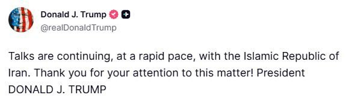

ترامپ: مذاکرات با جمهوری اسلامی ایران با سرعت زیادی ادامه دارد. از توجه شما به این موضوع سپاسگزارم!

📝 Amir

📌 @persian_trend_official
پرشین ترند | متفاوت‌ترین کانال نظامی

## Persian_Trend_Official — post 15449

  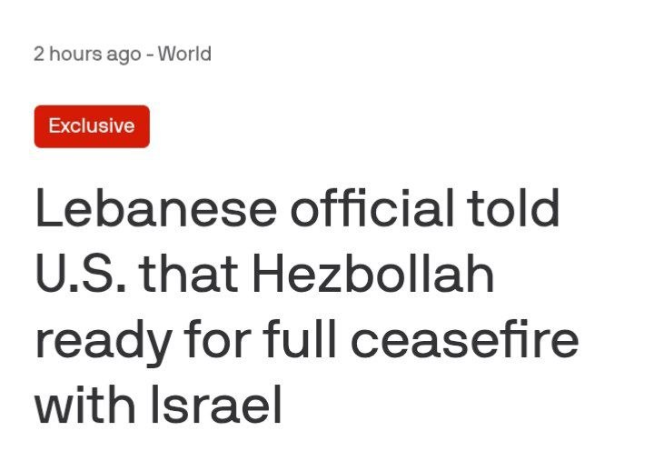

اکسیوس: یک مقام لبنانی به آمریکا گفت که حزب‌الله آماده آتش‌بس کامل با اسرائیل است!

به گزارش از اکسیوس، علی حمدان، مشاور ارشد نبیه بری، رئیس پارلمان لبنان، به اکسیوس گفت که او به دولت ترامپ گفته است که حزب‌الله آماده آتش‌بس کامل و فوری با اسرائیل است و متعهد شده است که اجرای آن را تضمین کند.

به گفته یک منبع آگاه، مقامات آمریکایی به گفته‌اند که فکر نمی‌کنند نتانیاهو موافقت کند. یک مقام اسرائیلی تأیید کرد که حزب‌الله آمادگی خود را برای آتش‌بس کامل حتی بدون درخواست عقب‌نشینی فوری اسرائیل اعلام کرده است.

📝 Amir

📌 @persian_trend_official
پرشین ترند | متفاوت‌ترین کانال نظامی

## Persian_Trend_Official — post 15448

  

وزارت امور خارجه جمهوری اسلامی: مسئولیت مستقیم آمریکا، چه در نقض آتش‌بس علیه ایران و چه در نقض آتش‌بس از سوی رژیم اسرائیل علیه لبنان، محرز است و مسئولیت آثار و پیامدهای این وضعیت برعهده آمریکاست.

ایران از منافع خود، در هر کجا که لازم بداند دفاع خواهد کرد.

📝 Amir

📌 @persian_trend_official
پرشین ترند | متفاوت‌ترین کانال نظامی

## Persian_Trend_Official — post 15447

  

آمریکا حمله اسرائیل به ضاحیه را متوقف کرد!

کان نیوز: علیرغم تهدیدات صریح نتانیاهو، تدارکات اسرائیل برای حمله به منطقه ضاحیه بیروت در ساعات اخیر پس از مداخله ایالات متحده به تأخیر افتاد.

📝 Amir

📌 @persian_trend_official
پرشین ترند | متفاوت‌ترین کانال نظامی

## Persian_Trend_Official — post 15446

https://youtube.com/live/bKStpJNvOXI?feature=share

## Persian_Trend_Official — post 15445

  <a href="telegram/content/Persian_Trend_Official_15445_1780359083.mp4" target="_blank">🎬 Download video</a>

رسانه نیروی هوافضا سپاه ویدیویی از لحظه سرنگونی پهپاد MQ-1 امریکایی در تاریخ بامداد 10 خرداد 1405 منتشر کرد.

📝 Amir

📌 @persian_trend_official
پرشین ترند | متفاوت‌ترین کانال نظامی

## Persian_Trend_Official — post 15444

گفتگوی تلفنی عراقچی با عاصم منیر و وزیر خارجه پاکستان

عراقچی در تماس‌های تلفنی جداگانه با محمد اسحق‌دار معاون نخست وزیر و وزیر امور خارجه پاکستان و فیلد مارشال عاصم منیر فرمانده ارتش پاکستان در خصوص تحولات منطقه‌ای و روندهای مرتبط با آتش‌بس گفتگو و رایزنی کرد.

📝 Amir

📌 @persian_trend_official
پرشین ترند | متفاوت‌ترین کانال نظامی

## Persian_Trend_Official — post 15443

  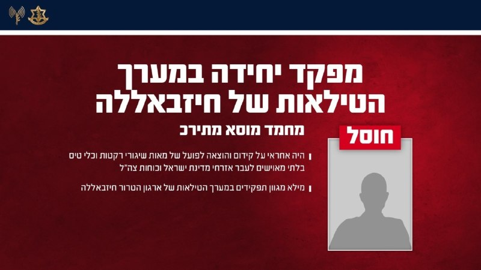

سخنگوی ارتش اسرائیل: ارتش اسرائیل فرمانده یک واحد در سامانه موشکی حزب‌الله را از بین برد.

نیروی هوایی، تحت فرماندهی تیپ گولانی، دیروز (یکشنبه) در منطقه نبطیه حمله کرد و محمد موسی ماترک، فرمانده یک واحد در سامانه موشکی حزب‌الله را از بین برد.

در طول سال‌ها، ماترک سمت‌های مختلفی در سامانه موشکی حزب‌الله داشت. ماترک مسئول ترویج و اجرای صدها پرتاب موشک و پهپاد علیه شهروندان اسرائیلی و نیروهای ارتش اسرائیل، از جمله تیپ گولانی فعال در منطقه بوفورت بود که به نیروی هوایی دستور حذف او را داد.

📝 Amir

📌 @persian_trend_official
پرشین ترند | متفاوت‌ترین کانال نظامی

## Persian_Trend_Official — post 15442

  <a href="telegram/content/Persian_Trend_Official_15442_1780359086.webm" target="_blank">🎬 Download video</a>

محسن رضایی مشاور نظامی رهبر جمهوری اسلامی: تنگه هرمز تحت مدیریت ایران است. اجازه تداوم محاصره دریایی را نخواهیم داد و تشدید تنش در لبنان هم تحمل نخواهد شد. صبر نیروهای مسلح جمهوری اسلامی ایران حدی دارد.

📝 Amir

📌 @persian_trend_official
پرشین ترند | متفاوت‌ترین کانال نظامی

## RadioFarda — post 157791

  <a href="https://t.me/radiofarda/157791" target="_blank">📎 Download file</a>

📻بشنوید: سرخط خبرهای نیمه‌شب با رادیوفردا، ۱۲ خرداد ۱۴۰۵‌

@RadioFarda

## RadioFarda — post 157790

  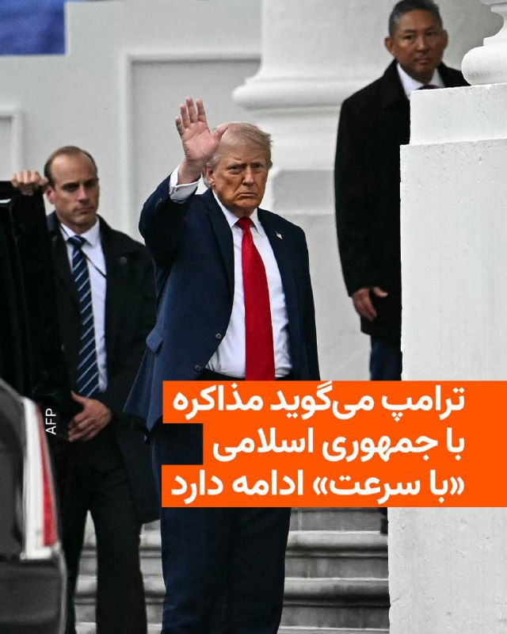

🔸رئیس جمهور آمریکا روز دوشنبه در پیامی در شبکه اجتماعی خود نوشت که مذاکره کشورش با حکومت ایران «با سرعت ادامه دارد».

🔸این پیام پس از آن منتشر شد که جمهوری اسلامی تهدید کرد که در صورت ادامه حملات اسرائیل به لبنان «تبادل پیام با آمریکا متوقف می‌شود».

🔸ترامپ در گفت‌وگو با خبرنگاران از تعلیق مذاکره با ایران اظهار بی‌اطلاعی کرد، اما تماسی تلفنی با نخست وزیر اسرائیل برقرار کرد که به توقف حملات به لبنان انجامید.

@RadioFarda

## RadioFarda — post 157789

🔸سردار آزمون، مهاجم تیم ملی ایران، در فهرست ۲۶ نفره این تیم برای جام جهانی که روز دوشنبه اعلام شد، حضور ندارد.

🔸آزمون ۹۱ بازی ملی انجام داده و ۵۷ گل برای ایران به ثمر رسانده است.

🔸او در اسفند ماه و پس از حمله آمریکا و اسرائیل به ایران، تصویری از خود در کنار حاکم دبی منتشر کرد.

🔸گزارش‌ها حاکی است که این پست اینستاگرامی با واکنش منفی مقام‌های ایرانی روبه‌رو شد و پس از آن آزمون از تیم ملی کنار گذاشته شد.

🔸رسانه‌های داخلی نوشته‌اند که سردار آزمون «با وجود ابراز تمایل دوباره برای بازگشت، اکنون فقط احتمال دارد پس از جام جهانی، در صورت عذرخواهی رسمی، بار دیگر برای رقابت‌های بعدی از جمله جام ملت‌های آسیا به تیم ملی دعوت شود.»

@RadioFarda

## RadioFarda — post 157788

ترامپ می‌گوید مذاکره با جمهوری اسلامی «با سرعت» ادامه دارد

🔸رئیس جمهور آمریکا روز دوشنبه در پیامی در شبکه اجتماعی خود نوشت که مذاکره کشورش با حکومت ایران «با سرعت ادامه دارد».

🔸این پیام پس از آن منتشر شد که جمهوری اسلامی تهدید کرد که در صورت ادامه حملات اسرائیل به لبنان «تبادل پیام با آمریکا متوقف می‌شود».

🔸ترامپ در گفت‌وگو با خبرنگاران از تعلیق مذاکره با ایران اظهار بی‌اطلاعی کرد، اما تماسی تلفنی با نخست وزیر اسرائیل برقرار کرد که به توقف حملات به لبنان انجامید.

@RadioFarda

## RadioFarda — post 157787

  

🔸در پی انتشار خبر تماس تلفنی دونالد ترامپ با بنیامین نتانیاهو، رئیس جمهور آمریکا در شبکه اجتماعی خود نوشت که نیروهای ارتش اسرائیل به بیروت نخواهند رفت.

🔸او گفت: «تماسی بسیار مفید با بی‌بی نتانیاهو، نخست وزیر اسرائیل، داشتم و دیگر نیرویی به بیروت نخواهد رفت، و هر نیرویی هم که در راه بودند بازگردانده می‌شوند.»

🔸ترامپ در ادامه نوشت که «از طریق نمایندگان عالی تماسی بسیار خوب با حزب‌الله داشته» و این گروه هم موافقت کرده است که دست از شلیک بردارد.

🔸صبح دوشنبه وب‌سایت آکسیوس به نقل از منابع خود گزارش داده بود که تلاش جدید آمریکا برای آتش‌بس میان اسرائیل و لبنان «شکست» خورده است.

@RadioFarda

## RadioFarda — post 157786

وقوع «دومین انفجار» در کشتی کانتینربر در نزدیکی بندر ام قصر عراق

🔸خبرگزاری رویترز روز دوشنبه از وقوع «دومین انفجار» در یک فروند کشتی کانتینربر در نزدیکی بندر ام قصر عراق خبر داد.

🔸بر اساس این خبر به نقل از منابع امنیتی عراق، این انفجار در فاصله ۴۰ مایل دریایی در جنوب شرقی بندر ام قصر در خلیج فارس رخ داده و باعث بروز آتش‌سوزی شده است.

🔸ساعاتی پیشتر اداره دریانوردی بریتانیا در شبکه ایکس از وقوع «انفجاری بزرگ» در این کشتی کانتینربر در پی اصابت «پرتابه‌ای ناشناس» خبر داده بود.

🔸هنوز خبری درباره مجروحان احتمالی این حادثه گزارش نشده است.

@RadioFarda

## RadioFarda — post 157785

بیانیه وزارت خارجه ایران: مسئولیت آثار و پیامدهای نقض آتش‌بس بر عهده آمریکا است

🔸در ادامه واکنش تند حکومت ایران به حملات اسرائیل در جنوب لبنان، وزارت خارجه جمهوری اسلامی در بیانیه‌ای هشدار داد که مسئولیت «آثار و پیامدهای نقض آتس‌بس» را بر عهده ایالات متحده می‌داند.

🔸در این بیانیه آمده است: «مسئولیت مستقیم آمریکا، چه در نقض آتش‌بس علیه ایران و چه در نقض آتش‌بس از سوی رژیم اسرائیل علیه لبنان، محرز است و مسئولیت آثار و پیامدهای این وضعیت برعهده آمریکاست.»

🔸همزمان رسانه‌ها در اسرائیل از جمله شبکه کان خبر می‌دهند که «در پی مداخله» آمریکا، ارتش اسرائیل حمله خود به منطقه ضاحیه در جنوب لبنان را عقب انداخته است.

🔸این خبر پس از آن منتشر شده است که همین رسانه‌ها از گفت‌وگوی تلفنی طولانی دونالد ترامپ با بنیامین نتانیاهو، نخست وزیر اسرائیل، خبر دادند.

🔸ساعتی پیشتر نخست‌وزیر اسرائیل به ارتش دستور داده بود که اهدافی را در حومه جنوبی بیروت هدف قرار دهد.

@RadioFarda

## RadioFarda — post 157784

  

🔸شبکه ان‌بی‌سی روز دوشنبه خبر داد که رئیس جمهور آمریکا از تعلیق مذاکرات یا تلاش برای این کار توسط جمهوری اسلامی اظهار بی‌اطلاعی کرده است.

🔸دونالد ترامپ به خبرنگار این شبکه آمریکایی گفت که از ایران چنین خبری نشنیده است.

🔸رسانه‌های حکومتی در ایران عصر دوشنبه، ۱۱ خردادماه، نوشتند که جمهوری اسلامی «تبادل پیام با آمریکا» را تا زمانی که اسرائیل حملاتش به لبنان را متوقف نکرده قطع می‌کند.

🔸به نوشته خبرگزاری تسنیم، «مسئولان و مذاکره‌کنندگان ایرانی» خواستار توقف فوری حملات اسرائیل شده «و تا زمانی که نظر ایران و مقاومت در این زمینه تأمین نشود، گفت‌وگویی در کار نخواهد بود».

🔸در واکنش به این خبر، ترامپ گفت: «اگر راستش را بخواهید، به نظر من ما زیادی در این باره حرف می‌زنیم. به نظرم، [به جای این کار] سکوت کردن خیلی بهتر خواهد بود.»

🔸او در ادامه گفت: «البته معنایش این نیست که همین الان می‌رویم و شروع می‌کنیم به بمب ریختن، فقط ساکت می‌مانیم، محاصره را هم حفظ می‌کنیم.»

@RadioFarda

## RadioFarda — post 157782

🔸رسانه‌های ایران از افزایش حجم ذخایر آب سد امیرکبیر (سد کرج) و رسیدن میزان پرشدگی مخزن این سد به حدود ۷۰ درصد خبر می‌دهند.

🔸بر اساس تصاویر منتشرشده، حجم آب ذخیره‌شده در این سد نسبت به مدت مشابه سال گذشته افزایش چشمگیری داشته است؛ موضوعی که پس از چند سال خشکسالی و کاهش ذخایر آبی، نشانه‌ای نسبتاً امیدوارکننده برای منابع آب تهران و البرز ارزیابی می‌شود.

🔸با این حال، کارشناسان تأکید می‌کنند بهبود وضعیت سد کرج به معنای پایان بحران آب نیست و وضعیت سدهایی مانند لار، لتیان و ماملو همچنان نگران‌کننده است.

@RadioFarda

## RadioFarda — post 157781

تهدید به «گشودن جبهه‌های جدید» از طرف سپاه در ادامه واکنش به حمله اسرائیل به لبنان

🔸همزمان با هشدار فرمانده قرارگاه خاتم‌الانبیاء‌ سپاه، سازمان اطلاعات سپاه پاسداران نیز در پیامی که به نوشته خبرگزاری فرانسه در تلویزیون حکومتی ایران نیز قرائت شده تهدید کرد که «جبهه‌هایی جدید» خواهد گشود.

🔸حساب سازمان اطلاعات سپاه در شبکه ایکس نوشت:‌ «ایران عبور از خط قرمزها در لبنان و غزه را به معنای جنگ مستقیم و تحمیل هزینه بر امنیت ملی خود و مقاومت اسلامی فرض کرده و متقابلا عزم خود را برای عملیات دفاعی با انجام اقدامات معناشکن و گشودن جبهه‌های جدید به علاوه حفظ معادله تنگه هرمز قرار می‌دهد.»

🔸جمهوری اسلامی از همان ابتدا پایان جنگ در لبنان را از جمله شرایط خود برای کنار آمدن با ایالات متحده عنوان کرده است.

🔸این در حالی است که اسرائیل و گروه حزب‌الله لبنان تحت فشار آمریکا به آتش‌بس رضایت داده، اما به‌ویژه در روزهای اخیر هر یک دیگری را به نقض این آتش‌بس متهم کرده است.

🔸تهدید به «حفظ معادله تنگه هرمز» یعنی بسته ماندن این تنگه استراتژیک در حالی است که ایران و آمریکا از طریق پاکستان و میانجی‌های دیگر در حال تلاش برای نهایی کردن یک تفاهم‌نامه در این باره هستند.

@RadioFarda

## RadioFarda — post 157780

  

هشدار قرارگاه مرکزی خاتم‌الانبیاء سپاه به ساکنان شمال اسرائیل

🔸در ادامه واکنش‌ مقامات جمهوری اسلامی به حملات مکرر اسرائیل به جنوب لبنان، فرمانده قرارگاه خاتم‌الانبیاء سپاه پاسداران روز دوشنبه به ساکنان شمال اسرائیل هشدار تخلیه داد.

🔸رسانه‌های حکومتی به نقل از علی عبداللهی، فرمانده این قرارگاه، نوشتند: «نتانیاهو در ادامه شرارت‌های خود در منطقه، ضاحیه و بیروت را تهدید به بمباران نموده و برای ساکنان آن هشدار تخلیه اعلام کرده است.»

🔸این فرمانده سپاه در ادامه تهدید کرده که در صورت بمباران شدن این مناطق در لبنان، ایران نیز به شمال اسرائیل حمله خواهد کرد.

🔸عبداللهی گفت: «در صورت عملی شدن این تهدید به ساکنان بخش‌های شمالی و شهرک‌های نظامی در سرزمین‌های اشغالی هشدار می‌دهیم اگر نمی‌خواهند آسیب ببینند منطقه را ترک نمایند.»

@RadioFarda

## RadioFarda — post 157779

  <a href="telegram/content/RadioFarda_157779_1780359091.mp4" target="_blank">🎬 Download video</a>

🔸تصویری از یک قلاده پلنگ ایرانی در پارک ملی گلستان، در جریان گشت و پایش محیطی در اردیبهشت‌ماه ۱۴۰۵ به ثبت رسید.

🔸این ویدیو که توسط جعفر پناه‌پور، از محیط‌بانان و پایشگران محیط زیست ثبت شده، حضور این گونه ارزشمند را در میان پوشش گیاهی منطقه نشان می‌دهد.

🔸پارک ملی گلستان به عنوان یکی از مهم‌ترین زیستگاه‌های حیات‌وحش ایران، نقش کلیدی در حفاظت از پلنگ ایرانی دارد؛ گونه‌ای که در فهرست جانوران در معرض خطر قرار گرفته است.

🔸پارک ملی گلستان با برخورداری از تنوع زیستی کم‌نظیر، یکی از مهم‌ترین مناطق حفاظت‌شده کشور برای بقای پلنگ ایرانی به شمار می‌رود.

@RadioFarda

## RadioFarda — post 157778

🔸رسانه‌های ایران ۱۱ خردادماه، از «نقض آتش‌بس» در همه جبهه‌ها از جمله لبنان خبر دادند
و نوشتند که تیم مذاکره‌کننده ایرانی گفتگوها و تبادل متون از طریق میانجی را متوقف می‌کند.

🔸مقامات رسمی ایران هنوز واکنشی به این خبر نشان ندادند.

🔸پیشتر سخنگوی وزارت خارجه بر «حفظ آتش‌بس» در لبنان تاکید کرده بود.

🔸همزمان نخست‌وزیر اسرائیل روز دوشنبه دستور حمله به جنوب بیروت را صادر کرد.

🔸وب‌سایت آکسیوس به نقل از منابع خود گزارش داده که تلاش جدید آمریکا برای آتش‌بس میان اسرائیل و لبنان «شکست» خورده است.

@RadioFarda

## RadioFarda — post 157777

  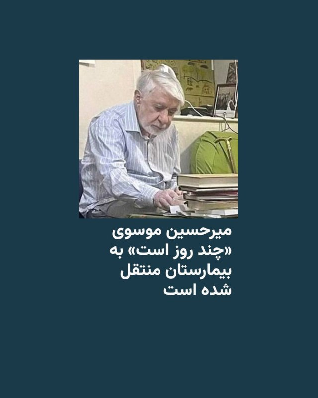

🔸در پی انتشار اخباری از مریض‌احوالی میرحسین موسوی، از رهبران جنبش سبز ایران، اردشیر امیرارجمند، مشاور او، تأیید کرد که آقای موسوی «چند روزی است» به بیمارستان منتقل شده است.

🔸میرحسین موسوی به همراه همسرش زهرا رهنورد، دیگر رهبر جنبش سبز، هم‌چنان در حصر به سر می‌برد.

🔸امیرارجمند که در فرانسه اقامت دارد روز دوشنبه به رادیوفردا گفت که خانه این دو فعال سیاسی دیگر «قابل سکونت نیست»، محل نگهداری آن‌ها پس از انتقال‌شان «نامعلوم» است، و شرایط حصر «دشوارتر» شده است.

🔸محل سکونت این دو در حملات بی‌امان اسرائیل به تهران به‌شدت آسیب دیده است.

@RadioFarda

## RadioFarda — post 157776

تیراندازی در دانشگاه پزشکی قزوین دو کشته برجا گذاشت

🔸رسانه‌ها در ایران از وقوع حادثه‌ای مرگبار در قزوین خبر می‌دهند که صبح روز دوشنبه اتفاق افتاده و جان دو نفر را گرفته است.

🔸به گفته حمیدرضا قافله‌باشی، رئیس دانشگاه علوم پزشکی قزوین، در جریان تیراندازی که «به دلیل خصومت خانوادگی اتفاق افتاده» دو دانشجوی این دانشگاه «که زن و شوهر بودند» جان خود را از دست داده‌اند.

🔸بر اساس شرح حادثه از زبان برخی از کاربران شبکه‌های اجتماعی، صبح روز دوشنبه دانشجوی مرد وارد دانشکده دندانپزشکی قزوین می‌شود و «همسر خودش را با سلاح کمری به قتل می‌رساند و پس از ارتکاب جرم به زندگی خود پایان می‌دهد».

🔸در سال‌های اخیر به نظر می‌رسد دسترسی مردم در ایران به سلاح گرم بسیار آسان‌تر شده، و در شبکه اجتماعی تلگرام حتی آگهی فروش اسلحه هم می‌توان دید.

@RadioFarda

## RadioFarda — post 157775

  

🔸عباس عراقچی، وزیر خارجه ایران، در شبکه ایکس نوشت: «آتش‌بس میان ایران و آمریکا، بدون هیچ ابهامی، آتش‌بسی در تمام جبهه‌ها، از جمله لبنان، است.»

🔸او در این پیام، نقض آتش‌بس در هر جبهه‌ای را «به معنای نقض آتش‌بس در تمامی جبهه‌ها» عنوان کرده است.

🔸عراقچی آمریکا و اسرائیل را «مسئول پیامدهای هرگونه نقض این آتش‌بس» معرفی کرده است.

🔸ایران بارها این موضوع را اعلام کرده که آتش‌بس میان طرفین منازعه در جنگ ایران، باید سایر جبهه‌ها به‌ویژه جبهه لبنان را هم در بر بگیرد.

🔸ابوالفضل شکارچی، سخنگوی نیروهای مسلح جمهوری اسلامی نیز به اسرائیل هشدار داده که «تداوم جنایات در لبنان برای نیروهای مسلح ایران قابل تحمل نخواهد بود.»

🔸در تازه‌ترین بی‌توجهی به این درخواست جمهوری اسلامی، بنیامین نتانیاهو، نخست‌وزیر اسرائیل، به ارتش دستور داده اهدافی را در حومه جنوبی بیروت هدف قرار دهد.

@RadioFarda

## RadioFarda — post 157774

🔸مسعود پیاهو، شهروندی که به اتهام ثبت ویدئو از اعتراضات ۱۴۰۴ به ۱۰ سال زندان محکوم شده است، روز دوشنبه ۱۱ خرداد با انتشار پیامی ویدئویی جدید گفت: «با وجود آنکه در بازنشر آن هیچ نقشی نداشته است، روز سه‌شنبه برای اجرای حکم خود را به زندان معرفی می‌کند.»

🔸حسن آقاخانی، وکیل دادگستری، روز یکشنبه از محکومیت موکلش به اتهام ثبت ویدئو از معترضی که در جریان اعتراضات دی‌ماه سال گذشته مقابل مأموران پلیس ایران در خیابان روی زمین نشسته بود، خبر داد.

🔸آقاخانی تاکید کرد که مسعود پیاهو قصد انتشار «عمومی» ویدئو را نداشته و آن را در «استوری پرایوت» صفحه اینستاگرام خود منتشر کرده اما سپس شخص دیگری آن را به شکل عمومی منتشر کرد.

🔸انتشار این ویدئو از فردی که روز هشتم دی‌ماه و در دومین روز اعتراضات به تنهایی مقابل مأموران انتظامی روی زمین نشسته بود، به شکل گسترده منتشر شد، بازتاب‌های فراوانی ایجاد کرد.

🔸تصویر این معترض به یکی از نمادهای اعتراضات دی ماه ۱۴۰۴ تبدیل شد.

🔸آقاخانی روز یکشنبه گفت که دادگاه با استناد به «قانون تشدید مجازات جاسوسی و همکاری با رژیم صهیونیستی» آقای پیاهو را به «۱۰ سال حبس» محکوم کرد.

@Radiofarda

## RadioFarda — post 157773

رئیس فدراسیون فوتبال ایران: تنگناهای مالی به‌شدت تیم را آزار می‌دهد

🔸مهدی تاج، رئیس فدراسیون فوتبال ایران، روز یک‌شنبه دهم خرداد به گلایه از مشکلات مالی در بر سر راه آماده‌سازی تیم ملی فوتبال ایران در راه جام جهانی پرداخت.

🔸به گزارش خبرگزاری ایرنا، او در این باره توضیح داده که «تیم ملی در شرایط خوبی قرار دارد، اما تنگناهای مالی به‌شدت تیم را آزار می‌دهد. هزینه‌های تیم‌های مختلف ملی دلاری است. وزارت ورزش زیر ۲۰۰ میلیارد به ما کمک کرده است.»

🔸رئیس فدراسیون فوتبال ایران دربارهٔ آخرین خبر پیرامون صدور روادید تیم ملی فوتبال برای حضور در جام جهانی ۲۰۲۶ هم گفت: «مسئول برگزاری جام جهانی فیفا است و از نظر ما مسئول دادن ویزا هم فیفا است. وقتی کشوری متعهد به میزبانی می‌شود، یکی از تعهداتی که می‌دهند، صدور ویزا است. در جلساتی که رو در رو با فیفا داشتیم، آنها در این رابطه با ما هم‌نظر هستند.»

🔸در فاصله ۱۴ روز تا جام جهانی ۲۰۲۶، بلاتکلیفی ویزای تیم ملی فوتبال ایران ادامه دارد. خبرگزاری مهر گزارش داده که فدراسیون فوتبال با ارسال نامه‌ای تازه به فیفا خواستار تعیین تکلیف فوری این پرونده شده، اما به گفته این خبرگزاری، فیفا تاکنون پاسخی به نامه‌های فدراسیون نداده است.

🔸مهدی محمدنبی، سرپرست تیم ملی، دو روز پیشتر از این گفته بود هنوز نه ویزای مکزیک و نه ویزای آمریکا برای اعضای تیم صادر نشده و تیم ملی به روادید چندبار ورود هر دو کشور نیاز دارد. پیشتر نیز مهدی تاج اعلام کرده بود که به‌دلیل مشکل ویزا، محل اردوی تیم ملی از آریزونای آمریکا به تیخوانای مکزیک منتقل شده است.

🔸این ابهام در حالی ادامه دارد که به گفته سفیر جمهوری اسلامی در مکزیک، هنوز روشن نیست آمریکا به تیم ملی روادید خواهد داد یا نه؛ موضوعی که می‌تواند برنامه‌های ایران را در روزهای پایانی پیش از جام جهانی با مشکل جدی روبه‌رو کند.

🔸نسخه کامل این گزارش را در وب‌سایت رادیوفردا بخوانید.

@Radiofarda

## RadioFarda — post 157772

🔸ارتش اسرائیل روز دوشنبه ۱۱ خرداد تصاویری از ورود نیروهای یگان گشتی گولانی به قلعه تاریخی شقیف (بوفور) در جنوب لبنان را منتشر کرد.

🔸ییسرائیل کاتز، وزیر دفاع اسرائیل، روز یکشنبه از تصرف این دژ راهبردی قرون وسطایی در جنوب لبنان، که پرچم اسرائیل بر فراز آن برافراشته شده است، خبر داده بود.

🔸قلعه بوفور یا شقیف بر بخش‌های گسترده‌ای از جنوب لبنان اشراف دارد و به همین دلیل از اهمیت نظامی بالایی برخوردار است.

🔸قلعه تاریخی شقیف متعلق به دوران جنگ‌های صلیبی در استان نبطیه در جنوب لبنان است که در فاصله حدود ۱ کیلومتری در جنوب،جنوب شرقی روستای أرنون قرار دارد.

🔸صلاح‌الدین ایوبی،‌ نخستین سلطان مصر و شام در سال ۱۱۹۰ قلعه شقیف را فتح کرد، اما ۶۰ سال بعد صلیبی‌ها دوباره آن را بازپس گرفتند.

🔸در سال ۱۲۶۸ سلطان ظاهر رکن‌الدین بیبرس بندقداری در نهایت قلعه را برای نیروهای اسلامی تصرف کرد.

🔸قلعه شقیف یکی از نمونه‌های معدودی است که در آن یک قلعه قرون وسطایی در جنگ‌های مدرن نیز دارای ارزش و کاربرد نظامی بوده است، همان‌طور که تاریخ اواخر سده بیستم آن، به‌ویژه در طول جنگ ۱۹۸۲ لبنان این موضوع را نشان داد.

@Radiofarda

## IranianMinds — post 21226

  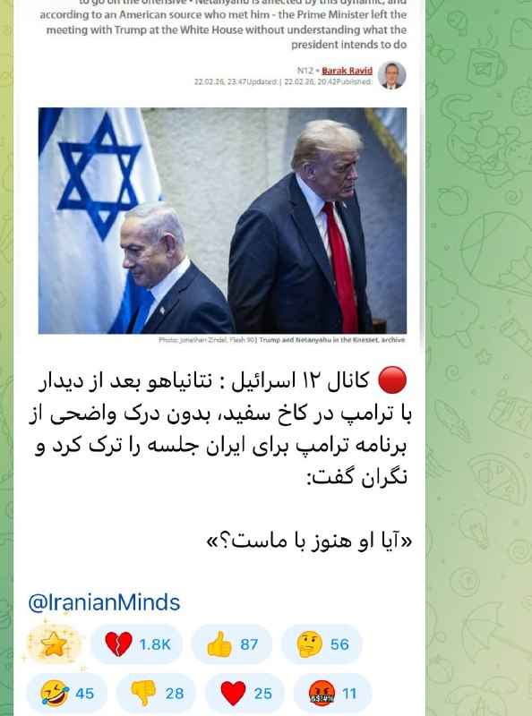

🔴 آکسیوس : حرف های امروز ترامپ در مکالمات تلفنی با نتانیاهو‌ این بوده : «تو دیوانه‌ای.» «اگر من نبودم، الان توی زندان بودی. دارم نجاتت می‌دهم.» «الان همه از تو متنفرند.» «به خاطر این ماجرا، همه از اسرائیل هم متنفر شده‌اند! @IranianMinds

## IranianMinds — post 21225

  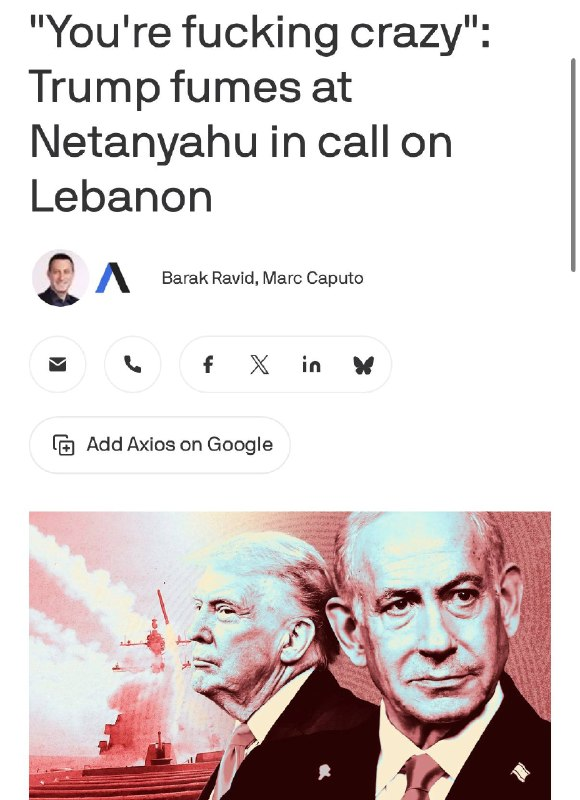

🔴 آکسیوس :

حرف های امروز ترامپ در مکالمات تلفنی با نتانیاهو‌ این بوده :

«تو دیوانه‌ای.»
«اگر من نبودم، الان توی زندان بودی. دارم نجاتت می‌دهم.»
«الان همه از تو متنفرند.»
«به خاطر این ماجرا، همه از اسرائیل هم متنفر شده‌اند!

@IranianMinds

## IranianMinds — post 21224

  <a href="telegram/content/IranianMinds_21224_1780359096.mp4" target="_blank">🎬 Download video</a>

بچه ها اسم این بازی عبور مرغ از خیابون  هست ویدئو نگاه کنید خیلی راحت 8 میلیون ازش سود گرفتیم😍

😤اگ توم دوس داری خیلی راحت از بازی های انلاین پول در بیاری حتما عضو کازینو شبانه شو
✅

توی کازینو شبانه بهت اموزش میدیم از بازی های انلاین پول دربیاری👌

کانال کازینو شبانه راهی برای چند برابر کردن سرمایت 🤷‍♂

کسب درامد انلاین با یه ادم حرفه ای یاد بگیر و‌ پول دربیار 
💵

🎯همین حالا عضو شو و شروع کن👇e11
https://t.me/+6ckCmywafrxiYzk0
https://t.me/+6ckCmywafrxiYzk0

## IranianMinds — post 21223

  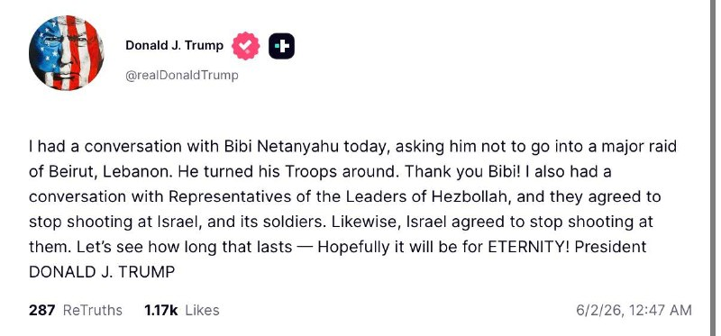

🔴 ترامپ:

«امروز با بیبی نتانیاهو صحبت کردم و از او خواستم حمله گسترده‌ای به بیروت لبنان انجام ندهد.

او نیروهایش را عقب کشید. ممنون بیبی! همچنین اسرائیل موافقت کرد که دیگر به آن‌ها شلیک نکند.

ببینیم این وضعیت چقدر دوام می‌آورد؛ امیدوارم برای همیشه ادامه داشته باشد!»

@IranianMinds

## IranianMinds — post 21222

🔴ترامپ:
شاید این هفته با ایران به توافق برسیم

صلح با ایران شاید حتی بهتر از پیروزی نظامی باشد‌‌!

@IranianMinds

## IranianMinds — post 21221

🔴خبرگزاری ایرنا:

روز دوشنبه ۱۱ خرداد از کشته شدن دو سپاهی در منطقه فردو استان قم خبر داد.

حسین رمضانیان‌فردویی و محمد اویسی بر اثر انفجار پرتابه ‌های باقی‌مانده از جنگ اخیر، به هلاکت رسیدند.

@IranianMinds

## IranianMinds — post 21220

🔴 ترامپ :

امروز ی مشکل کوچک پیش اومد،ایرانیا خیلی از حملات اسرائیل به لبنان ناراحت بودن،با اسرائیل و حزب الله حرف زدم گفتم بهم تیراندازی نکنید قبول کردن احتمالا تو همین هفته با ایران به توافق میرسیم.

@IranianMinds

## IranianMinds — post 21219

  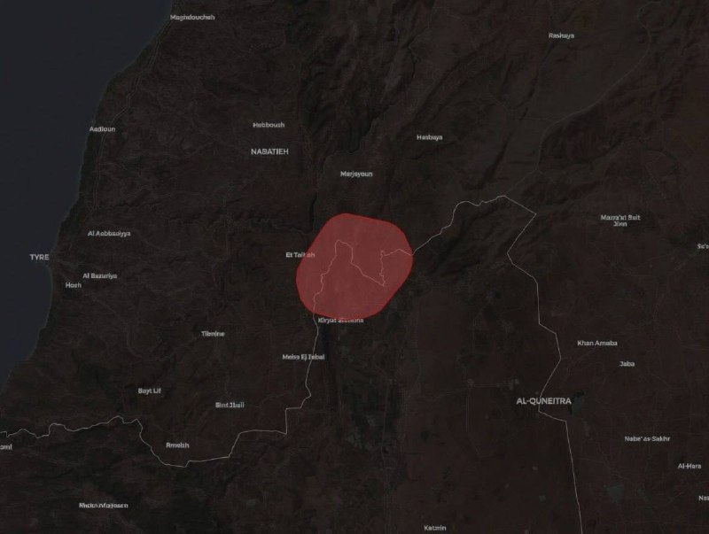

🔴 حزب الله پیشنهاد آتش بس ترامپ رو رد کرد. @IranianMinds

## IranianMinds — post 21218

  <a href="telegram/content/IranianMinds_21218_1780359100.mp4" target="_blank">🎬 Download video</a>

🔴 شبکه البرز داشت مثلا اون گوشه پخش زنده حضور پرشور خرزشیارو‌ نشون میداد که یهو از دستشون در رفت تایم ویدیویی که گذاشته بودن تموم شد رفت تو‌ ویدیو پلیر 😂

@IranianMinds

## IranianMinds — post 21217

🔴 فوری از پست جدید ترامپ: من یک تماس بسیار سازنده با نخست‌وزیر بی‌بی نتانیاهو، از اسرائیل، داشتم و هیچ نیرویی به بیروت اعزام نخواهد شد، و هر نیرویی که در راه بود، قبلاً بازگردانده شده. همچنین، از طریق نمایندگان بلندپایه، تماس بسیار خوبی با حزب‌الله داشتم…

## IranianMinds — post 21216

  <a href="telegram/content/IranianMinds_21216_1780359102.mp4" target="_blank">🎬 Download video</a>

⚫️ نه میبخشیم نه فراموش میکنیم

صحبت های مادر جاویدنام امیرحسین احمدی شریف 🖤

@IranianMinds

## IranianMinds — post 21215

من قدیم گفتم الانم میگم

این کانال جای خرزشی و حکومتی و هرکسی که یه درصد حامی این حکومت قاتل باشه نیست

هیچ آزادی بیانیم برای موجوداتی که چون عقایدمون باهاشون یکی‌ و نیست و از نظرشون حکممون مرگه نداریم

پس بی زحمت سیکتونو بزنید این کانال جای شما نیست و متعلق به مردم ایرانه !

## IranianMinds — post 21214

  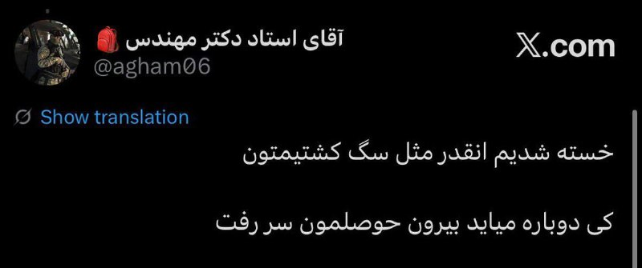

نرمال ترین خرزشی :

@IranianMinds

## IranianMinds — post 21213

امروز زیاد از پیاما گرفتم و خیلیا اومدن انتقاد کردن گفتم‌ خودتون‌ جواب بدید و نظرتونو نسبت به حرف ایشون بگید @IranianMinds

## IranianMinds — post 21212

امروز زیاد از پیاما گرفتم و خیلیا اومدن انتقاد کردن گفتم‌ خودتون‌ جواب بدید و نظرتونو نسبت به حرف ایشون بگید @IranianMinds

## IranianMinds — post 21211

  

امروز زیاد از پیاما گرفتم و خیلیا اومدن انتقاد کردن

گفتم‌ خودتون‌ جواب بدید و نظرتونو نسبت به حرف ایشون بگید

@IranianMinds

## IranianMinds — post 21210

  <a href="telegram/content/IranianMinds_21210_1780359105.mp4" target="_blank">🎬 Download video</a>

@IranianMinds

## IranianMinds — post 21209

  

سیستم جدید دوربینی که توی آمریکا داره استفاده میشه :))

@IranianMinds

## IranianMinds — post 21208

  

🔴 کاتز ، وزیر دفاع اسرائیل :

در لبنان هیچ آتش بسی نداریم ، اسرائیل تا جایی که نیاز باشد پیشروی خواهد کرد.

@IranianMinds

## IranianMinds — post 21207

🔴پست ترامپ: گفت‌وگوها با جمهوری اسلامی ایران با سرعتی بالا ادامه دارد. از توجه شما به این موضوع سپاسگزارم. رئیس جمهور دونالد جی. ترامپ. این بار گفت جمهوری اسلامی ایران . @IranianMinds

## BBCPersian — post 282608

  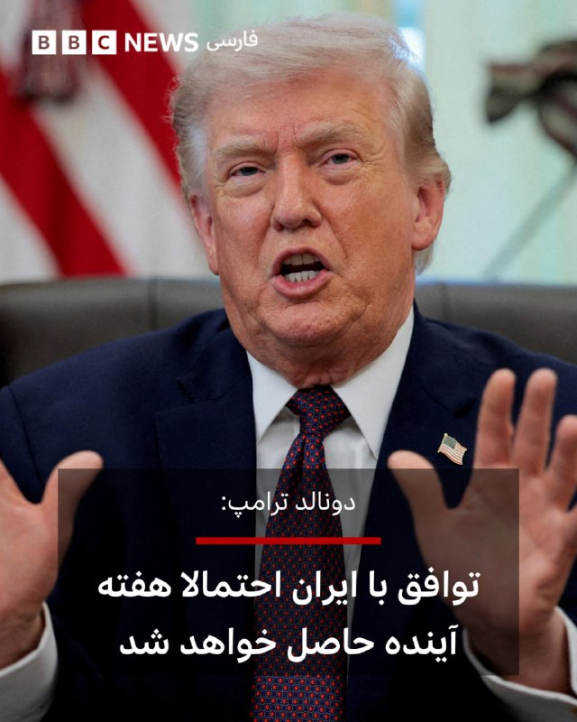

‌ ‌ ‌
دونالد ترامپ، رئيس جمهور آمريکا، در گفت وگو با شبکه ای‌بی‌سی گفت معتقد است ظرف «هفته آينده» توافقی با ايران برای تمديد آتش‌بس و بازگشايی تنگه هرمز حاصل خواهد شد.

او در گفت وگوی تلفنی با جاناتان کارل، خبرنگار ارشد ای‌بی‌سی در واشنگتن، گفت: «اوضاع خوب به نظر می‌رسد، خيلی خوب.»

آقای ترامپ افزود: «امروز يک مشکل کوچک پيش آمد، اما همان طور که احتمالا متوجه شديد، خيلی سريع آن را حل کردم.»

به گفته رئيس‌جمهوری آمريکا، اين مشکل از نارضايتی ايرانی‌ها نسبت به حملات اسرائيل به لبنان ناشی شده بود.

رئیس‌جمهور آمریکا گفت: «با حزب‌الله صحبت کردم و گفتم شليک نکنيد. با بی‌بی [بنيامين نتانياهو، نخست وزير اسرائيل] هم صحبت کردم و گفتم شليک نکنيد. هر دو طرف هم دست از شليک به يکديگر برداشتند.»

او افزود: «اين موضوع ساده‌ای نيست. شما درباره يک کشور بسيار بزرگ صحبت می‌کنيد که می‌خواهد توافقی انجام دهد. خصومت‌های بسيار عميقی وجود دارد. بنابراين اين کار برای آنها آسان نيست. از ديد ما هم آسان نيست. اما داريم به آنچه نياز داريم دست پيدا می‌کنيم.»

https://bbc.in/4x28ev7
📷Reuters
@BBCPersian

## BBCPersian — post 282600

‌ ‌ ‌
جنجال‌ها بر سر محاکمه پنج فعال حامی فلسطینیان در آلمان بالا گرفته است. این افراد متهم به عضویت در یک سازمان مجرمانه و وارد کردن حدود یک میلیون یورو خسارت به اموال یک شرکت دفاعی اسرائیلی در شهر اولم آلمان هستند.

پرونده موسوم به «اولم ۵» در آلمان، که از حامیان دیرینه اسرائیل به شمار می‌رود، بحث گسترده‌ای را درباره نحوه برخورد با معترضان حامی فلسطینیان برانگیخته و ممکن است به الگویی برای پرونده‌های مشابه در آینده تبدیل شود.

این پنج فعال که تابعیت بریتانیا، اسپانیا، ایرلند و آلمان را دارند و از ماه سپتامبر تاکنون در بازداشت موقت به سر می‌برند، در دادگاهی با تدابیر شدید امنیتی در زندان اشتامهایم شهر اشتوتگارت محاکمه می‌شوند.

https://bbc.in/4fRjuV1
📷Getty/ PA/ Alamy/ "Ulm 5"
@BBCPersian

## BBCPersian — post 282599

  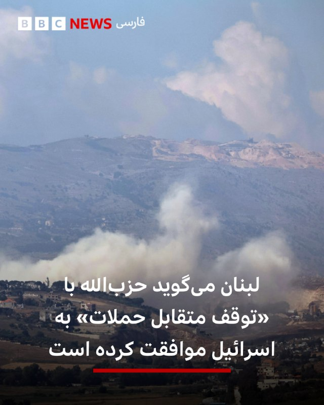

‌ ‌ ‌ ‌
دفتر ریاست جمهوری لبنان اعلام کرد که مقامات این کشور «تاییدیه موافقت حزب‌الله با پیشنهاد آمریکا که خواستار توقف متقابل حملات است را دریافت کرده‌اند.»

دفتر رئیس‌جمهور لبنان در حسابش در شبکه اجتماعی ایکس نوشت: «بر اساس این پیشنهاد، حملات اسرائیل به حومه جنوبی بیروت در ازای خودداری حزب‌الله از انجام حملات علیه اسرائیل متوقف خواهد شد» و آتش‌بس «به تمام سرزمین‌های لبنان گسترش خواهد یافت».

قرار است مذاکراتی در روزهای سه‌شنبه و چهارشنبه «برای بحث در مورد این پیشرفت و تقویت آن» انجام شود.

https://bbc.in/3Q0LkUe
📷EPA/Shutterstock
@BBCPersian

## BBCPersian — post 282598

  

خبرگزاری‌های فارس و تسنیم، نزدیک به سپاه پاسداران از هدف قرار دادن یک کشتی باربری خبر داده‌اند.

در اطلاعیه نیروی دریایی سپاه پاسداران که عصر دوشنبه - اول ژوئن / ۱۱ خرداد - در این خبرگزاری‌ها منتشر شده آمده است: «درپی حمله متجاوزانه ارتش تروریستی آمریکا به کشتی ایرانی «لیان استار» در محدودهٔ دریای عمان، در یک عملیات مقابله‌به‌مثل، کشتی ام‌اس‌سی ساریسکا - MSC Sariska - متعلق به دشمن آمریکایی-صهیونیستی هدف موشک کروز قرار گرفت. هرگونه تجاوز ارتش آمریکا در منطقه با پاسخ قاطع روبه‌رو خواهد شد.»

همزمان سازمان عمليات تجارت دريايی بريتانيا (يوکی‌ام‌تی‌او) اعلام کرده گزارشی از وقوع يک حادثه در ۴۰ مايل دريايی جنوب شرقی بندر ام القصر عراق دريافت کرده است.

بر اساس گزارش این سازمان «يک کشتی کانتینربر در حال عبور از خليج فارس بود که در پی اصابت يک پرتابه ناشناس به سمت راست کشتی، انفجار بزرگی رخ داد.»

بنابر اطلاعاتی که از کشتی ام‌اس‌سی ساریسکا در وبسایت‌های کشتیرانی موجود است، و آخرین موقعیت جغرافیایی اعلام شده او که حدود ۵ ساعت قبل از انتشار این خبر بوده، خلیج فارس، ثبت شده است.

📷Reuters
@BBCPersian

## BBCPersian — post 282597

  

‌ ‌ ‌ ‌
ایتامار بن گویر، وزیر امنیت ملی اسرائیل، از اعلام ترامپ مبنی بر توقف حملاتی که اسرائیل قصد داشت علیه مناطقی در حومه جنوبی بیروت انجام دهد، انتقاد کرده و گفته است: «وقت آن رسیده که به ترامپ نه بگوییم».

این وزیر راست افراطی اسرائیل در برنامه‌ای در شبکه اجتماعی ایکس نوشت: «زمان آن رسیده که آنچه وظیفه می‌طلبد را انجام دهیم و آنچه لازم است حمله به حزب‌الله، آزادسازی جنگجویانمان و بازگرداندن امنیت به شمال است.»

او نوشت: «آقای نخست وزیر، شما گفتید که یک نخست وزیر قوی به رئیس جمهور ایالات متحده می‌گوید، در صورت امکان «بله» و در صورت لزوم «نه». اکنون زمان آن است که به دوستمان، رئیس جمهور ترامپ بگوییم «نه».

https://bbc.in/4uPbKrm
📷 Reuters
@BBCPersian

## BBCPersian — post 282596

‌ ‌ ‌ ‌
پس از تهدید نخست وزیر اسرائیل درباره از سرگیری حملات به بیروت، دونالد ترامپ، رئیس جمهوری آمریکا می‌گوید پس از گفت‌وگو با آقای نتانیاهو و همچنین تماس از طریق واسطه‌ها با حزب‌الله بین طرفین توافق حاصل شده که حمله به بیروت متوقف شود.

با تهدیدهای مقامات اسرائیلی درباره حمله به بیروت، باعث شد بسیاری حومه جنوبی این شهر را ترک کنند.

این در حالیست که ارتش اسرائیل دیروز قلعه استراتژیک و تاریخی شقیف را در جنوب لبنان به تسخیر خود درآورد.

پیشروی که مقامات اسرائیلی آن را دست‌آوردی مهم در جنگ با حزب‌الله می‌خوانند. امروز بمباران‌ها در این نواحی ادامه داشت و این ارتش باز به بسیاری از شهرها و روستاها دستور تخلیه اجباری صادر کرد.

نفیسه کوهنورد، خبرنگار ارشد خاورمیانه ما از بیروت در گزارشش درباره آخرین‌ها در لبنان می‌گوید.

@BBCPersian

## BBCPersian — post 282595

🔻 ارتش اسرائیل از کشته شدن یک سرباز و زخمی شدن هفت نفر دیگر در جنوب لبنان خبر داد

ارتش اسرائیل اعلام کرد که یک سرباز این کشور در جنوب لبنان کشته شده است.

به گفته اسرائیل هفت سرباز دیگر هم «در جریان درگیری‌ها» در جنوب لبنان زخمی شده‌اند.

جزییات بیشتری از این خبر منتشر نشده است.

https://bbc.in/4u49FGN
@BBCPersian

## BBCPersian — post 282594

  <a href="https://t.me/bbcpersian/282594" target="_blank">📎 Download file</a>

پادکست برنامه شصت دقیقه دوشنبه ۱۱ خرداد ۱۴۰۵

این نسخه رادیویی برنامه شصت دقیقه تلویزیون فارسی بی‌بی‌سی است که هرشب بعد از پخش، با حجم کم از اپلیکیشن‌های پادگیر و صفحه تلگرام بی‌بی‌سی فارسی در دسترس است.

با هشتگ BBCPersianRadio# با ما در ارتباط باشید

@BBCPersian

## BBCPersian — post 282593

  <a href="telegram/content/BBCPersian_282593_1780359112.mp4" target="_blank">🎬 Download video</a>

⭕️ سرخط آخرین خبرهای دوشنبه ۱۱ خرداد ۱۴۰۵
@BBCPersian

## BBCPersian — post 282592

🔻لغو سفر وزرای آلمان و نروژ به بیروت در میانه پرواز به‌دلیل «وخامت وضعیت امنیتی»

به گزارش خبرگزاری فرانسه، وزرای آلمان و نروژ به‌دلیل «وخامت وضعیت امنیتی» در منطقه مجبور شدند سفر روز دوشنبه خود به لبنان را در میانه پرواز لغو کنند و برگردند.

سخنگوی ریم العبلی-رادووان، وزیر توسعه بین‌الملل آلمان، به خبرگزاری فرانسه گفت که وزیر آلمانی و همتای نروژی‌اش، آسموند آوکروست، «به دلایل نظامی» مجبور به لغو سفر و بازگشت به برلین شدند، چرا که هنگام نزدیک شدن به فرودگاه بیروت «وضعیت به‌سرعت رو به وخامت می‌گذاشت».

سخنگوی دولت نروژ هم به خبرگزاری فرانسه تایید کرد که این سفر لغو شده است.

به گزارش رسانه‌های نروژی، این دو وزیر قصد داشتند برای نشان دادن همبستگی با مردم لبنان این سفر را انجام دهند.

به گزارش این رسانه‌ها، وزرای دو کشور قرار بود با جوزف عون، رئیس‌جمهور لبنان، و همچنین گروه‌های جامعه مدنی و آوارگان دیدار کنند.

اسرائیل حملات خود به لبنان را گسترش داده است؛ پیشتر هم بنیامین نتانیاهو، نخست‌وزیر، دستور حمله به اهدافی در ضاحیه در جنوب بیروت را صادر کرد.

از زمان برقراری آتش‌بس میان اسرائیل و لبنان در حدود شش هفته پیش، تبادل آتش میان اسرائیل و حزب‌الله ادامه داشته است و هر دو طرف یکدیگر را به نقض آتش‌بس متهم می‌کنند.

پیشتر، ایران به آمریکا و اسرائیل هشدار داد که «نقض آتش‌بس در هر یک از جبهه‌ها، به منزله نقض آن در تمامی جبهه‌ها است.»

@BBCPersian

## BBCPersian — post 282591

  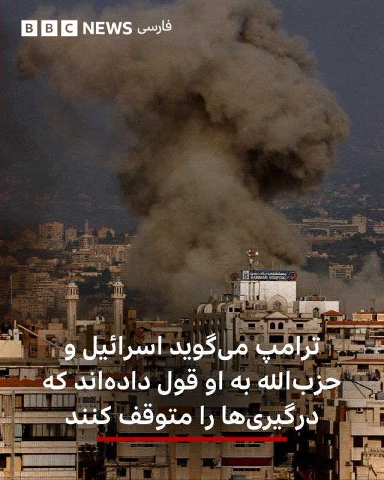

🔻دونالد ترامپ، رئیس جمهور آمریکا، در پستی در شبکه اجتماعی خود، سوشال تروث، نوشت: «گفت‌وگویی بسیار سازنده با نخست‌وزیر اسرائیل داشتم و هیچ نیرویی به بیروت اعزام نخواهد شد. همچنین هر نیرویی که در مسیر اعزام بود، بازگشته است.»

او همچنین اضافه کرد: «از طریق نمایندگان عالی‌رتبه، گفت‌وگوی بسیار خوبی با حزب‌الله داشتم و آن‌ها موافقت کردند که تمامی تیراندازی متوقف شود؛ اسرائیل به آن‌ها حمله نخواهد کرد و آن‌ها نیز به اسرائیل حمله نخواهند کرد.»

آقای ترامپ در پستی دیگری نوشت: «گفت‌وگوها با جمهوری اسلامی ایران به‌سرعت در جریان است.»

ساعتی پیش خبرگزاری تسنیم گفت که اطلاع یافته است «با عنایت به اینکه لبنان جزء پیش‌شرط‌های آتش‌بس بوده است و اینک این آتش‌بس در همه جبهه‌ها از جمله لبنان نقض شده است» تیم مذاکره‌کننده ایران «گفت‌وگوها و تبادل متون از طریق میانجی را متوقف می‌کند.»

📷Getty Images
@BBCPersian

## BBCPersian — post 282590

  <a href="https://t.me/bbcpersian/282590" target="_blank">📎 Download file</a>

پادکست جام جهان‌نما، دوشنبه ۱۱ خرداد ۱۴۰۵

این برنامه رادیویی را می‌توانید هرشب ساعت ۲۰ به وقت ایران، روی موج متوسط ۷۰۲ کیلوهرتز و موج کوتاه ۹۴۶۵ کیلوهرتز بشنوید.

تکرار برنامه را هم می‌توانید ساعت ۲۱:۳۰ روی موج متوسط ۷۰۲ کیلوهرتز و موج کوتاه ۵۳۹۵ کیلوهرتز گوش کنید.

@BBCPersian

## BBCPersian — post 282588

🔻اینترنت بین‌الملل در ایران، «۶۰ درصد» پیش از اعتراضات دی است

با بازگشت نسبی دسترسی به اینترنت جهانی در ایران از روز ۵ خرداد، ترافیک اینترنت تا امروز، دوشنبه ۱۱ خرداد، در حدود ۶۰ درصد سطح پیش از اعتراضات دی ماه باقی مانده است.

داده‌های شرکت کنتیک در کالیفرنیا که در زمینه اندازه‌گیری ترافیک اینترنت فعالیت می‌کند حاکی است دسترسی به اینترنت بین‌المللی در ایران همچون دوره کوتاه بازگشت اینترنت بعد از اعتراضات، با اختلال همراه است.

کاربران اینترنت در ایران با محدودیت‌های بسیاری مواجهند. علاوه بر بی‌ثباتی اینترنت، بسیاری از وبسایت‌ها یا خدمات فیلتر هستند و بدون وی‌پی‌ان در دسترس نیستند.

https://bbc.in/4vjnvWG
@BBCPersian

## idfinfarsi — post 11704

  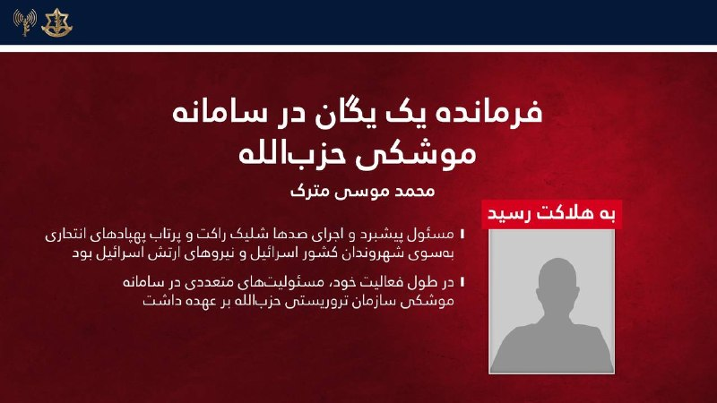

‼️ارتش اسرائیل فرمانده یک یگان در سامانه موشکی سازمان تروریستی حزب‌الله را به هلاکت رساند

❌نیروی هوایی با هدایت نیروهای تیپ گولانی روز گذشته (یکشنبه) در منطقه نبطیه حمله کرده و محمد موسی مترک، فرمانده یک یگان در سامانه موشکی سازمان تروریستی حزب‌الله را به هلاکت رساند.

⭕️مترک طی سال‌ها، مسئولیت‌های متعددی را در سامانه موشکی حزب‌الله بر عهده داشت.
او مسئول پیشبرد و اجرای صدها شلیک راکت و پرتاب هواگردهای بدون سرنشین به‌سوی شهروندان کشور اسرائیل و نیروهای ارتش اسرائیل بود، از جمله علیه نیروهای تیپ گولانی که در منطقه بوفور در حال فعالیت هستند و عملیات نیروی هوایی برای به هلاکت رساندن وی را هدایت کردند.

## idfinfarsi — post 11703

  

‏‼️«کنترل بر رشته‌کوه بوفور دارای اهمیت‌های عملیاتی مهمی است. این منطقه یک دارایی جغرافیایی مرکزی برای حزب‌الله محسوب می‌شود و به‌عنوان مرکز عصبی این سازمان عمل می‌کند. از اینجا، این سازمان بر مناطق الجلیل و متولا از نظر آتش و دیده‌بانی تسلط دارد. تنها از آغاز عملیات “غرش شیران”، بیش از ۴۰۰ پرتابه از این منطقه شلیک شده است»

‏⭕️«ارتش اسرائیل در سراسر لبنان، از ضاحیه تا صور، حمله کرده و به حملات خود ادامه خواهد داد. در هر جایی که تهدیدی علیه شهروندان اسرائیل و نیروهای ارتش اسرائیل وجود داشته باشد — ما برای رفع آن اقدام خواهیم کرد»

‏⭕️متن کامل سخنان سخنگوی ارتش اسرائیل، سرتیپ افی دفرین در مرز شمال:

‏«ظهر بخیر. دیروز، نه چندان دور از اینجا، نیروهای ارتش اسرائیل به رهبری لشکر ۳۶ تحت فرماندهی شمال، یک عملیات گسترده را به پایان رساندند. در جریان این عملیات، ما به کنترل عملیاتی بر رشته‌کوه بوفور و منطقه دره سلوقی در جنوب لبنان دست یافتیم. اکنون نیروهای لشکر ۳۶ بر رشته‌کوه بوفور مسلط هستند.

‏⭕️این یک عملیات مهم بود که برای مدت طولانی برنامه‌ریزی شده و پس از روند منظم آماده‌سازی رزمی، با تأیید رئیس ستاد کل ارتش انجام شد. کنترل بر رشته‌کوه بوفور دارای اهمیت‌های عملیاتی مهمی است. این منطقه یک دارایی جغرافیایی مرکزی برای حزب‌الله محسوب می‌شود و به‌عنوان مرکز عصبی این سازمان عمل می‌کند. از اینجا، این سازمان بر مناطق الجلیل و متولا از نظر آتش و دیده‌بانی تسلط دارد. تنها از آغاز عملیات “غرش شیران”، بیش از ۴۰۰ پرتابه از این منطقه شلیک شده است.

‏⭕️زیرساختی که حزب‌الله ایجاد کرده، یک زیرساخت ایرانی است که به‌عنوان یک مرکز مهم فرماندهی و کنترل هم در سطح و هم در زیرزمین عمل می‌کند. ما در حال تضعیف توانایی‌های حزب‌الله هستیم و به تعمیق ضربه به آن ادامه می‌دهیم. در کنار دستاوردهای عملیاتی، این نبرد هزینه‌های سنگینی از ما گرفته است. در نبردهای دیروز و امروز، گروهبان ارشد آدم تسرفتی و گروهبان ارشد میخائیل تیوکین جان‌باختند، یادشان گرامی. میخائیل، ۲۱ ساله از اشکلون، رزمنده یگان گشتی گیوعاتی، و آدم، ۲۰ ساله از روش هاعین، رزمنده یگان ماگلان. آن‌ها در نبرد بر سر این رشته‌کوه و در حالی که از شهرک‌های شمال دفاع می‌کردند، جان باختند. من به خانواده‌های آن‌ها تسلیت می‌گویم، ما آن‌ها را در آغوش می‌گیریم و به همراهی با آن‌ها ادامه خواهیم داد.

‏⭕️ارتش اسرائیل در سراسر لبنان، از ضاحیه تا صور، حمله کرده و به حملات خود ادامه خواهد داد. در هر جایی که تهدیدی علیه شهروندان اسرائیل و نیروهای ارتش اسرائیل وجود داشته باشد — ما برای رفع آن اقدام خواهیم کرد.»

## idfinfarsi — post 11693

  <a href="telegram/content/idfinfarsi_11693_1780359117.mp4" target="_blank">🎬 Download video</a>

‼️پس از سه ماه نبرد: لشکر ۱۴۶ سومین دور نبرد خود را به پایان رساند و مأموریت خود در جنوب لبنان را تکمیل کرد

🔸لشکر ۱۴۶ در طول سه ماه گذشته در منطقه خط دفاعی پیشرو در جنوب لبنان برای به هلاکت رساندن تروریست‌ها، انهدام زیرساخت‌های تروریستی سازمان تروریستی حزب‌الله و رفع تهدیدات علیه شهروندان کشور اسرائیل فعالیت کرد.

🔸در طول این عملیات، نیروها بیش از ۵۵۰ تروریست را به هلاکت رساندند و بیش از ۲۷۰۰ زیرساخت تروریستی را منهدم کردند، از جمله: بیش از ۲۰۰ انبار تسلیحاتی که با همکاری نیروی هوایی منهدم شد و ده‌ها مسیر زیرزمینی که با همکاری یگان مهندسی ویژه منهدم شدند.

## idfinfarsi — post 11691

## idfinfarsi — post 11690

‼️پس از پیشبرد طرح‌های تروریستی علیه نیروهای ارتش اسرائیل: یک تروریست از شاخه نظامی سازمان تروریستی حماس که به‌عنوان پزشک در بیمارستان فعالیت می‌کرد، به هلاکت رسید

⭕️نیروهای ارتش اسرائیل دو روز گذشته (شنبه) به‌صورت هدفمند در مرکز نوار غزه حمله کرده و تروریست جمال ابو عون، فرمانده یک واحد در شاخه نظامی سازمان تروریستی حماس را که به‌طور همزمان به‌عنوان پزشک در بیمارستان یافا در دیرالبلح فعالیت می‌کرد، به هلاکت رساندند.

⭕️وی در چارچوب نقش خود در این سازمان تروریستی، فرماندهی تروریست‌های حماس را بر عهده داشت و به پیشبرد و طراحی طرح‌های تروریستی علیه نیروهای ارتش اسرائیل و کشور اسرائیل می‌پرداخت. در دوره اخیر نیز در پیشبرد تلاش‌های ایجاد توان رزمی، بازسازی و تقویت سازمان تروریستی حماس، برخلاف توافق آتش‌بس، نقش داشته است.

⭕️فعالیت‌های تروریستی این تروریست نمونه‌ای دیگر از استفاده ابزاری و فرصت‌طلبانه سازمان تروریستی حماس از نقش‌های غیرنظامی برای پیشبرد فعالیت‌های تروریستی است.

⭕️پیش از حمله، اقداماتی برای کاهش آسیب به غیرنظامیان انجام شد، از جمله استفاده از مهمات دقیق و رصد ‌های هوایی.

⭕️نیروهای ارتش اسرائیل تحت فرماندهی جنوب مطابق با توافق در منطقه مستقر هستند و به فعالیت برای رفع هرگونه تهدید فوری ادامه خواهند داد.

## Dirty_Kids — post 390800

  <a href="telegram/content/Dirty_Kids_390800_1780359119.webm" target="_blank">🎬 Download video</a>

☢️خفن ترین و‌ قدیمی ترین  انالیزور  ایران ینی دکتر بت 
👍 
🔴مسابقات جذاب جام جهانی به زودی شروع میشه بیا توی کانال دکتر بت و باهاش همراه شو و پول در بیار
💵 رایگان بهترین شرط هارو براتون میذاره حتی هزار تومن هم دریافت نمیکنه روزانه میتونی از پیش بینی فوتبال باهاش…

## Dirty_Kids — post 390799

  <a href="telegram/content/Dirty_Kids_390799_1780359120.webm" target="_blank">🎬 Download video</a>

☢️خفن ترین و‌ قدیمی ترین  انالیزور  ایران ینی دکتر بت 
👍

🔴مسابقات جذاب جام جهانی به زودی شروع میشه بیا توی کانال دکتر بت و باهاش همراه شو و پول در بیار
💵

رایگان بهترین شرط هارو براتون میذاره
حتی هزار تومن هم دریافت نمیکنه
روزانه میتونی از پیش بینی فوتبال باهاش پول در بیاری 👌
A11

🌟اگ اهل پیش بینی فوتبالی این کانال اصلا از دست ندین
👇

✅https://t.me/+4_ADqwB9e-QwYjlk

✅https://t.me/+4_ADqwB9e-QwYjlk

## Dirty_Kids — post 390798

  

#بخوابیم

@Dirty_Kids 👻

## Dirty_Kids — post 390796

  

‏والا حق دارن بی اعصاب باشن

@Dirty_Kids 👻

## Dirty_Kids — post 390795

  <a href="telegram/content/Dirty_Kids_390795_1780359121.mp4" target="_blank">🎬 Download video</a>

کنسرت کاردی بی فقط مخصوص پسراست

@Dirty_Kids 👻

## Dirty_Kids — post 390794

  <a href="telegram/content/Dirty_Kids_390794_1780359123.mp4" target="_blank">🎬 Download video</a>

ویدیو کالا‌ف‌ دیوتی‌طور از درگیری تن به تن نیروهای ارتش اسرائیل با نیروهای تروریست حزب‌الله:

@Dirty_Kids 👻

## Dirty_Kids — post 390793

🔴 قالیباف:
ایران نه تنها روند گفتگو را متوقف خواهد کرد بلکه اگر اسرائیل حملات در لبنان را متوقف نکند،
مستقیماً به اسرائیل حمله خواهد کرد.

@Dirty_Kids 👻

## Dirty_Kids — post 390792

  

ترامپ: توافق صلح با ایران میتونه حتی بهتر از یه پیروزی نظامی باشه.

خبرنگار: خب پس چرا امضاش نمیکنی؟

ترامپ : چون هنوز باید ازشون چندتا امتیاز دیگه بگیرم؛ ولی خب تهش اون چیزی که باید به دست بیاریم رو می‌گیریم.

@Dirty_Kids 👻

## Dirty_Kids — post 390788

🔴تصاویری از دوالیپا و شوهرش بعد ازدواج تو یه ساحل

حجم ازدواج این مدت واقعا رفته بالا حتی دوا لیپا هم رفت خونه بخت الان فقط من موندم و پزشکیان.

@Dirty_Kids 👻

## Dirty_Kids — post 390787

  <a href="telegram/content/Dirty_Kids_390787_1780359126.mp4" target="_blank">🎬 Download video</a>

⁨
رویکرد جالب مراد ویسی به فاطمه مهاجرانی 😄

عمو مراد من فاطمه مهاجرانی تو صورتش نگاه کنم دیگه راست نمیکنم... 🤢

@Dirty_Kids 👻

## Dirty_Kids — post 390785

نمیزاریم با چفیه و دستبد بیرون بری، بِچ

@Dirty_Kids 👻

## Dirty_Kids — post 390783

🔴 بانی بلو سوراخ اشتراکی که رکورد دار رابطه جنسی با 1000 هزار مرد تو یه روز بود

اعلام کرده باردار شده و یه جشن گرفته برای اعلام پدر بچه و به 400 تا از مردایی که باهاشون بوده پیام داده شاید بابای بچه تو باشی تو جشن شرکت کن😐

@Dirty_Kids 👻

## Dirty_Kids — post 390782

🔴 تسنیم:
حزب‌الله پیشنهاد آتش‌بس جزئی آمریکا رو رد کرد.

+ حالا که اسرائیل داره میزنه

@Dirty_Kids 👻

## Dirty_Kids — post 390780

🔴 بعد از صحبت‌های موفق آمیز ترامپ و نتانیاهو راجع به آتش بس اسرائیل و لبنان؛

هم‌اکنون جنگنده‌های اسرائیلی دارن به صورت هوایی جنوب لبنان رو شخم میزنن.

@Dirty_Kids 👻

## Hranews — post 113315

  

گزارشی از آخرین وضعیت لیلا و مریم آفرین، زندانیان سیاسی محبوس در زندان اوین

❗️
❗️
❗️
❗️
❗️– لیلا آفرین و مریم آفرین، زندانیان سیاسی، دوران محکومیت حبس خود را در زندان اوین سپری می‌کنند. این دو خواهر پیشتر بابت اتهامات سیاسی توسط دادگاه انقلاب، هر کدام به تحمل یک سال حبس محکوم شدند.

به گزارش خبرگزاری هرانا، ارگان خبری مجموعه فعالان حقوق بشر در ایران، لیلا و مریم آفرین، زندانیان سیاسی، در حال تحمل دوران محکومیت خود در زندان اوین هستند.

یک منبع مطلع نزدیک به خانواده این زندانیان ضمن تایید این خبر به هرانا گفت: ” لیلا آفرین، حدودا ۳۰ ساله و خواهرش مریم آفرین، پیشتر توسط دادگاه انقلاب تهران با اتهامات سیاسی هر یک به تحمل یک سال حبس محکوم شدند.”

وی افزود: “این دو خواهر مورخ ۱۹ آذر ۱۴۰۴ به بند زنان زندان اوین منتقل شده و در حال تحمل دوران محکومیت خود هستند.”

ادامه مطلب

#مریم_آفرین #لیلا_آفرین

↘️
@hranews_bot تماس ✉️ - @Hranews کانال هرانا 🆑

## Hranews — post 113314

اجرای حکم اعدام دو زندانی در زندان های سبزوار و نیشابور/ رهایی یک زندانی از چوبه‌دار

❗️
❗️
❗️
❗️
❗️– حکم دو زندانی که پیشتر از بابت اتهام قتل به اعدام محکوم شده بودند، در زندان های نیشابور و سبزوار اجرا شد. از سوی دیگر، یک زندانی محکوم به اعدام با رضایت اولیای دم از مجازات مرگ رهایی یافت. همچنین، رئیس کل دادگستری استان آذربایجان‌غربی از کسب رضایت اولیای دم در ۹ پرونده اعدام خبر داد.

ادامه مطلب

#عیسی_شکوریان #محمد_حکیمی #اعدام

↘️
@hranews_bot تماس ✉️ - @Hranews کانال هرانا 🆑

## Hranews — post 113313

دستکم ۲ تجمع اعتراضی برگزار شد

❗️
❗️
❗️
❗️
❗️– روز گذشته، شماری از اساتید اخراجی دانشگاه فرهنگیان در مقابل ساختمان‌ وزارت آموزش و پرورش در تهران و گروهی از شهروندان ساکن روستای دهنو واقع در شهرستان دورود، در اعتراض به تداوم قطع آب در این روستا، #تجمع_اعتراضی برگزار کردند.

ادامه مطلب

↘️
@hranews_bot تماس ✉️ - @Hranews کانال هرانا 🆑

## Hranews — post 113312

اهواز؛ مسمومیت ۴ کارگر در سایه فقدان ایمنی کار

❗️
❗️
❗️
❗️
❗️– در سایه فقدان ایمنی محیط و شرایط نامناسب کار، چهار #کارگر در اهواز حین انجام کار، بر اثر نشت و انتشار مواد پودری از یک رآکتور صنعتی، مسموم شدند.

ادامه مطلب

↘️
@hranews_bot تماس ✉️ - @Hranews کانال هرانا 🆑

## Hranews — post 113311

جرائم مواد مخدر؛ یک زندانی در زندان قم اعدام شد

❗️
❗️
❗️
❗️
❗️– حکم اعدام یک زندانی که پیشتر از بابت اتهامات مرتبط با جرائم مواد مخدر به #اعدام محکوم شده بود، روز دوشنبه ۴ خردادماه، در زندان قم اجرا شد.

ادامه مطلب

#بهنام_حسنیانی

↘️
@hranews_bot تماس ✉️ - @Hranews کانال هرانا 🆑

## Hranews — post 113310

نریمان فرهادی به دادسرای اهواز احضار شد

❗️
❗️
❗️
❗️
❗️– نریمان فرهادی، از اعضای کانون صنفی فرهنگیان خوزستان، به شعبه ۲۲ بازپرسی دادسرای اهواز احضار شد.

ادامه مطلب

#نریمان_فرهادی

↘️
@hranews_bot تماس ✉️ - @Hranews کانال هرانا 🆑

## Hranews — post 113309

  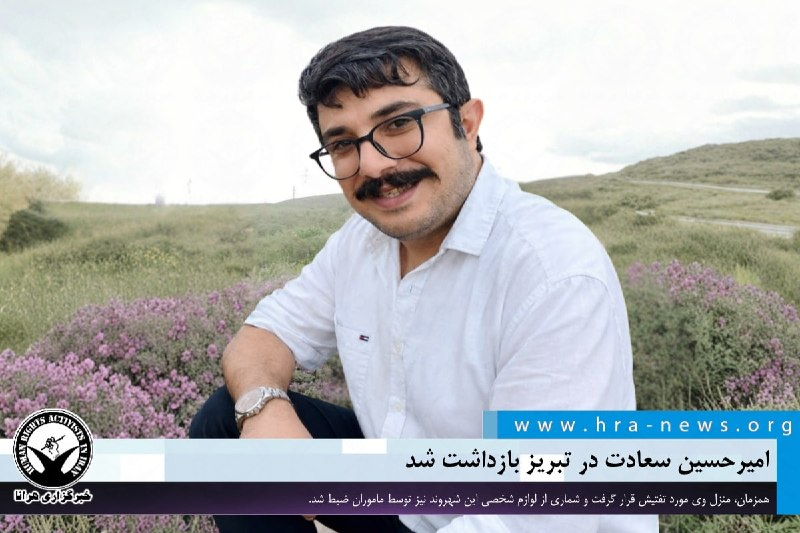

امیرحسین سعادت در تبریز بازداشت شد

❗️
❗️
❗️
❗️
❗️– امروز دوشنبه ۱۱ خرداد، امیرحسین سعادت، دبیر پیشین شورای صنفی دانشگاه علامه طباطبایی، توسط ماموران اداره اطلاعات در تبریز #بازداشت و به مکان نامعلومی منتقل شد. همزمان، منزل وی مورد تفتیش قرار گرفت و شماری از لوازم شخصی این شهروند نیز توسط ماموران ضبط شد.

به گزارش خبرگزاری هرانا، ارگان خبری مجموعه فعالان حقوق بشر در ایران، امیرحسین سعادت در تبریز بازداشت شد.

بر اساس اطلاعات دریافتی هرانا، آقای سعادت صبح امروز بدون ارائه حکم قضایی توسط ماموران اداره اطلاعات در محل کار خود بازداشت و به مکان نامعلومی منتقل شد. بازداشت وی با خشونت و ضرب و شتم همراه بوده است.
یک منبع مطلع نزدیک به خانواده این شهروند ضمن تایید این موضوع به هرانا گفت: “وی طی یک تماس تلفنی کوتاه با خانواده‌اش از بازداشت خود خبر داده اما به محل نگهداری خود اشاره‌ای نکرده است. همزمان منزل امیرحسین توسط ماموران مورد تفتیش قرار گرفته است. در جریان این بازرسی، شماری از وسایل شخصی وی از جمله تلفن همراه، لپ‌تاپ و پاسپورت او ضبط شده است.”

ادامه مطلب

#امیرحسین_سعادت

↘️
@hranews_bot تماس ✉️ -  @Hranews  کانال هرانا 🆑

## Hranews — post 113308

  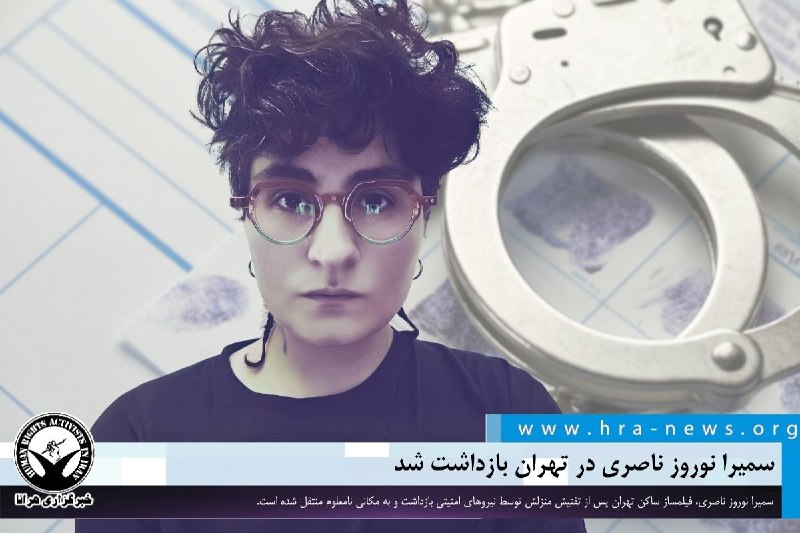

سمیرا نوروز ناصری در تهران بازداشت شد

❗️
❗️
❗️
❗️
❗️– امروز دوشنبه، سمیرا نوروز ناصری، فیلمساز ساکن تهران پس از تفتیش منزلش توسط نیروهای امنیتی #بازداشت و به مکانی نامعلوم منتقل شده است.

به گزارش خبرگزاری هرانا، ارگان خبری مجموعه فعالان حقوق بشر در ایران، سمیرا نوروز ناصری بازداشت شد.

بر اساس اطلاعات دریافتی هرانا، بازداشت خانم نوروز ناصری صبح امروز دوشنبه ۱۱ خردادماه، توسط نیروهای امنیتی بدون ارائه حکم قضایی صورت گرفته است. ماموران همچنین اقدام به تفتیش منزل این کارگردان کرده‌اند.

ادامه مطلب

#سمیرا_نوروز_ناصری

↘️
@hranews_bot تماس ✉️ -  @Hranews  کانال هرانا 🆑

## Hranews — post 113307

  

سعید پیوندی: قانون تشدید مجازات جاسوسی، دشمنی میان جامعه و حکومت را بیش‌تر می‌کند/ نفیسه شرف‌الدینی

📡
📡
📡
📡
📡– پس از تصویب و ابلاغ «قانون تشدید مجازات جاسوسی و همکاری با رژیم صهیونیستی و کشورهای متخاصم علیه امنیت و منافع ملی»، بحث‌های گسترده‌ای درباره‌ی پیامدهای حقوقی، سیاسی و اجتماعی این قانون شکل گرفته است. بسیاری از منتقدان معتقدند که گسترش مفاهیمی چون «همکاری با دولت متخاصم»، «فعالیت امنیتی» و «اقدام علیه امنیت ملی» می‌تواند مرز میان فعالیت‌های مدنی، علمی، رسانه‌ای و امنیتی را بیش از پیش مبهم کرده و زمینه‌ی گسترش نظارت، کنترل و سرکوب اجتماعی را فراهم کند. ماهنامه‌ی خط صلح برای بررسی ابعاد جامعه‌شناختی این قانون، تاثیر آن بر آزادی‌های مدنی، اعتماد اجتماعی، خودسانسوری و امنیتی‌سازی جامعه، با «سعید پیوندی»، جامعه‌شناس ایرانی و مدیر مرکز تحقیقاتی LISEC-Lorraine در دانشگاه لورن، به گفتگو نشسته است.

متن گفتگو با سعید پیوندی را در ادامه می‌خوانید:

قانون «تشدید مجازات جاسوسی و همکاری با رژیم صهیونیستی و کشورهای متخاصم علیه امنیت و منافع ملی» چگونه مفهوم «امنیت» را از یک مقوله‌ی صرفاً حقوقی ـ امنیتی به ابزاری برای تنظیم و کنترل روابط اجتماعی، رسانه‌ای و حتی علمی گسترش می‌دهد؟ آیا می‌توان آن را نمونه‌ای از «امنیتی‌سازی» جامعه، در معنای جامعه‌شناختی، دانست؟

از نظر من، این قانون و اقدامات کنونی دستگاه قضایی ایران، سازمان‌های اطلاعاتی و نیروهای انتظامی، همه در همین چارچوب قرار می‌گیرند. یعنی ما با یک فرآیند فراگیر امنیتی‌سازی در جامعه‌ی ایران سروکار داریم و هرکسی هم می‌تواند با این تعریف، در حوزه‌هایی چون همکاری با کشورهای خارجی یا کشورهای متخاصم، فعالیت‌های امنیتی و مانند آن، متهم شود. می‌توان گفت که حکومت، از نظر خودش، تلاش می‌کند نوعی بازدارندگی برای همکاری‌های احتمالیِ برخی افراد جامعه با نیروهای خارجی ایجاد کند. اما در عمل، معنای این امر این است که حکومت به همه‌ی غیرخودی‌ها، به نوعی، مشکوک خواهد بود.

ادامه مطلب

ادامه و لینک به مطلب در وبسایت خط صلح

#سعید_پیوندی
#نفیسه_شرف‌الدینی

↘️
@hranews_bot تماس ✉️ - @Hranews کانال هرانا 🆑

## Hranews — post 113306

گزارشی از بازداشت یک شهروند در شهرستان مهرستان

❗️
❗️
❗️
❗️
❗️– روز شنبه، عبدالمالک دهانی، شهروند اهل شهرستان مهرستان واقع در استان سیستان و بلوچستان، توسط ماموران امنیتی در این شهرستان #بازداشت و به مکانی نامعلوم منتقل شده است.

ادامه مطلب

#عبدالمالک_دهانی

↘️
@hranews_bot تماس ✉️ -  @Hranews  کانال هرانا 🆑

## Hranews — post 113305

روز یکشنبه ۱۰ خردادماه، شماری از شهروندان ساکن روستای دهنو واقع در شهرستان دورود، در اعتراض به تداوم قطع آب در این روستا دست به #تجمع_اعتراضی زدند.

به گفته این شهروندان معترض، در طول ۱۰ تا ۱۵ روز گذشته آب شرب این روستا به طور کامل قطع بوده است. این موضوع موجب مختل شدن زندگی روزمره مردم شده و بسیاری از خانواده‌ ها از ابتدایی‌ترین نیازهای بهداشتی مانند استحمام محروم مانده‌اند. همچنین، علیرغم پیگیری‌ های مکرر شهروندان از فرمانداری، بخشداری و اداره آب و فاضلاب، تاکنون اقدام مؤثری برای رفع این مشکل صورت نگرفته است.

↘️
@hranews_bot تماس ✉️ - @Hranews کانال هرانا 🆑

## Hranews — post 113304

  

دادستان عمومی و انقلاب شهرستان اهر، با اشاره به #توقیف_اموال ایرانیان مقیم خارج از کشور، اظهار داشت که حتی انتشار یک عکس یا ویدیو نیز می‌تواند مشمول مجازات توقیف اموال شود.

این مقام قضایی افزود: «مجازات توقیف اموال به‌صورت مستقل و کاملاً جدا از مجازات حبس یا اعدام اعمال می‌شود.»

↘️
@hranews_bot تماس ✉️ - @Hranews کانال هرانا 🆑

## Hranews — post 113303

رشت؛ حکم اعدام متهم به قتل یک کودک اجرا شد

❗️
❗️
❗️
❗️
❗️– امروز دوشنبه ۱۱ خردادماه، حکم یک زندانی که پیشتر از بابت اتهام تعرض و قتل یک کودک به نام ایلیا زادحسین به #اعدام محکوم شده بود، در رشت به اجرا درآمد.

ادامه مطلب

#ایلیا_زادحسین

↘️
@hranews_bot تماس ✉️ -  @Hranews  کانال هرانا 🆑

## Hranews — post 113302

  

یاشار دارالشفا بازداشت شد

❗️
❗️
❗️
❗️
❗️– یاشار دارالشفا، زندانی سیاسی پیشین که ساکن تهران است، امروز توسط نیروهای امنیتی در منزل خود #بازداشت و به مکان نامعلومی منتقل شد.

به گزارش خبرگزاری هرانا، ارگان خبری مجموعه فعالان حقوق بشر در ایران، یاشار دارالشفا بازداشت شد.

براساس اطلاعات دریافتی هرانا، صبح امروز دوشنبه ۱۱ خرداد ۱۴۰۵، نیروهای امنیتی با مراجعه به منزل خانوادگی این شهروند، بدون ارائه حکم قضایی او را بازداشت کردند. ماموران همچنین منزل وی را نیز تفتیش کردند.

ادامه مطلب

#یاشار_دارالشفا

↘️
@hranews_bot تماس ✉️ -  @Hranews  کانال هرانا 🆑

## Hranews — post 113301

اعتراضات در دانشگاه‌ها؛ دستکم ۱۰ دانشجوی دانشگاه تهران به کمیته انضباطی احضار شدند

❗️
❗️
❗️
❗️
❗️– طی روزهای اخیر، دستکم ۱۰ دانشجوی #دانشگاه_تهران در ارتباط با تجمعات دانشجویی پس از اعتراضات سراسری دی‌ماه، به کمیته انضباطی این دانشگاه احضار شدند.

ادامه مطلب

↘️
@hranews_bot تماس ✉️ -  @Hranews  کانال هرانا 🆑

## Hranews — post 113300

قروه؛ ۲ متهم در پرونده تعرض گروهی به یک نوجوان اعدام شدند

❗️
❗️
❗️
❗️
❗️– صبح امروز، حکم اعدام دو تن از متهمان پرونده تجاوز گروهی به یک پسر ۱۴ ساله اهل قروه که منجر به خودکشی او شد، در این شهرستان به اجرا در آمد.

ادامه مطلب

↘️
@hranews_bot تماس ✉️ -  @Hranews  کانال هرانا 🆑

## Hranews — post 113299

گزارشی از اجرای حکم اعدام یک زندانی در زندان جیرفت

❗️
❗️
❗️
❗️
❗️– سحرگاه روز سه‌شنبه ۵ خردادماه، حکم یک زندانی که پیشتر از بابت اتهام قتل به #اعدام محکوم شده بود، در زندان جیرفت اجرا شد.

ادامه مطلب

#سبحان_عباسی
↘️
@hranews_bot تماس ✉️ -  @Hranews  کانال هرانا 🆑

## Hranews — post 113298

سمنان؛ اموال ۱۸ شهروند دیگر ساکن خارج از کشور توقیف شد

❗️
❗️
❗️
❗️
❗️– اموال و دارایی‌های ۱۸ شهروند ساکن خارج از کشور در استان سمنان توقیف شد. دستگاه قضایی این افراد را به «همکاری با دشمن» متهم کرده است.

ادامه مطلب

↘️
@hranews_bot تماس ✉️ -  @Hranews  کانال هرانا 🆑

## Hranews — post 113297

  

روز یکشنبه ۱۰ خرداد‌ماه، شماری از اساتید اخراجی دانشگاه فرهنگیان در مقابل ساختمان وزارت آموزش و پرورش در تهران، دست به #تجمع_اعتراضی زدند.

لغو احکام بازنشستگی اجباری اعضای هیئت علمی دانشگاه فرهنگیان براساس مصوبه سال ۱۳۹۶ هیات امنای دانشگاه از جمله دلایل اعتراض این اساتید است.

↘️
@hranews_bot تماس ✉️ - @Hranews کانال هرانا 🆑

## Hranews — post 113296

  

اعتراضات دی‌ماه ۱۴۰۴؛ مهرداد محمدی‌نیا و اشکان مالکی اعدام شدند

❗️
❗️
❗️
❗️
❗️– مرکز رسانه قوه قضاییه اعلام کرد مهرداد محمدی‌نیا و اشکان مالکی، از بازداشت‌شدگان اعتراضات دی‌ماه ۱۴۰۴ تهران، سحرگاه امروز #اعدام شدند. دستگاه قضایی این دو نفر را از بابت اتهاماتی از جمله «مشارکت در اقدامات عملیاتی برخلاف امنیت کشور» و «همکاری با دولت‌های متخاصم» به مجازات مرگ محکوم کرده بود.

ادامه مطلب

#مهرداد_محمدی‌نیا
#اشکان_مالکی

↘️
@hranews_bot تماس ✉️ -  @Hranews  کانال هرانا 🆑

## manototv — post 105898

  <a href="telegram/content/manototv_105898_1780359133.mp4" target="_blank">🎬 Download video</a>

سخنان عزت‌الله همایون‌فر، ادیب و سیاستمدار، درباره روحیه قوی ملت ایران و ریشه‌های آن در سی قرن تاریخ کشور

## manototv — post 105890

  <a href="telegram/content/manototv_105890_1780359134.mp4" target="_blank">🎬 Download video</a>

حمله گزارش‌شده آمریکا به اهدافی در جنوب ایران، از نظر دامنه محدود بود، اما از نظر پیام نظامی اهمیت داشت. بر اساس روایت آمریکا، این حمله پس از سرنگونی یک پهپاد آمریکایی بر فراز آب‌های بین‌المللی انجام شد و سایت‌های راداری و مراکز فرماندهی و کنترل پهپادی جمهوری اسلامی در سیریک و جزیره قشم را هدف قرار داد.

## alonews — post 124356

  

🔥 همراه با ساب + حجم مصرفی، فقط 8T! 🚀

😍فقط گیگی 8 تومن😍

✅ باخرید 90 گیگ 100 گیگ تحویل بگیرید 😍✅
❌ فقط تا پایان امشب ❌

🔥 اگه دنبال یه VPN پایدار و بدون دردسر می‌گردی، این پلن مخصوص خودته!

@Netaazaadbot
@NetAazaadBot

✅ همراه با ساب + حجم مصرفی
✅ 15 سرور اختصاصی پرسرعت
✅ اتصال پایدار و بدون قطعی
✅ سرعت بالا حتی در ساعات شلوغ

@Netaazaadbot
@NetAazaadBot

📩 برای خرید و دریافت سرویس استارت رو بزن✅

## alonews — post 124355

  <a href="telegram/content/alonews_124355_1780359136.webm" target="_blank">🎬 Download video</a>

👈ترامپ: ایرانی‌ها از حملات اسرائیل به لبنان ناراحت بودند و من سریع مشکل را حل کردم

✅ @AloNews خبر جنگ

## alonews — post 124354

  <a href="telegram/content/alonews_124354_1780359136.webm" target="_blank">🎬 Download video</a>

👈آکسیوس: ترامپ تنها به دنبال توافق است

✅ @AloNews خبر جنگ

## alonews — post 124353

  <a href="telegram/content/alonews_124353_1780359137.webm" target="_blank">🎬 Download video</a>

👈کارشناس صدا و سیما: خون یک لبنانی اندازه خون یک ایرانی با ارزشه

✅ @AloNews خبر جنگ

## alonews — post 124352

  <a href="telegram/content/alonews_124352_1780359137.webm" target="_blank">🎬 Download video</a>

👈وزیر جنگ آمریکا: آماده‌ایم به جنگ برگردیم

✅ @AloNews خبر جنگ

## alonews — post 124351

  <a href="telegram/content/alonews_124351_1780359137.webm" target="_blank">🎬 Download video</a>

👈4 سوخت رسان آمریکایی در نزدیکی مرزهای ایران

✅ @AloNews خبر جنگ

## alonews — post 124350

  <a href="telegram/content/alonews_124350_1780359137.mp4" target="_blank">🎬 Download video</a>

👈واکنش تاج به ناامن بودن شهر تیخوانا: کاری به مواد فروش‌های مکزیک نداریم و نمی‌خواهیم هم اصلاحشان کنیم!

✅ @AloNews خبر جنگ

## alonews — post 124349

  <a href="telegram/content/alonews_124349_1780359139.webm" target="_blank">🎬 Download video</a>

👈دوستان این تبلیغاتی که پائین کانال نمایش داده میشه توسط تلگرامه و دست ما نیست و کلاهبرداری هست و فریب نخورید

✅ @AloNews خبر جنگ

## alonews — post 124348

  <a href="telegram/content/alonews_124348_1780359140.webm" target="_blank">🎬 Download video</a>

👈ترامپ: فعلا جنگ نمیکنیم

✅ @AloNews خبر جنگ

## alonews — post 124347

  <a href="telegram/content/alonews_124347_1780359140.webm" target="_blank">🎬 Download video</a>

👈رئیس جمهور ترامپ:
امروز با بی بی نتانیاهو صحبت کردم و از او خواستم که به حمله بزرگی به بیروت لبنان نپردازد. اون سربازاش رو برگردوند ممنون بیبی

🔴من همچنین با نمایندگان رهبران حزب الله صحبت کردم ، و آنها موافقت کردند که تیراندازی به اسرائیل و سربازانش را متوقف کنند. به همین ترتیب ، اسرائیل موافقت کرد که به آنها شلیک نکند.

🔴بذار ببینیم چقدر طول میکشه-امیدوارم برای ابدیت باشه!‌‌

✅ @AloNews خبر جنگ

## alonews — post 124346

  <a href="telegram/content/alonews_124346_1780359140.mp4" target="_blank">🎬 Download video</a>

فیلم وایرال شده از بلاگر روسی در کافه‌ای زیر زمینی در تهران با حضور جواد یساری

[@AloTweet]

## alonews — post 124344

  <a href="telegram/content/alonews_124344_1780359143.webm" target="_blank">🎬 Download video</a>

💔جاویدنام حامد بیابانی، ۲۴ ساله، اصالتاً کُردِ کرمانشاه و ساکن پرند بود.

🔴شب ۱۸ دی، در تهرانپارس، وقتی دوست صمیمی‌اش جاویدنام علیرضا صحت‌بخش هدف گلوله قرار گرفت، حامد خودش را به خطر انداخت و به سمت او رفت تا کمکش کند و او را از محل تیراندازی عقب بکشد؛ اما در همان لحظه خودش هم هدف گلوله جنگی قرار گرفت. گلوله به گلوی حامد خورد و جانش را گرفت.

🔴خانواده‌اش تصمیم گرفتند پیکر او را به سنقر، از توابع کرمانشاه، ببرند؛ شهری که ریشه و اصالت مادری‌شان به آنجا بازمی‌گشت.

🔴حامد از آن آدم‌هایی بود که عاشق زندگی‌اند؛ اجتماعی، شوخ‌طبع، پرانرژی و سرشار از شور. هر جا می‌رفت، فضا را زنده می‌کرد، جمع را به هیجان می‌آورد و لبخند روی لب‌ها می‌نشاند.

🔴حامد بیابانی و علیرضا صحت‌بخش دو رفیق صمیمی بودند؛ هر دو ۲۴ ساله، هر دو ساکن پرند، و هر دو در تهرانپارس با گلوله جنگی کشته شدند؛ علیرضا با گلوله‌ای به قلب و حامد وقتی برای کمک به او رفت، با گلوله‌ای به گلو.

🤔عرزشی حرام زاده، اینها تروریست بودن که به قتل رسوندینشون؟ ادعای عدل علی هم دارید.

✅@AloNews

## alonews — post 124343

  <a href="telegram/content/alonews_124343_1780359143.webm" target="_blank">🎬 Download video</a>

👈باقر:
ایران نه تنها روند گفتگو را متوقف خواهد کرد بلکه اگر اسرائیل حملات در لبنان را متوقف نکند،
مستقیماً به اسرائیل حمله خواهد کرد.

✅ @AloNews خبر جنگ

## alonews — post 124342

  <a href="telegram/content/alonews_124342_1780359144.webm" target="_blank">🎬 Download video</a>

👈ترامپ: مردم ایران مرا دوست دارند زیرا رژیم را عوض کردم

✅ @AloNews خبر جنگ

## alonews — post 124341

  <a href="telegram/content/alonews_124341_1780359144.webm" target="_blank">🎬 Download video</a>

👈ترامپ: «کار ساده‌ای نیست. شما درباره یک کشور واقعاً بزرگ صحبت می‌کنید، آنها یک کشور بسیار بزرگ هستند که می‌خواهد توافق کند. خصومت فوق‌العاده‌ای وجود دارد، واقعاً.»

🔴او ادامه داد: «بنابراین این کار برای آنها آسان نیست. در واقع از منظر ما هم آسان نیست. اما ما داریم آنچه را که نیاز داریم به دست می‌آوریم.»

✅ @AloNews خبر جنگ

## alonews — post 124340

  <a href="telegram/content/alonews_124340_1780359144.webm" target="_blank">🎬 Download video</a>

👈ترامپ در گفت‌وگو با ای‌بی‌سی:
من هنوز این توافق را تأیید نکرده‌ام و هنوز چند نکته دیگر باقی مانده است که باید تضمین شود.

🔴من هنوز با این توافق موافقت نکرده‌ام و هنوز باید چند امتیاز دیگر بگیرم.

✅ @AloNews خبر جنگ

## alonews — post 124339

  <a href="telegram/content/alonews_124339_1780359144.webm" target="_blank">🎬 Download video</a>

👈ترامپ: شاید این هفته با ایران به توافق برسیم

✅ @AloNews خبر جنگ

## alonews — post 124338

  <a href="telegram/content/alonews_124338_1780359145.webm" target="_blank">🎬 Download video</a>

👈ترامپ:
امروز یک مشکل کوچک پیش آمد، ایرانی‌ها از حملات اسرائیل به لبنان ناراحت بودند.

🔴بنابراین من با حزب‌الله صحبت کردم و گفتم تیراندازی نکنید، و با بی‌بی (نتانیاهو) صحبت کردم و گفتم تیراندازی نکنید، و هر دو تیراندازی به سمت یکدیگر را متوقف کردند.

✅ @AloNews خبر جنگ

## alonews — post 124337

  <a href="telegram/content/alonews_124337_1780359145.webm" target="_blank">🎬 Download video</a>

👈ترامپ: صلح با ایران شاید حتی بهتر از پیروزی نظامی باشد‌‌

✅ @AloNews خبر جنگ

---
📅 بروزرسانی: 1405/03/11 03:22
---

## VahidOOnLine — post 243128

  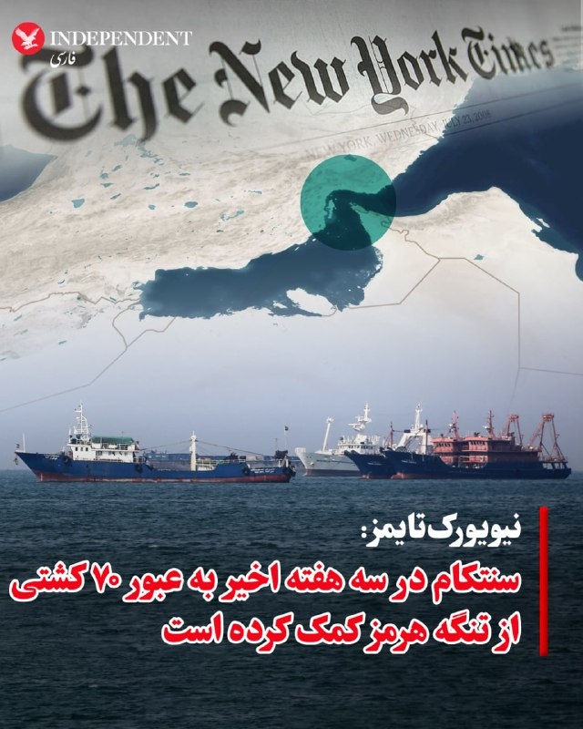

♦️به گزارش نیویورک‌تایمز، نیروهای آمریکایی در هفته‌های اخیر به هماهنگی عبور ده‌ها کشتی تجاری از تنگه هرمز کمک کرده‌اند؛ اقدامی که به گفته مقام‌های ایالات متحده، در حالی انجام شده که رفت‌وآمد از این آبراه همچنان به‌دلیل بن‌بست در مذاکرات برای پایان دادن به جنگ با ایران پرخطر است.یکی از مقام‌های آمریکایی که به شرط ناشناس ماندن درباره مسائل عملیاتی صحبت می‌کرد، گفت فرماندهی مرکزی ایالات متحده در سه هفته گذشته عبور حدود ۷۰ کشتی تجاری را در مسیر ورود و خروج از خلیج فارس از طریق تنگه هرمز هدایت کرده است. مقام‌های آمریکایی افزودند که بیشتر این کشتی‌ها هنگام عبور از این آبراه باریک، برای جلوگیری از شناسایی، دستگاه‌های فرستنده و گیرنده موقعیت‌یاب خود را خاموش کرده بودند.تحلیلگران حوزه کشتیرانی می‌گویند عبورهای هدایت‌شده توسط آمریکا ظاهرا از مسیرهایی نزدیک‌تر به عمان انجام می‌شود. به نوشته این روزنامه آمریکایی، مسیر هماهنگ‌شده توسط آمریکا همچنین گزینه‌ای جایگزین برای مالکان کشتی است که نمی‌خواهند برای عبور از تنگه از ایران مجوز بگیرند یا عوارض پرداخت کنند. . به گفته سنتکام، محاصره دریایی ایران که در واکنش به اقدام تهران در بستن تنگه هرمز اجرا در خلیج عمان اجرا می‌شود تاکنون مسیر ۱۱۶ کشتی را تغییر داده است. این اقدام تا حد زیادی صادرات نفت ایران را مختل کرده است. بر اساس داده‌های شرکت اطلاعات دریایی «کلپر» (Kpler)، از میان ۸۹۵ عبور ثبت‌شده از تنگه هرمز بین اول مارس تا ۱۹ مه، کمی بیش از نیمی از آن‌ها از مسیر ایران انجام شده است. حدود ۴۰ درصد نیز از مسیرهای نامشخص یا «تاریک» عبور کرده‌اند.
‌🇸🇦 Indypersian

🤖 @VahidOOnLine

## VahidOOnLine — post 243127

♦️تصاویر منتشر شده در حساب اینستاگرام خانواده تیموری‌راد، محل خاکسپاری جاویدنامان امید، ۴۷ ساله، پسرش آرمین، ۱۹ ساله و برادرش امیر، ۴۲ ساله، کشته‌شده‌ها در دی‌ماه ۱۴۰۴ را نشان می‌دهد. امید، آرمین و امیر تیموری‌راد جمعه‌شب، ۱۹ دی‌ماه، در فردیس کرج با شلیک نیروهای سرکوبگر جمهوری اسلامی کشته ‌شدند.
‌🇸🇦 Indypersian

🤖 @VahidOOnLine

## VahidOOnLine — post 243126

  

آرمان خورسند، رییس مرکز امور بین‌الملل و کنوانسیون‌های سازمان حفاظت محیط‌زیست گفت دریافت عوارض محیط‌زیستی از کشتی‌های عبوری تنگه هرمز در حقوق بین‌الملل دریاها مبنای حقوقی دارد و می‌تواند برای جبران خسارت‌های واردشده به محیط‌زیست خلیج فارس هزینه شود.

او «آلودگی‌های نفتی، فعالیت ناوگان نظامی خارجی و خسارت به زیست‌بوم‌های حساس خلیج فارس و جزایر منطقه» را از دلایل ضرورت تامین منابع مالی برای احیای محیط‌زیست این منطقه دانست.

خورسند گفت کشورهای مجاور تنگه هرمز در چارچوب نظام «عبور بی‌ضرر» می‌توانند برای خدمات دریانوردی و جبران خسارت‌های ناشی از نقض مقررات، هزینه و عوارض دریافت کنند و ادعای غیرقانونی بودن آن را «بی‌مبنا» خواند.
‌🏁 🇬🇧 IranintlTV

🤖 @VahidOOnLine

## VahidOOnLine — post 243125

  

ایوت کوپر، وزیر خارجه بریتانیا، در واکنش به تشدید درگیری‌ها بین اسرائیل و حزب‌الله، از آن‌ها خواست که به آتش‌بس در لبنان احترام بگذارند.

او گفت پیشروی اسرائیل در جنوب لبنان «باید پایان یابد» و اشاره کرد که عملیات اسرائیل «غیرنظامیان را کشته و آواره کرده، زیرساخت‌ها را نابود کرده و فضای دیپلماسی را از بین برده است.»

کوپر از حزب‌الله خواست که به حملات خود به اسرائیل را پایان دهد و خلع سلاح شود.

او گفت: «همه طرفین باید به آتش‌بس احترام بگذارند و با حسن نیت در مذاکرات شرکت کنند.»
‌🏁 🇬🇧 IranintlTV

🤖 @VahidOOnLine

## VahidOOnLine — post 243124

  <a href="telegram/content/VahidOOnLine_243124_1780271581.mp4" target="_blank">🎬 Download video</a>

♦️دونالد ترامپ با انتشار ویدیویی تولیدشده با هوش مصنوعی در شبکه اجتماعی «تروث سوشال»، هواپیمای اختصاصی ریاست‌جمهوری آمریکا، «ایر فورس وان»، را به تصویر کشید که در میان حلقه‌ای از جنگنده‌های نظامی و بمب‌افکن‌های استراتژیک هسته‌ای ایالات متحده در حال پرواز است.
‌🇸🇦 Indypersian

🤖 @VahidOOnLine

## VahidOOnLine — post 243123

  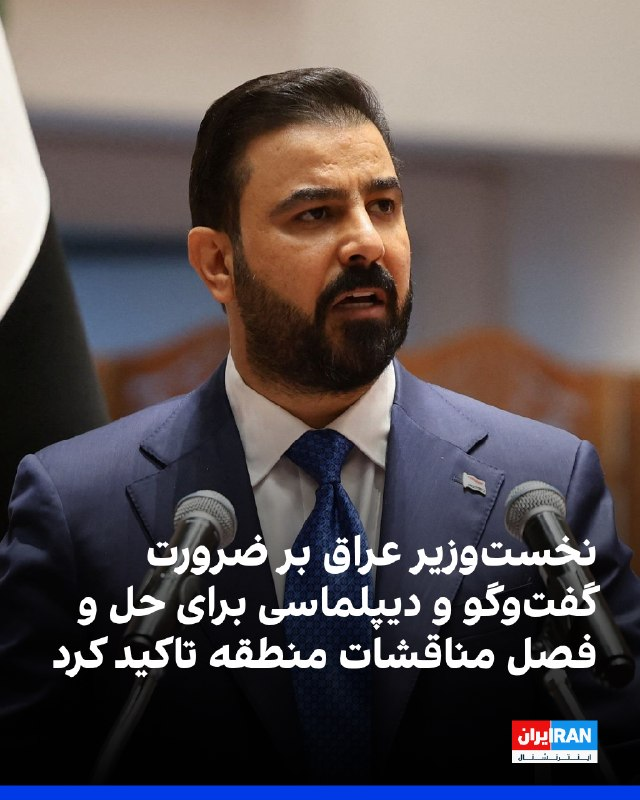

علی الزیدی، نخست‌وزیر عراق، بر ضرورت اولویت دادن به گفت‌وگو و دیپلماسی برای حل و فصل مناقشات و برقراری امنیت و ثبات در منطقه تأکید کرد.

به گزارش خبرگزاری قطر، الزیدی در دیدار با جاشوا هریس، کاردار سفارت آمریکا در عراق، افزود که ارتباط سازنده بین بغداد و واشینگتن باید ادامه یابد و کار مشترک در چارچوب توافقنامه چارچوب استراتژیک و یادداشت‌های تفاهم دوجانبه باید حفظ شود.

او بر تعهد هر دو طرف به تقویت مشارکت و هماهنگی در مورد مسائل مختلف دوجانبه و منطقه‌ای تاکید کرد.

در بیانیه‌ دولت عراق آمده است که دو طرف در مورد چشم‌اندازهای همکاری بین کشورهای خود و راه‌های توسعه و گسترش روابط در همه زمینه‌ها، به ویژه اقتصادی، سرمایه‌گذاری و فرهنگی، بر اساس احترام متقابل و منافع مشترک، گفت‌وگو کردند.
‌🏁 🇬🇧 IranintlTV

🤖 @VahidOOnLine

## VahidOOnLine — post 243122

  

♦️به گزارش آذربایجان آنلاین، در پی بارش‌های مناسب ماه‌های اخیر، سطح آب تالاب «قوری‌گول» به وضعیت مطلوب رسیده و شرایط زیستگاهی این منطقه نسبت به سال‌های گذشته بهبود چشمگیری یافته است. بر اساس این گزارش، توسعه نیزارها و افزایش امنیت این زیستگاه طبیعی در آذربایجان شرقی، موجب احیای تدریجی تالاب و بازگشت گونه‌های ارزشمند، کمیاب و مهاجر شده است. رویدادی امیدوارکننده که تاثیر مستقیم و مثبت بارندگی‌ها را بر زیست‌بوم منطقه نشان می‌دهد. در همین راستا، حضور پرندگان شاخصی مانند فلامینگو و اردک سرسفید که از مهم‌ترین نشانه‌های سلامت زیست‌بوم تالاب‌ها به شمار می‌روند، در قوری‌گول ثبت شده است. همچنین در ماه‌های اخیر پرندگان دیگری نظیر آنقوت، چنگر، چوب‌پا و درنا نیز در این پهنه آبی مشاهده شده‌اند که تاییدی بر افزایش تنوع زیستی و بهبود شرایط طبیعی منطقه است. تالاب قوری‌گول از مهم‌ترین زیستگاه‌های پرندگان مهاجر در شمال‌غرب ایران محسوب می‌شود.
‌🇸🇦 Indypersian

🤖 @VahidOOnLine

## VahidOOnLine — post 243121

  

♦️فارس، خبرگزاری وابسته به سپاه، یکشنبه‌شب، ۱۰ خردادماه، از شنیده‌شدن صدای انفجار در محله باغ ابریشم کرمانشاه خبر داد. سازمان آتش نشانی کرمانشاه اعلام کرد: «وقوع یک حادثه ناشی از انفجار گاز در محله باغ ابریشم باعث ایجاد آتش‌سوزی در یک واحد مسکونی و سرایت آن به ساختمان‌ مجاور شد که ۲ مجروح برجا گذاشت». فارس همزمان از «نشت و انفجار شدید گاز» در یک مجتمع ۴۰ واحدی واقع در فاز یک اندیشه تهران خبر داده بود که دست‌کم ۴ نفر در آن مجروح شدند.
‌🇸🇦 Indypersian

🤖 @VahidOOnLine

## VahidOOnLine — post 243120

  

♦️به گزارش «امتداد»، مسعود پیاهو، عکاسی که تصویر نشستن یک معترض مقابل نیروهای سرکوب جمهوری اسلامی را در دی‌ماه ۱۴۰۴ ثبت کرده بود، به «همکاری با اسرائیل» متهم و به «۱۰ سال حبس» محکوم شد؛ حکمی که در شعبه ۹ دیوان تایید شده و به اجرای احکام رفته است. براساس اعلام حسن آقاخانی، وکیل مسعود پیاهو، او این فیلم کوتاه را به صورت ناخودآگاه ضبط کرده و بدون قصد انتشار، صرفا برای تعداد محدودی از دوستانش در روایتگر خصوصی اینستاگرام منتشر کرده است.
‌🇸🇦 Indypersian

🤖 @VahidOOnLine

## VahidOOnLine — post 243119

  

♦️وزیر دادگستری لبنان روز یکشنبه، ۱۰ خردادماه، در گفتگوی اختصاصی با «العربیه» با انتقاد شدید از عملکرد نظامی حزب‌الله اعلام کرد: «حزب‌الله لبنان را به جنگ‌هایی می‌کشاند که خود انتخاب نکرده است و با شلیک ۶ موشک، جنگ همه‌جانبه را به کشور بازگرداند. اکنون زمان آن فرا رسیده است که این گروه به ماجراجویی‌های خود پایان دهد و از گزینه دولت حمایت کند. چرا که سلاح حزب‌الله به بهانه‌ای برای تهاجم به لبنان تبدیل شده است.» او با تاکید بر ضرورت خلع سلاح این گروه افزود: «حزب‌الله باید سلاح خود را به دولت تحویل دهد و این به معنای تسلیم شدن نیست. اگر حزب‌الله سلاحش را تحویل دهد، دولت در مذاکرات قوی‌تر خواهد بود، در حالی که در وضعیت فعلی، این گروه توانایی دولت برای مذاکره از موضع قدرت را مختل کرده است. حزب‌الله پیش از این نیز لبنانی‌ها را در سوریه قربانی کرد و نبردها را صرفا در راستای منافع خود پیش می‌برد. در حال حاضر دیپلماسی مناسب‌ترین راه است».
‌🇸🇦 Indypersian

🤖 @VahidOOnLine

## VahidOOnLine — post 243118

♦️مهدی تاج، رئیس فدراسیون فوتبال ایران، روز یکشنبه در پاسخ به نگرانی‌ها درباره صدور ویزای بازیکنان تیم ملی فوتبال برای سفر به آمریکا گفت: «میزبان ما فیفا است و فیفا در واقع مسئول برگزاری مسابقات و از نظر ما مسئول دادن ویزا است، نه دولت آمریکا. چرا که وقتی کشوری می‌خواهد میزبانی را عهده‌دار شود، متعهد به انجام یک‌سری کارها می‌شود که یکی از آن‌ها صادر کردن ویزا است و باید این حداقل‌های قانونی را رعایت و مراعات کنند. من خودم امیدوارم با توجه به مسئولیتی که فیفا پذیرفته و صحبت‌های رخ‌به‌رخی که ما از نزدیک با مسئولین فیفا داشته‌ایم، این کار اتفاق بیفتد و مشکلی در این زمینه وجود نداشته باشد.»
همزمان، عباس عراقچی، وزیر امور خارجه جمهوری اسلامی، در گفتگو با خبرگزاری صداوسیما با اشاره به آخرین وضعیت صدور ویزا برای اعضای تیم ملی فوتبال ایران گفت: «دیروز [شنبه] دوستان ما در ترکیه با سفارت مکزیک تماس‌های نزدیکی داشتند. سفارت مکزیک در آنکارا از انگشت‌نگاری [اعضای تیم ملی] صرف‌نظر کرده و بنابر هماهنگی قرار شد به گونه‌ای جلو برود که همه ویزاها صادر بشود.»
‌🇸🇦 Indypersian

🤖 @VahidOOnLine

## VahidOOnLine — post 243117

  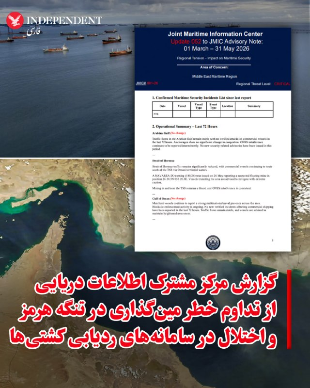

♦️«مرکز مشترک اطلاعات دریایی» (JMIC) در جدیدترین گزارش ارزیابی امنیتی خود، سطح تهدیدات برای امنیت کشتیرانی تجاری در منطقه دریایی خاورمیانه به‌ویژه تنگه هرمز را «بحرانی» اعلام کرد. بر اساس این گزارش، حجم تردد کشتی‌های تجاری در تنگه هرمز در بازه زمانی ۱۱ اسفند تا ۱۰ خرداد به شدت کاهش یافته و شناورها ناچار به تغییر مسیر به سمت آب‌های ساحلی عمان شده‌اند. این نهاد بین‌المللی همچنین با اشاره به صدور هشدار ناوریا ۹ (NAVAREA IX) درباره رویت یک مین شناور در این آب‌راه حیاتی، نسبت به تداوم خطر مین‌گذاری در مسیرهای تردد و اختلالات شدید و مداوم در سیستم‌های موقعیت‌یاب جهانی (GNSS) هشدار داد طبق آمارهای ارائه‌شده، میانگین تردد روزانه کشتی‌ها در تنگه هرمز به تنها ۳ تا ۴ ترانزیت در روز سقوط کرده است؛ با این حال، گزارش تصریح می‌کند که جریان ترافیک دریایی در خلیج عدن و دریای سرخ جنوبی کماکان پایدار است و در ۷۲ ساعت گذشته هیچ حمله تاییدشده‌ای علیه کشتی‌های تجاری در این مناطق ثبت نشده است.
‌🇸🇦 Indypersian

🤖 @VahidOOnLine

## VahidOOnLine — post 243116

  

یوهان وادفول، وزیر خارجه آلمان، اعلام کرد ادامه پیشروی ارتش اسرائیل در جنوب لبنان مایه «نگرانی جدی» است.

به گزارش رویترز، وزیر خارجه آلمان گفت: «از همه طرف‌های درگیر به‌شدت می‌خواهم درگیری‌ها را متوقف کرده و به آتش‌بس مورد توافق بازگردند.»
‌🏁 🇬🇧 IranintlTV

🤖 @VahidOOnLine

## VahidOOnLine — post 243115

  

سناتور لیندسی گراهام، نماینده جمهوری‌خواه مجلس سنای آمریکا، در شبکه اجتماعی ایکس نوشت در گفت‌گو با دونالد ترامپ، حمایت خود را از توافقی با حکومت ایران که ‌خواسته‌های رییس‌جمهوری آمریکا برای باز کردن تنگه هرمز، شروع مذاکرات برای پایان دادن دائمی به جاه‌طلبی‌های هسته‌ای و حمایت تهران از تروریسم را بپذیرد، تأیید کرده است.

او ابراز اطمینان کرد که ترامپ با یک توافق بد با ایران موافقت نخواهد کرد.

گراهام در مورد حملات اسرائیل در لبنان نیز نوشت که باید به این کشور اجازه داد که تهدیدهای ناشی از حملات مداوم حزب‌الله را خنثی کند و افزود: بخش‌هایی از اسرائیل به دلیل اصابت موشک‌ها و راکت‌های حزب‌الله غیرقابل سکونت هستند.
‌🏁 🇬🇧 IranintlTV

🤖 @VahidOOnLine

## VahidOOnLine — post 243114

  

علی عبدالله خانی‌، قائم‌مقام معاون راهبردی پزشکیان، با بیان اینکه «بیش از ۵۶ درصد مردم حداقل یک بار در تجمعات شبانه شرکت کردند» گفت: این حضور یعنی حفظ نظام جمهوری اسلامی را مد نظر داشتند.
او اضافه کرد: «همه رده‌های سنی با تحصیلات مختلف در این اجتماعات حضور داشتند و ۷۰ درصد عاملیت جنبش بر عهده زنان بود.»
‌🏁 🇬🇧 IranintlTV

🤖 @VahidOOnLine

## VahidOOnLine — post 243113

  <a href="telegram/content/VahidOOnLine_243113_1780271593.mp4" target="_blank">🎬 Download video</a>

♦️عباس عراقچی، وزیر امور خارجه جمهوری اسلامی، روز یکشنبه در گفتگو با خبرگزاری صداوسیما با اشاره به آخرین وضعیت صدور ویزا برای اعضای تیم ملی فوتبال ایران گفت: «دیروز [شنبه] دوستان ما در ترکیه با سفارت مکزیک تماس‌های نزدیکی داشتند. سفارت مکزیک در آنکارا از انگشت‌نگاری [اعضای تیم ملی] صرف‌نظر کرده و بنابر هماهنگی قرار شد به گونه‌ای جلو برود که همه ویزاها صادر بشود.» او گفت:‌ «هرچه به ما بیشتر فشار آوردند، بیشتر جنگیدیم».
پیش از این، دکتر جمشید ایرانی، وکیل دیوان عالی آمریکا، از صدور «مجوز موقت و مشروط برای ورود» (Parole) به بازیکنان تیم ملی فوتبال ایران خبر داد. این وکیل در پیامی که در صفحه فیسبوک خود به اشتراک گذاشت، با اشاره به تحقیق و پی بردن به تصمیم واشنگتن در قبال کاروان ورزشی ایران توضیح داد که وزارت امور خارجه آمریکا برای اعضای تیم ملی «ویزای معمولی» صادر نخواهد کرد، بلکه ورود آن‌ها به خاک این کشور در قالب این طرح مشروط خواهد بود که امتیازات ویزای عادی را ندارد.
این تحولات درحالی رخ می‌دهد که تا روز جمعه هشتم خرداد ماه، وضعیت ویزای اعضای تیم ملی فوتبال مردان جمهوری اسلامی ایران، در کمتر از دو هفته به آغاز جام جهانی، با ابهاماتی روبه‌رو بود.
‌🇸🇦 Indypersian

🤖 @VahidOOnLine

## VahidOOnLine — post 243112

  

♦️به گزارش تسنیم، خبرگزاری وابسته به سپاه، یکشنبه‌شب «نشت و انفجار شدید گاز» در یک مجتمع ۴۰ واحدی واقع در فاز یک اندیشه، دست‌کم ۴ مجروح برجای گذاشت. بر اساس اعلام سازمان آتش‌نشانی، این حادثه در طبقه سوم این مجتمع رخ داده و با توجه به شدت انفجار و ارزیابی‌های اولیه در محل، احتمال افزایش شمار مجروحان وجود دارد.
‌🇸🇦 Indypersian

🤖 @VahidOOnLine

## VahidOOnLine — post 243111

  

امانوئل مکرون، رییس‌جمهور فرانسه، در شبکه اجتماعی ایکس اعلام کرد با محمد بن سلمان، ولیعهد عربستان سعودی، هیثم بن طارق، سلطان عمان، محمد بن زاید، رییس امارات متحده عربی، و عبدالفتاح السیسی، رییس‌جمهور مصر، گفت‌وگو کرده است.

مکرون افزود به همه آن‌ها پیامی واحد منتقل کرده است: ضروری است توافقی میان ایالات متحده و جمهوری اسلامی هرچه سریع‌تر حاصل شود و این فرصت باید همین اکنون مورد استفاده قرار گیرد.

او تاکید کرد اولویت باید دستیابی به آتش‌بس و بازگشایی فوری تنگه هرمز، بدون هیچ شرطی و در چارچوب حقوق بین‌الملل، باشد. سپس گفت‌وگوها باید برای دستیابی به توافقی کامل و مستحکم درباره برنامه هسته‌ای، موشک‌های بالستیک و ثبات منطقه‌ای ادامه یابد.
‌🏁 🇬🇧 IranintlTV

🤖 @VahidOOnLine

## VahidOOnLine — post 243110

  

بر اساس اطلاعات رسیده به ایران‌اینترنشنال، اشکان مالکی و مهرداد محمدی‌نیا، دو معترض بازداشت‌شده در جریان انقلاب ملی در دی‌ماه ۱۴۰۴، در معرض خطر اجرای قریب‌الوقوع حکم اعدام قرار دارند. 
بنا بر این گزارش، این دو جوان معترض در زندان قزلحصار محبوس هستند. 
دادگاه رسیدگی به پرونده اشکان مالکی و مهرداد محمدی‌نیا روز دوم اسفند در شعبه ۱۵ دادگاه انقلاب به ریاست ابوالقاسم صلواتی برگزار شد. این دو معترض در نهایت به اعدام محکوم شدند و بر اساس اطلاعات دریافتی، در معرض اجرای حکم قرار دارند. 
اشکان مالکی و مهرداد محمدی‌نیا در این پرونده به «محاربه از طریق تحریق و تخریب مسجد جعفری و حوزه علمیه امام هادی در کوی نصر تهران» متهم شده‌اند. 
در همین پرونده، آرمان معرفتی، دیگر معترض بازداشت‌شده که هم‌اکنون در زندان تهران بزرگ نگهداری می‌شود، به «اجتماع و تبانی علیه امنیت داخلی کشور» متهم شده است.
‌🏁 🇬🇧 IranintlTV

🤖 @VahidOOnLine

## WithYashar — post 13108

گزارش‌ها از حمله پهپادی ایران به گروه های مخالف ایرانی-کرد در نزدیکی اربیل، شمال عراق!
@withyashar

## WithYashar — post 13107

  <a href="telegram/content/WithYashar_13107_1780271599.mp4" target="_blank">🎬 Download video</a>

اتاق جنگ با یاشار : چشم آسمان ، هواپیما آواکس
@withyashar

## WithYashar — post 13106

## WithYashar — post 13105

انفجار در فاز یک اندیشه شهریار خیابان شیشم شرقی در یک ساختمان که چندین مصدوم داشته @withyashar

## WithYashar — post 13104

انفجار در فاز یک اندیشه شهریار خیابان شیشم شرقی در یک ساختمان که چندین مصدوم داشته @withyashar

## mwarmonitor — post 9960

✈️یک فروند هواپیمای گشت دریایی P-8A پوزیدون نیروی دریایی ایالات متحده امروز بر فراز دریای عرب فعال بود.

✈️به‌طور جداگانه، یک فروند دیگر از هواپیماهای گشت دریایی P-8A نیروی دریایی آمریکا از کمپ لمونیه در جیبوتی به پایگاه هوایی شاهزاده سلطان در عربستان سعودی پرواز کرد.

@mwarmonitor

## mwarmonitor — post 9959

  

✈️نیروی هوایی ایالات متحده آمریکا (USAF)

Boeing E-3 Sentry: یک فروند✈️
AE11DF 77-0351 – ANDOR 54

Boeing KC-46 Pegasus: دو فروند✈️
AE5FA5 11-46058 – YETI ??
AE5FA1 18-46054 – YETI ??

Boeing KC-135 Stratotanker: یک فروند✈️
AE058B 57-1514 – علامت تماس نامشخص

📌بر اساس داده‌های فلایت‌رادار، امشب سه هواپیمای سوخت‌رسان و یک فروند آواکس E-3 بر فراز منطقه مسئولیت سنتکام مشاهده شده‌اند.

@mwarmonitor

## FoxNewsTwitter — post 342465

  <a href="telegram/content/FoxNewsTwitter_342465_1780271603.mp4" target="_blank">🎬 Download video</a>

Fox News (Twitter/X)

"Our community will resist again."

Los Angeles Mayor Karen Bass warned that she and her city's residents are ready to oppose federal immigration enforcement if the Trump administration attempts widespread operations during the World Cup.

Bass, who is facing a challenge in the mayoral election from Spencer Pratt, pledged her support for Los Angeles residents regardless of who they are or why they're in the city.

Last year, ICE raids in Los Angeles sparked riots across the city.

## FoxNewsTwitter — post 342461

Fox News (Twitter/X)

New York City's annual Israel Day parade went on without its mayor.

Zohran Mamdani skipped the event due to his stance toward Israel, breaking a decades-long tradition of New York City mayors attending the celebration.

As thousands packed Fifth Avenue waving Israeli flags, Gov. Kathy Hochul, Sen. Chuck Schumer, Attorney General Letitia James, and New York Republican gubernatorial candidate Bruce Blakeman all took part.

Mamdani's absence quickly became a political flashpoint, with critics accusing Mamdani of turning his back on New York's Jewish community amid record levels of antisemitism.

## FoxNewsTwitter — post 342460

  

Fox News (Twitter/X)

Iran’s president has reportedly asked to resign, citing a loss of authority inside the country’s ruling system.

According to reports, Masoud Pezeshkian told the Supreme Leader’s office that he and his government have been excluded from major decision-making, leaving him unable to fulfill his responsibilities.

The reported resignation comes amid growing signs of internal power struggles within the regime and as the U.S. continues negotiations with Tehran.

President Trump has repeatedly pointed to divisions inside Iran’s leadership, previously saying the regime is “seriously fractured.”

## pm_afshaa — post 91976

  <a href="telegram/content/pm_afshaa_91976_1780271606.webm" target="_blank">🎬 Download video</a>

🔴فاکس نیوز:
رئیس‌جمهور ایران، درخواست استعفا داده و دلیلش رو این عنوان کرده که عملاً اختیار و نفوذ کافی در ساختار حاکمیت نداره؛ اون به دفتر رهبری اعلام کرده که خودش و دولتش از تصمیم‌گیری‌های مهم کنار گذاشته شدن.

💧 Rainbet.com the #1 Non-KYC Crypto Casino & Sportsbook @rainbetcom

😁 @Pm_Afshaa

## pm_afshaa — post 91975

  <a href="telegram/content/pm_afshaa_91975_1780271607.webm" target="_blank">🎬 Download video</a>

🔴قائم‌مقام، معاون راهبردی پزشکیان:
بیش از 56 درصد مردم حداقل یک بار در تجمعات شبانه شرکت کردن.

💧 Rainbet.com the #1 Non-KYC Crypto Casino & Sportsbook @rainbetcom

😁 @Pm_Afshaa

## pm_afshaa — post 91974

پزشکیان: فقط شهادت میتونه منو از خدمت به مردم باز بداره

💧 Rainbet.com the #1 Non-KYC Crypto Casino & Sportsbook @rainbetcom

😁 @Pm_Afshaa

## pm_afshaa — post 91973

#مهم
عزیزای دلم همگی الان چنل زاپاس‌مون رو جوین بشید کانال تحت ریپورت شدیده اگه چیزی شد زاپاس رو داشته باشید فعالیت میاد اونور
👇

https://t.me/Pm_Zapas
https://t.me/Pm_Zapas

## pm_afshaa — post 91972

سخنگوی کمیته امنیت ملی جمهوری اسلامی: لبنان را رها نخواهیم کرد؛ برای ما به اندازه ایران مهم است

💧 Rainbet.com the #1 Non-KYC Crypto Casino & Sportsbook @rainbetcom

😁 @Pm_Afshaa

## pm_afshaa — post 91970

  <a href="telegram/content/pm_afshaa_91970_1780271608.webm" target="_blank">🎬 Download video</a>

🔴تسنیم به نقل از یک منبع آگاه:
ایران اصلاحیه‌های جدید درباره متن تفاهم احتمالی اعمال خواهد کرد .

ملاک برای ایران متنی است که خودمان قبول داشته باشیم و اعمال اصلاحیه از ناحیه ترامپ به معنای پذیرش آنها توسط ایران نیست؛ ایران برای وضعیت عدم تفاهم نیز کاملاً آمادگی دارد.

💧 Rainbet.com the #1 Non-KYC Crypto Casino & Sportsbook @rainbetcom

😁 @Pm_Afshaa

## DEJradio — post 5194

  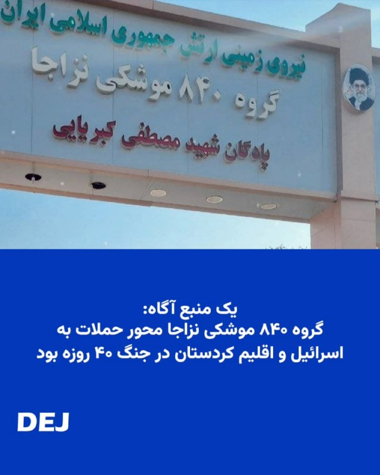

📝
⭕️ براساس اطلاعات دریافتی در جنگ ۴۰ روزه، بخشی از حملات موشکی و پهپادی به اسرائیل، اقلیم کردستان عراق و اردن توسط گروه ۸۴۰ موشکی نیروی زمینی ارتش انجام شد. ستاد فرماندهی این گروه در کاشان مستقر است.
این در حالیست که دونالد ترامپ به «فاکس نیوز» گفت،«شاید شنیدن این موضوع برای خیلی‌ها تعجب‌آور باشد، اما اینکه در جنگ‌ها همه چیز را نابود کنی، اشتباه است، چرا که بعد کشوری داری که تا ۴۰ سال هم قادر به بازسازی خود نخواهد بود.»
او با اشاره به جنگ عراق، آن را نمونه‌ای از رویکرد اشتباه آمریکا در درگیری‌های گذشته دانست و گفت: «به عراق نگاه کنید؛ ما خیلی بد عمل کردیم، آن کار یک اشتباه بزرگ بود.»
ترامپ همچنین عنوان کرد آمریکا ارتش ایران را «تا حدی به حال خود گذاشته»، چون به گفته او این ارتش «تا اندازه‌ای میانه‌رو» است و واشنگتن نمی‌خواسته همه ساختار نظامی کشور را نابود کند.

#جنگ۴۰روزه
@DEJradio

## DEJradio — post 5193

⭕️🕘 خبر ۲۱
یکشنبه ۱۰ خرداد ۱۴۰۵

#خبر۲۱
@DEJradio

## DEJradio — post 5192

  

⭕️
⭕️ یک منبع مطلع به دژ می‌گوید اینترنت در ایران با اصرار دولت مسعود پزشکیان مجدد وصل شد، اما بعضی افراد صاحب نفوذ در دستگاه‌های امنیتی برای قطع مجدد آن فشار می‌آورند.
این افراد به واسطه چند عضو شورای‌عالی فضای مجازی از ستاد «ساماندهی اینترنت» وابسته به دولت شکایت کردند.
همچنین چند نماینده مجلس شورای اسلامی با پشتیبانی نهادهای امنیتی به دنبال مسدودسازی مجدد اینترنت هستند. آنها گفته‌اند «ستاد ویژه فضای مجازی حق تصمیم برای اینترنت ندارد.»
در ایران با آغاز جنگ اینترنت قطع شد و بیش از سه ماه تمام کشور به جز سیم‌کارت سفیدها به آن دسترسی نداشتند.
برخی اما می‌گویند محال است، بدون نظر نهادهای امنیتی بالادستی اینترنت وصل شده باشد. به اعتقاد آنها دولت تصمیم‌گیر نیست و صرفاً یک بازی درون حکومتی است که برای دولت پزشکیان نزد افکار عمومی با وصل شدن اینترنت اعتبارسازی شود.
مخالفان باز شدن اینترنت می‌گویند، "احتمال آسیب به دستگاه امنیتی و احتمال نفوذ خارجی در عرصه حکمرانی لز طریق اینترنت بسیار زیاد است."

#اینترنت
@DEJradio

## VahidOnline — post 75825

  

فاکس نیوز هم به درخواست استعفای پزشکیان پرداخته: FoxNews

چند مقام دولتی در ایران از جمله سخنگوی دولت این کشور با تکذیب شایعه استعفای مسعود پزشکیان، آن را «خبر کذب با هدف ایجاد ناامیدی» خواندند.

فاطمه مهاجرانی، سخنگوی دولت، الیاس حضرتی و علی احمدنیا که از اعضای شورای اطلاع رسانی دولت آقای پزشکیان هستند در پست‌های جداگانه به ادامه کار رئیس جمهوری و تلاش او برای «حل مسائل کشور» اشاره کرده‌اند.
@VahidHeadline

📡 @VahidOnline

## VahidOnline — post 75824

  

رسانه‌های جمهوری اسلامی وقوع دو انفجار را که تقریبا هم‌زمان در تهران و کرمانشاه و در ساعات پایانی یکشنبه گزارش شد به نشت گاز نسبت دادند.

سایت تسنیم، نزدیک به سپاه پاسداران اعلام کرد که در ساعات پایانی روز یکشنبه، «انفجار گاز» در محله باغ ابریشم کرمانشاه باعث مصدومیت ۲ نفر شد.
این سایت‌ همچنین مدعی شد که انفجار در یک واحد مسکونی در «فاز یک اندیشه» در استان تهران ناشی از «نشت گاز» بوده است.
خبرگزاری ایسنا به نقل از سخنگوی اورژانس استان تهران می‌گوید این انفجار تاکنون ۶ مصدوم بر جای گذاشته است.
@VahidHeadline

📡 @VahidOnline

## IranIntlTV — post 339953

  

آرمان خورسند، رییس مرکز امور بین‌الملل و کنوانسیون‌های سازمان حفاظت محیط‌زیست گفت دریافت عوارض محیط‌زیستی از کشتی‌های عبوری تنگه هرمز در حقوق بین‌الملل دریاها مبنای حقوقی دارد و می‌تواند برای جبران خسارت‌های واردشده به محیط‌زیست خلیج فارس هزینه شود.

او «آلودگی‌های نفتی، فعالیت ناوگان نظامی خارجی و خسارت به زیست‌بوم‌های حساس خلیج فارس و جزایر منطقه» را از دلایل ضرورت تامین منابع مالی برای احیای محیط‌زیست این منطقه دانست.

خورسند گفت کشورهای مجاور تنگه هرمز در چارچوب نظام «عبور بی‌ضرر» می‌توانند برای خدمات دریانوردی و جبران خسارت‌های ناشی از نقض مقررات، هزینه و عوارض دریافت کنند و ادعای غیرقانونی بودن آن را «بی‌مبنا» خواند.
https://iranintl.com/202605314484

## IranIntlTV — post 339952

  

ایوت کوپر، وزیر خارجه بریتانیا، در واکنش به تشدید درگیری‌ها بین اسرائیل و حزب‌الله، از آن‌ها خواست که به آتش‌بس در لبنان احترام بگذارند.

او گفت پیشروی اسرائیل در جنوب لبنان «باید پایان یابد» و اشاره کرد که عملیات اسرائیل «غیرنظامیان را کشته و آواره کرده، زیرساخت‌ها را نابود کرده و فضای دیپلماسی را از بین برده است.»

کوپر از حزب‌الله خواست که به حملات خود به اسرائیل را پایان دهد و خلع سلاح شود.

او گفت: «همه طرفین باید به آتش‌بس احترام بگذارند و با حسن نیت در مذاکرات شرکت کنند.»
https://iranintl.com/202605311407

## IranIntlTV — post 339951

  

علی الزیدی، نخست‌وزیر عراق، بر ضرورت اولویت دادن به گفت‌وگو و دیپلماسی برای حل و فصل مناقشات و برقراری امنیت و ثبات در منطقه تأکید کرد.

به گزارش خبرگزاری قطر، الزیدی در دیدار با جاشوا هریس، کاردار سفارت آمریکا در عراق، افزود که ارتباط سازنده بین بغداد و واشینگتن باید ادامه یابد و کار مشترک در چارچوب توافقنامه چارچوب استراتژیک و یادداشت‌های تفاهم دوجانبه باید حفظ شود.

او بر تعهد هر دو طرف به تقویت مشارکت و هماهنگی در مورد مسائل مختلف دوجانبه و منطقه‌ای تاکید کرد.

در بیانیه‌ دولت عراق آمده است که دو طرف در مورد چشم‌اندازهای همکاری بین کشورهای خود و راه‌های توسعه و گسترش روابط در همه زمینه‌ها، به ویژه اقتصادی، سرمایه‌گذاری و فرهنگی، بر اساس احترام متقابل و منافع مشترک، گفت‌وگو کردند.
https://iranintl.com/202605319641

## IranIntlTV — post 339950

  <a href="telegram/content/IranIntlTV_339950_1780271614.mp4" target="_blank">🎬 Download video</a>

محسن هاشمی رفسنجانی، عضو حزب کارگزاران سازندگی، با لحنی توهین‌آمیز، دونالد ترامپ را «گاو خشمگین» نامید و گفت باید راهی پیدا کرد که او صدمه بیشتری به ایران نزند. او افزود اگر توافق‌نامه‌ای به نفع جمهوری اسلامی نباشد، بعدا ما هم آن را پاره می‌کنیم و خواستار مذاکرات تازه‌ای می‌شویم.
@iranintltv

## IranIntlTV — post 339949

  <a href="https://t.me/IranintlTV/339949" target="_blank">📎 Download file</a>

🎧نسخه صوتی سیاست با مراد ویسی: استعفای پزشکیان؛ شکاف در راس نظام
@iranintlTV

## IranIntlTV — post 339948

  <a href="telegram/content/IranIntlTV_339948_1780271616.mp4" target="_blank">🎬 Download video</a>

مراد ویسی، تحلیل‌گر ارشد ایران‌اینترنشنال، گفت: «تجربه صربستان و برکناری و مرگ میلوسویچ پس از جنگ کوزوو، نشان داد که شکست‌های نظامی می‌توانند پایه‌های حکومت‌های دیکتاتوری را متزلزل و اختلافات داخلی آنها را تشدید کنند. وضعیت کنونی جمهوری اسلامی نیز نتیجه فعال شدن بحران‌های مختلف پس از جنگ‌ها و تشدید شکاف‌های درونی در راس نظام را نشان می‌دهد.»
@iranintltv

## IranIntlTV — post 339947

  <a href="telegram/content/IranIntlTV_339947_1780271619.mp4" target="_blank">🎬 Download video</a>

پنج ماه پس از کشته‌شدن ده‌ها هزار نفر در جریان انقلاب ملی در دی‌ماه، شماری از ایرانیان در لس‌آنجلس گردهم آمدند تا یاد جان‌باختگان را گرامی بدارند.

شرکت‌کنندگان همچنین بر جایگاه پرچم شیر و خورشید به‌عنوان نمادی از همبستگی و اتحاد میان ایرانیان تاکید کردند.

گزارش نیلوفر منصوری، خبرنگار ایران‌اینترنشنال و گفت‌وگو با راحله امیری، از آسیب‌دیدگان چشمی جنبش «زن، زندگی، آزادی» و یکی دیگر از شرکت‌کنندگان
@iranintltv

## IranIntlTV — post 339946

  <a href="telegram/content/IranIntlTV_339946_1780271621.mp4" target="_blank">🎬 Download video</a>

گزارش اختصاصی ایران‌اینترنشنال به نقل از یک منبع آگاه نشان می‌دهد مسعود پزشکیان با ارسال نامه‌ای رسمی به دفتر مجتبی خامنه‌ای خواستار کناره‌گیری فوری از سمت خود شده است.

او در این نامه تاکید کرده دولت و شخص رییس‌جمهور در عمل از روند تصمیم‌گیری‌های کلان کشور کنار گذاشته شده‌اند و ادامه مسئولیت در این شرایط ممکن نیست.

گفت‌وگو با کامیار بهرنگ، عضو تحریریه ایران‌اینترنشنال
@iranintltv

## IranIntlTV — post 339945

  <a href="telegram/content/IranIntlTV_339945_1780271624.mp4" target="_blank">🎬 Download video</a>

مراد ویسی، تحلیل‌گر ارشد ایران‌اینترنشنال، گفت: «اختلاف میان پزشکیان و فرماندهان سپاه بر سر دو موضوع اصلی است؛ نحوه اداره داخلی کشور و چگونگی مواجهه با آمریکا و اسرائیل. در حالی که برخی چهره‌ها مانند قالیباف به رویکرد توافق و حفظ نظام نزدیک‌تر توصیف می‌شوند، بخشی از فرماندهان سپاه بر ادامه مسیر تقابل و جنگ تاکید دارند، فارغ از پیامدهای آن.»
@iranintltv

## IranIntlTV — post 339944

  

مراد ویسی، تحلیل‌گر ارشد ایران‌اینترنشنال، گفت: «پزشکیان از ناتوانی در اداره کشور به دلیل دخالت‌های سپاه گلایه کرده، اما فرماندهان سپاه که بر بخش‌های اصلی قدرت مسلط شده‌اند حاضر به پذیرش این انتقادها نیستند. برای مردمی که جمهوری اسلامی را نمی‌خواهند، تشدید اختلافات در راس حکومت نشانه‌ای از تضعیف بیشتر نظام و درگیری میان دو جناحی تلقی می‌شود که هر دو متهم به ظلم علیه مردم هستند.»
@iranintltv

## IranIntlTV — post 339943

  

یوهان وادفول، وزیر خارجه آلمان، اعلام کرد ادامه پیشروی ارتش اسرائیل در جنوب لبنان مایه «نگرانی جدی» است.

به گزارش رویترز، وزیر خارجه آلمان گفت: «از همه طرف‌های درگیر به‌شدت می‌خواهم درگیری‌ها را متوقف کرده و به آتش‌بس مورد توافق بازگردند.»
https://iranintl.com/202605317536

## IranIntlTV — post 339942

  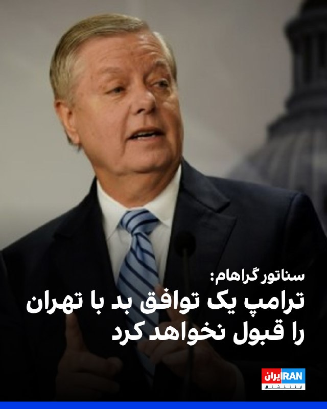

سناتور لیندسی گراهام، نماینده جمهوری‌خواه مجلس سنای آمریکا، در شبکه اجتماعی ایکس نوشت در گفت‌گو با دونالد ترامپ، حمایت خود را از توافقی با حکومت ایران که ‌خواسته‌های رییس‌جمهوری آمریکا برای باز کردن تنگه هرمز، شروع مذاکرات برای پایان دادن دائمی به جاه‌طلبی‌های هسته‌ای و حمایت تهران از تروریسم را بپذیرد، تأیید کرده است.

او ابراز اطمینان کرد که ترامپ با یک توافق بد با ایران موافقت نخواهد کرد.

گراهام در مورد حملات اسرائیل در لبنان نیز نوشت که باید به این کشور اجازه داد که تهدیدهای ناشی از حملات مداوم حزب‌الله را خنثی کند و افزود: بخش‌هایی از اسرائیل به دلیل اصابت موشک‌ها و راکت‌های حزب‌الله غیرقابل سکونت هستند.
https://iranintl.com/202605310697

## IranIntlTV — post 339941

  <a href="telegram/content/IranIntlTV_339941_1780271628.mp4" target="_blank">🎬 Download video</a>

فاطمه مهاجرانی، سخنگوی دولت جمهوری اسلامی، گفت افزایش ارزش کالابرگ از مطلوبات دولت است، اما باید با مقدورات هماهنگ باشد. او با اشاره تلویحی به محاصره دریایی آمریکا به‌عنوان تحولات مرزهای جنوبی و اثر آن بر درآمد کشور افزود «فعلا خبری از افزایش مبلغ کالابرگ نیست.»
@iranintltv

## IranIntlTV — post 339940

  

علی عبدالله خانی‌، قائم‌مقام معاون راهبردی پزشکیان، با بیان اینکه «بیش از ۵۶ درصد مردم حداقل یک بار در تجمعات شبانه شرکت کردند» گفت: این حضور یعنی حفظ نظام جمهوری اسلامی را مد نظر داشتند.
او اضافه کرد: «همه رده‌های سنی با تحصیلات مختلف در این اجتماعات حضور داشتند و ۷۰ درصد عاملیت جنبش بر عهده زنان بود.»
https://iranintl.com/202605314070

## IranIntlTV — post 339939

  <a href="telegram/content/IranIntlTV_339939_1780271631.mp4" target="_blank">🎬 Download video</a>

🔻علیرضا دبیر، رییس فدراسیون کشتی، درباره شماری از مخالفان جمهوری اسلامی در آمریکا گفت: «من ۱۴۰ رفیق درست و حسابی در آمریکا دارم که دکتر و مهندس هستند. نگاه نکنید چهار نفر می‌آیند جلوی دوربین می‌رقصند. این افراد لش و لوش‌هایی بودند که چند سال پیش فرار کردند و رفتند.»

🔹علیرضا دبیر پیشتر بخشی از ایرانیان خارج از کشور را «آویزان»، «پلشت» و «به دردنخور» خطاب کرده بود.

@iranintltvsport

## IranIntlTV — post 339938

  <a href="telegram/content/IranIntlTV_339938_1780271634.mp4" target="_blank">🎬 Download video</a>

بعد از سه ماه خاموشی مطلق، کم‌کم عده بیشتری در ایران به اینترنت وصل می‌شوند؛ جمهوری اسلامی چطور با استقرار یک پادگان دیجیتال، حق ارتباط ده‌ها میلیون ایرانی را مصادره کرد؟ این انزوای بی‌سابقه چگونه از نظر فنی، مهندسی شد، خسارت‌ ده‌ها میلیارد دلاری آن بر دوش چه کسانی است و آمران و پیمانکاران اجرایی این خاموشی دقیقا چه کسانی هستند؟ امشب قطع سراسری اینترنت در ایران را زیر ذره‌بین می‌بریم.

اصلاحیه: در بخشی از برنامه عدد خسارت روزانه قطعی اینترنت بین «۷۰ تا ۸۰ میلیارد دلار» ذکر شده. رقم صحیح روزانه «۷۰ تا ۸۰ میلیون دلار» است.
@iranintltv

## IranIntlTV — post 339937

  <a href="telegram/content/IranIntlTV_339937_1780271637.mp4" target="_blank">🎬 Download video</a>

سی‌ان‌ان گزارش داد جمهوری اسلامی بخش بزرگی از مسیرهای مسدودشده به سایت‌های زیرزمینی موشکی خود را بازسازی کرده است.

به نوشته این رسانه، ایران اکنون توان شلیک شمار بیشتری موشک دوربرد به سمت اسرائیل و دیگر کشورهای منطقه را دارد.

گفت‌وگو با آرام حسامی، استاد علوم سیاسی
@iranintltv

## IranIntlTV — post 339936

  

امانوئل مکرون، رییس‌جمهور فرانسه، در شبکه اجتماعی ایکس اعلام کرد با محمد بن سلمان، ولیعهد عربستان سعودی، هیثم بن طارق، سلطان عمان، محمد بن زاید، رییس امارات متحده عربی، و عبدالفتاح السیسی، رییس‌جمهور مصر، گفت‌وگو کرده است.

مکرون افزود به همه آن‌ها پیامی واحد منتقل کرده است: ضروری است توافقی میان ایالات متحده و جمهوری اسلامی هرچه سریع‌تر حاصل شود و این فرصت باید همین اکنون مورد استفاده قرار گیرد.

او تاکید کرد اولویت باید دستیابی به آتش‌بس و بازگشایی فوری تنگه هرمز، بدون هیچ شرطی و در چارچوب حقوق بین‌الملل، باشد. سپس گفت‌وگوها باید برای دستیابی به توافقی کامل و مستحکم درباره برنامه هسته‌ای، موشک‌های بالستیک و ثبات منطقه‌ای ادامه یابد.
https://iranintl.com/202605318416

## IranIntlTV — post 339935

  

بر اساس اطلاعات رسیده به ایران‌اینترنشنال، اشکان مالکی و مهرداد محمدی‌نیا، دو معترض بازداشت‌شده در جریان انقلاب ملی در دی‌ماه ۱۴۰۴، در معرض خطر اجرای قریب‌الوقوع حکم اعدام قرار دارند. 
بنا بر این گزارش، این دو جوان معترض در زندان قزلحصار محبوس هستند. 
دادگاه رسیدگی به پرونده اشکان مالکی و مهرداد محمدی‌نیا روز دوم اسفند در شعبه ۱۵ دادگاه انقلاب به ریاست ابوالقاسم صلواتی برگزار شد. این دو معترض در نهایت به اعدام محکوم شدند و بر اساس اطلاعات دریافتی، در معرض اجرای حکم قرار دارند. 
اشکان مالکی و مهرداد محمدی‌نیا در این پرونده به «محاربه از طریق تحریق و تخریب مسجد جعفری و حوزه علمیه امام هادی در کوی نصر تهران» متهم شده‌اند. 
در همین پرونده، آرمان معرفتی، دیگر معترض بازداشت‌شده که هم‌اکنون در زندان تهران بزرگ نگهداری می‌شود، به «اجتماع و تبانی علیه امنیت داخلی کشور» متهم شده است.
https://iranintl.com/202605317088

## Shin_Persian — post 6343

  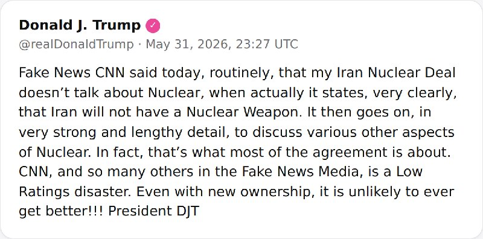

Shin ✓ @hey_itsmyturn Sun, 31 May 2026 23:31:03 UTC President Trump @POTUS: "Fake News CNN said today, routinely, that my Iran Nuclear Deal doesn’t talk about Nuclear, when actually it states, very clearly, that Iran will not have a Nuclear Weapon. It then…

## Shin_Persian — post 6342

Shin ✓ @hey_itsmyturn
Sun, 31 May 2026 23:31:03 UTC

President Trump @POTUS:
"Fake News CNN said today, routinely, that my Iran Nuclear Deal doesn’t talk about Nuclear, when actually it states, very clearly, that Iran will not have a Nuclear Weapon. It then goes on, in very strong and lengthy detail, to discuss various other aspects of Nuclear. In fact, that’s what most of the agreement is about. CNN, and so many others in the Fake News Media, is a Low Ratings disaster. Even with new ownership, it is unlikely to ever get better!!! President DJT"

فارسی

رئیس‌جمهور ترامپ @POTUS:

«سی‌ان‌ان (CNN) که رسانه اخبار جعلی است، امروز به طور مکرر گفت که توافق هسته‌ای من با ایران درباره مسائل هسته‌ای صحبت نمی‌کند، در حالی که در واقع، این توافق به وضوح بیان می‌کند که ایران سلاح هسته‌ای نخواهد داشت. سپس، با جزئیات بسیار قوی و طولانی، به بحث درباره جنبه‌های مختلف دیگر موضوعات هسته‌ای می‌پردازد. در حقیقت، بیشتر متن توافق درباره همین موضوع است. سی‌ان‌ان و بسیاری دیگر در رسانه‌های اخبار جعلی، یک فاجعه با رتبه‌بندی پایین هستند. حتی با مدیریت جدید هم بعید است که هرگز بهتر شوند!!! رئیس‌جمهور دی‌جی‌تی (DJT)»

𝕏 · @shin_persian

## Shin_Persian — post 6341

↩️ Quoted tweet: acceladealer ✓ @acceladealer Sun, 31 May 2026 19:44:43 UTC Damage to building following explosion (claimed targeted assassination) in SHAHRIAR [شهريار], Iran 35.680714, 51.022755 @GeoConfirmed @EpicFuryMap @FaytuksNetwork geolocated by…

## Shin_Persian — post 6340

  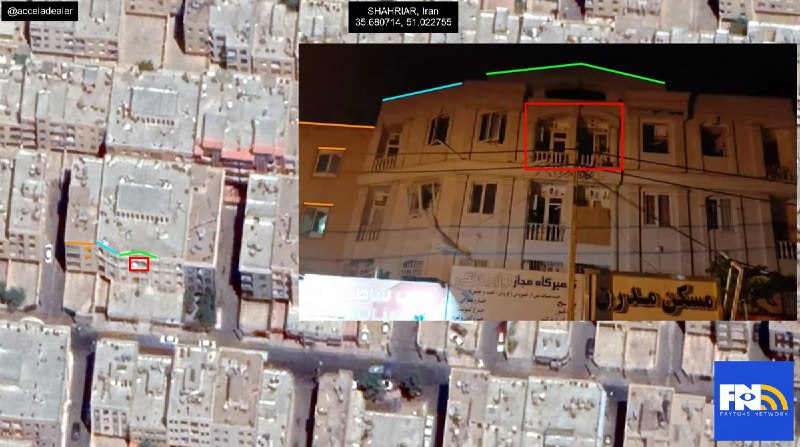

↩️ Quoted tweet:
acceladealer ✓ @acceladealer
Sun, 31 May 2026 19:44:43 UTC

Damage to building following explosion (claimed targeted assassination) in SHAHRIAR [شهريار], Iran

35.680714, 51.022755

@GeoConfirmed @EpicFuryMap @FaytuksNetwork

geolocated by @acceladealer

↩️ توییت نقل‌قول شده — برای پاسخ، پست زیر را ببینید.

فارسی

خسارت به ساختمان در پی انفجار (ادعای ترور هدفمند) در شهریار، ایران

۳۵.۶۸۰۷۱۴, ۵۱.۰۲۲۷۵۵

@GeoConfirmed @EpicFuryMap @FaytuksNetwork

تایید جغرافیایی توسط @acceladealer_

𝕏 · @shin_persian

## Shin_Persian — post 6339

Shin ✓ @hey_itsmyturn
Sun, 31 May 2026 20:12:22 UTC

Explosions in Erbil, Kurdistan Region, #Iraq 🇮🇶

فارسی

انفجارها در اربیل، اقلیم کردستان، #Iraq 🇮🇶

𝕏 · @shin_persian

## FarsiVOA — post 219223

🔺ترامپ: برخلاف ادعای سی‌‌‌ان‌ان «توافق هسته‌ای ایران» به‌روشنی می‌گوید که جمهوری اسلامی نباید سلاح هسته‌ای داشته باشد

▪️دونالد ترامپ، رئیس‌جمهوری آمریکا یک‌شنبه شب تاکید کرد که «توافق هسته‌ای ایران» به‌روشنی می‌گوید که جمهوری اسلامی ایران نباید سلاح هسته‌ای داشته باشد.

⬇️ بیشتر بخوانید:
https://ir.voanews.com/a/8155840.html
@FarsiVOA

## FarsiVOA — post 219222

⚡️عراق خواهان تداوم همکاری‌های مشترک استراتژیک با ایالات متحده آمریکا
@FarsiVOA

## FarsiVOA — post 219221

⚡️روز جهانی بدون دخانیات فرصتی است برای افزایش آگاهی درباره خطرات مصرف دخانیات و تأثیر آن بر سلامت افراد و جوامع. مصرف دخانیات هر سال جان میلیون‌ها نفر را در سراسر جهان می‌گیرد.
@FarsiVOA

## FarsiVOA — post 219220

⚡️مخالفت قاطع آمریکا با حضور هرگونه گروه وابسته به جمهوری اسلامی در دولت جدید عراق
@FarsiVOA

## FarsiVOA — post 219219

⚡️«تندروهای حکومتی» تعطیلی مجلس شورای اسلامی را تلاشی برای جلوگیری از تصویب قانون تنگه هرمز می‌دانند
@FarsiVOA

## FarsiVOA — post 219218

  

⚡️هم‌زمان با انتشار برخی گزارش‌ها از تلاش‌های جمهوری اسلامی برای دسترسی به سایت‌های زیرزمینی موشکی، وزارت امور خارجه اسرائيل با انتشار تصویر یک پرتابگر موشکی سوخته در حاشیه یک جاده، نوشت «لانچر‌های جمهوری اسلامی» نیروهای آمریکایی و اسرائيلی در طول عملیات مشترک اخیرشان پرتابگرهای موشکی بسیاری را در ایران نابود کردند. دونالد ترامپ، رئيس‌جمهوری آمریکا، پیشتر با اشاره به تلاش‌های جمهوری‌اسلامی برای دسترسی دوباره به مهماتی که بر اثر حملات آمریکا و اسرائيل از دسترسش خارج شده بود، گفته است که ایالات متحده فعالیت‌های رژیم در این باره را رصد می‌کند و می‌تواند آن تسلیحات را به‌سرعت نابود کند.
@FarsiVOA

## FarsiVOA — post 219217

  <a href="telegram/content/FarsiVOA_219217_1780271643.mp4" target="_blank">🎬 Download video</a>

⚡️ترامپ: برای توافق با جمهوری اسلامی عجله ندارم؛ واکنش قانوگذاران در کنگره
@FarsiVOA

## FarsiVOA — post 219216

  

⚡️رسانه‌های جمهوری اسلامی وقوع دو انفجار را که تقریبا هم‌زمان در تهران و کرمانشاه و در ساعات پایانی یکشنبه گزارش شد به نشت گاز نسبت دادند. سایت تسنیم، نزدیک به سپاه پاسداران اعلام کرد که در ساعات پایانی روز یکشنبه، «انفجار گاز» در محله باغ ابریشم کرمانشاه باعث مصدومیت ۲ نفر شد. این سایت‌ همچنین مدعی شد که انفجار در یک واحد مسکونی در «فاز یک اندیشه» در استان تهران ناشی از «نشت گاز» بوده است. خبرگزاری ایسنا به نقل از سخنگوی اورژانس استان تهران می‌گوید این انفجار تاکنون ۶ مصدوم بر جای گذاشته است.
@FarsiVOA

## FarsiVOA — post 219214

  <a href="https://t.me/farsivoa/219214" target="_blank">📎 Download file</a>

🔴📢‌ پادکست خبری یکشنبه ۱۰ خرداد ۱۴۰۵

🛜در صورتی که با مشکل اینترنت مواجه هستید میتوانید اخبار صدای آمریکا را از نسخه‌های پادکست خبری ما روزانه دنبال کنید و یا اخبار را از نسخه سبک وب‌سایت ما پیگیر باشید:
https://ir.voanews.com/lite

📡بروزترین فرکانسهای ماهواره‌ای را نیز میتوانید از صفحه زیر پیگیری کنید:
https://ir.voanews.com/satellite

🔔دیگر شبکه‌های اجتماعی ما هم دنبال کنید:
https://linktr.ee/voafarsi

ما را به اشتراک بگذارید
@farsivoa

## FarsiVOA — post 219213

🔺ادامه راکت‌پرانی‌های حزب‌الله به شمال اسرائيل هم‌زمان با تلاش‌های دولت لبنان برای ادامه مذاکرات صلح

▪️رسانه‌های اسرائیلی از ادامه حملات راکتی گروه تروریستی حزب‌الله به شمال اسرائيل خبر می‌دهند.

⬇️ بیشتر بخوانید:
https://ir.voanews.com/a/8155833.html
@FarsiVOA

## FarsiVOA — post 219212

  

⚡️مایک والتز، سفیر آمریکا در سازمان ملل متحد، در واکنش به پستی در شبکه اجتماعی ایکس که به نقل از اسکات بسنت، وزیر خزانه‌داری آمریکا، نوشته بود حملات جمهوری اسلامی به کشورهای جنوب خلیج فارس باعث شده این کشورها در شناسایی و مسدود کردن دارایی‌های تهران در بانک‌های خود با واشنگتن همکاری کنند، گفت بله، جمهوری اسلامی «اشتباه بزرگی» مرتکب شد و تا آینده قابل پیش‌بینی، بهای آن را خواهد پرداخت.
@FarsiVOA

## FarsiVOA — post 219211

  <a href="telegram/content/FarsiVOA_219211_1780271646.mp4" target="_blank">🎬 Download video</a>

⚡️بازنشستگان ایرانی زیر فشار تورم ساختاری؛ گفت‌وگو با رضا غیبی
@FarsiVOA

## FarsiVOA — post 219210

⚡️در سایه بحران دارو و معیشت در ایران؛ دغدغه روزنامه کیهان لبنان است
@FarsiVOA

## Persian_Trend_Official — post 15418

شبتون بخیر ❤️🌙

📝 Nick

📌 @persian_trend_official
پرشین ترند | متفاوت‌ترین کانال نظامی

## RadioFarda — post 157753

  <a href="https://t.me/radiofarda/157753" target="_blank">📎 Download file</a>

📻بشنوید: سرخط خبرهای نیمه‌شب با رادیوفردا، یازده خرداد ۱۴۰۵‌

@RadioFarda

## IranianMinds — post 21165

  <a href="telegram/content/IranianMinds_21165_1780271648.mp4" target="_blank">🎬 Download video</a>

⚫️ در شب ۹ اسفند احمدرضا و امیرحسین فیضی، دو برادر ۱۵ و ۱۹ ساله، فقط به‌ خاطر اینکه با شنیدن خبر مرگ خامنه‌ای بوق زدن و شادی کردن، توسط نیروهای نظامی به رگبار بسته شدن و کشته شدن.

@IranianMinds

## IranianMinds — post 21164

  <a href="telegram/content/IranianMinds_21164_1780271651.mp4" target="_blank">🎬 Download video</a>

بچه ها اسم این بازی عبور مرغ از خیابون  هست ویدئو نگاه کنید خیلی راحت 8 میلیون ازش سود گرفتیم😍

😤اگ توم دوس داری خیلی راحت از بازی های انلاین پول در بیاری حتما عضو کازینو شبانه شو
✅

توی کازینو شبانه بهت اموزش میدیم از بازی های انلاین پول دربیاری👌

کانال کازینو شبانه راهی برای چند برابر کردن سرمایت 🤷‍♂

کسب درامد انلاین با یه ادم حرفه ای یاد بگیر و‌ پول دربیار 
💵

🎯همین حالا عضو شو و شروع کن👇e10
https://t.me/+6ckCmywafrxiYzk0
https://t.me/+6ckCmywafrxiYzk0

## IranianMinds — post 21163

  

رژه روز اسرائیل در نیویورک.

@IranianMinds

## IranianMinds — post 21162

  <a href="telegram/content/IranianMinds_21162_1780271655.mp4" target="_blank">🎬 Download video</a>

حسین طاهری، مداح:

اگر مذاکره می‌کنید، اگر توافق می‌کنید، اگر جنگ هست ، به ما نتیجشو بگید که ما حداقل تکلیف خودمونو توی خیابونا بدونیم.

@IranianMinds

## BBCPersian — post 282518

  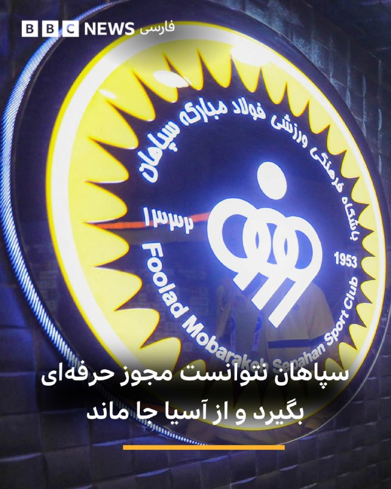

‌ ‌ ‌
بنابر گزارش رسانه‌های ایران باشگاه سپاهان اصفهان موفق به کسب مجوز حرفه‌ای مورد نظر برای شرکت در لیگ دو مسابقات باشگاه‌های آسیا نشد و نمی‌تواند در فصل آینده این مسابقات حضور یابد.

درخواست کسب مجوز حرفه‌ای توسط این باشگاه پیش‌تر رد شده بود اما سپاهان با شکایت به کمیته استیناف منتظر نظر نهایی بود. روز یکشنبه رسانه‌های ایران از رد درخواست زردپوشان در کمیته استیاف خبر دادند که به معنی حذف سپاهان از امکان حضور در مسابقات آسیایی امسال است.

پیش از این تراکتور و استقلال به عنوان نمایندگان ایران در لیگ سطح یک نخبگان آسیا معرفی شده بودند.

اکنون با کنار رفتن سپاهان، تیم‌های رده چهارم و پس از آن شانس حضور در این مسابقات را خواهند داشت.

گل گهر سیرجان هم اکنون در رتبه چهارم جدول لیگ برتر تعطیل مانده ایران است که در صورت کسب مجوز حرفه‌ای خواهد توانست جایگزین سپاهان شود.

پس از این تیم چادرملو اردکان و پرسپولیس تهران در رتبه‌های پنجم و ششم جدول قرار دارند.

https://trib.al/7i82t6A
📷 Reuters
@BBCPersian

## BBCPersian — post 282517

  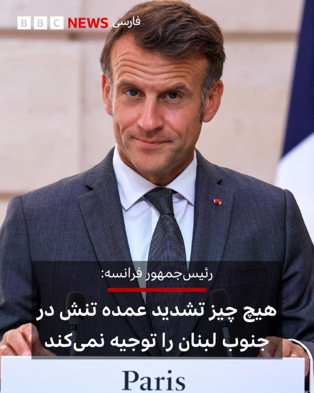

‌ ‌ ‌ ‌
امانوئل مکرون، رئیس‌جمهور فرانسه، روز یکشنبه گفت که «هیچ چیز تشدید عمده تنش در جنوب لبنان را توجیه نمی‌کند».

این اظهارات آقای مکرون بعد از آن بیان شد که نیروهای اسرائیلی حمله جدیدی را به جنوب لبنان آغاز کردند.

پس از تصرف قلعه تاریخی شقیف (بوفور)، توسط نیروهای اسرائیلی شورای امنیت سازمان ملل متحد روز دوشنبه به درخواست فرانسه جلسه اضطراری برگزار خواهد کرد.

آقای مکرون همچنین پس از صحبت با رهبران منطقه‌ای در پیامی در شبکه اجتماعی ایکس گفت که دستیابی سریع به توافق بین ایالات متحده و ایران «ضروری» است.

رئیس جمهور فرانسه با محمد بن سلمان، ولیعهد عربستان سعودی، هیثم بن طارق، سلطان عمان، محمد بن زاید، رئیس امارات متحده عربی و عبدالفتاح سیسی، همتای مصری خود گفتگو کرد.

📷Reuters
@BBCPersian

## BBCPersian — post 282516

  <a href="telegram/content/BBCPersian_282516_1780271659.mp4" target="_blank">🎬 Download video</a>

‌ ‌ ‌ ‌
در ماه‌های اخیر گزارش‌های متعددی از کمبود دارو در ایران منتشر شده است. به گفته وحید شریعت، رئیس انجمن روانپزشکی ایران، داروهای حیاتی روانپزشکی از جمله داروهای مرتبط با افسردگی، دوقطبی و اسکیزوفرنی با کمبود مواجه شده‌اند و در صورت ادامه روند فعلی، این وضعیت می‌تواند در ماه‌های آینده تشدید شود.

دکتر کیانا کثیری در برنامه رادیویی جام جهان‌نمای بی‌بی‌سی فارسی درباره پیامدهای خطرناک کمبود داروهای روانپزشکی گفت.

@BBCPersian

## BBCPersian — post 282515

  <a href="https://t.me/bbcpersian/282515" target="_blank">📎 Download file</a>

پادکست برنامه شصت دقیقه یکشنبه ۱۰ خرداد ۱۴۰۵

این نسخه رادیویی برنامه شصت دقیقه تلویزیون فارسی بی‌بی‌سی است که هرشب بعد از پخش، با حجم کم از اپلیکیشن‌های پادگیر و صفحه تلگرام بی‌بی‌سی فارسی در دسترس است.

با هشتگ BBCPersianRadio# با ما در ارتباط باشید

@BBCPersian

## BBCPersian — post 282514

  

‌ ‌ ‌
چند مقام دولتی در ایران از جمله سخنگوی دولت این کشور با تکذیب شایعه استعفای مسعود پزشکیان، آن را «خبر کذب با هدف ایجاد ناامیدی» خواندند.

فاطمه مهاجرانی، سخنگوی دولت، الیاس حضرتی و علی احمدنیا که از اعضای شورای اطلاع رسانی دولت آقای پزشکیان هستند در پست‌های جداگانه به ادامه کار رئیس جمهوری و تلاش او برای «حل مسائل کشور» اشاره کرده‌اند.

در همین حال، خبرگزاری‌های رسمی ایران، روز یکشنبه چند گزارش‌ تصویری از حضور و سخنرانی آقای پزشکیان در رویدادهای مختلف داخلی منتشر کردند از جمله گفتگوی او با خبرنگاران درباره جام جهانی ۲۰۲۶.

https://trib.al/MvkvAGi
📷omidradio
@BBCPersian

## BBCPersian — post 282513

  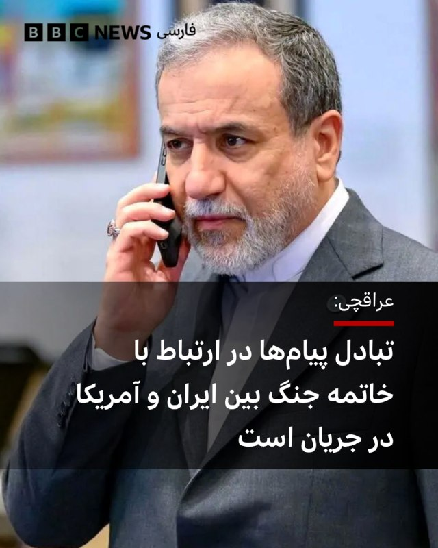

‌ ‌ ‌ ‌
عباس عراقچی، وزیر امور خارجه ایران گفته است که گفت‌وگوها و تبادل پیام‌ها بین ایران و آمریکا برای خاتمه جنگ همچنان در جریان است و تا زمانی که به نتیجه مشخصی نرسد، نمی‌توان درباره آن قضاوت کرد.

او در گفت‌وگو با خبرگزاری صدا و سیما با اشاره به ادامه تبادل پیام‌ها بین ایران و آمریکا برای خاتمه جنگ با میانجی گری پاکستان، گفته است تا زمانی که این اقدامات به نتیجه خاصی نرسد، گمانه‌زنی‌های مطرح‌شده در این زمینه فاقد اهمیت است.

او افزود: همه آنچه در حال حاضر درباره مذاکرات در رسانه ها مطرح می‌شود، در حد گمانه‌زنی است و به نظر من نباید به این گمانه‌زنی‌ها اهمیت داده شود تا وقتی موضوعات به مرحله قطعیت برسد.

https://trib.al/c8Cs9MF
📷eghtesadnews
@BBCPersian

## Dirty_Kids — post 390705

  <a href="telegram/content/Dirty_Kids_390705_1780271664.webm" target="_blank">🎬 Download video</a>

☢️خفن ترین و‌ قدیمی ترین  انالیزور  ایران ینی دکتر بت 
👍 
🔴مسابقات جذاب جام جهانی به زودی شروع میشه بیا توی کانال دکتر بت و باهاش همراه شو و پول در بیار
💵 رایگان بهترین شرط هارو براتون میذاره حتی هزار تومن هم دریافت نمیکنه روزانه میتونی از پیش بینی فوتبال باهاش…

## Dirty_Kids — post 390704

  <a href="telegram/content/Dirty_Kids_390704_1780271665.webm" target="_blank">🎬 Download video</a>

☢️خفن ترین و‌ قدیمی ترین  انالیزور  ایران ینی دکتر بت 
👍

🔴مسابقات جذاب جام جهانی به زودی شروع میشه بیا توی کانال دکتر بت و باهاش همراه شو و پول در بیار
💵

رایگان بهترین شرط هارو براتون میذاره
حتی هزار تومن هم دریافت نمیکنه
روزانه میتونی از پیش بینی فوتبال باهاش پول در بیاری 👌
A10

🌟اگ اهل پیش بینی فوتبالی این کانال اصلا از دست ندین
👇

✅https://t.me/+4_ADqwB9e-QwYjlk

✅https://t.me/+4_ADqwB9e-QwYjlk

## Dirty_Kids — post 390703

  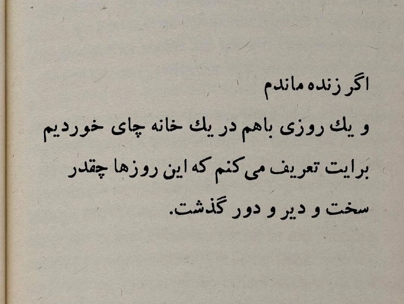

#بخوابیم

@Dirty_Kids 👻

## Dirty_Kids — post 390701

اون مار از منی که تو ایران با وجود جمهوری‌اسلامی زندگی میکنم خوشبخت‌تره

@Dirty_Kids 👻

## Dirty_Kids — post 390700

  <a href="telegram/content/Dirty_Kids_390700_1780271666.mp4" target="_blank">🎬 Download video</a>

این ویدیو برای شروع جام‌جهانی خیلی وایرال شده که میپرسه کدوم تیم قهرمان جام‌جهانی میشه؟ 🏆

@Dirty_Kids 👻

## Dirty_Kids — post 390699

  <a href="telegram/content/Dirty_Kids_390699_1780271669.mp4" target="_blank">🎬 Download video</a>

بهروز رهبری‌فر در این ویدیو می‌گه «چون علی خامنه‌ای کشته شده و من خودمو فرزند او می‌دونم پس من الان فرزند شهیدم!‌»

@Dirty_Kids 👻

## Dirty_Kids — post 390698

  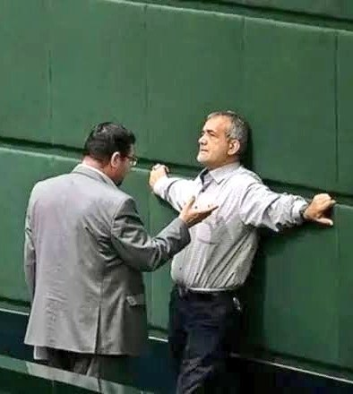

‏+ مسعود لج نکن بیا بریم کار داریم
- من سوار هلیکوپتر نمیشم
+ هلیکوپتر کدومه دکتر؟!
- من استخر هم نمیام
+ لابد تو‌ حموم واجبی هم نمیزنی؟

@Dirty_Kids 👻

## Dirty_Kids — post 390697

  

فاکس هم تاید کرد پزشکیان استعفا داده
نمیدونم چرا این خبر ذره‌ای بکیرم نیست
چون ما میدونستیم رییس جمهور در جمهوری اسلامی دلقکی بیش نیست

@Dirty_Kids 👻

## Dirty_Kids — post 390691

‏ملت ورداشتن عکسای این چادری کافه‌ایارو بی‌حجاب کردن دارن پخش میکنن 😂😂😂

@Dirty_Kids 👻

## Dirty_Kids — post 390690

تسنیم استعفای پزشکیان رو تکذیب کرد
تسنیم خبر مرگ لاریجانی رو هم تکذیب کرد
تسنیم خبر مرگ تنگسیری رو هم تکذیب کرد
تو فقط تکذیب کن:)))

تو جمهوری‌اسلامی رسمه که هر وقت میخوان یک خبر یا اتفاقی رو آروم آروم به مردم بگن، اول میدن به تسنیم تکذیبش کنه.

@Dirty_Kids 👻

## Dirty_Kids — post 390688

استفاده خوب و درست از هوش مصنوعی

@Dirty_Kids 👻

## Dirty_Kids — post 390687

  <a href="telegram/content/Dirty_Kids_390687_1780271672.mp4" target="_blank">🎬 Download video</a>

🔴حسین طاهری، مداح :
اگه دارین مذاکره می‌کنید به ماهم بگین که حداقل تکلیف خودمونو تو این دورهم جمع شدنایِ شبانه بدونیم.

@Dirty_Kids 👻

## Dirty_Kids — post 390686

🔴 ایران اینترنشنال: مسعود پزشکیان بخاطر ورود سپاه به تمامی مسائل کشور و دخالت در کارای دولت نامه استعفا خودشو به مجتبی خامنه‌ای تحویل داد. @Dirty_Kids 👻

## alonews — post 124067

  <a href="telegram/content/alonews_124067_1780271674.webm" target="_blank">🎬 Download video</a>

👈خبرگزاری ‌CNN اعلام کرد که ایران اکنون 50 ورودی از 69 ورودی تونلی را که توسط ایالات متحده آمریکا و اسرائیل در 18 تأسیسات موشکی زیرزمینی مورد اصابت قرار گرفته بود، باز کرده است

🔴تصویر متعلق به یک پایگاه موشکی در دزفول است که چهار ورودی از پنج ورودی آن باز شده است

✅ @AloNews خبر جنگ

## alonews — post 124065

  <a href="telegram/content/alonews_124065_1780271675.webm" target="_blank">🎬 Download video</a>

👈رژه روز اسرائیل در نیویورک

✅ @AloNews خبر جنگ

## alonews — post 124064

  <a href="telegram/content/alonews_124064_1780271675.mp4" target="_blank">🎬 Download video</a>

این 2 دقیقه رو حتما یه جا سیو کنین و یا بفرستین پیوی رفیقتون که گمش نکنین! هر بار این کلیپ رو باز کنین مو به تنتون سیخ میشه که طی این چند سال چه اتفاقی افتاده!

[@AloTweet]

## alonews — post 124063

  <a href="telegram/content/alonews_124063_1780271676.mp4" target="_blank">🎬 Download video</a>

🔴مسعود پیاهو، کسی که ویدیوی مرد نشسته مقابل موتوسواران یگان‌ویژه در خیابان جمهوری تهران را منتشر کرد، به ۱۰ سال زندان محکوم شد.

🔴ویدیوی این مرد که در دومین روز اعتراضات دی‌ماه ۱۴۰۴ منتشر شد، به سرعت وایرال و به یکی از نمادهای اعتراضات تبدیل شد.

🤔دم از عدل علی میزنن ولی به معاویه گفتن زکی

✅@AloNews

## alonews — post 124062

  

🔴 حمله شدید عارف غلامی، بازیکن استقلال به محمدحسین میثاقی
@AloSport

## alonews — post 124061

  <a href="telegram/content/alonews_124061_1780271679.webm" target="_blank">🎬 Download video</a>

👈نبیه بری، رئیس مجلس لبنان : اعلام کرده که خلع سلاح حزب‌الله را تضمین می‌کند و قول آن را می‌دهد اگر اسرائیلی‌ها حملاتشان را متوقف کنند.

✅ @AloNews خبر جنگ

## alonews — post 124060

  <a href="telegram/content/alonews_124060_1780271680.webm" target="_blank">🎬 Download video</a>

👈اوکراین تعدادی پهپاد انتحاری به سمت روسیه پرتاب کرد

✅ @AloNews خبر جنگ

## alonews — post 124059

  <a href="telegram/content/alonews_124059_1780271680.webm" target="_blank">🎬 Download video</a>

👈مرندی: اگر نتانیاهو در جنوب لبنان متوقف نشود، اقتصاد آمریکا در ماه ژوئن فرو می‌پاشد، زمان در حال تمام شدن است!

✅ @AloNews خبر جنگ

## alonews — post 124058

  <a href="telegram/content/alonews_124058_1780271680.webm" target="_blank">🎬 Download video</a>

👈شبکه خبری المیادین گزارش داد صدای چند انفجار در مرکز منطقه کردستان عراق شنیده شده است.

🔴هنوز علت انفجارها مشخص نیست

✅ @AloNews خبر جنگ

## alonews — post 124057

  <a href="telegram/content/alonews_124057_1780271681.webm" target="_blank">🎬 Download video</a>

👈تانکرترکرز: چهار نفتکش ایرانی با محموله ۷ میلیون بشکه‌ای ظاهراً به ایران بازگردانده شدند

🔴 بر اساس یک تحلیل تصویری، ۴ نفتکش شرکت ملی نفتکش ایران با مجموع ۷ میلیون بشکه نفت خام در ۲ تا ۳ روز گذشته ظاهراً برای خروج از آب‌های ایران حرکت کرده‌اند، اما به احتمال زیاد مسیرشان تغییر کرده و به داخل بازگشته‌اند.

✅ @AloNews خبر جنگ

## alonews — post 124056

  <a href="telegram/content/alonews_124056_1780271681.webm" target="_blank">🎬 Download video</a>

👈انفجار گاز در مجتمع مسکونی فاز یک اندیشه با ۴ مصدوم؛ احتمال افزایش مصدومان

✅ @AloNews خبر جنگ

## alonews — post 124055

  <a href="telegram/content/alonews_124055_1780271681.webm" target="_blank">🎬 Download video</a>

👈ماکرون: ایران و آمریکا باید فورا به توافق برسند!

✅ @AloNews خبر جنگ

## alonews — post 124054

  <a href="telegram/content/alonews_124054_1780271681.webm" target="_blank">🎬 Download video</a>

👈بلومبرگ: سه ماه پس از آغاز جنگ ایران، تقریباً غیرممکن شده است که روحیه صعودی که بازارهای جهانی را برای دارایی‌های پرریسک هدایت می‌کند، کاهش یابد

✅ @AloNews خبر جنگ

## alonews — post 124053

  <a href="telegram/content/alonews_124053_1780271682.webm" target="_blank">🎬 Download video</a>

👈فعالیت تانکر های سوخت رسان آمریکایی در خلیج فارس

🔴همچنین آواکس E3 نیز بلند شده است

✅ @AloNews خبر جنگ

## alonews — post 124052

  <a href="telegram/content/alonews_124052_1780271682.webm" target="_blank">🎬 Download video</a>

👈وزیر خارجه آلمان: پیشروی مداوم ارتش اسرائیل در جنوب لبنان نگرانی عمیقی ایجاد کرده است

✅ @AloNews خبر جنگ

## alonews — post 124051

  <a href="telegram/content/alonews_124051_1780271683.webm" target="_blank">🎬 Download video</a>

👈سخنگوی کمیسیون امنیت ملی: به ساعت صفر برسیم حتما نظامیان ما اقدام خواهند کرد!

✅ @AloNews خبر جنگ

---
📅 بروزرسانی: 1405/03/10 23:28
---

## VahidOOnLine — post 243109

  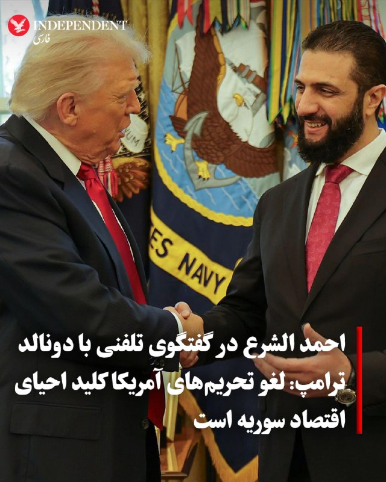

♦️احمد الشرع، رئیس‌جمهوری سوریه، روز یکشنبه دهم خرداد ماه، در تماس تلفنی با دونالد ترامپ، رئیس‌جمهوری آمریکا، درباره روابط دوجانبه، آخرین تحولات سیاسی و امنیتی منطقه و راه‌های تقویت همکاری‌های مشترک گفتگو کرد.
بر اساس بیانیه دفتر ریاست‌جمهوری سوریه، دو طرف در این تماس راه‌های حمایت از ثبات سوریه و کمک به روند بهبود اقتصادی این کشور در مرحله پیش رو را مورد بررسی قرار دادند.
احمد الشرع در این گفتگو بر اهمیت تداوم حمایت‌های بین‌المللی از سوریه در دوره بازسازی و احیای کشور تاکید کرد و گفت لغو تحریم‌های باقی‌مانده آمریکا علیه سوریه گامی اساسی برای احیای اقتصاد، جذب سرمایه‌گذاری و بهبود شرایط معیشتی شهروندان سوری است.
دفتر ریاست‌جمهوری سوریه همچنین اعلام کرد در این تماس تلفنی، آخرین تحولات منطقه‌ای و «مسائل مورد اهتمام مشترک دو کشور» نیز مورد بحث و تبادل نظر قرار گرفت.
‌🇸🇦 Indypersian

🤖 @VahidOOnLine

## VahidOOnLine — post 243108

  

خبرگزاری تسنیم، وابسته به سپاه، به نقل از «یک منبع مطلع» درباره روند مذاکرات نوشت: ملاک برای جمهوری اسلامی متنی است که خودمان قبول داشته باشیم و اعمال اصلاحیه از سوی ترامپ به معنای پذیرش آن از طرف ما نیست.

تسنیم افزود جمهوری اسلامی برای «وضعیت عدم تفاهم» نیز کاملا آمادگی دارد.
‌🏁 🇬🇧 IranintlTV

🤖 @VahidOOnLine

## VahidOOnLine — post 243107

  

♦️خبرگزاری حکومتی تسنیم، شامگاه یکشنبه دهم خرداد ماه، به نقل از یک «منبع مطلع» گزارش داد در پی پیشنهاد اصلاحیه‌های جدید از سوی دونالد ترامپ به متن تفاهم احتمالی میان تهران و واشنگتن، ایران نیز اصلاحیه‌های خود را بر متن اعمال خواهد کرد.
این منبع با اشاره به گزارش رسانه‌های آمریکایی درباره تغییرات پیشنهادی رئیس‌جمهوری آمریکا به تسنیم گفت: «تبادل متن‌ها همچنان ادامه دارد و ایران نیز قاعدتا اصلاحیه‌های خود را درباره متن اعمال خواهد کرد و هنوز هیچ چیز نهایی نیست.»
خبرگزاری تسنیم که به عنوان منبعی برای بازتاب دیدگاه‌ه هسته‌های نزدیک به قدرت در ایران شناخته می‌شود، به نقل از این منبع آگاه تاکید کرد: «ملاک برای ایران متنی است که خودمان آن را قبول داشته باشیم و اعمال اصلاحیه از سوی ترامپ به معنای پذیرش آن از جانب ایران نیست.»
این منبع مطلع همچنین تصریح کرد: «ایران برای وضعیت عدم تفاهم نیز کاملا آمادگی دارد.»
‌🇸🇦 Indypersian

🤖 @VahidOOnLine

## VahidOOnLine — post 243106

  <a href="telegram/content/VahidOOnLine_243106_1780257515.mp4" target="_blank">🎬 Download video</a>

سخنان الهام‌بخش دکتر عزت‌الله همایونفر، ادیب و سیاست‌مداری که واژگانش، وطن را معنا می‌کردند. در روزگاری که صداقت در سیاست نایاب بود، او ایستاد؛ با فرهنگ، با قلم، با شرف.
‌🏁 🇬🇧 ManotoTV

🤖 @VahidOOnLine

## VahidOOnLine — post 243096

  <a href="telegram/content/VahidOOnLine_243096_1780257516.mp4" target="_blank">🎬 Download video</a>

حذف احتمالی سردار آزمون از تیم ملی، فقط یک خبر ورزشی نیست.

این ماجرا دوباره پرسشی قدیمی را زنده می‌کند: در کشوری که سیاست و ورزش بارها به هم گره خورده‌اند، چه کسی حق دارد نماینده یک ملت باشد؟

از حمایت ورزشکاران از معترضان تا واکنش حکومت به صداهای مستقل، فوتبال ایران سال‌هاست فراتر از یک بازی است.

شاید امروز مهم‌ترین بحث فوتبال ایران نه ترکیب تیم ملی، بلکه معنای «تیم ملی» باشد. ورق بزنید.
‌🏁 🇬🇧 ManotoTV

🤖 @VahidOOnLine

## VahidOOnLine — post 243095

  

یدالله جوانی، معاون سیاسی سپاه پاسداران، گفت: «اعمال حاکمیت بر تنگه هرمز سلاحی راهبردی‌تر از تسلیحات اتمی است که ایران را قادر به تنبیه متجاوزان می‌کند.»

او با اشاره به جنگ میان جمهوری اسلامی، آمریکا و اسرائیل افزود: «این جنگ اجتناب‌ناپذیر بود و ما در وقوع آن غافلگیر نشدیم. همواره برای این رویارویی آماده می‌شدیم.»

معاون سیاسی سپاه پاسداران همچنین با اشاره به جنگ هشت‌ساله ایران و عراق گفت: «جنگ تحمیلی دوم و سوم نیز همان برکات را برای جامعه اسلامی ایران به همراه داشته است. ایران نه تنها در دفاع پیروز شد، بلکه از دل این جنگ، یک قدرت جهانی ظهور کرده است.»
‌🏁 🇬🇧 IranintlTV

🤖 @VahidOOnLine

## VahidOOnLine — post 243094

  <a href="telegram/content/VahidOOnLine_243094_1780257517.mp4" target="_blank">🎬 Download video</a>

♦️شهر هاربین، مرکز استان هیلونگ‌جیانگ در شمال شرقی چین، عصر روز یکشنبه دهم خرداد ماه، با طوفان تندری شدید و کم‌سابقه همراه با بادهای بسیار قدرتمند مواجه شد.
بر اساس گزارش‌ رسانه‌های محلی، سرعت تندبادها در برخی نقاط به ۳۷.۵ متر بر ثانیه رسید که موجب شکل‌گیری توده‌های گسترده گردوغبار در سطح شهر شد.
وزش شدید باد و گردوغبار ناشی از آن، دید افقی را به شدت کاهش داد و بخش‌هایی از هاربین را در تاریکی فرو برد. تصاویر منتشرشده در شبکه‌های اجتماعی، آسمان تیره و شرایط نامساعد جوی در این شهر را نشان می‌دهد.
‌🇸🇦 Indypersian

🤖 @VahidOOnLine

## VahidOOnLine — post 243093

  

♦️رسانه اسرائیل هیوم در گزارشی به نقل از مقام‌های پیشین و کنونی موساد، مدعی شده است که اعتراضات دی‌ماه ۱۴۰۴ که ابتدا از بازار تهران آغاز شد و به سرعت به دیگر شهرها گسترش یافت، زمان‌بندی برنامه‌ریزی‌شده برای حمله اسرائیل و آمریکا به ایران را تغییر داد و باعث شد این عملیات زودتر از موعد مورد نظر موساد آغاز شود.

بر اساس این گزارش، شاخه‌ای محرمانه در موساد که از سال ۲۰۲۱ برای «عملیات نفوذ» و جنگ روانی علیه جمهوری اسلامی ایجاد شده، پیش از آغاز جنگ، ماه مه ۲۰۲۶ (اردیبهشت/ خرداد ۱۴۰۵) را زمان آمادگی برای اقدام نظامی بعدی تعیین کرده بود. اما اعتراضات بازار تهران که به گفته این گزارش «از پایگاه اجتماعی سنتی حکومت» برخاست، معادلات را تغییر داد.

یک منبع آگاه به اسرائیل هیوم گفت که همین اعتراض‌ها به عاملی شتاب‌دهنده تبدیل شد و دونالد ترامپ را متقاعد کرد زودتر از آنچه موساد انتظار داشت وارد کارزار علیه ایران شود. به گفته او، «جنگ خیلی زود آغاز شد، چون پس از سرکوب خشونت‌بار اعتراض‌ها، هنوز سازوکار ترس مانع بازگشت مردم به خیابان بود.»
‌🇸🇦 Indypersian

🤖 @VahidOOnLine

## VahidOOnLine — post 243092

  

ایران‌اینترنشنال به اسناد و اطلاعاتی اختصاصی دست یافته است که نشان می‌دهند یک شرکت چینی با هماهنگی دولت این کشور و همچنین دو شرکت مستقر در ترکیه و امارات، در تامین مواد شیمیایی لازم برای ساخت موشک‌های بالستیک به سپاه پاسداران کمک می‌‌کند.

یک سند که گروه هکری پرانا به آن دست یافته و در اختیار ایران‌اینترنشنال قرار داده است، فاش می‌کند که چین نه‌تنها آشکارا به سپاه پاسداران در تامین این مواد کمک می‌کند، بلکه با کمک شبکه‌ای از شرکت‌ها تحریم‌های آمریکا علیه جمهوری اسلامی را هم دور می‌زند.

در این میان شرکت «هاوکان انرژی» نقش اصلی را ایفا می‌‌کند. این شرکت سال‌ها واسطه فروش نفت سپاه پاسداران به پالایشگاه‌های چینی بود و چهار سال پیش به دلیل تامین مالی نیروی قدس سپاه پاسداران از سوی ایالات متحده تحریم شد.

سال گذشته یک منبع مطلع به اینترنشنال گفته بود که این شرکت بیش از یک میلیارد دلار از پول نفت سپاه را بازنگردانده است.

ادامه این گزارش را در وبسایت ایران‌اینترنشنال بخوانید
‌🏁 🇬🇧 IranintlTV

🤖 @VahidOOnLine

## VahidOOnLine — post 243091

  <a href="telegram/content/VahidOOnLine_243091_1780257519.mp4" target="_blank">🎬 Download video</a>

♦️وزارت گردشگری و آثار باستانی مصر، روز یکشنبه دهم خرداد ماه، اعلام کرد یک هیئت باستان‌شناسی مصری موفق به کشف مجموعه‌ای از آثار تاریخی در محوطه گورستان «پانهسی» در منطقه المطریة واقع در عین‌شمس در شرق قاهره شده است.
بر اساس اعلام این وزارتخانه، این مجموعه شامل نخستین اثاثیه تدفینی تقریبا کامل کشف‌شده در این منطقه، به همراه تعدادی آثار نادر و چندین گوشواره فلزی است که احتمال می‌رود از طلا ساخته شده باشند.
مقام‌های مصری می‌گویند این کشف جدید می‌تواند به روشن شدن رازهای بیشتری از گورستان باستانی هلیوپولیس، یکی از مهم‌ترین مراکز مذهبی مصر باستان، کمک کند.
وزارت گردشگری و آثار باستانی مصر در بیانیه‌ای تاکید کرد این دستاورد نشان‌دهنده موفقیت ماموریت‌های باستان‌شناسی مصری در بازخوانی و تفسیر تاریخ فرهنگی هلیوپولیس است؛ شهری که از آن به عنوان یکی از قدیمی‌ترین و مهم‌ترین شهرهای مذهبی جهان باستان یاد می‌شود.
‌🇸🇦 Indypersian

🤖 @VahidOOnLine

## VahidOOnLine — post 243090

  

♦️خبرگزاری حکومتی تسنیم، روز یکشنبه دهم خرداد ماه، به نقل از یک منبع آگاه در دولت گزارش داد اخبار و شایعات منتشرشده درباره استعفای مسعود پزشکیان، رئیس‌جمهوری ایران، صحت ندارد.
این منبع آگاه تاکید کرد پزشکیان استعفایی نداده، امروز مشغول انجام امور و برنامه‌های کاری خود بوده و برنامه‌های آتی او نیز طبق روال برگزار خواهد شد.
تسنیم به نقل از این منبع نوشت، این اخبار با هدف «خبرسازی برای کسب اطلاعات امنیتی به نفع موساد و سیا و اختلاف‌افکنی و شکستن انسجام در ایران» منتشر می‌شود.
همزمان با انتشار این گزارش، رسانه‌های داخلی ایران تصاویری از حضور پزشکیان در مراسمی دولتی در شامگاه یکشنبه را منتشر کردند.
‌🇸🇦 Indypersian

🤖 @VahidOOnLine

## WithYashar — post 13103

  <a href="telegram/content/WithYashar_13103_1780257520.mp4" target="_blank">🎬 Download video</a>

🎬 Video

## WithYashar — post 13102

پدافند قم فعال شد 🚨
@withyashar

## WithYashar — post 13101

  <a href="telegram/content/WithYashar_13101_1780257521.mp4" target="_blank">🎬 Download video</a>

انفجار در فاز یک اندیشه شهریار خیابان شیشم شرقی در یک ساختمان که چندین مصدوم داشته
@withyashar

## WithYashar — post 13100

تسنیم : ایران تغییرات بیشتری در یادداشت تفاهم ایجاد خواهد کرد. اینکه ترامپ در حال ایجاد تغییراتی در این یادداشت تفاهم است، به این معنی نیست که این تغییرات برای ما قابل قبول است. ایران کاملاً برای شرایطی که هیچ توافقی حاصل نشود، آماده است.
@withyashar

## WithYashar — post 13099

حمله به کشتی حامل مس در تنگه هرمز

در پی درگیری‌های اخیر در تنگه هرمز، یک کشتی خارجی که حامل مس بود، مورد هدف قرار گرفت
@withyashar

## WithYashar — post 13098

  <a href="telegram/content/WithYashar_13098_1780257522.mp4" target="_blank">🎬 Download video</a>

تردد خودرو های منطقه آزاد در سراسر کشور آزاد است
@withyashar

## WithYashar — post 13097

  <a href="telegram/content/WithYashar_13097_1780257523.mp4" target="_blank">🎬 Download video</a>

اسکات بسنت، وزیر خزانه‌داری ایالات متحده:

اشتباه بزرگی که ایرانی‌ها مرتکب شدند حمله به همسایگانشان در شورای همکاری خلیج فارس، همسایگانشان در خلیج فارس بود، زیرا ما متحدان بسیار خوبی داشتیم که شاید در مورد پول با ما کاملاً شفاف نبودند، پول ایران که در سیستم‌های بانکی آنها بود، ناگهان بسیار مطیع شدند و حاضر شدند حساب‌ها را تحویل دهند یا به ما در مسدود کردن حساب‌ها کمک کنند.
@withyashar

## WithYashar — post 13096

کانال ۱۵ اسرائیل: گسترش عملیات اسرائیل در لبنان با هماهنگی دولت آمریکا انجام شد.
@withyashar

## WithYashar — post 13095

جروزالم پست: منابع به واشنگتن پست مدعی شدند که مجتبی خامنه‌ای، رهبر ایران، هنوز به آخرین پیشنهادات ایالات متحده، از جمله تفاهم‌ نامه‌ای که در جریان مذاکرات اخیر مورد توافق قرار گرفت، پاسخی نداده است.
@withyashar

## WithYashar — post 13094

عراقچی: ویزای تیم ملی فوتبال ظرف یک تا دو روز آینده صادر می‌شود
@withyashar

## WithYashar — post 13093

  <a href="telegram/content/WithYashar_13093_1780257525.mp4" target="_blank">🎬 Download video</a>

شاهزاده رضا پهلوی:

آنها در تلاشند تا قانون شریعت را نه در دمشق یا تهران، بلکه در خیابان‌های بلژیک، خیابان‌های پاریس، خیابان‌های لندن تحمیل کنند.

تا چه حد اجازه می‌دهید این رادیکالیسم ادامه یابد؟ این تهدیدی مستقیم برای ثبات و جمعیت‌شناسی اروپا است!
@withyashar

## WithYashar — post 13092

منابع اسرائیلی:ترامپ در تماس تلفنی آخر خود با بنیامین نتانیاهو اعلام کرد که در صورت همکاری با واشنگتن برای این تفاهم‌ نامه 60 روزه موقت اسرائیل کاملا در لبنان و غزه آزادی عمل خواهد داشت
@withyashar

## WithYashar — post 13091

به گزارش رسانه‌های محلی، فعالیت جت‌های جنگنده بر فراز کرج در استان البرز گزارش شده است.
@withyashar

## WithYashar — post 13090

صبح امروز سپاه اعلام کرده یک پهپاد MQ-1 را در نزدیکی جزیره قشم سرنگون کرده است. هرچند اسرائیل یا آمریکا این موضوع را تأیید نکرده‌اند، اما چند ساعت بعد یک حمله در همان منطقه انجام شده است. منابع می‌گویند در این حمله، «محسن سپاسیان» (مسئول تدارکات سپاه هوافضا در استان) و «ستوان سینا نجارپور» کشته شده‌اند. تاکنون هیچ طرفی مسئولیت حمله را بر عهده نگرفته است و این خبر را تایید نکرده است
@withyashar

## WithYashar — post 13089

## WithYashar — post 13088

زرشکیان قهر کرد ! اینترنشنال: مسعود پزشکیان با ارسال نامه‌ای به دفتر مجتبی خامنه‌ای خواهان استعفا از سمت خودش شده. @withyashar

## WithYashar — post 13087

## WithYashar — post 13086

## WithYashar — post 13085

مشکلش چیه اصلا همین امشب باشه چه بهتر! هرچه زودتر بهتر اصلا! خیلی زودتر از اینا حتییییی🫠🫠🫠

## WithYashar — post 13084

و اینکه لطفا خودت هم یه پست بذار ما شاهزاده رو تگ کنیم

## mwarmonitor — post 9957

🔴مجری (سی‌ان‌ان): اکنون باراک راوید، تحلیل‌گر امور جهانی و سیاسی سی‌ان‌ان و خبرنگار اکسیوس به ما ملحق شده است. باراک، همیشه از حضور شما در اینجا خوشحالیم. ما چند روزی است که در یک وضعیت انتظار و بلاتکلیفی به سر می‌بریم. شما موقعیت فعلی ما را در این لحظه چگونه…

## mwarmonitor — post 9956

🔴مجری (سی‌ان‌ان):
اکنون باراک راوید، تحلیل‌گر امور جهانی و سیاسی سی‌ان‌ان و خبرنگار اکسیوس به ما ملحق شده است. باراک، همیشه از حضور شما در اینجا خوشحالیم. ما چند روزی است که در یک وضعیت انتظار و بلاتکلیفی به سر می‌بریم. شما موقعیت فعلی ما را در این لحظه چگونه توصیف می‌کنید؟
🔵باراک راوید:
خب، فکر می‌کنم ما در آخرین لحظات این مذاکرات قرار داریم، یا حداقل در لحظاتی که پتانسیل این را دارند که آخرین لحظات باشند. من فکر می‌کنم هر دو طرف این موضوع را تایید و اعتراف می‌کنند؛ و این را هم از مقامات آمریکایی، هم از میانجی‌ها و هم از خود ایرانی‌ها می‌شنوم که همین موضوع را به رسانه‌های دولتی خود نیز می‌گویند؛ اینکه طرفین بسیار به یک توافق نزدیک هستند. و همیشه در لحظات پایانی مذاکرات، هر طرف تلاش می‌کند تا به آخرین دستاورد و پیروزی نهایی خود دست یابد. و من فکر می‌کنم در حال حاضر در چنین وضعیتی هستیم.
🔴مجری:
بله، و وزیر دفاع نیز اعلام کرده که ایالات متحده در صورت لزوم آماده است تا نبرد را [در خلیج فارس] از سر بگیرد. اما ارزیابی شما از تمایل رئیس‌جمهور برای گام برداشتن در این مسیر چیست؟
🔵باراک راوید:
خب، این قطعا یک گزینه است و من فکر نمی‌کنم ترامپ آن را نادیده گرفته باشد. اما در حال حاضر، برداشت من از گفتگو با افراد نزدیک به رئیس‌جمهور این است که موضوع اصلی که پرزیدنت ترامپ می‌خواهد در کوتاه‌مدت حل کند، مسئله تنگه هرمز است. و یکی از مواردی که به رئیس‌جمهور گفته شده، از جمله در جلسات اتاق وضعیت (Situation Room)، این است که اگر او توافق را نپذیرد و جنگ دوباره از سر گرفته شود، این به معنای سناریوی بسته ماندن تنگه هرمز برای ۶ تا ۱۲ ماه دیگر خواهد بود؛ با تمام پیامدهایی که برای اقتصاد جهانی و اقتصاد ایالات متحده به همراه دارد. و من فکر می‌کنم این چیزی است که پرزیدنت ترامپ می‌خواهد آن را حل کند و فکر می‌کنم این یکی از ملاحظات اصلی او در بررسی این توافق در حال حاضر است.
🔴مجری:
ارتش اسرائیل نیز درباره شدت گرفتن درگیری‌ها با حزب‌الله در لبنان هشدار می‌دهد. درگیری‌ها میان اسرائیل و حزب‌الله پس از ترور رهبر عالی ایران از سر گرفته شد. این یک جبهه دوم است، اما یک درگیری مرتبط با تمام این قضایا به شمار می‌رود. این موضوع چگونه بر این مذاکرات میان آمریکا و ایران تاثیر می‌گذارد؟
🔵باراک راوید:
در مورد ایرانی‌ها، آن‌ها تلاش می‌کنند تا به نوعی این دو درگیری را به هم پیوند بزنند و مطمئن شوند که اگر با آمریکا به توافقی دست یابند، یکی از نتایج آن این باشد که اسرائیل مجبور شود حملات خود علیه حزب‌الله را متوقف کند. فکر می‌کنم در حال حاضر، با توجه به شکلی که پیش‌نویس توافق دارد، به احتمال زیاد ایرانی‌ها قرار است حداقل...

@mwarmonitor

## mwarmonitor — post 9955

  <a href="telegram/content/mwarmonitor_9955_1780257526.mp4" target="_blank">🎬 Download video</a>

🎬 Video

## mwarmonitor — post 9954

🔴مجری ؛ «یک دقیقه زمان داریم و می‌خواهم از شما بپرسم که چقدر به کسانی که در حال حاضر به رئیس‌جمهور مشاوره می‌دهند اعتماد دارید؟ حدس می‌زنم برخی از مهره‌های اصلی را می‌شناسید، چه استیو وین باشد، چه جرد کوشنر؛ شما در گذشته با آن‌ها تعامل داشته‌اید. آیا مطمئن هستید که آن‌ها از دانش استراتژیک یا درک کافی برای بهبود وضعیتی که در حال حاضر وجود دارد، برخوردارند؟»
🔵 جان بولتون:
«فکر نمی‌کنم آن‌ها متوجه نوع امتیازاتی که واگذار می‌کنند باشند. به عنوان مثال، یکی از جنجالی‌ترین ابعاد این توافق که هنوز بسیار مبهم است، این است که آیا ایالات متحده قصد دارد دارایی‌های مسدود شده ایران را آزاد کند و منابع دیگری را در اختیار آن‌ها قرار دهد یا خیر.
به نظر من این یک اشتباه بزرگ خواهد بود. آزاد کردن دارایی‌ها برای یک دولت واقعی در ایران که نماینده مردم باشد، یک چیز است؛ اما اگر ما دارایی‌های مسدود شده را در اختیار این دولت قرار دهیم، این کار جایگاه آن‌ها را بیش از پیش تثبیت خواهد کرد.
و من فکر نمی‌کنم دلالان املاک (اشاره به سابقه ترامپ و کوشنر) درک کنند که چه چیزی در اینجا در خطر است. موضوع این پول‌ها، توسعه اقتصادی در ایران نیست؛ بلکه تثبیت موقعیت و توانمندسازی رژیم برای ماندن در قدرت است. اگر کار به این شکل پیش برود، از نظر سیاسی برای ترامپ بسیار بد خواهد بود.» بلومبرگ

@mwarmonitor

## mwarmonitor — post 9953

  <a href="telegram/content/mwarmonitor_9953_1780257528.mp4" target="_blank">🎬 Download video</a>

🎬 Video

## mwarmonitor — post 9952

🔴ارتش آمریکا در حملات هوایی به قایق‌هایی که آن‌ها را به قاچاق مواد مخدر متهم می‌کند، در آب‌های نزدیک آمریکای جنوبی بیش از ۲۰۰ نفر را کشته است. در کلمبیا و اکوادور، این حملات زندگی کسانی را که از راه دریا امرار معاش می‌کنند، دگرگون کرده است. نیویورک تایمز

@mwarmonitor

## mwarmonitor — post 9951

  <a href="telegram/content/mwarmonitor_9951_1780257529.mp4" target="_blank">🎬 Download video</a>

📌«دو فروند بمب‌افکن استراتژیک B-1 امروز کمی بعد از ساعت ۶ عصر در یک پرواز آموزشی از پایگاه RAF Fairford به پرواز درآمدند و به سمت جنوب‌غربی حرکت کردند. امروز مسافت پروازشان نسبتاً طولانی بوده است.»

@mwarmonitor

## mwarmonitor — post 9950

🔴«در یک تحلیل بصری که برای مشتریان تهیه کرده‌ایم، نشان دادیم که چهار نفتکش متعلق به شرکت ملی نفتکش ایران (NITC)، با مجموع محموله‌ای حدود ۷ میلیون بشکه نفت خام، به نظر می‌رسد طی ۲ تا ۳ روز گذشته در مقطعی تلاش کرده‌اند ایران را ترک کنند، اما به احتمال زیاد دوباره به سمت ایران تغییر مسیر داده‌اند. TANKER TRACKER

@mwarmonitor

## mwarmonitor — post 9949

  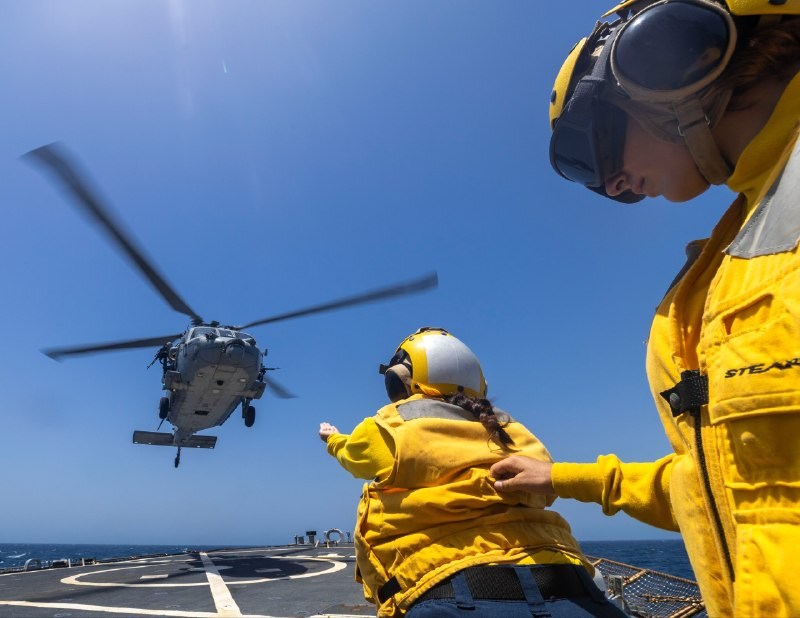

🔸ملوانان آمریکایی یک فروند بالگرد MH-60S سی‌هاوک را هنگام فرود بر عرشه پروازی ناوشکن USS Milius (DDG 69) در جریان عملیات پروازی، در تاریخ ۲۹ مه هدایت می‌کنند. میلیوس در حال پشتیبانی از محاصره دریایی ایالات متحده علیه ایران است؛ محاصره‌ای که تا ۳۱ مه موجب تغییر مسیر ۱۱۸ کشتی تجاری و از کار افتادن ۵ کشتی شده است.

@mwarmonitor

## mwarmonitor — post 9948

🔴بر اساس گزارش رسانه لبنانی LBCI، وزیر امور خارجه آمریکا Marco Rubio در حال پیگیری برقراری یک آتش‌بس کامل در لبنان است و احتمال دارد پس از نشست مذاکراتی ۲ ژوئن، این موضوع رسماً اعلام شود.

🔸سناتور لیندسی گراهام:

🔹در گفت‌وگوی اخیرم با دونالد ترامپ، حمایت خود را از توافقی با ایران اعلام کردم که خواسته رئیس‌جمهور ترامپ برای بازگشایی تنگه هرمز و آغاز مذاکرات به‌منظور پایان همیشگی جاه‌طلبی‌های هسته‌ای ایران و حمایت آن از تروریسم را بپذیرد. اطمینان دارم که در نهایت، رئیس‌جمهور ترامپ با یک توافق بد با ایران موافقت نخواهد کرد.

🔹در جبهه‌ای جداگانه، بر این باورم که باید به اسرائیل اجازه داده شود تهدیدهایی را که از حملات مستمر حزب‌الله از خاک لبنان متوجه این کشور است، خنثی کند. بخش‌هایی از اسرائیل به‌دلیل شلیک موشک‌ها و راکت‌های حزب‌الله غیرقابل سکونت شده‌اند.

🔹غیرقابل قبول است که از اسرائیل خواسته شود آتش‌بسی با حزب‌الله بپذیرد، آن هم در حالی که حزب‌الله آشکارا خواستار نابودی اسرائیل است و حملات مداوم خود را ادامه می‌دهد. هرگونه آتش‌بس با حزب‌الله به آن‌ها فرصت می‌دهد دوباره مسلح شوند و قوی‌تر شوند. از نظر من، نباید هیچ پیوندی میان توافق با ایران و توانایی اسرائیل برای دفاع و مقابله با تجاوز بی‌وقفه حزب‌الله در لبنان وجود داشته باشد. درباره حماس نیز این پرسش مطرح است که تا چه زمانی قرار است به آن‌ها فرصت خلع سلاح بدهیم؟ بگذارید اسرائیل کار آن‌ها را تمام کند.

🔹هر توافقی با ایران که توانایی اسرائیل برای مقابله با حماس و حزب‌الله را محدود کند، نادرست و غیرعاقلانه خواهد بود.

@mwarmonitor

## FoxNewsTwitter — post 342459

  

Fox News (Twitter/X)

A fight over a White House ballroom is turning into a national security showdown.

President Trump is accusing a federal judge of jeopardizing Washington’s safety by slowing a project that includes a rooftop drone base and other security enhancements.

“Judge Richard Leon should stop playing games with America’s security!” Trump wrote, arguing that today’s threats demand new defensive measures beyond traditional protections.

The lawsuit is focused on whether the administration can proceed with the project and its security upgrades without congressional authorization.

## FoxNewsTwitter — post 342458

  <a href="telegram/content/FoxNewsTwitter_342458_1780257532.mp4" target="_blank">🎬 Download video</a>

Fox News (Twitter/X)

Video captures the moment a dog is spooked by a meteor that exploded over Massachusetts, creating a boom heard across New England.

## FoxNewsTwitter — post 342454

Fox News (Twitter/X)

## FoxNewsTwitter — post 342450

Fox News (Twitter/X)

Coordinated supply operation exposed at Delaney Hall ahead of protests.

Agitators outside the Delaney Hall detention facility in New Jersey were seen establishing a highly organized logistics and support operation before protests began at the site.

Stockpiles of masks, duct tape, hard hats and medical supplies were laid out near the facility. Delaney Hall has been at the center of a standoff after detainees alleged abuse and poor conditions, claims DHS denies.

## FoxNewsTwitter — post 342449

  <a href="telegram/content/FoxNewsTwitter_342449_1780257533.mp4" target="_blank">🎬 Download video</a>

Fox News (Twitter/X)

Police hold the line as anti-ICE agitators try breaking the barricade at Delaney Hall to push their way into the New Jersey detention center.

## FoxNewsTwitter — post 342448

  <a href="telegram/content/FoxNewsTwitter_342448_1780257535.mp4" target="_blank">🎬 Download video</a>

Fox News (Twitter/X)

JUST IN: Governor DeSantis leads the charge to eliminate property taxes in Florida under a new plan aimed at giving homeowners relief.

"This is really a historic opportunity to have more money in people's pockets and to actually have their home be their private property that the government just can't use as a piggy bank." | @SundayFutures

## FoxNewsTwitter — post 342447

  

Fox News (Twitter/X)

"ICE! ICE! We love ICE!"

Trump supporters chant as they confront anti-ICE agitators at Delaney Hall amid violent demonstrations outside the New Jersey detention center.

## pm_afshaa — post 91969

  <a href="telegram/content/pm_afshaa_91969_1780257537.mp4" target="_blank">🎬 Download video</a>

انفجار در فاز یک اندیشه شهریار خیابان شیشم شرقی در یک ساختمان که چندین مصدوم داشته

💧 Rainbet.com the #1 Non-KYC Crypto Casino & Sportsbook @rainbetcom

😁 @Pm_Afshaa

## pm_afshaa — post 91968

  <a href="telegram/content/pm_afshaa_91968_1780257538.mp4" target="_blank">🎬 Download video</a>

🎙️گزارشگر به محمد‌جواد ظریف:
میگن شما پشت پرده مذاکرات هستید.

ظریف: من اصلا هیچکاره‌ام

💧 Rainbet.com the #1 Non-KYC Crypto Casino & Sportsbook @rainbetcom

😁 @Pm_Afshaa

## pm_afshaa — post 91967

🔴یک مقام ارشد امنیتی اسرائیلی: ایران قرارداد با آمریکا را امضا نخواهدکرد

💧 Rainbet.com the #1 Non-KYC Crypto Casino & Sportsbook @rainbetcom

😁 @Pm_Afshaa

## pm_afshaa — post 91966

  <a href="telegram/content/pm_afshaa_91966_1780257539.mp4" target="_blank">🎬 Download video</a>

شاهزاده رضا پهلوی:برخلاف این رژیم که می‌خواهد اسرائیل را از نقشه جهان پاک کند، ما آن‌ها را به عنوان شرکای استراتژیک واقعی می‌بینیم.

ما از دوستان اسرائیلی‌مان استقبال می‌کنیم تا در حل بسیاری از چالش‌هایی که ایران با آن‌ها مواجه است به ما کمک کنن ما با اسرائیل هیچ اختلافی نداریم

💧 Rainbet.com the #1 Non-KYC Crypto Casino & Sportsbook @rainbetcom

😁 @Pm_Afshaa

## pm_afshaa — post 91965

  <a href="telegram/content/pm_afshaa_91965_1780257541.mp4" target="_blank">🎬 Download video</a>

شاهزاده رضا پهلوی:آنها در تلاشند تا قانون شریعت را نه در دمشق یا تهران، بلکه در خیابان‌های بلژیک، خیابان‌های پاریس، خیابان‌های لندن تحمیل کنند.

تا چه حد اجازه می‌دهید این رادیکالیسم ادامه یابد؟ این تهدیدی مستقیم برای ثبات و جمعیت‌شناسی اروپا است!

💧 Rainbet.com the #1 Non-KYC Crypto Casino & Sportsbook @rainbetcom

😁 @Pm_Afshaa

## pm_afshaa — post 91964

  <a href="telegram/content/pm_afshaa_91964_1780257542.mp4" target="_blank">🎬 Download video</a>

شاهزاده رضا پهلوی:
مردم ایران همان نیروهای حاضر در میدان هستند. نیازی به اعزام نیروهای نظامی شما نیست، اما برای اینکه نیروهای حاضر در میدان بتوانند فرصتی برای بازگشت به خیابان‌ها داشته باشند، به حداقل محافظت نیاز دارن

💧 Rainbet.com the #1 Non-KYC Crypto Casino & Sportsbook @rainbetcom

😁 @Pm_Afshaa

## pm_afshaa — post 91963

🔴منابع اسرائیلی:ترامپ در تماس تلفنی آخر خود با بنیامین نتانیاهو اعلام کرد که در صورت همکاری با واشنگتن برای این تفاهم‌ نامه 60 روزه موقت اسرائیل کاملا در لبنان و غزه آزادی عمل خواهد داشت

💧 Rainbet.com the #1 Non-KYC Crypto Casino & Sportsbook @rainbetcom

😁 @Pm_Afshaa

## pm_afshaa — post 91962

  <a href="telegram/content/pm_afshaa_91962_1780257544.webm" target="_blank">🎬 Download video</a>

🔴ایران اینترنشنال: مسعود پزشکیان به علت تسلط کامل فرماندهان سپاه بر اداره امور کشور، با ارسال نامه‌ای به دفتر مجتبی خامنه‌ای خواهان استعفا از سمت خودش شده. 
💧 Rainbet.com the #1 Non-KYC Crypto Casino & Sportsbook @rainbetcom 
😁 @Pm_Afshaa

## pm_afshaa — post 91961

  <a href="telegram/content/pm_afshaa_91961_1780257544.webm" target="_blank">🎬 Download video</a>

🔴ایران اینترنشنال: مسعود پزشکیان به علت تسلط کامل فرماندهان سپاه بر اداره امور کشور، با ارسال نامه‌ای به دفتر مجتبی خامنه‌ای خواهان استعفا از سمت خودش شده. 
💧 Rainbet.com the #1 Non-KYC Crypto Casino & Sportsbook @rainbetcom 
😁 @Pm_Afshaa

## pm_afshaa — post 91960

  <a href="telegram/content/pm_afshaa_91960_1780257545.webm" target="_blank">🎬 Download video</a>

🔴کانال 15 اسرائیل به نقل از منابع:
گسترش عملیات در لبنان با هماهنگی آمریکا انجام شد.

💧 Rainbet.com the #1 Non-KYC Crypto Casino & Sportsbook @rainbetcom

😁 @Pm_Afshaa

## pm_afshaa — post 91959

  <a href="telegram/content/pm_afshaa_91959_1780257545.webm" target="_blank">🎬 Download video</a>

🔴عباس عراقچی: گفتگوها و تبادل پیام‌‌ها در جریان است و تا وقتی به نتیجه مشخص نرسه، نمیشه در موردش قضاوت کرد و هر آنچه که الان گفته میشه گمانه‌زنی است و نباید به آن اهمیت داد.

💧 Rainbet.com the #1 Non-KYC Crypto Casino & Sportsbook @rainbetcom

😁 @Pm_Afshaa

## pm_afshaa — post 91958

  <a href="telegram/content/pm_afshaa_91958_1780257545.webm" target="_blank">🎬 Download video</a>

🔴ایران اینترنشنال: مسعود پزشکیان به علت تسلط کامل فرماندهان سپاه بر اداره امور کشور، با ارسال نامه‌ای به دفتر مجتبی خامنه‌ای خواهان استعفا از سمت خودش شده. 
💧 Rainbet.com the #1 Non-KYC Crypto Casino & Sportsbook @rainbetcom 
😁 @Pm_Afshaa

## pm_afshaa — post 91956

#مهم
عزیزای دلم همگی الان چنل زاپاس‌مون رو جوین بشید کانال تحت ریپورت شدیده اگه چیزی شد زاپاس رو داشته باشید فعالیت میاد اونور
👇

https://t.me/Pm_Zapas
https://t.me/Pm_Zapas

## pm_afshaa — post 91955

  

ترامپ پستی از نیوت گینگریچ را بازنشر کرد که در آن گفته است ترامپ «در آستانه یک پیروزی تاریخی» در ایران است

💧 Rainbet.com the #1 Non-KYC Crypto Casino & Sportsbook @rainbetcom

😁 @Pm_Afshaa

## pm_afshaa — post 91954

🔴وزیر خزانه‌داری آمریکا: فشارها بر ایران و جلوگیری از صادرات نفت از جزیره خارک ادامه دارد

💧 Rainbet.com the #1 Non-KYC Crypto Casino & Sportsbook @rainbetcom

😁 @Pm_Afshaa

## pm_afshaa — post 91953

  <a href="telegram/content/pm_afshaa_91953_1780257546.webm" target="_blank">🎬 Download video</a>

🔴ایران اینترنشنال: مسعود پزشکیان به علت تسلط کامل فرماندهان سپاه بر اداره امور کشور، با ارسال نامه‌ای به دفتر مجتبی خامنه‌ای خواهان استعفا از سمت خودش شده.

💧 Rainbet.com the #1 Non-KYC Crypto Casino & Sportsbook @rainbetcom

😁 @Pm_Afshaa

## pm_afshaa — post 91952

وضعیت لبنان بعد از حمله هوایی اسراییل به این کشور 
💧 Rainbet.com the #1 Non-KYC Crypto Casino & Sportsbook @rainbetcom 
😁 @Pm_Afshaa

## pm_afshaa — post 91951

  <a href="telegram/content/pm_afshaa_91951_1780257547.webm" target="_blank">🎬 Download video</a>

🔴مهاجرانی، سخنگوی دولت:
قالیباف کسی است که فرمانده میدان بوده و عراقچی هم رزمنده زمان جنگ است، بنابراین تمام کسانی که الان درگیر مذاکره هستن، میدان رو به‌خوبی درک می‌کنند.

نیروهای مسلح ایران همچنان دست‌به‌ماشه هستن و تیم دیپلماسی با همین نگاه، مذاکرات رو دنبال میکنه.

💧 Rainbet.com the #1 Non-KYC Crypto Casino & Sportsbook @rainbetcom

😁 @Pm_Afshaa

## pm_afshaa — post 91950

🔴سی‌ان‌ان: ترامپ با آزادسازی هرگونه دارایی ایران در توافق احتمالی مخالفت کرده

💧 Rainbet.com the #1 Non-KYC Crypto Casino & Sportsbook @rainbetcom

😁 @Pm_Afshaa

## pm_afshaa — post 91949

  <a href="telegram/content/pm_afshaa_91949_1780257548.webm" target="_blank">🎬 Download video</a>

🔴سی‌بی‌اس: میانجی‌ها هنوز دارن روی توافق بین تهران و واشینگتن کار میکنن. ترامپ روز جمعه متن توافق رو دوباره اصلاح کرده و نسخه جدیدش رو فرستاده ایران تا تأییدش کنه، ولی تا الان هنوز پاسخی از طرف تهران داده نشده. 
💧 Rainbet.com the #1 Non-KYC Crypto Casino…

## DEJradio — post 5191

📡
🛑 ساعتی پیش دونالد ترامپ مصاحبه‌ای از مارک لوین، روزنامه نگار نزدیک به خود با دیویس هنسن، تاریخ نگار و پژوهشگر موسسه را در حساب کاربری خود در تروث سوشیال قرار داد.
این مصاحبه مربوط به جنگ ایالات متحده با جمهوری اسلامی است.

#ترامپ #مارک_لوین
@DEJradio

## DEJradio — post 5190

  <a href="telegram/content/DEJradio_5190_1780257548.mp4" target="_blank">🎬 Download video</a>

📺 
🕐 موسیقی در دوران استبداد، نقش ساز، صدا و هنر در تقویت جنبش‌های آزادیخواهانه
هر یکشنبه و پنجشنبه هر هفته بعد از خبر ۲۱

#ایران_را_پس_میگیریم
#زیرصدا
@DEJradio

## DEJradio — post 5189

  <a href="telegram/content/DEJradio_5189_1780257550.mp4" target="_blank">🎬 Download video</a>

⭕️
🔴 شکاف در صف حامیان نظام؛ یکی از هواداران ولایت با انتقاد از مذاکرات مقامات با قاتلان خامنه‌ای خطاب به ته مانده مسئولان نظام می‌گوید: "مردم رو نفهم فرض نکنید"

#مزدوران
@DEJradio

## DEJradio — post 5188

  <a href="telegram/content/DEJradio_5188_1780257551.mp4" target="_blank">🎬 Download video</a>

📺 
🕐 مهمان برنامه نیمکت، احمد باطبی روزنامه‌نگار و فعال حقوق بشر است. او در این برنامه به واکاوی تحولات جنبش دانشجویی و دگرگونی دانشگاه‌ها پرداخته است.
«نیمکت» برنامه مشترک خبرنامه امیرکبیر و تلویزیون دژ است و بر مبارزات دانشجویی تمرکز دارد.
این برنامه هر یکشنبه بعد از خبر ۲۱ پخش می‌شود.

#نیمکت
@DEJradio

## DEJradio — post 5187

  <a href="telegram/content/DEJradio_5187_1780257553.webm" target="_blank">🎬 Download video</a>

🔸
🔺 فاطمه مهاجرانی سخنگوی دولت درباره دلایل افزایش گرانی گفت «وقتی جریان عرضه و تقاضا دچار مشکل می‌شود بازار واکنش نشان می‌دهد.»
او با اشاره به محاصره دریایی بنادر جمهوری اسلامی، ادامه داد: «دزدی دریایی آمریکا تاثیر می‌گذارد که ورود کمتر شود.»
این در حالیست که برخی مقامات جمهوری اسلامی ادعا می‌کنند «محاصره دریایی» شکست خورده است. بعضی نمایندگان مجلس شورای اسلامی نیز ادعا کرده بودند نظام راهکار شکستن محاصره دریایی را می‌داند.

#محاصره_دریایی #گرانی
@DEJradio

## DEJradio — post 5186

  <a href="telegram/content/DEJradio_5186_1780257554.mp4" target="_blank">🎬 Download video</a>

🔸
🔺 براساس گزارش‌های مردمی بعد از جنگ ۴۰ روزه وضعیت آب سدها و دریاچه‌ها بهتر شده است. برخی منابع می‌گویند حدود ۷۰ درصد ظرفیت مخزن سد کرج تا ۱۰ خرداد پر شده است.

#کرج #آب
@DEJradio

## VahidOnline — post 75823

  <a href="telegram/content/VahidOnline_75823_1780257555.mp4" target="_blank">🎬 Download video</a>

خبرگزاری تسنیم، وابسته به سپاه پاسداران انقلاب اسلامی، در واکنش به گزارش شبکه ایران اینترنشنال درباره استعفای مسعود پزشکیان، رییس دولت، این خبر را تکذیب کرد و آن را «شایعه‌سازی» خواند.

شبکه ایران اینترنشنال، ساعاتی پیش در گزارشی اعلام کرد مسعود پزشکیان در نامه‌ای رسمی به دفتر مجتبی خامنه‌ای، رهبر جمهوری اسلامی، خواستار کناره‌گیری از سمت خود شده است. این رسانه همچنین نوشت در این نامه به وجود اختلافات ساختاری در اداره کشور و نقش نهادهای نظامی در تصمیم‌گیری‌های کلان اشاره شده است.
@VahidHeadline

📡 @VahidOnline

## VahidOnline — post 75822

  

IranIntlbrk

📡 @VahidOnline

## VahidOnline — post 75821

  

مسعود پیاهو، مردی که تصویر معترض نشسته مقابل نیروهای پلیس یگان ویژه در مقابل پاساژ علاالدین در آغاز اعتراضات دی ماه سال گذشته را منتشر کرد، به گفته وکیلش به ۱۰ سال زندان محکوم شده است.
@VahidHeadline

📡 @VahidOnline

## VahidOnline — post 75820

  <a href="telegram/content/VahidOnline_75820_1780257556.mp4" target="_blank">🎬 Download video</a>

اسکات بسنت، وزیر خزانه‌داری آمریکا، در گفت‌وگو با فاکس‌نیوز درباره ایران اعلام کرد: لایه اول و دوم حکومت آن‌ها از بین رفته و اکنون با لایه سوم روبه‌رو هستیم. شاید آن‌ها دیده‌اند برای بقیه چه اتفاقی افتاد و می‌بینند ترامپ آماده انجام چه اقداماتی است.

بسنت افزود: اگر ترامپ با این توافق موافقت کند، همین حالا به رهبران جمهوری اسلامی می‌گویم که او این توافق را هم از نظر نظامی و هم از نظر اقتصادی اجرا خواهد کرد. آزادی کشتیرانی در خلیج فارس از طریق تنگه هرمز باید به وضعیت پیشین بازگردد.

او درباره اینکه آیا ترامپ «کار را تمام خواهد کرد» گفت: اگر «تمام کردن کار» یعنی اطمینان از باز بودن تنگه هرمز، در اختیار گرفتن اورانیوم با غنای بالا و نداشتن سلاح هسته‌ای از سوی جمهوری اسلامی، پس کار تمام شده است.

بسنت تاکید کرد: چه از طریق مداخله نظامی، چه محاصره یا فشار اقتصادی، این نخستین بار در ۴۷ سال گذشته است که ایرانی‌ها درباره نداشتن سلاح هسته‌ای گفت‌وگو می‌کنند. این موضوع پیش‌تر ممنوعه بود و اکنون برای نخستین بار روی میز مذاکره قرار گرفته است.
@VahidOOnLine

📡 @VahidOnline

## VahidOnline — post 75819

عراقچی در تاریخ ۲۹ آبان ۱۴۰۴
در تلویزیون جمهوری اسلامی میگه ترامپ به ما نامه‌ای داده و صراحتا نوشته
«دو گزینه بیشتر نیست»
یا جنگ و خونریزی یا مذاکره مستقیم
«برای از بین بردن غنی‌سازی و موشکی»

این مصاحبه چند ماه بعد از جنگ ۱۲ روزه بود! یعنی در آبان ماه، مشکلات آمریکا و جمهوری اسلامی همچنان همون چیزهایی بودند که باعث یک جنگ شد، و این مصاحبه یک ماه پیش از آن بود که دست به قتل‌عام مردم در خیابان‌ها بزنید!

الان هم محور مذاکرات کاملا مشخصه!
همون چیزهایی است که جنگ ۱۲ روزه رو رقم زد. همون چیزهایی است که در آبان ماه عراقچی در تلویزیون گفت.

خون تک‌تک ایرانیان از جمله کودکان میناب پای شماست! شما طرف مذاکره بودید، شما انتخاب کننده و تصمیم گیر بودید.

و شما بین اورانیوم و موشک، و یا جان مردم، زیرساخت‌های کشور، فولاد و پتروشیمی و…
اورانیوم و موشک و دشمنی با اسرائیل و آمریکا رو انتخاب کردید! هنوز هم طرف مذاکره و تصمیم‌گیر شما هستید! و‌ جنگ ‌از سر گرفته بشه باز تصمیم و انتخاب شماست و مقصر شما هستید!

نمی‌توانید پشت کودکان میناب قایم بشید و از کشتار دیماه فرار کنید!
هر خون و ‌هر ویرانی ، همه پای شماست.

## VahidOnline — post 75818

  

حسن و حسین امیری، دو برادر دوقلوی ۲۰ ساله محبوس در زندان قزلحصار کرج، از سوی شعبه ۲۶ دادگاه انقلاب تهران به ریاست قاضی ایمان افشاری به اعدام محکوم شدند.

بر اساس اطلاعات دریافتی هرانا، مبنای صدور این رای اتهام «جاسوسی برای اسراییل» عنوان شده است.

یک منبع مطلع در گفت‌وگو با هرانا اعلام کرد در کیفرخواست صادرشده علیه حسن و حسین امیری، مشاهده تصاویری از ساختمان‌های آسیب‌دیده به عنوان مستند اتهام «جاسوسی به نفع اسراییل» مورد استناد قرار گرفته است.

این منبع همچنین گفت: «حسن و حسین امیری به دستور بازپرس پرونده به صورت جداگانه در زندان قزلحصار نگهداری می‌شوند و از حق ملاقات با یکدیگر محروم هستند. این دو زندانی در حال حاضر در سوییت ۳۵ این زندان محبوس هستند.»

بر اساس این گزارش، این دو برادر پیشتر در یکی از ایست‌های بازرسی و پس از بررسی تلفن همراهشان بازداشت شدند.آن‌ها پس از بازداشت، به مدت دو ماه در وضعیت بلاتکلیف در زندان قزلحصار کرج نگهداری شدند.

👈 حسن و حسین امیری از دو سالگی در مراکز بهزیستی پرورش یافته‌اند و خانواده‌ای برای پیگیری وضعیت قضایی و حقوقی خود ندارند. به گفته آشنایان این دو جوان، نبود حامی خانوادگی بر نگرانی‌ها درباره روند رسیدگی به پرونده آنان افزوده است.
@VahidHeadline

📡 @VahidOnline

## VahidOnline — post 75817

  

سی‌ان‌ان: ایران چندین ورودی تأسیسات موشکی زیرزمینی خود را بازگشایی کرده است

شبکه خبری سی‌ان‌ان روز یکشنبه ۱۰ خرداد با استناد به تصاویر ماهواره‌ای اعلام کرد ایران توانسته از زمان توقف جنگ شماری از زرادخانه‌های موشکی مدفون خود بر اثر حملات هوایی آمریکا و اسرائیل را از زیر خاک بیرون بیاورد.

حملات آمریکا و اسرائیل با تخریب جاده‌ها و مسدود کردن ورودی تونل‌ها، دسترسی ایران به پایگاه‌های موشکی زیرزمینی را محدود کرده بود.

سی‌ان‌ان ادعا کرده است که ایران تاکنون ۵۰ مورد از ۶۹ ورودی تونلی را که در ۱۸ تأسیسات موشکی زیرزمینی توسط آمریکا و اسرائیل هدف قرار گرفته بودند، بازگشایی کرده است، از جمله در پایگاه‌هایی در خارج از اصفهان و در اطراف خمین.

بر اساس گزارش این شبکه خبری، ایران همچنین بخش‌های دیگری از این پایگاه‌ها را نیز ترمیم کرده است؛ از جمله جاده‌هایی که آمریکا و اسرائیل برای جلوگیری از تردد پرتابگرهای موشکی بمباران کرده بودند. تصاویر ماهواره‌ای نشان می‌دهند که تقریباً تمامی گودال‌های ناشی از بمباران اکنون پر شده‌اند و در دو پایگاه، این جاده‌ها حتی دوباره آسفالت شده‌اند.

ایران شبکه پایگاه‌های زیرزمینی خود را در عمق خاک و در مواردی زیر کوه‌ها ساخته است تا در برابر حملات هوایی مصون باشند، به همین دلیل آمریکا و اسرائیل بسیاری از ورودی‌های این تأسیسات را بمباران کردند؛ اقدامی که در کنار تلاش برای شناسایی و نابود کردن پرتابگرهای موشکی، باعث شد توان ایران برای شلیک موشک به‌طور قابل توجهی محدود شود.

این حملات خسارت سنگینی به پایگاه‌ها وارد کرد؛ به‌گونه‌ای که بیشتر ورودی‌های تونل‌ها زیر حجم عظیمی از آوار مدفون شدند و جاده‌های منتهی به این سایت‌ها نیز به‌شدت تخریب شدند.

سی‌ان‌ان می‌گوید باز کردن ورودی تأسیسات موشکی زیرزمینی می‌تواند به ایران این قابلیت را دهد که در صورت وقوع دور جدیدی از درگیری‌ها، موشک‌های بالستیک بیشتری نسبت به اواخر جنگ ۴۰ روزه به سمت اسرائیل و کشورهای دیگر شلیک کند.
@VahidHeadline

📡 @VahidOnline

## IranIntlTV — post 339934

  <a href="telegram/content/IranIntlTV_339934_1780257557.mp4" target="_blank">🎬 Download video</a>

علی شیرازی، عضو تحریریه ایران‌اینترنشنال، درباره سناریوی پذیرش استعفای مسعود پزشکیان از سوی مجتبی خامنه‌ای گفت: «در چنین شرایطی، کشور وارد حکومت نظامی خواهد شد؛ وضعیتی که در آن فرماندهان سپاه پاسداران به‌طور علنی زمام امور مرتبط با زندگی مردم را در دست خواهند گرفت.»
@iranintltv

## IranIntlTV — post 339933

  

خبرگزاری تسنیم، وابسته به سپاه، به نقل از «یک منبع مطلع» درباره روند مذاکرات نوشت: ملاک برای جمهوری اسلامی متنی است که خودمان قبول داشته باشیم و اعمال اصلاحیه از سوی ترامپ به معنای پذیرش آن از طرف ما نیست.

تسنیم افزود جمهوری اسلامی برای «وضعیت عدم تفاهم» نیز کاملا آمادگی دارد.
https://iranintl.com/202605318379

## IranIntlTV — post 339932

  <a href="telegram/content/IranIntlTV_339932_1780257559.mp4" target="_blank">🎬 Download video</a>

🔻بازیکنان تیم فوتبال آرسنال پس از قهرمانی در لیگ برتر انگلستان، در حضور هواداران خود رژه قهرمانی در خیابان‌های لندن برگزار کردند. آرسنال پس از ۲۲ سال توانست عنوان قهرمانی لیگ برتر را از آن خود کند.

🔹گزارش آیدین مقیمی، ایران‌اینترنشنال

@iranintltvsport

## IranIntlTV — post 339931

  

یدالله جوانی، معاون سیاسی سپاه پاسداران، گفت: «اعمال حاکمیت بر تنگه هرمز سلاحی راهبردی‌تر از تسلیحات اتمی است که ایران را قادر به تنبیه متجاوزان می‌کند.»

او با اشاره به جنگ میان جمهوری اسلامی، آمریکا و اسرائیل افزود: «این جنگ اجتناب‌ناپذیر بود و ما در وقوع آن غافلگیر نشدیم. همواره برای این رویارویی آماده می‌شدیم.»

معاون سیاسی سپاه پاسداران همچنین با اشاره به جنگ هشت‌ساله ایران و عراق گفت: «جنگ تحمیلی دوم و سوم نیز همان برکات را برای جامعه اسلامی ایران به همراه داشته است. ایران نه تنها در دفاع پیروز شد، بلکه از دل این جنگ، یک قدرت جهانی ظهور کرده است.»
https://iranintl.com/202605318586

## IranIntlTV — post 339930

  <a href="telegram/content/IranIntlTV_339930_1780257561.mp4" target="_blank">🎬 Download video</a>

دهمین نمایشگاه «تهران، بدون سانسور» با همکاری ناشران مستقل خارج از کشور در شهرهای تورنتو و اتاوا برگزار شد.

برگزارکنندگان اعلام کرده‌اند این نمایشگاه امسال به‌صورت محدود در شهرهای دیگری از جمله لندن، استکهلم و کپنهاگ نیز برگزار خواهد شد.

گزارش مهسا مرتضوی، خبرنگار ایران‌اینترنشنال و گفت‌وگو با سعید چوبک، برگزارکننده نمایشگاه
@iranintltv

## IranIntlTV — post 339929

  <a href="https://t.me/IranintlTV/339929" target="_blank">📎 Download file</a>

🎧نسخه صوتی چشم‌انداز: استعفای مسعود پزشکیان؛ بحران در حکومت اسلامی
@iranintlTV

## IranIntlTV — post 339928

  <a href="telegram/content/IranIntlTV_339928_1780257562.mp4" target="_blank">🎬 Download video</a>

استعفای مسعود پزشکیان؛ بحران در حکومت اسلامی

چشم‌انداز با مهدی مهدوی‌آزاد

نسخه کامل این برنامه در یوتیوب:
https://youtu.be/bGNMtgCM1x0
@iranintltv

## IranIntlTV — post 339927

  <a href="telegram/content/IranIntlTV_339927_1780257564.mp4" target="_blank">🎬 Download video</a>

محمدجواد اکبرین، عضو تحریریه ایران‌اینترنشنال، درباره استعفای مسعود پزشکیان گفت: «در گذشته هم سابقه داشته که سر بزنگاه نظامیان به جای مدیران سیاسی تصمیم گرفته‌اند اما در آن روزها شرایط اقتصاد ایران به ویرانی امروز نبود.» او افزود پزشکیان در این شرایط باید پاسخگوی وضعیت موجود باشد، اما «می‌داند که توان اداره و پاسخگویی را ندارد و به همین دلیل نامه استعفای خود را نوشته است».
@iranintltv

## IranIntlTV — post 339926

  

ایران‌اینترنشنال به اسناد و اطلاعاتی اختصاصی دست یافته است که نشان می‌دهند یک شرکت چینی با هماهنگی دولت این کشور و همچنین دو شرکت مستقر در ترکیه و امارات، در تامین مواد شیمیایی لازم برای ساخت موشک‌های بالستیک به سپاه پاسداران کمک می‌‌کند.

یک سند که گروه هکری پرانا به آن دست یافته و در اختیار ایران‌اینترنشنال قرار داده است، فاش می‌کند که چین نه‌تنها آشکارا به سپاه پاسداران در تامین این مواد کمک می‌کند، بلکه با کمک شبکه‌ای از شرکت‌ها تحریم‌های آمریکا علیه جمهوری اسلامی را هم دور می‌زند.

در این میان شرکت «هاوکان انرژی» نقش اصلی را ایفا می‌‌کند. این شرکت سال‌ها واسطه فروش نفت سپاه پاسداران به پالایشگاه‌های چینی بود و چهار سال پیش به دلیل تامین مالی نیروی قدس سپاه پاسداران از سوی ایالات متحده تحریم شد.

سال گذشته یک منبع مطلع به اینترنشنال گفته بود که این شرکت بیش از یک میلیارد دلار از پول نفت سپاه را بازنگردانده است.

ادامه این گزارش را در وبسایت ایران‌اینترنشنال بخوانید
https://iranintl.com/202605316277

## IranIntlTV — post 339924

  

تانکر ترکرز در شبکه اجتماعی ایکس اعلام کرد چهار نفتکش متعلق به شرکت ملی نفتکش ایران، با مجموع ظرفیت حدود هفت میلیون بشکه نفت خام، طی دو تا سه روز گذشته ظاهرا تلاش کرده‌اند ایران را ترک کنند، اما به احتمال زیاد مجبور به بازگشت شده‌اند.
https://iranintl.com/202605318162

## IranIntlTV — post 339923

  <a href="telegram/content/IranIntlTV_339923_1780257567.mp4" target="_blank">🎬 Download video</a>

ستاد فرماندهی مرکزی آمریکا، سنتکام، با انتشار ویدیویی از یک ناو هواپیمابر نیروی دریایی خود در ایکس نوشت: «این ناو به طول تقریبی سه زمین فوتبال با بیش از ۵۰۰۰ ملوان، شهری خودکفا در دریا است که برای ادامه روان عملیات به تلاش همه اعضای تیم ــ چه روی عرشه و چه زیر عرشه ــ نیاز دارد.»
@iranintltv

## IranIntlTV — post 339921

  

فرماندهی مرکزی آمریکا اعلام کرد از آغاز عملیات محاصره دریایی بنادر ایران تاکنون ۱۱۸ کشتی تجاری مجبور به تغییر مسیر شده‌اند و پنج کشتی نیز توسط نیروهای آمریکایی از کار افتاده‌اند.
سنتکام همچنین با انتشار تصویری از ناوشکن «یو‌اس‌اس میلیوس» اعلام کرد این شناور در عملیات محاصره بنادر ایران مشارکت دارد.
https://iranintl.com/202605318764

## IranIntlTV — post 339920

  <a href="https://t.me/IranintlTV/339920" target="_blank">📎 Download file</a>

🎧نسخه صوتی تیتراول با نیوشا صارمی: استعفای پزشکیان به دلیل تسلط کامل سپاه؛ مجتبی خامنه‌ای می‌پذیرد؟
@iranintlTV

## IranIntlTV — post 339919

  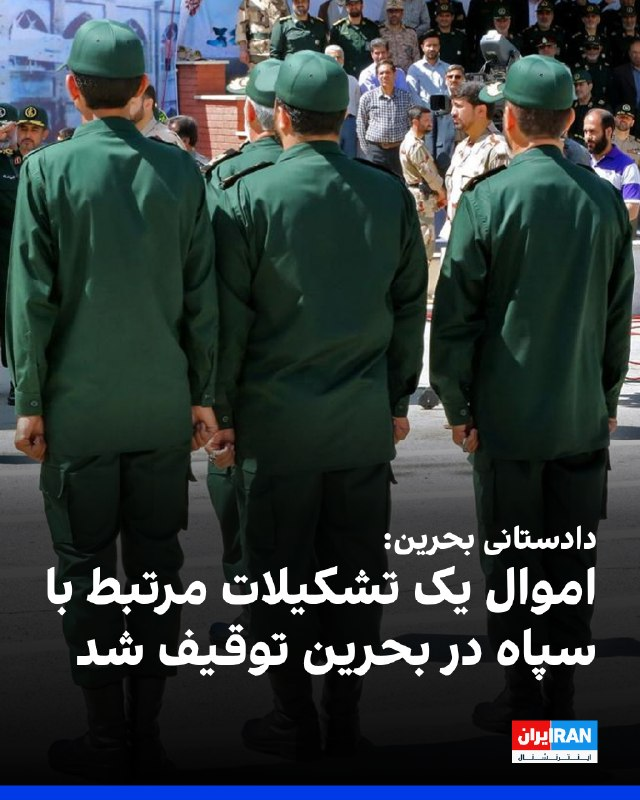

به گزارش العربیه، دادستانی بحرین اعلام کرد که تحقیقات درباره تشکیلات مرتبط با سپاه پاسداران در این کشور را آغاز کرده است.

بر اساس اعلام دادستانی بحرین، این تشکیلات، روحانیون مخالف رویکرد ولایت فقیه را مورد ارعاب قرار داده و به انتقال پول به گروه‌هایی در ایران، عراق و لبنان اقدام کرده است.

بر اساس این بیانیه، اموال این گروه توقیف شده است.
https://iranintl.com/202605313272

## IranIntlTV — post 339918

  <a href="telegram/content/IranIntlTV_339918_1780257569.mp4" target="_blank">🎬 Download video</a>

ارتش اسرائیل اعلام کرد کنترل عملیاتی قلعه راهبردی شقیف در جنوب لبنان را به‌دست گرفته است؛ تحولی که همزمان با گسترش عملیات زمینی در خاک لبنان رخ داده است.

این در حالی است که از ۲۷ فروردین و با میانجی‌گری آمریکا میان اسرائیل و لبنان آتش‌بس اعلام شد، اما درگیری‌ها همچنان ادامه دارد.

گفت‌وگو با فرزین ندیمی، پژوهشگر ارشد امور دفاعی و امنیتی
@iranintltv

## IranIntlTV — post 339917

گزارش‌های متعدد از سخت‌تر شدن برخی مفاد توافق پیشنهادی با تهران از سوی رییس جمهور آمریکا خبر می‌دهند. به گزارش نیویورک تایمز، نسخه اصلاح‌شده این توافق برای بررسی به تهران ارسال شده. آکسیوس هم نوشت که تغییرات مورد نظر ترامپ عمدتا مرتبط با برنامه هسته‌ای و ذخایر اورانیوم غنی‌شده جمهوری اسلامی است.

گفت‌وگو با مرضیه حسینی خبرنگار ایران‌اینترنشنال و مسعود کاظمی روزنامه‌نگار

@iranintltv

## IranIntlTV — post 339916

  

عباس عراقچی، وزیر خارجه جمهوری اسلامی، یکشنبه به صداوسیمای جمهوری اسلامی اعلام کرد: «گفت‌وگوها و تبادل پیام‌‌ها در جریان است و تا وقتی به نتیجه مشخص نرسد، نمی‌شود در موردش قضاوت کرد.»

او افزود: «هر آنچه که الان گفته می‌شود گمانه‌زنی است و نباید به آن اهمیت داد تا وقتی که به قطعیت برسد.»
https://iranintl.com/202605318549

## IranIntlTV — post 339915

  <a href="telegram/content/IranIntlTV_339915_1780257571.mp4" target="_blank">🎬 Download video</a>

یک منبع آگاه به ایران‌اینترنشنال خبر داد مسعود پزشکیان با ارسال نامه‌ای رسمی به دفتر مجتبی خامنه‌ای خواستار کناره‌گیری از سمت خود شده است.

براساس اطلاعات رسیده به ایران‌اینترنشنال، پزشکیان در این نامه هشدار داده ساختار اداره کشور عملا از مسیرهای رسمی خارج شده و بخش‌های اصلی حاکمیت تحت کنترل کامل طیفی از فرماندهان سپاه پاسداران قرار گرفته است.

گفت‌وگو با مراد ویسی، تحلیل‌گر ارشد ایران‌اینترنشنال
@iranintltv

## IranIntlTV — post 339914

  

سایت امتداد گزارش داد مسعود پیاهو، شهروندی که تصویر نشستن یک معترض مقابل نیروهای سرکوب در اعتراضات بازار در دی ۱۴۰۴ را ثبت کرده بود، به اتهام «همکاری با اسرائیل» به ۱۰ سال حبس محکوم شده است.

حسن آقاخانی، وکیل این شهروند، عنوان کرده است موکل او این فیلم کوتاه را به صورت ناخودآگاه از آن صحنه ضبط کرده و قصد انتشار آن را نداشته و صرفا برای تعداد محدودی از دوستانش در استوری خصوصی اینستاگرام منتشر کرده است.

به گزارش امتداد و به نقل از وکیل مسعود پیاهو، حکم ۱۰ سال حبس در شعبه ۹ دیوان تایید شده و به اجرای احکام رفته است و این شهروند باید خود را به زندان معرفی کند.
https://iranintl.com/202605316094

## IranIntlTV — post 339913

  <a href="telegram/content/IranIntlTV_339913_1780257573.mp4" target="_blank">🎬 Download video</a>

ویدیوی منتشرشده در شبکه‌های اجتماعی، دود غلیظ ناشی از آتش‌سوزی را در حوالی اتوبان ستاری تهران در روز یک‌شنبه ۱۰ خرداد نشان می‌دهد.

جلال ملکی، سخنگوی سازمان آتش‌نشانی شهرداری تهران، در این‌باره گفت: مقادیری لاستیک و روغن در پارکینگ ساختمانی نگهداری می‌شده که به دلایل نامشخص دچار آتش‌سوزی شده است. این حادثه مصدومیت و تلفات جانی نداشته است.
@iranintltv

## Shin_Persian — post 6337

Shin ✓ @hey_itsmyturn
Sun, 31 May 2026 19:03:04 UTC

He was responsible for importing sat. dishes for IRIB, as well as contracts between the IRIB and IRGC Khatam Al Anbiya.

فارسی

او مسئول واردات دیش‌های ماهواره برای صدا و سیمای جمهوری اسلامی ایران (IRIB) و همچنین مسئول قراردادهای بین صدا و سیما و قرارگاه سازندگی خاتم‌الانبیا سپاه پاسداران (IRGC) بود.

𝕏 · @shin_persian

## Shin_Persian — post 6336

Shin ✓ @hey_itsmyturn
Sun, 31 May 2026 19:01:19 UTC

Targeted assassination in Adniesheh, Tehran Province, #Iran
Target: Vahid Hakan
@ ~ 1820Z

فارسی

ترور هدفمند در اندیشه، استان تهران، #Iran
هدف: وحید هاکان
در حدود ۱۸۲۰Z (۲۱:۵۰ به وقت تهران)

𝕏 · @shin_persian

## Shin_Persian — post 6335

  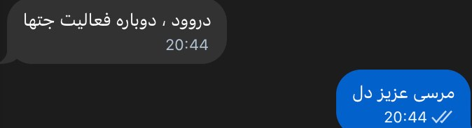

Shin ✓ @hey_itsmyturn
Sun, 31 May 2026 17:44:41 UTC

Now -
Jet activity over Karaj, Alborz Province, #Iran

فارسی

فعالیت جت‌های جنگنده بر فراز کرج، استان البرز، #Iran

𝕏 · @shin_persian

## Shin_Persian — post 6334

  

Shin ✓ @hey_itsmyturn Sun, 31 May 2026 17:37:26 UTC Tasnim called @IranIntl a "Mossad-affiliated media", adds "Mr. President did'nt resign, was working today, and will continue his work as planned", citing an "informed source". [These quick denials by…

## Shin_Persian — post 6333

Shin ✓ @hey_itsmyturn
Sun, 31 May 2026 17:37:26 UTC

Tasnim called @IranIntl a "Mossad-affiliated media", adds "Mr. President did'nt resign, was working today, and will continue his work as planned", citing an "informed source".

[These quick denials by IRGC media usually mean the opposite] [They rejected his resignation iyam]

فارسی

تسنیم @IranIntl را یک «رسانه وابسته به موساد» خواند و به نقل از یک «منبع آگاه» افزود: «آقای رئیس‌جمهور استعفا نداده، امروز مشغول به کار بود و طبق برنامه به فعالیت خود ادامه خواهد داد.»

[این تکذیب‌های سریع توسط رسانه‌های سپاه پاسداران (IRGC) معمولاً به معنای معکوس است] [به نظر من آن‌ها با استعفای او مخالفت کرده‌اند]

𝕏 · @shin_persian

## Shin_Persian — post 6332

Shin ✓ @hey_itsmyturn
Sun, 31 May 2026 17:32:49 UTC

IRGC-owned Tasnim denies Pezeshkian's resignation.

فارسی

خبرگزاری تسنیم متعلق به سپاه پاسداران انقلاب اسلامی (IRGC)، استعفای پزشکیان را تکذیب کرد.

𝕏 · @shin_persian

## Shin_Persian — post 6331

↩️ Quoted tweet: ایران اینترنشنال - خبر فوری ✓ @IranIntlbrk Sun, 31 May 2026 16:40:46 UTC یک منبع آگاه به ایران اینترنشنال خبر داد که مسعود پزشکیان، رئیس‌جمهوری ایران، با ارسال نامه‌ای رسمی به دفتر مجتبی خامنه‌ای، رهبر جمهوری اسلامی، خواستار کناره‌گیری از…

## Shin_Persian — post 6330

↩️ Quoted tweet:
ایران اینترنشنال - خبر فوری ✓ @IranIntlbrk
Sun, 31 May 2026 16:40:46 UTC

یک منبع آگاه به ایران اینترنشنال خبر داد که مسعود پزشکیان، رئیس‌جمهوری ایران، با ارسال نامه‌ای رسمی به دفتر مجتبی خامنه‌ای، رهبر جمهوری اسلامی، خواستار کناره‌گیری از سمت خود شد.
بر اساس اطلاعات رسیده به ایران‌اینترنشنال، پزشکیان در این نامه که طی ساعات گذشته ارسال شده، با لحنی کم

↩️ Quoted tweet — see the post below for the reply.

English

An informed source told Iran International that Masoud Pezeshkian, the President of Iran, sent an official letter to the office of Mojtaba Khamenei, the Supreme Leader of the Islamic Republic, requesting to resign from his position.

According to information obtained by Iran International, in this letter sent within the past few hours, Pezeshkian, with a tone...

𝕏 · @shin_persian

## Shin_Persian — post 6329

Shin ✓ @hey_itsmyturn
Sun, 31 May 2026 17:04:32 UTC

Lots of people tweeting the Jordanian flag with a missing star, do they have a problem with Jordan?

فارسی

افراد زیادی در حال توئیت کردن پرچم اردن بدون ستاره هستند، آیا آن‌ها با اردن مشکلی دارند؟

𝕏 · @shin_persian

## Shin_Persian — post 6328

  

Shin ✓ @hey_itsmyturn
Sun, 31 May 2026 16:59:05 UTC

USS Milius is supporting the U.S. blockade against Iran. As of May 31, the blockade has redirected 118 commercial vessels and disabled 5.

Source: https://x.com/i/web/status/2061130303352050177

فارسی

ناو یو‌اس‌اس میلیوس (USS Milius) از محاصره ایالات متحده علیه ایران حمایت می‌کند. تا تاریخ ۳۱ مه، این محاصره باعث تغییر مسیر ۱۱۸ کشتی تجاری و از کار افتادن ۵ کشتی شده است.

منبع: https://x.com/i/web/status/2061130303352050177

𝕏 · @shin_persian

## Shin_Persian — post 6327

↩️ Quoted tweet: Shin ✓ @hey_itsmyturn Fri, 29 May 2026 21:03:59 UTC Source tells me that an Iranian Lieutenant has been killed by shrapnel. Qeshm island, Hormozgan Province, #Iran ↩️ توییت نقل‌قول شده — برای پاسخ، پست زیر را ببینید. فارسی منابع به من…

## Shin_Persian — post 6326

↩️ Quoted tweet:
Shin ✓ @hey_itsmyturn
Fri, 29 May 2026 21:03:59 UTC

Source tells me that an Iranian Lieutenant has been killed by shrapnel.
Qeshm island, Hormozgan Province, #Iran

↩️ توییت نقل‌قول شده — برای پاسخ، پست زیر را ببینید.

فارسی

منابع به من خبر می‌دهند که یک ستوان ایرانی بر اثر اصابت ترکش کشته شده است.
جزیره قشم، استان هرمزگان، #Iran_

𝕏 · @shin_persian

## ManotoTV — post 105889

  <a href="telegram/content/ManotoTV_105889_1780257575.mp4" target="_blank">🎬 Download video</a>

سخنان الهام‌بخش دکتر عزت‌الله همایونفر، ادیب و سیاست‌مداری که واژگانش، وطن را معنا می‌کردند. در روزگاری که صداقت در سیاست نایاب بود، او ایستاد؛ با فرهنگ، با قلم، با شرف.

## ManotoTV — post 105879

  <a href="telegram/content/ManotoTV_105879_1780257576.mp4" target="_blank">🎬 Download video</a>

حذف احتمالی سردار آزمون از تیم ملی، فقط یک خبر ورزشی نیست.

این ماجرا دوباره پرسشی قدیمی را زنده می‌کند: در کشوری که سیاست و ورزش بارها به هم گره خورده‌اند، چه کسی حق دارد نماینده یک ملت باشد؟

از حمایت ورزشکاران از معترضان تا واکنش حکومت به صداهای مستقل، فوتبال ایران سال‌هاست فراتر از یک بازی است.

شاید امروز مهم‌ترین بحث فوتبال ایران نه ترکیب تیم ملی، بلکه معنای «تیم ملی» باشد. ورق بزنید.

## FarsiVOA — post 219208

🔺دیدگاه | سقوط قلعه بوفور و شکستی که حزب‌الله و جمهوری اسلامی تقدیم جهان اسلام کردند

◾️تصرف قلعه تاریخی و راهبردی بوفور (یا بوفورت که نام عربی آن «شقیف» است) توسط ارتش اسرائیل در جنوب لبنان می‌تواند برخی معادلات نظامی و سیاسی این کشور را تغییر دهد و یک شکست تاریخی برای حزب‌الله و جمهوری اسلامی ثبت کند.

⬇️ بیشتر بخوانید:
https://ir.voanews.com/a/opinion-beaufort-castle-fall-hezbollah-defeat/8155798.html
@FarsiVOA

## FarsiVOA — post 219207

  

فرماندهی مرکزی ایالات متحده، سنتکام، تصویری از هدایت یک بالگرد «ام‌اچ-۶۰ اس سی هاوک» هنگام فرود روی عرشه ناو «یواس‌اس میلیوس» در جریان عملیات پروازی در ۸ خرداد منتشر کرد.

سنتکام می‌گوید ناو «میلیوس» از محاصره آمریکا علیه جمهوری اسلامی حمایت می‌کند؛ محاصره‌ای که تا ۱۰ خرداد، مسیر ۱۱۸ کشتی تجاری را تغییر داده و ۵ فروند را از کار انداخته است.

@FarsiVOA

## FarsiVOA — post 219206

در حالی که ماه‌ها قبل مسئولان فدراسیون فوتبال جمهوری اسلامی از تضمین‌ها و شروط حضور تیم در جام جهانی صحبت می‌کردند، حالا در فاصله ۱۱ روز تا آغاز جام جهانی گزارش‌ها حاکی از آن است که فدراسیون برای تعیین تکلیف ویزاها بار دیگر به فیفا نامه زده است.

## FarsiVOA — post 219205

🔺صدور حکم زندان علیه یک وکیل؛ وقتی مجازات اعتراض «یک‌سال حضور در ستاد امر به معروف» است

◾️منابع حقوق بشری روز یکشنبه ۱۰ خرداد، از محکومیت مهدی انصاری، وکیل دادگستری به پنج سال حبس، و محکومیت نیما حسن‌خانی، از بازداشت‌شدگان اعتراضات دی‌ ۱۴۰۴، به «یک سال حضور در ستاد امر به معروف و نهی از منکر» به علاوه محکومیت‌های دیگر خبر دادند.

⬇️ بیشتر بخوانید:

https://ir.voanews.com/a/nima-hassankhani-mehdi-ansari-protesters-prison-lawyer/8155821.html

## FarsiVOA — post 219204

روزنامه شرق در گزارشی از گسترش پدیده‌ای نوشت که آن را «بحران خاموش ترک درمان» نامیده است؛ وضعیتی که در آن بیماران به دلیل افزایش هزینه‌ها، درمان‌‌ و مراقبت از بیماری‌های مزمن را به تعویق می‌اندازند یا به‌کلی کنار می‌گذارند.

بر اساس این گزارش، فشار همزمان تورم درمانی، کاهش قدرت خرید خانوارها، رشد قیمت دارو و تجهیزات پزشکی و پوشش محدود بیمه‌ها باعث شده درمان برای بسیاری از خانواده‌ها از یک حق ضروری به کالایی وابسته به توان مالی تبدیل شود.

گزارش کامل را در وب‌سایت صدای آمریکا بخوانید.

@FarsiVOA

## FarsiVOA — post 219201

ده سال زندان برای شهروندی که از معترض نشسته در برابر ماموران فیلمبرداری کرد

## FarsiVOA — post 219200

🔺ارتش اسرائیل: از زمان آتش‌بس تاکنون ۹۰۰ تروریست حزب‌الله کشته شدند

◾️ارتش اسرائیل روز یکشنبه ۱۰ خرداد، با انتشار پیامی در حساب کاربری خود در شبکه اجتماعی ایکس اعلام کرد که از آغاز آتش‌بس میان اسرائیل و لبنان در ۲۸ فروردین تاکنون «۹۰۰ تروریست از نیروهای حزب‌الله» را از بین برده است.

⬇️ بیشتر بخوانید:

https://ir.voanews.com/a/israel-lebanon-hezbollah-iran-beaufort/8155810.html

## FarsiVOA — post 219199

  <a href="telegram/content/FarsiVOA_219199_1780257577.mp4" target="_blank">🎬 Download video</a>

شنبه ٩ خرداد ۱۴۰۵، گروهی از پرستاران در یزد در اعتراض به «واریز نشدن تعرفه‌های خدمات پرستاری از شش ماه گذشته و تداوم بی‌عدالتی‌های صنفی و مزدی» با شعار «پرستار داد بزن، حقتو فریاد بزن» مقابل ساختمان استانداری تجمع کردند.

## FarsiVOA — post 219198

🔺جمهوری اسلامی سه تن از معترضان دی را به بیش از ۹ سال حبس محکوم کرد

◾️قوه قضائیه جمهوری اسلامی سه جوان اهل دره‌شهر استان ایلام و ساکن کرج به نام‌های محمدامین شمسی، امیر امرایی، و کامیار امرایی را که در جریان اعتراضات دی‌ماه ۱۴۰۴ بازداشت و در قزل‌حصار زندانی شده‌اند، جمعا به ۹ سال و ۳ ماه حبس محکوم کرده است.

⬇️ بیشتر بخوانید:

https://ir.voanews.com/a/prison-three-kurdish-youths-qezel-hesar-judiciary/8155814.html

## FarsiVOA — post 219197

🔺سناتور گراهام: پرزیدنت ترامپ «توافق بد» با رژیم ایران را نمی‌پذیرد

◾️لیندسی گراهام، سناتور ارشد جمهوری‌خواه از ایالت کارولینای جنوبی، یکشنبه ۱۰ خرداد، در شبکه ایکس با اشاره به گفت‌و‌گوی اخیرش با دونالد ترامپ، رئیس جمهوری آمریکا، نوشت: «یقین دارم دونالد ترامپ با یک توافق بد با [رژیم] ایران موافقت نخواهد کرد.»

⬇️ بیشتر بخوانید:

https://ir.voanews.com/a/lindsey-graham-iran-israel-hezbollah/8155794.html

## FarsiVOA — post 219194

تیفانی ترامپ، دختر پرزیدنت ترامپ، با انتشار تصاویری از سفر خود و همسرش به تاج محل نوشت: «دیداری شگفت‌انگیز از تاج محل؛ رویایی که به حقیقت پیوست.»

@FarsiVOA

## FarsiVOA — post 219193

فاجعه بیکاری در جنوب ایران؛ اخراج گسترده کارگران پتروشیمی در ماهشهر

## FarsiVOA — post 219192

🔺حبس به دلیل ضبط وقایع؛ ثبت‌کننده «مرد تانکی تهران» به ۱۰ سال زندان محکوم شد

◾️گزارش‌هایی که روز یکشنبه ۱۰ خرداد منتشر شد حاکی از آن است که مسعود پیاهو، شهروندی که تصویری از حرکت اعتراضی مشهور به «مرد تانکی تهران» را ثبت کرده بود، به ۱۰ سال حبس محکوم شده است و پرونده او در آستانه اجرای حکم قرار دارد.

⬇️ بیشتر بخوانید:

https://ir.voanews.com/a/tehran-tank-man-photographer-jailed/8155801.html

## FarsiVOA — post 219191

🔺صدور حکم اعدام علیه دو جوان ۲۰ ساله به اتهام «جاسوسی»؛ ماشین مرگ جمهوری اسلامی سر ایستادن ندارد

◾️در ادامه موج اتهام‌زنی‌های بی‌اساس و صدور احکام اعدام برای مخالفان و معترضان رژیم، قوه قضائیه جمهوری اسلامی حسن و حسین امیری، برادران دوقلوی ۲۰ ساله، را به «جاسوسی برای اسرائیل» متهم و آنها را به اعدام محکوم کرد.

⬇️ بیشتر بخوانید:

https://ir.voanews.com/a/iran-issues-death-sentences-to-two-20-year-olds/8155805.html

## FarsiVOA — post 219190

  <a href="telegram/content/FarsiVOA_219190_1780257578.mp4" target="_blank">🎬 Download video</a>

ارتش اسرائیل تصاویری از فعالیت نیروهایش در قلعه بوفور منتشر کرده است.
نیروهای ارتش اسرائیل پیشتر ارتفاعات بوفور را تصرف کردند. هدف اصلی این عملیات نابودی زیرساخت‌های حزب‌الله بود که با هدایت جمهوری اسلامی در این منطقه ایجاد شده است.

تصرف بوفور پس از روزها نبرد شدید در روستاهای اطراف و عبور نیروهای اسرائیلی از رودخانه لیتانی انجام شد؛ عمیق‌ترین پیشروی اسرائیل در لبنان طی ۲۶ سال گذشته.

این قلعه ۱۲ قرن قدمت دارد و یونسکو آن را به رسمیت می‌شناسد و نزدیک شهر نبطیه و در فاصله حدود ۱۴ کیلومتری از مرز اسرائیل قرار دارد.

## FarsiVOA — post 219189

گفت‌و‌گو با آلان توفیقی، تحلیلگر سیاسی از پاریس، درباره اظهارات قالیباف و دیگر مذاکره‌کنندگان جمهوری اسلامی و تاثیر احتمالی آن بر مواضع پرزیدنت ترامپ

## FarsiVOA — post 219188

🔺صدور حکم خلع لباس علیه یک روحانی اهل سنت به دلیل «عزاداری نکردن» برای مرگ خامنه‌ای

◾️رسانه‌های حقوق بشری روز یکشنبه ۱۰ خرداد اعلام کردند که دادگاه‌ ویژه روحانیت رژیم جمهوری اسلامی، عثمان ذاکری، روحانی سنی اهل بوکان، را به «خلع لباس» و «اخراج از مسجد» محکوم کرده است.

⬇️ بیشتر بخوانید:

https://ir.voanews.com/a/disrobing-sunni-cleric-iran-religious-minorities-mourning-for-khamenei/8155800.html

## FarsiVOA — post 219187

گفت‌و‌گو با دکتر مازیار صدری، فوق تخصص مراقبت‌های ویژه، درباره پیامدهای بالا رفتن هزینه درمان در ایران که سبب شده است بیماران قید مداوا شدن را بزنند.

## DW_Farsi — post 125355

🔶 عراقچی: تا وقتی گفت‌وگوها به نتیجه مشخص نرسد، قضاوت زودهنگام بی‌معناست
 
عباس عراقچی، وزیر امور خارجه جمهوری اسلامی ایران، در گفت‌وگو با خبرگزاری صدا و سیما با اشاره به ادامه روند گفت‌وگوها و تبادل پیام‌ها میان ایران و آمریکا با میانجی‌گری پاکستان، گفت تا زمانی که این روند به نتیجه مشخصی نرسد، نمی‌توان درباره آن قضاوت کرد.
 
عراقچی گفت گفت‌وگوها و تبادل پیام‌ها همچنان در جریان است و این روند ادامه دارد.
 
او تاکید کرد هرگونه ارزیابی درباره این روند باید به زمانی موکول شود که نتیجه‌ای روشن و مشخص به دست آمده باشد.
 
وزیر امور خارجه جمهوری اسلامی ایران افزود آنچه اکنون در رسانه‌ها درباره مذاکرات مطرح می‌شود، در حد گمانه‌زنی است.
 
پیشتر، محمدباقر قالیباف، رئیس مجلس شورای اسلامی با اشاره به مذاکرات جاری بین جمهوری اسلامی و آمریکا بر سر ادامه آتش‌بس و توافق هسته‌ای، با بیان این که جمهوری اسلامی "هیچ اعتمادی" به وعده‌های آمریکا ندارد گفت: «کار دیپلماسی تبدیل پیروزی‌های کسب شده در میدان نظامی به دستاوردهای سیاسی و حقوقی است.»
 
قالیباف در ادامه، مذاکره‌کنندگان جمهوری اسلامی را "سربازان میدان مبارزه‌ دیپلماسی" توصیف کرد و گفت مذاکره‌کنندگان جمهوری اسلامی "هیچ اعتمادی به حرف ها و وعده‌های دشمن ندارند".
 
این در حالی است که وبسایت خبری اکسیوس از قول یک مقام ارشد ایالات متحده گزارش داد که دونالد ترامپ، رئیس جمهور آمریکا در جریان نشست اتاق وضعیت در کاخ سفید، خواسته که چند اصلاحیه در متن توافق با جمهوری اسلامی انجام شود.
 
در این گزارش آمده است که در متن کنونی یک بازه ۶۰ روزه برای انجام مذاکره در خصوص تعهدات اتمی جمهوری اسلامی و کاهش تحریم‌ها پیش‌بینی شده و نخستین موضوعات بر سر سرنوشت ذخایر اورانیوم غنی‌شده در ایران و نیز محدود کردن غنی‌سازی بیشتر خواهد بود.
 
در همین حال، نیویورک‌تایمز از سه مقام ایالات متحده نقل کرده که ترامپ، پیش‌شرط‌های چارچوب احتمالی توافق با ایران را سخت‌تر کرده و تغییرات پیشنهادی خود را به منظور بازبینی دوباره به تهران فرستاده است.
@dw_farsi

## DW_Farsi — post 125354

  

🔶 شورای امنیت به درخواست فرانسه درباره لبنان نشست اضطراری برگزار می‌کند
 
منابع دیپلماتیک به خبرگزاری فرانسه گفته‌اند شورای امنیت سازمان ملل نشست اضطراری درباره گسترش عملیات اسرائیل در لبنان را برگزار خواهد کرد. این نشست به درخواست فرانسه تشکیل می‌شود و بلافاصله پس از نشست اضطراری دیگری درباره سقوط یک پهپاد روسی به یک ساختمان مسکونی در رومانی، که برای ساعت ۳ بعدازظهر روز یکشنبه ۳۱ مه به وقت نیویورک برنامه‌ریزی شده، آغاز خواهد شد.
 
 به این ترتیب، پرونده لبنان در ادامه یک جلسه امنیتی دیگر در دستور کار شورای امنیت قرار خواهد گرفت.
 
درخواست فرانسه پس از آن مطرح شد که نیروهای اسرائیلی قلعه راهبردی بوفور  را در لبنان تصرف کردند. این تحول، نگرانی‌ها درباره گسترش بیشتر دامنه عملیات اسرائیل در خاک لبنان را افزایش داده است.
 
برگزاری این نشست نشان می‌دهد تحولات میدانی اخیر در جنوب لبنان، بار دیگر به سطح شورای امنیت کشیده شده و به موضوعی فوری در دستور کار سازمان ملل تبدیل شده است.
 
@dw_farsi

## DW_Farsi — post 125353

  

🔶 حسن و حسین امیری، دو برادر ۲۰ ساله، به اعدام محکوم شدند
 
به گزارش هرانا، حسن و حسین امیری، دو برادر دوقلوی ۲۰ ساله زندانی در قزلحصار کرج، از سوی شعبه ۲۶ دادگاه انقلاب تهران به ریاست ایمان افشاری به اعدام محکوم شده‌اند. این حکم به‌تازگی صادر شده و مبنای آن اتهام "جاسوسی برای اسرائیل" عنوان شده است. در کیفرخواست این دو برادر، مشاهده تصاویری از ساختمان‌های آسیب‌دیده مبنای طرح اتهام "جاسوسی به نفع اسرائیل" قرار گرفته است.
 
یک منبع مطلع به هرانا گفته است حسن و حسین امیری به دستور بازپرس پرونده به‌صورت جداگانه در زندان قزلحصار نگهداری می‌شوند و از حق ملاقات با یکدیگر محروم هستند.
 
این دو برادر پیش‌تر در یکی از ایست‌های بازرسی و پس از بررسی تلفن همراهشان بازداشت شدند و به مدت دو ماه به‌صورت بلاتکلیف در زندان قزلحصار کرج نگهداری شدند.
 
حسن و حسین امیری از دو سالگی در مراکز بهزیستی پرورش یافته‌اند و خانواده‌ای برای پیگیری وضعیت خود ندارند؛ موضوعی که نگرانی آشنایان آن‌ها را درباره روند رسیدگی به پرونده افزایش داده است.
 
@dw_farsi

## DW_Farsi — post 125352

🔶 گزارش سی‌ان‌ان از بازگشایی پایگاه‌های موشکی زیرزمینی ایران
 
سی‌ان‌ان در گزارشی نوشت ایران پس از هفته‌ها بمباران آمریکا و اسرائیل، با استفاده از تجهیزات ساده‌ای مانند بولدوزر و کامیون، در حال بازگشایی زردخانه‌های مدفون خود است و همین موضوع محدودیت‌های راهبرد بمباران آمریکا را آشکار کرده است.
 
بر اساس این گزارش، تصاویر ماهواره‌ای نشان می‌دهند ایران تاکنون ۵۰ ورودی از ۶۹ ورودی تونل را در ۱۸ سایت موشکی زیرزمینی که هدف حمله قرار گرفته بودند، دوباره باز کرده است.
 
در این گزارش آمده است آمریکا  و اسرائیل در هفته‌های نخست جنگ، برای محدود کردن توان موشکی ایران، جاده‌ها را منهدم و دهانه تونل‌های پایگاه‌های زیرزمینی را مسدود کردند. اما تصاویر ماهواره‌ای نشان می‌دهند ایران با ابزارهای ساده توانسته بخش قابل توجهی از این مسیرها را دوباره باز کند.
 
علاوه بر ورودی تونل‌ها، بخش‌هایی از جاده‌هایی که برای جلوگیری از حرکت پرتابگرهای موشکی  بمباران شده بودند نیز ترمیم شده‌اند. به گفته سی‌ان‌ان، تقریبا همه گودال‌های ایجادشده در این مسیرها پر شده و در دو نقطه، حتی آسفالت‌ریزی دوباره انجام شده است.
@dw_farsi

## DW_Farsi — post 125351

  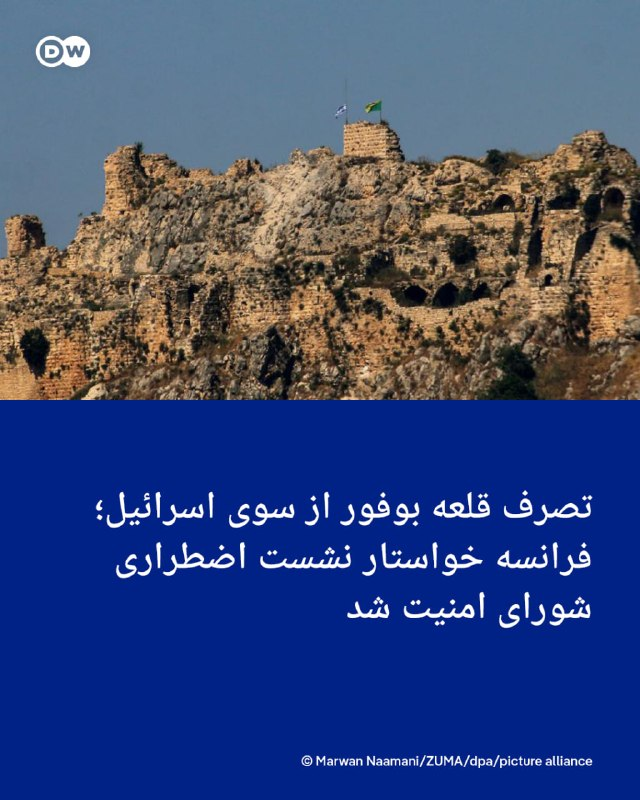

🔶 تصرف قلعه بوفور از سوی اسرائیل؛ فرانسه خواستار نشست اضطراری شورای امنیت شد
 
ژان-نوئل بارو، وزیر خارجه فرانسه، اعلام کرد پاریس پس از تصرف قلعه بوفور در لبنان توسط ارتش اسرائیل، خواستار برگزاری نشست اضطراری شورای امنیت سازمان ملل شده است. او گفت فرانسه حق اسرائیل برای دفاع از خود را به رسمیت می‌شناسد، اما ادامه عملیات نظامی اسرائیل در لبنان و گسترش حضور آن در خاک این کشور را غیرقابل توجیه می‌داند.
 
به گزارش العربیه انگلیسی، بارو در این باره گفت هیچ چیز نمی‌تواند ادامه عملیات نظامی اسرائیل در لبنان و عمیق‌تر شدن اشغال خاک این کشور را توجیه کند.
 
دنی دانون، نماینده اسرائیل در سازمان ملل، در واکنش به درخواست فرانسه گفت بحث واقعی در شورای امنیت باید درباره شکست مداوم در اجرای قطعنامه ۱۷۰۱ باشد؛ قطعنامه‌ای که پس از جنگ سال ۲۰۰۶ میان اسرائیل و حزب‌الله تصویب شد و بر اساس آن، حزب‌الله باید به شمال رود لیتانی عقب می‌رفت.
 
او گفت حزب‌الله سال‌هاست قطعنامه‌های سازمان ملل را آشکارا نقض کرده، با حمایت ایران مسلح شده و تهدیدی مستقیم برای غیرنظامیان اسرائیلی و ثبات منطقه ایجاد کرده است.
 
@dw_farsi

## DW_Farsi — post 125350

  <a href="telegram/content/DW_Farsi_125350_1780257581.mp4" target="_blank">🎬 Download video</a>

🎥 پیدا شدن بخشی از مجسمه آسیب‌دیده تخت مرمر کاخ گلستان
 
براساس تصاویری که به‌تازگی در شبکه‌های اجتماعی منتشر شده، مرمت‌گران کاخ گلستان روز ۱۸ فروردین ۱۴۰۵ در جریان مرمت تخت مرمر، قطعه "سر فرشته" یکی از مجسمه‌های این اثر تاریخی را که از بدنه جدا شده بود، در میان آوار پیدا کردند.
 
تخت مرمر از آثار دوره فتحعلی‌شاه قاجار در کاخ‌موزه گلستان است که از ۶۵ قطعه مرمر زرد ساخته شده و در گذشته برای مراسم رسمی و تاج‌گذاری مورد استفاده قرار می‌گرفت. رضاشاه پهلوی نیز تاج‌گذاری خود را در این محل برگزار کرد. این اثر تاریخی در پی موج انفجار ناشی از حملات هوایی ائتلاف نظامی آمریکا و اسرائیل به مناطقی در نزدیکی کاخ گلستان در شامگاه دهم اسفند ۱۴۰۴ آسیب دیده بود.
@dw_farsi

## DW_Farsi — post 125349

  

🔶 گزارش‌هایی از حمله موشکی ایران به اقلیم کردستان
 
یک مقام حزب "آزادی کردستان" گفته است امروز یکشنبه ۱۰ خرداد (۳۱ مه) یکی از پایگاه‌های اصلی وابسته به این گروه مخالف حکومت ایران در نزدیکی اربیل در عراق هدف حمله موشکی قرار گرفته است. این مقام، مسئولیت حمله را متوجه ایران دانسته است.
 
هم‌زمان، رسانه‌های دولتی ایران گزارش دادند نیروهای زمینی سپاه پاسداران به پایگاه‌های گروه‌های کرد در شمال عراق حمله کرده‌اند.
 
در این گزارش‌ها اشاره شده که محل دقیق حمله‌ها روشن نیست و مشخص نشده کدام پایگاه‌ها هدف قرار گرفته‌اند.
 
سپاه پاسداران در ماه‌های اخیر بارها مقر احزاب کرد در اقلیم کردستان را هدف حملات هوایی و پهپادی قرار داده است.
@dw_farsi

## DW_Farsi — post 125348

  

🔶 افزایش ۴۰ درصدی خدمات تدفین در بهشت زهرای تهران
 
مصوبه جدید نرخ بهای خدمات در بهشت‌زهرا نشان می‌دهد تعرفه خدمات مختلف، از حمل متوفی و تغسیل تا تکفین، تدفین و برگزاری مراسم، به‌طور متوسط حدود ۴۰ درصد افزایش یافته است. بر اساس این گزارش، در برخی موارد نیز میزان افزایش قیمت‌ها به ۵۰ درصد رسیده است.
 
به گزارش دیده‌بان ایران، هزینه انتقال هر متوفی از سطح شهر تهران تا شعاع ۱۰ کیلومتری به ۹ میلیون و ۷۵۰ هزار ریال رسیده است؛ رقمی که نشان‌دهنده افزایش ۵۰ درصدی این سرویس است.
 
نرخ حمل متوفی به پزشکی قانونی کهریزک نیز از این افزایش مستثنا نمانده و به ازای هر کیلومتر اضافه، افزایش یافته است. در نتیجه، هزینه انتقال در این مسیر نیز نسبت به قبل بالاتر رفته و بار مالی بیشتری بر خانواده‌ها تحمیل می‌کند.
 
در میان خدمات مختلف، آمبولانس خصوصی بیشترین رشد تعرفه را داشته است.
 
این تغییرات در مجموع نشان می‌دهد هزینه خدمات مرتبط با انتقال و رسیدگی به متوفیان در تهران وارد مرحله تازه‌ای از افزایش شده و بخش مهمی از خدمات بهشت‌زهرا با نرخ‌های بالاتری محاسبه خواهد شد.
@dw_farsi

## Persian_Trend_Official — post 15417

  <a href="telegram/content/Persian_Trend_Official_15417_1780257584.webm" target="_blank">🎬 Download video</a>

https://youtube.com/live/KH1FJLD8MjM?feature=share

## Persian_Trend_Official — post 15416

تا دقایقی دیگه لایو داریم

## Persian_Trend_Official — post 15415

  <a href="telegram/content/Persian_Trend_Official_15415_1780257584.mp4" target="_blank">🎬 Download video</a>

خبرگزاری CNN: ایران علیرغم بمباران گسترده آمریکا و اسرائیل، در کمتر از دو ماه دسترسی به اکثر پایگاه‌های موشکی زیرزمینی خود را بازیابی کرده است.

در طول جنگ، ایالات متحده و اسرائیل با تخریب جاده‌های دسترسی و فرو ریختن ورودی‌های تونل، زیرساخت‌های موشکی زیرزمینی ایران را هدف قرار دادند. اما از زمان آتش‌بس، تهران به سرعت اقدام کرده است. از 69 ورودی تونل در 18 تأسیسات زیرزمینی مورد حمله، 50 مورد از آنها تاکنون پاکسازی شده‌اند.

تصاویر ماهواره‌ای نشان می‌دهد که تلاش برای بازیابی به چیزی پیچیده‌تر از بولدوزرها، بیل مکانیکی‌ها و کامیون‌های کمپرسی متکی نیست. جاده‌ها در اکثر سایت‌ها بازسازی شده‌اند و برخی از بخش‌ها از قبل آسفالت شده‌اند.

منابع متعدد به CNN گفتند که بازیابی بسیار ارزان‌تر و ساده‌تر از خود حملات بوده است. تیمور کادیشف، محقق دانشگاه هامبورگ، گفت: "شما باید از سلاح‌های بسیار پیچیده و گران‌قیمت برای ایجاد چنین خسارتی استفاده کنید و تنها چیزی که برای تعمیر آن نیاز دارید بولدوزرها هستند."

📝 Amir

📌 @persian_trend_official
پرشین ترند | متفاوت‌ترین کانال نظامی

## Persian_Trend_Official — post 15414

  

شایعه استعفای رئیس‌جمهور هیچ نسبتی با واقعیت ندارد‏

«الیاس حضرتی» رئیس شورای اطلاع‌رسانی دولت:

🔹 رئیس‌جمهور ‌پزشکیان⁩ با تمام توان مشغول پیگیری امور کشور و خدمت به مردم است

🔹 ‏برای چندمین بار در ماه‌های اخیر، برخی رسانه‌های خارجی و شبکه‌های همسو با آنها شایعه استعفای رئیس‌جمهور را مطرح کرده‌اند، شایعه‌ای که هیچ نسبتی با واقعیت ندارد و پیش از این نیز بارها تکذیب شده است.

🔹 ‏به نظر می‌رسد طراحان این اخبار بیش از آنکه در پی اطلاع‌رسانی باشند، در آرزوی ایجاد ناامیدی، اختلاف و شکاف در انسجام ملی هستند که البته ناکام خواهند ماند.

🔹 ‏ملت ایران⁩ نشان داده است که در بزنگاه‌های مهم، فارغ از تفاوت دیدگاه‌ها، برای حفظ منافع ملی و سربلندی کشور در کنار یکدیگر می‌ایستد. آرزوی شکستن وحدت این ملت و گسستن پیوند دولت و مردم، همانند گذشته، محقق نخواهد شد.

👺Phantom

📌 @persian_trend_official
پرشین ترند | متفاوت‌ترین کانال نظامی

## Persian_Trend_Official — post 15413

  <a href="telegram/content/Persian_Trend_Official_15413_1780257586.webm" target="_blank">🎬 Download video</a>

یک منبع آگاه در دولت: اینترنشنال، کارخانه تولید اکاذیب درباره پزشکیان و دیگران است

▪️ یک منبع آگاه در دولت در گفتگو با تسنیم با اشاره به شایعه‌سازی «اینترنشنال»، رسانه وابسته به موساد، درباره استعفای آقای پزشکیان، رئیس‌جمهور، تاکید کرد: اینکه این رسانه ضدایرانی کارخانه تولید اکاذیب درباره ایران است دیگر بر کسی پوشیده نیست، لذا طبیعی است که کسی شایعات او را هم باور نکند.

▪️ وی خاطرنشان کرد: آقای رئیس‌جمهور استعفایی نداده، امروز مشغول کار بوده و برنامه‌های آتی او نیز طبق روال برگزار خواهد شد.

▪️ این منبع آگاه تصریح کرد: این قبیل شایعه‌سازی‌ها با دو هدف عمده صورت می‌گیرد؛ نخست: خبرسازی برای کسب اطلاعات امنیتی به نفع موساد و سیا و دوّم: اختلاف‌افکنی و شکستن انسجام مقدس اجتماعی در ایران.

▪️ وی تاکید کرد: منابع آگاه اینترنشنال، معمولاً محصول تخیلات و فانتزی‌های گردانندگان این شبکه هستند و وجود خارجی ندارند.

👺Phantom

📌 @persian_trend_official
پرشین ترند | متفاوت‌ترین کانال نظامی

## Persian_Trend_Official — post 15412

  

ادعای ایران اینترنشنال: مسعود پزشکیان بخاطر ورود سپاه به تمامی مسائل کشور و دخالت در کارای دولت نامه استعفا خودشو به مجتبی خامنه‌ای تحویل داد.

👺Phantom

📌 @persian_trend_official
پرشین ترند | متفاوت‌ترین کانال نظامی

## Persian_Trend_Official — post 15411

  

بلومبرگ: ایالات متحده اعلام کرده است که هرگونه توافق با ایران برای عبور امن از تنگه هرمز ممنوع است، حتی اگر این توافق شامل پرداخت پول یا عوارض نباشد.

به گزارش بلومبرگ وزارت خزانه‌داری آمریکا در بیانیه‌ای که در 29 مه منتشر شد تأکید کرد: صرف‌نظر از اینکه پرداختی انجام شود یا نه، اشخاص آمریکایی از دریافت هرگونه خدمات از دولت ایران منع شده‌اند، از جمله خدمات مربوط به تضمین عبور ایمن.

این تصمیم در حالی اتخاذ شده که تنش‌ها میان آمریکا و ایران ادامه دارد و موضوع عبور کشتی‌ها از تنگه هرمز به یکی از مسائل اصلی تبدیل شده است.

بر اساس این دستور شرکت‌ها و افراد آمریکایی نمی‌توانند برای عبور امن با ایران مذاکره کنند، حتی دریافت تضمین امنیت بدون پرداخت پول هم ممنوع است، پرداخت عوارض یا هزینه به ایران نیز مشمول تحریم‌ها می‌شود

این اقدام نشان می‌دهد که واشنگتن عملاً هیچ‌گونه نقش یا اختیار ایران در کنترل عبور و مرور در تنگه هرمز را به رسمیت نمی‌شناسد.

📝 Amir

📌 @persian_trend_official
پرشین ترند | متفاوت‌ترین کانال نظامی

## Persian_Trend_Official — post 15410

  <a href="telegram/content/Persian_Trend_Official_15410_1780257587.webm" target="_blank">🎬 Download video</a>

🇺🇸
🇹🇭
⚡️ — ایالات متحده و تایلند در حال مذاکره بر سر یک توافق بلندمدت جدید برای عرضه گاز طبیعی مایع‌شده آمریکا هستند، زیرا نگرانی‌ها درباره امنیت انرژی پس از آسیب به زیرساخت‌های LNG قطر و ناپایداری در اطراف تنگه هرمز در جریان جنگ ایران افزایش یافته است، رویترز گزارش می‌دهد.

➡️ مذاکرات بر روی یک قرارداد الزام‌آور بلندمدت بین شرکت Venture Global و شرکت دولتی انرژی تایلند، PTT Public Company Limited، متمرکز است.

➡️ قراردادهای مورد بحث احتمالاً برای ۱۵ سال یا بیشتر اجرا خواهند شد، اگرچه حجم‌ها و زمان‌بندی‌های دقیق اعلام نشده است.

👺Phantom

📌 @persian_trend_official
پرشین ترند | متفاوت‌ترین کانال نظامی

## Persian_Trend_Official — post 15409

  

رسانه‌های اسرائیلی: یک پایگاه نظامی در شمال هایمک (مرج بن عامر) هدف پهپادی قرار گرفت.

تا به این لحظه ۶ زخمی در «بیت هیل» از جمله ۳ نفر در وضعیت بحرانی قرار دارند
هلیکوپترهای ارتش در حال انتقال مجروحان در میان نیروهای ارتش در نزدیکی «بیت هلیل» هستند.

👺Phantom

📌 @persian_trend_official
پرشین ترند | متفاوت‌ترین کانال نظامی

## Persian_Trend_Official — post 15408

  

🇮🇷
🇮🇷 حملات موشکی سپاه به سمت اقلیم کردستان، عراق. 
🚀
🚀
🚀
🚀 
👺Phantom 📌 @persian_trend_official پرشین ترند | متفاوت‌ترین کانال نظامی

## Persian_Trend_Official — post 15407

  <a href="telegram/content/Persian_Trend_Official_15407_1780257589.webm" target="_blank">🎬 Download video</a>

صادرات تخم مرغ ممنوع شد. طبق نامه معاونت توسعه بازرگانی وزارت جهاد کشاورزی به مدیرکل دفتر صادرات سازمان توسعه تجارت و گمرک، صادرات تخم‌مرغ خوراکی تا اطلاع ثانوی ممنوع شد .🫆: Ⓜ 🆔:@persian_trend_official پرشین ترند | متفاوت‌ترین کانال نظامی

## Persian_Trend_Official — post 15406

  

🇮🇷
🇮🇷 حملات موشکی سپاه به سمت اقلیم کردستان، عراق.

🚀
🚀
🚀
🚀

👺Phantom

📌 @persian_trend_official
پرشین ترند | متفاوت‌ترین کانال نظامی

## Persian_Trend_Official — post 15403

  <a href="telegram/content/Persian_Trend_Official_15403_1780257590.webm" target="_blank">🎬 Download video</a>

وقتی روحانیت و ایدئولوژی برای پوشش مردم تصمیم‌گیری می‌کنند، نتیجه‌اش می‌شود چنین فاجعه‌ای. قطعاً خانم سخنگو در استایل شخصی خودش می‌تواند بسیار مرتب‌تر و آراسته‌تر ظاهر شود؛ اما آن چیزی که حراست، اجبار و ایدئولوژی حکومتی بر پوشش زنان در جمهوری اسلامی تحمیل…

## Persian_Trend_Official — post 15402

  

وقتی روحانیت و ایدئولوژی برای پوشش مردم تصمیم‌گیری می‌کنند، نتیجه‌اش می‌شود چنین فاجعه‌ای.

قطعاً خانم سخنگو در استایل شخصی خودش می‌تواند بسیار مرتب‌تر و آراسته‌تر ظاهر شود؛ اما آن چیزی که حراست، اجبار و ایدئولوژی حکومتی بر پوشش زنان در جمهوری اسلامی تحمیل می‌کند، در نهایت چنین تصویری از ایران می‌سازد؛ تصویری زشت، تحقیرآمیز و دور از شأن تمدنی چند هزار ساله که قرار است در برابر نگاه جهان نماینده ایران باشد.

تلخ‌تر اینکه ایشان قرار است ویترین «زن مطلوب جمهوری اسلامی» در رسانه‌ها باشد؛ اما همین تصویر نشان می‌دهد وقتی حکومت به‌جای انتخاب آزادانه، پوشش را به ابزار ایدئولوژی تبدیل می‌کند، نتیجه نه وقار است، نه هویت، نه زیبایی؛ بلکه یک نمایش تحمیلی و ضدتصویر از زن ایرانی است.

📌 @persian_trend_official
پرشین ترند | متفاوت‌ترین کانال نظامی

## Persian_Trend_Official — post 15401

  

دیده شدن یک شناور ایرانی با نام دریافت‌کننده عوارض سپاه در تنگه هرمز!

📝 Amir

📌 @persian_trend_official
پرشین ترند | متفاوت‌ترین کانال نظامی

## RadioFarda — post 157752

🔸حسن آقاخانی، وکیل دادگستری، روز یکشنبه خبر داد که مسعود پیاهو، موکل او، به اتهام فیلم گرفتن از معترضی که در جریان اعتراضات دی‌ماه سال گذشته مقابل مأموران پلیس ایران در خیابان روی زمین نشسته بود، به ۱۰ سال زندان محکوم شده است. 🔸او به امتداد گفت که بازداشت…

## RadioFarda — post 157751

  <a href="telegram/content/RadioFarda_157751_1780257591.mp4" target="_blank">🎬 Download video</a>

🔸حسن آقاخانی، وکیل دادگستری، روز یکشنبه خبر داد که مسعود پیاهو، موکل او، به اتهام فیلم گرفتن از معترضی که در جریان اعتراضات دی‌ماه سال گذشته مقابل مأموران پلیس ایران در خیابان روی زمین نشسته بود، به ۱۰ سال زندان محکوم شده است.

🔸او به امتداد گفت که بازداشت آقای پیاهو به پیش از هجدهم و نوزدهم دی سال گذشته برمی‌گردد.

🔸این وکیل توضیح داده است: «موکل من در حال کار در بازاری بودند که به خیابان جمهوری مشرف بوده است. شخصی در مقابل مامورین نیروی انتظامی، می‌نشیند و مسعود یک فیلم کوتاه به صورت ناخودآگاه از آن صحنه ضبط می‌کند.»

🔸او اعلام کرد که مسعود پیاهو قصد انتشار «عمومی» این ویدئو را نداشته و آن را در «استوری پرایوت» صفحه اینستاگرام خود منتشر کرد اما سپس شخص دیگری آن را به شکل عمومی منتشر کرد.

🔸انتشار این ویدئو از فردی که روز هشتم دی‌ماه و در دومین روز اعتراضات به تنهایی مقابل مأموران انتظامی روی زمین نشسته بود، به شکل گسترده منتشر شد، بازتاب‌های فراوانی ایجاد کرد و به یکی از نمادهای این اعتراض‌ها تبدیل شد.

@RadioFarda

## RadioFarda — post 157750

🔸طالبان با قانون جدید طلاق، به‌طور ضمنی ازدواج کودکان را به رسمیت شناخته است.

🔸بر اساس این قانون، دختران ازدواج‌کرده در کودکی فقط پس از رسیدن به سن بلوغ می‌توانند درخواست جدایی بدهند؛ در این سن نیز اگر اعتراضی نکنند، سکوتشان به‌معنای رضایت تلقی می‌شود.

🔸سازمان ملل این فرمان را گامی دیگر در تضعیف حقوق زنان و دختران افغان دانسته و آن را نشانه‌ای از مجاز بودن ازدواج کودکان توصیف کرده است.

🔸طبق این قانون، حتی در صورت بدرفتاری شوهر، دختر برای فسخ ازدواج باید ادعای خود را در دادگاه ثابت کند؛ در غیر این صورت، رأی به نفع شوهر صادر می‌شود.

🔸فعالان حقوق زنان می‌گویند در افغانستانِ تحت حاکمیت طالبان، با محدودیت‌های شدید علیه زنان و تابوی اجتماعی طلاق، دسترسی دختران خردسال به عدالت عملاً بسیار دشوار است.

@RadioFarda

## RadioFarda — post 157749

  <a href="https://t.me/radiofarda/157749" target="_blank">📎 Download file</a>

📻بشنوید: ایستگاه ۱۹ با رادیوفردا، دهم خرداد ۱۴۰۵

@RadioFarda

## RadioFarda — post 157748

پزشکیان: تداوم فشارهای خارجی اداره کشور را پیچیده کرده است

🔸مسعود پزشکیان، رئیس‌جمهور ایران، روز یکشنبه گفت فشارهای خارجی و محدود شدن دسترسی دولت به منابع اقتصادی باعث مشکلاتی در اداره کشور شده است.

🔸محاصره دریایی آمریکا علیه بنادر ایران که از اواخر فروردین با دستور رئیس‌جمهور ایالات متحده آغاز شده است، بر اساس گزارش‌ها باعث کاهش شدید صادرات نفت و سقوط درآمدهای ارزی دولت جمهوری اسلامی شده است. این محاصره که توسط نیروهای نظامی آمریکا اعمال می‌شود، حرکت کشتی‌های تجاری از مبدأ و به مقصد ایران را محدود کرده است.

🔸پزشکیان در جلسه هیئت دولت جمهوری اسلامی با اشاره به این که محدودیت‌های بیرونی دلیل بخشی از مشکلات اقتصادی است، گفت: «تداوم برخی محدودیت‌ها و فشارهای خارجی، به‌ویژه در حوزه دسترسی به منابع و ظرفیت‌های اقتصادی، پیچیدگی‌های خاصی را برای اداره کشور ایجاد کرده است.»

🔸او در ادامه خواستار آن شد که مردم درباره «واقعیت‌های موجود» مطلع شوند و گفت که «جامعه باید نسبت به الزامات و هزینه‌های مقاومت آگاه باشد».

🔸این در حالی است که بر اساس گزارش‌ها، دونالد ترامپ، رئیس‌جمهور آمریکا، تفاهم‌نامه برای تمدید آتش‌بس با ایران را با شرایطی «سخت‌تر» دوباره به تهران فرستاده است.

🔸او همچنین تهدید کرده که اگر توافق با ایران مطابق میل واشینگتن نباشد و باعث جلوگیری از دسترسی ایران به سلاح هسته‌ای نشود، احتمال ازسرگیری اقدام نظامی وجود دارد.

@RadioFarda

## RadioFarda — post 157747

🔸ارتش اسرائیل روز یک‌شنبه ۱۰ خرداد اعلام کرد عملیات زمینی خود در جنوب لبنان را به مناطق بیشتری گسترش داده و نیروهایش برای تقویت مواضع نظامی اسرائیل در این منطقه از رود لیتانی هم عبور کرده‌اند.

🔸مقام‌های ارشد اسرائیلی از تصرف یک قلعه مهم در جنوب لبنان خبر دادند و در واکنش به این اتفاق، فرانسه خواستار برگزاری جلسه اضطراری شورای امنیت سازمان ملل شد.

🔸ارتش اسرائیل در بیانیه‌ای گفت «شمار قابل توجهی» از نیروهای زمینی این کشور عملیات تهاجمی را برای گسترش «خط دفاعی پیشرو» آغاز کرده‌اند و این عملیات اکنون به مناطق بیشتری توسعه داده شده است.

🔸این اعلامیه دو روز پس از آن منتشر شد که بنیامین نتانیاهو، نخست‌وزیر اسرائیل، گفت نیروهای اسرائیلی از رود لیتانی، در حدود ۳۰ کیلومتری شمال مرز مشترک اسرائیل و لبنان، عبور کرده‌اند.

🔸همزمان، وزیر دفاع اسرائیل، اعلام کرد ارتش این کشور قلعه شقیف (بوفور)، دژ راهبردی قرون وسطایی در جنوب لبنان، را تصرف کرده و پرچم اسرائیل را بر فراز آن برافراشته است. او این منطقه را «یکی از مهم‌ترین نقاط راهبردی» برای دفاع از شهرک‌های الجلیل و امنیت نیروهای اسرائیلی توصیف کرد.

@RadioFarda

## IranianMinds — post 21161

  

مسعود پیاهو، مردی که تصویر معترض نشسته مقابل نیروهای پلیس یگان ویژه در مقابل پاساژ علاالدین در آغاز اعتراضات دی ماه سال گذشته رو منتشر کرد، به گفته وکیلش به ۱۰ سال زندان محکوم شده!

@IranianMinds

## IranianMinds — post 21160

  

ویدیوی پشم ریزون از لحظه‌ی حمله آمریکا با موشک تاماهاک به بیت رهبری رو از «کلوز فرند» ببینید: 
🔥

@CloseFriend3
@CloseFriend3

## IranianMinds — post 21159

  <a href="telegram/content/IranianMinds_21159_1780257594.mp4" target="_blank">🎬 Download video</a>

🔴محمد‌جواد ظریف در پاسخ به سؤال میگن شما پشت پرده مذاکرات هستید، گفت:
من اصلأ هیچکاره ‌ام.

@IranianMinds

## IranianMinds — post 21158

🔴ایران اینترنشنال: پزشکیان به دلیل "تسلط کامل فرماندهان سپاه بر اداره کشور" استعفا داد. @IranianMinds

## IranianMinds — post 21157

  

🔴ایران اینترنشنال:

پزشکیان به دلیل "تسلط کامل فرماندهان سپاه بر اداره کشور" استعفا داد.

@IranianMinds

## IranianMinds — post 21155

  

🔴 چند روز پیش دو تا داداش اسرائیلی دستگیر شدن

حالا دلیلش چی بوده ؟ با کمک چت جی پی تی و گوگل‌مپ میومدن اطلاعات ساختگی از خودشون در میاوردن و میفروختن به جمهوری اسلامی در طول جنگ این کسخلام باور کرده بودن و نمیدونسن اصلا چیه و بر طبق اطلاعات اینا میومدن موشک پرتاب میکردن به سمت مختصاتی که اینا میدادن :)))

@IranianMinds

## IranianMinds — post 21154

  

مسعود پیاهو، مردی که تصویر معترض نشسته مقابل نیروهای پلیس یگان ویژه در مقابل پاساژ علاالدین در آغاز اعتراضات دی ماه سال گذشته رو منتشر کرد، به گفته وکیلش به ۱۰ سال زندان محکوم شده!

@IranianMinds

## IranianMinds — post 21153

  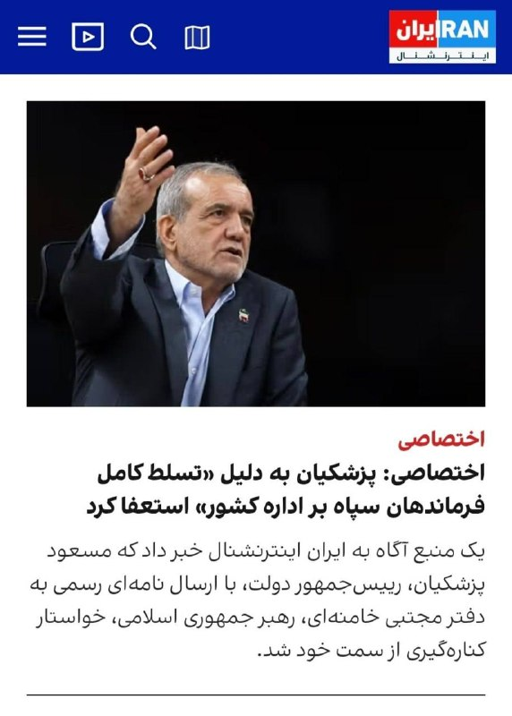

@IranianMinds

## IranianMinds — post 21152

🔴 مهاجرانی، سخنگوی دولت:
قالیباف کسی است که فرمانده میدان بوده و عراقچی هم رزمنده زمان جنگ است، بنابراین تمام کسانی که الان درگیر مذاکره هستن، میدان رو به‌خوبی درک می‌کنند.

نیروهای مسلح ایران همچنان دست‌به‌ماشه هستن و تیم دیپلماسی با همین نگاه، مذاکرات رو دنبال میکنه.

@IranianMinds

## IranianMinds — post 21151

🔴 اسکات بسنت، وزیر خزانه‌داری آمریکا: فشارها بر ایران و جلوگیری از صادرات نفت از جزیره خارک ادامه دارد.

@IranianMinds

## IranianMinds — post 21150

  

استایل جدید و متفاوت صابر ابر

@IranianMinds

## IranianMinds — post 21149

کانالی که همیشه در مسیر ورشکست کردن سایت های شرطبندی حرکت کرده! 😈

آمار ثابت 90 درصد برد ✅
فقط کافیه چند روز فرم هاش رو دنبال کنید...
⚽ @Tipster_Mafiaa   @Tipster_Mafiaa
⚽ @Tipster_Mafiaa      @Tipster_Mafiaa

## IranianMinds — post 21148

  

میکس عالی برد شد🖤☑️
✔️@Tipster_Mafiaa

## IranianMinds — post 21147

  <a href="telegram/content/IranianMinds_21147_1780257597.mp4" target="_blank">🎬 Download video</a>

اکانت اسرائیل به فارسی:

جدی چرا دفنش نمی‌کنند؟؟😂😂😂

@IranianMinds

## BBCPersian — post 282512

🔻 شورای امنیت به درخواست فرانسه «درمورد گسترش حمله اسرائیل به لبنان» جلسه اضطراری برگزار می‌کند

منابع دیپلماتیک به خبرگزاری فرانسه گفتند که شورای امنیت سازمان ملل متحد روز دوشنبه درمورد گسترش حمله اسرائیل به لبنان، پس از تصرف قلعه تاریخی شقیف (بوفور)، جلسه اضطراری برگزار خواهد کرد.

این منابع گفتند که این جلسه به درخواست فرانسه و بلافاصله پس از جلسه اضطراری درمورد اصابت یک پهپاد روسیه به آپارتمانی در رومانی خواهد بود.

پیشتر، وزیر امور خارجه فرانسه گفت که پس از تصرف قلعه شقیف (بوفور) در لبنان به دست نیروهای اسرائیل، خواستار برگزاری نشست اضطراری شورای امنیت سازمان ملل شده است.

ژان نوئل بارو به شبکه «بی‌اف‌ام تی‌وی» گفت: «با وجود آنکه حق دفاع مشروع اسرائیل را مانند هر کشوری به رسمیت می‌شناسیم، هیچ چیز نمی‌تواند ادامه عملیات نظامی اسرائیل و پیشروی هرچه بیشتر در خاک لبنان را توجیه کند.»

وزیر دفاع اسرائیل امروز در پستی در شبکه تلگرام نوشت: «۴۴ سال پس از نبرد قهرمانانه بوفور و در روزی که یادآور سربازان کشته‌ شده در جنگ اول لبنان (۱۹۸۲) است، نیروهای ما بار دیگر به این قلعه بازگشتند و پرچم اسرائیل را برافراشتند.»

این قلعه ۹۰۰ ساله که متعلق به قرون وسطی است، دید وسیعی بر جنوب لبنان دارد و از نظر نظامی بسیار مهم محسوب می‌شود.

https://trib.al/kde10vW
@BBCPersian

## BBCPersian — post 282511

🔻 تام باراک فرستاده ویژه ترامپ در امور سوریه و عراق شد

دونالد ترامپ، امروز تام باراک، سفیر آمریکا در ترکیه، را با حفظ پست کنونی، به عنوان فرستاده ویژه رئیس‌جمهور آمریکا در امور سوریه و عراق هم منصوب کرد.

دونالد ترامپ با اعلام این خبر در شبکه اجتماعی تروث سوشال از عملکرد آقای باراک در سمت سفیر آمریکا در ترکیه تمجید کرد: «تام باراک به عنوان سفیر آمریکا در ترکیه باقی خواهد ماند و با حمایت کامل وزارت امور خارجه ایالات متحده فعالیت خواهد کرد.»

او نوشت: «همکاری استراتژیک آمریکا با دولت‌های سوریه و عراق، و روابطش با این کشورها همچنان در حال گسترش است.»

https://trib.al/xnR5A7T
@BBCPersian

## BBCPersian — post 282510

  <a href="telegram/content/BBCPersian_282510_1780257598.mp4" target="_blank">🎬 Download video</a>

آخرین خبرهای مهم روز یکشنبه ۱۰ خرداد ۱۴۰۵

@BBCPersian

## BBCPersian — post 282509

  <a href="https://t.me/bbcpersian/282509" target="_blank">📎 Download file</a>

📻پادکست جام جهان‌نما، یکشنبه ۱۰ خرداد ۱۴۰۵

پادکست جام جهان‌نما، یکشنبه ۱۰ خرداد ۱۴۰۵ این برنامه رادیویی را می‌توانید هرشب ساعت ۲۰ به وقت ایران، روی موج متوسط ۷۰۲ کیلوهرتز و موج کوتاه۹۴۶۵ کیلوهرتز بشنوید.

تکرار برنامه را هم می‌توانید ساعت ۲۱:۳۰ روی موج متوسط ۷۰۲ کیلوهرتز و موج کوتاه ۵۳۹۵ کیلوهرتز گوش کنید.

@BBCPersian

## BBCPersian — post 282508

🔻بر اساس گزارش‌ها وقوع انفجاری در منطقه تحت کنترل شورشیان میانمار بیش از پنجاه نفر را کشته است.

این انفجار در ایالت شان، نزدیک مرز چین، رخ داده است. تصاویر نشان می‌دهد که دود غلیظی به آسمان بلند شده و ساختمان‌ها در منطقه‌ای وسیع تخریب شده‌اند.

محل انفجار نزدیک شهر نام خام است که در کنترل ارتش آزادی‌بخش ملی تانگ یکی از قدرتمندترین گروه‌های مسلح مخالف دولت نظامی میانمار است.

برخی گزارش‌ها حاکی است که انفجار در یک انبار مهمات رخ داده است اما شورشیان می‌گویند که این انفجار ناشی از انفجار تصادفی مواد منفجره بوده است.

@BBCPersian

## BBCPersian — post 282507

  <a href="telegram/content/BBCPersian_282507_1780257601.mp4" target="_blank">🎬 Download video</a>

رژه پیروزی آرسنال با شور و هیجان در حال برگزاری است و بازیکنان با اتوبوس‌های روباز در شمال لندن حرکت می‌کنند .
 
دود قرمز هوا را پر کرده است زیرا هزاران هوادار برای پیوستن به جشن‌ها در خیابان‌ها صف کشیده‌اند.
 
یکی از هواداران، جرالدین، به ما می‌گوید: «تیم ما دوباره به اوج رسیده است.» دیگری، لی، می‌گوید: «من 20 سال برای این لحظه صبر کردم.»
 
همچنین تیم زنان آرسنال که در ماه فوریه اولین جام قهرمانان زنان را بالای سر برد، در این رژه جشن می‌گیرند.
 
یکی از هواداران جوان به بی‌بی‌سی می‌گوید: «من داشتم برای [آلسیا] روسو دست تکان می‌دادم، او هم دست تکان داد.»
 
جشن‌های امروز پس از فینال نفس‌گیر لیگ قهرمانان اروپا در روز شنبه برگزار می‌شود که در آن پاری سن ژرمن در ضربات پنالتی آرسنال را شکست داد.

@bbcpersian

## BBCPersian — post 282506

  <a href="telegram/content/BBCPersian_282506_1780257602.mp4" target="_blank">🎬 Download video</a>

🔻سرخط خبرهای روز یکشنبه، ۱۰ خرداد ۱۴۰۵

https://trib.al/Clx2mh7
@BBCPersian

## BBCPersian — post 282505

  

🔻مسعود پیاهو، مردی که تصویر معترض نشسته مقابل نیروهای پلیس یگان ویژه در مقابل پاساژ علاالدین در آغاز اعتراضات دی ماه سال گذشته را منتشر کرد، به گفته وکیلش به ۱۰ سال زندان محکوم شده است.

این ویدیو در آن زمان بازتاب گسترده‌ای در رسانه‌ها و شبکه‌های اجتماعی داشت.

حسن آقاخانی، وکیل مسعود پیاهو به سایت خبری امتداد در ایران گفت: «بازداشت موکل من به پیش از هجدهم و نوزدهم دیماه سال گذشته و اعتراضات اقتصادی در بازار برمی‌گردد. موکل من در حال کار در بازاری بودند که به خیابان جمهوری مشرف بوده است. شخصی در مقابل مامورین نیروی انتظامی، می‌نشیند و مسعود یک فیلم کوتاه به صورت ناخودآگاه از آن صحنه ضبط می‌کند.»

به گفته وکیل آقای پیاهو، «او به هیچ عنوان قصد انتشار ویدیو در بیرون از کشور را نداشته و صرفا برای یک تعداد مختصری از دوستانش در استوری خصوصی اینستاگرامش منتشر کرده است.»

با این وجود، به گفته این وکیل دادگستری، حکم ۱۰ سال حبس مسعود پیاهو که بر اساس قانون «تشدید مجازات جاسوسی و همکاری با رژیم صهیونیستی» صادر شده، در دیوان عالی کشور هم تایید شده و اکنون در آستانه اجرا قرار دارد.

@BBCPersian

## idfinfarsi — post 11687

  <a href="telegram/content/idfinfarsi_11687_1780257604.mp4" target="_blank">🎬 Download video</a>

‼️مستندات جدید: نیروهای یگان گشتی گولانی در قلعه بوفور

## idfinfarsi — post 11686

  <a href="telegram/content/idfinfarsi_11686_1780257605.mp4" target="_blank">🎬 Download video</a>

۹۰۰ تروریست حزب‌الله از زمان اجرای آتش‌بس به هلاکت رسیدند:

🔸ارتش اسرائیل از ساعات صبح امروز زیرساخت‌های سازمان تروریستی حزب‌الله را در صور و مناطق دیگر در جنوب لبنان مورد حمله قرار داد

🔸به موازات تعمیق فعالیت نیروهای ما در رشته‌کوه بوفور، ارتش اسرائیل از صبح امروز به انبارهای سلاح، مقرهای مستقر و زیرساخت‌های اضافی سازمان تروریستی حزب‌الله در منطقه صور و سایر مناطق جنوب لبنان حمله کرد.

🔸انبارهای هدف قرارگرفته توسط تروریست‌های این سازمان برای پیشبرد و اجرای طرح‌های تروریستی علیه نیروهای ارتش اسرائیل مورد استفاده قرار می‌گرفتند

## Dirty_Kids — post 390680

  <a href="telegram/content/Dirty_Kids_390680_1780257607.mp4" target="_blank">🎬 Download video</a>

دخترا تو اینستاگرام ديگه زیادی دارن با ما راحت میشن:

@Dirty_Kids 👻

## Dirty_Kids — post 390679

  

واکنش فیلد مارشال محسن رضایی به خبر استعفای پزشکیان 🤣

@Dirty_Kids 👻

## Dirty_Kids — post 390678

  

لانچر موشک‌های بالستیک جمهوری اسلامی.

@Dirty_Kids 👻

## Dirty_Kids — post 390677

زندگی برای قشر ما اینطوریه که اون زمان 5 تومن نداشتیم یه پراید بخریم ، بعد 10 تومن نداشتیم ، بعد 20 تومن نداشتیم
الانم یک میلیارد نداریم.
فرقی برا ما نکرده

اون موقع کمتر نداشتیم بخریم، بعد بیشتر نداشتیم بخریم، الان اصلا نداریم بخریم. :)

@Dirty_Kids 👻

## Dirty_Kids — post 390676

  

🔴 ماهی‌ای که به تازگی در ونزوئلا کشف شده و آقایون دائم در تلاشن تا بتونن صیدش کنن:|

@Dirty_Kids 👻

## Dirty_Kids — post 390675

  <a href="telegram/content/Dirty_Kids_390675_1780257609.mp4" target="_blank">🎬 Download video</a>

موافقید با نظر مرادمون در خصوص «بی‌بی»؟!

@Dirty_Kids 👻

## Dirty_Kids — post 390674

  

🔴 معاون دفتر پزشکیان: خبر استعفای رییس جمهور دروغه و پزشکیان همچنان به غصه خوردن ادامه میده.

@Dirty_Kids 👻

## Dirty_Kids — post 390673

  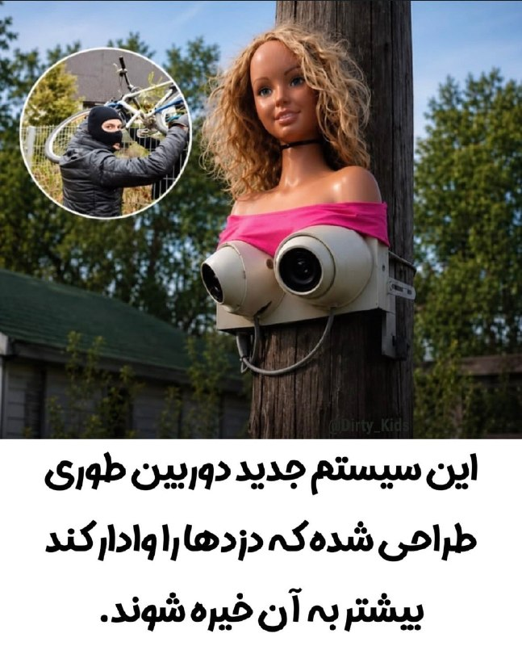

وقتی از عقلت استفاده میکنی🤣

@Dirty_Kids 👻

## Dirty_Kids — post 390672

  

رفسنجانی تو خاطراتش گفته بود: همه‌ی جوجه آخوندارو میندازن تو بشکه بهشون دخول میکنن هیچی دیگه خواستم بگم حق دارن از اون محیط پاشون به این محیط باز شده ذوق کنن داستان اینه که یکی گفته تو کافه چادری میبینم چندشم میشه این گوزوها مثلا دارن دیس‌بک میدن @Dirty_Kids…

## Dirty_Kids — post 390671

  

وکیل از اسمش محمد هستش

وکیل تراز :)))))))))))

@Dirty_Kids 👻

## Dirty_Kids — post 390670

  <a href="telegram/content/Dirty_Kids_390670_1780257611.mp4" target="_blank">🎬 Download video</a>

🔴 صحبتای ایشون خیلی وایرال شده و نظر خیلیارو جذب کرده.

جذاب‌ترین چیز توی این زمونه برای دخترا اینه که بهشون «نه» بگی! از بس اکثر مردا جلو دخترا خم شدن توقعات بالا رفته.
رفیق دخترِ من بعد از حموم استوری گذاشت از خودش و از ۳۰۰ فالور ۵۰ تا بهش دایرکت دادن! همین باعث میشه دخترا فکر کنن همه اونارو میخوان.
سر همین فکر میکنن هیچکس لایق این نیست باهاشون باشه و هر نفرو برای یه چیزی انتخاب میکنن، یه پسرو برای مسائل مالی، یکیو برای محبت، یکی برای مسئله جنسی و...

@Dirty_Kids 👻

## Dirty_Kids — post 390669

  <a href="telegram/content/Dirty_Kids_390669_1780257611.mp4" target="_blank">🎬 Download video</a>

آهنگ «بزن که خوب می‌زنی» 😂😂 از حامد فرد

@Dirty_Kids 👻

## Dirty_Kids — post 390668

  

دیده شده امروز در تهران:))))))))))))

@Dirty_Kids 👻

## Dirty_Kids — post 390667

  

🔴 ایران اینترنشنال: مسعود پزشکیان بخاطر ورود سپاه به تمامی مسائل کشور و دخالت در کارای دولت نامه استعفا خودشو به مجتبی خامنه‌ای تحویل داد.

@Dirty_Kids 👻

## Dirty_Kids — post 390666

  

عجب خایه‌ای دارید؛ یه وقت نگیرنتون، تو روز روشن با چادر توی سطح شهر تردد می‌کنید. فکر میکنم اینکه امثال اینا کافه رفتن رو افتخار میدونن ناشی از احساس طرد شدگی در جامعه‌ست که خودشون به این نتیجه رسیدن کافه جای اونا نیست  + با امریکا مبارزه میکنن با وسایل…

## Dirty_Kids — post 390664

  

🔴 طبق تحقیقات دانشگاه پنسیلوانیا آمریکا
🇺🇸، تو عرقِ زیر بغل مردها یه سری مواد شیمیایی هست که می‌تونه روی حال و بدن زن‌ها اثر مثبت بزاره؛

طِی این آزمایش، یه عصاره از عرق مردها رو به لب بالای خانم‌ها زدن و بعدش بعضی از خانم‌ها متوجه شدن استرسشون کمتر شده و حس آرامش بیشتری پیدا کردن.
این مواد روی بعضی هورمون‌های بدن خانم‌ها مثل هورمون‌های مرتبط با چرخه قاعدگی هم اثر می‌ذاره و همچنین باعث تسکین درد میشه.

@Dirty_Kids 👻

## Dirty_Kids — post 390663

  <a href="https://t.me/Dirty_Kids/390663" target="_blank">📎 Download file</a>

✅ اپلیکیشن اندروید سایت جهانی دربی بت

💰اولین سایت جهانی با امکان شارژ و برداشت ریالی(کارت به کارت)

🔗 برای ورود فیلترشکن روی کشور مناسب قرار دهید مانند فنلاند و المان و....

😀Telegram Channel
👇
https://t.me/+bcynkEgSW2dlYTc0

## Dirty_Kids — post 390662

  

😤دنبال یه سایت شرط بندی بین المللی بودی که به ایرانیا خدمات بده؟!
⛔

👍دربی بت همون انتخاب  100%

💎ویژگی های سایت جهانی Derby Bet:

⬅️امکان شارژ امن با کارت بانکی

⬅️واریز اول دوبل شارژ می شوید(بونوس۱۰۰٪)

⬅️پر اپشن ترین سایت فعال در ایران

⬅️تسویه حساب کمتر از 5 دقیقه

⬅️برگشت بخشی از باخت به صورت هفتگی

🚨کد هدیه ثبت نام:GG007

⚠️برای دانلود اپلکیشن کلیک کنید
👉

🔔کانال دربی بت :

🪙https://t.me/+bcynkEgSW2dlYTc0

## Hranews — post 113295

  

عدم رسیدگی پزشکی؛ اعزام بی‌نتیجه محشر پرندین به بیمارستان و تداوم محرومیت از درمان

❗️
❗️
❗️
❗️
❗️– محشر (محترم) پرندین، نوکیش مسیحی محبوس در زندان اوین، با وجود نیاز فوری به آنژیوگرافی قلب و جراحی تومورهای ناحیه گردن، از رسیدگی تخصصی پزشکی محروم مانده است. وی در هفته گذشته به بیمارستان اعزام شد، اما پس از انجام یک آزمایش، بدون دریافت خدمات درمانی یا تجویز دارو به زندان بازگردانده شد.

به گزارش خبرگزاری هرانا، ارگان خبری مجموعه فعالان حقوق بشر در ایران، محشر (محترم) پرندین کماکان از رسیدگی درمانی محروم است.

یک منبع مطلع از وضعیت این نوکیش مسیحی، ضمن تایید این موضوع به هرانا گفت: “خانم پرندین در هفته گذشته یک‌بار به بیمارستان اعزام شد، اما پس از انجام تنها یک آزمایش، بدون دریافت خدمات درمانی یا تجویز دارو، مجدداً به زندان بازگردانده شد. این در حالی است که بنا بر تشخیص پزشک بهداری زندان، وی نیازمند انجام آنژیوگرافی قلب و جراحی تومورهای موجود در ناحیه گردن است.”

ادامه مطلب

#محشر_پرندین #محترم_پرندین

↘️
@hranews_bot تماس ✉️ - @Hranews کانال هرانا 🆑

## Hranews — post 113294

  

محمد داوری از زندان عادل‌آباد شیراز آزاد شد

❗️
❗️
❗️
❗️
❗️– محمد داوری، زندانی سیاسی، امروز با پایان دوران محکومیت از زندان عادل‌آباد شیراز آزاد شد.

به گزارش خبرگزاری هرانا، ارگان خبری مجموعه فعالان حقوق بشر در ایران، محمد داوری آزاد شد.

براساس اطلاعات دریافتی هرانا، آقای داوری امروز یکشنبه ۱۰ خرداد ۱۴۰۵، با پایان دوران محکومیت خود از زندان عادل‌آباد شیراز آزاد شده است.

ادامه مطلب

#محمد_داوری

↘️
@hranews_bot تماس ✉️ - @Hranews کانال هرانا 🆑

## Hranews — post 113293

دستکم ۴ تجمع اعتراضی برگزار شد

❗️
❗️
❗️
❗️
❗️– امروز یکشنبه ۱۰ خرداد، جمعی از بازنشستگان تامین اجتماعی در شهرهای تهران، رشت و شوش و گروهی از کارگران شهرداری در شوش تجمع اعتراضی برگزار کردند.

ادامه مطلب

#کارگران #بازنشستگان

↘️
@hranews_bot تماس ✉️ - @Hranews کانال هرانا 🆑

## Hranews — post 113292

  

گزارشی از آخرین وضعیت سوری چگینی بابایی در زندان قزوین

❗️
❗️
❗️
❗️
❗️– سوری چگینی بابایی، زندانی سیاسی دوران محکومیت خود را در زندان قزوین سپری می‌کند. وی پیشتر، توسط دادگاه انقلاب قزوین به سه سال حبس و مجازاتهای تکمیلی محکوم شده بود. همچنین او بیش از ۱۴۰ روز است که از ملاقات با خانواده خود محروم مانده است.

به گزارش خبرگزاری هرانا، ارگان خبری مجموعه فعالان حقوق بشر در ایران، سوری چگینی بابایی، زندان سیاسی دوران محکومیت خود را در زندان قزوین سپری می‌کند.

بر اساس اطلاعات دریافتی هرانا، خانم بابایی پس از بازداشت در اعتراضات سراسری ۱۴۰۴، با یک پرونده قضایی دو بخشی مواجه شد. وی در بخش نخست این پرونده، توسط شعبه دوم دادگاه انقلاب قزوین از بابت اتهام «توهین به رهبری» به دو سال حبس و از بابت اتهام «تبلیغ علیه نظام» به یک سال حبس و دو سال ممنوعیت خروج از کشور محکوم شده است. همچنین در بخش دوم این پرونده، شعبه ۱۰۵ دادگاه کیفری دو قزوین، وی را از اتهام «اخلال در نظم و آسایش عمومی» تبرئه کرده است.

ادامه مطلب

#سوری_چگینی_بابایی

↘️
@hranews_bot تماس ✉️ - @Hranews کانال هرانا 🆑

## Hranews — post 113291

گزارشی از بلاتکلیفی، معوقات مزدی و بیمه‌ای کارگران در ۳ واحد مختلف

❗️
❗️
❗️
❗️
❗️– حدود ۱۷۰ نفر از کارگران کارخانه پویا نخ ایلام واقع در شهرک صنعتی ششدار در بلاتکلیفی شغلی به‌سر می‌برند. از سوی دیگر، گروهی از #کارگران کارخانه کیش چوب از عدم پرداخت مطالبات مزدی چندین ماهه خود خبر دادند. همچنین، شماری از کارگران کارخانجات مخابراتی ایران (آی‌تی‌ام‌سی) در شیراز، از عدم پرداخت چندین ماه حق بیمه و مطالبات مزدی خود ابراز نارضایتی کرده و خواستار رسیدگی به مطالباتشان شدند.

ادامه مطلب

↘️
@hranews_bot تماس ✉️ - @Hranews کانال هرانا 🆑

## Hranews — post 113290

  

مسلم زمانی از زندان یاسوج آزاد شد

❗️
❗️
❗️
❗️
❗️– مسلم زمانی، شهروند ساکن گچساران که در رابطه با اعتراضات دی‌ماه ۱۴۰۴ بازداشت شده بود، امروز با تودیع وثیقه از زندان یاسوج آزاد شد.

به گزارش خبرگزاری هرانا، ارگان خبری مجموعه فعالان حقوق بشر در ایران، مسلم زمانی آزاد شد.

براساس اطلاعات دریافتی هرانا، آزادی آقای زمانی امروز یکشنبه ۱۰ خردادماه، با تودیع وثیقه از زندان یاسوج صورت گرفته است.

پرونده وی در شعبه دوم بازپرسی دادسرای عمومی و انقلاب گچساران با اتهاماتی از جمله «تبلیغ علیه نظام جمهوری اسلامی»، «عضویت در دسته، جمعیت یا شعبه جمعیت‌هایی که در داخل کشور با هدف برهم زدن امنیت کشور تشکیل شده‌اند» و «اجتماع و تبانی برای ارتکاب جرم علیه امنیت داخلی یا خارجی کشور» در حال رسیدگی است.

ادامه مطلب

#مسلم_زمانی

↘️
@hranews_bot تماس ✉️ - @Hranews کانال هرانا 🆑

## Hranews — post 113289

مردی در تهران به اعدام و شلاق محکوم شد

❗️
❗️
❗️
❗️
❗️– مردی به اتهام قتل و مصرف مشروبات الکلی توسط شعبه سه دادگاه کیفری تهران به مجازات‌هایی از جمله #اعدام و #شلاق محکوم شد.

ادامه مطلب

↘️
@hranews_bot تماس ✉️ - @Hranews کانال هرانا 🆑

## Hranews — post 113288

کرمان؛ مرگ یک کارگر در سایه فقدان ایمنی کار

❗️
❗️
❗️
❗️
❗️– در سایه فقدان ایمنی محیط و شرایط نامناسب کار، یک #کارگر مقنی در کرمان، حین انجام کار طی حادثه ای جان خود را از دست داد.

ادامه مطلب

↘️
@hranews_bot تماس ✉️ - @Hranews کانال هرانا 🆑

## Hranews — post 113287

  

تداوم بازداشت؛ بلاتکلیفی احمد رحیمی و سهیلا حسینی همچنان ادامه دارد

❗️
❗️
❗️
❗️
❗️– احمد رحیمی، استاد دانشگاه و همسرش سهیلا حسینی، هنرمند و نقاش، با گذشت ۷۵ روز از زمان بازداشت، همچنان به‌صورت بلاتکلیف در زندان وکیل‌آباد مشهد نگهداری می‌شوند.

به گزارش خبرگزاری هرانا، ارگان خبری مجموعه فعالان حقوق بشر در ایران، احمد رحیمی و همسرش سهیلا حسینی، کماکان در زندان وکیل‌آباد مشهد در بازداشت به‌سر میبرند.

بر اساس اطلاعات دریافتی هرانا، با وجود گذشت ۷۵ روز از زمان بازداشت، خانواده این افراد از دلایل بازداشت و اتهامات منتسب به آنان مطلع نشده‌اند. همچنین با وجود پیگیری‌های مکرر نزدیکان آنان از مراجع قضایی از جمله دادسرا، دادگاه و مسئولان زندان، تاکنون نتیجه‌ای حاصل نشده و امکان ملاقات حضوری نیز برای آنان فراهم نشده است. این افراد همچنین از حق دسترسی به وکیل و امکان تودیع وثیقه برای آزادی موقت محروم مانده‌اند.

ادامه مطلب

#احمد_رحیمی #سهیلا_حسینی

↘️
@hranews_bot تماس ✉️ - @Hranews کانال هرانا 🆑

## Hranews — post 113286

بازماندگی از تحصیل بیش از ۱۵۰۰ دانش‌آموز در استان مرکزی

❗️
❗️
❗️
❗️
❗️– مدیرکل بهزیستی استان مرکزی اعلام کرد که ۱۵۹۸ دانش‌آموز در این استان از تحصیل بازمانده‌اند.

ادامه مطلب

#دانش‌آموزان

↘️
@hranews_bot تماس ✉️ - @Hranews کانال هرانا 🆑

## Hranews — post 113285

اعتراضات ۱۴۰۴؛ تایید حکم ۱۰ سال حبس مسعود پیاهو در دیوان عالی کشور

❗️
❗️
❗️
❗️
❗️– محکومیت حبس مسعود پیاهو، از بازداشت‌شدگان اعتراضات سراسری دی‌ماه ۱۴۰۴، توسط شعبه ۹ دیوان عالی کشور عینا تایید شد. وی پیشتر توسط شعبه ۲۳ دادگاه انقلاب تهران به ۱۰ سال حبس محکوم شده بود.

ادامه مطلب

#مسعود_پیاهو

↘️
@hranews_bot تماس ✉️ - @Hranews کانال هرانا 🆑

## Hranews — post 113284

سنندج؛ وریا موید و جمال خداکرمی آزاد شدند

❗️
❗️
❗️
❗️
❗️– وریا موید و جمال خداکرمی که در جریان اعتراضات سراسری ۱۴۰۴، در سنندج بازداشت شده بودند، با تودیع وثیقه آزاد شدند.

ادامه مطلب

#وریا_موید #جمال_خداکرمی

↘️
@hranews_bot تماس ✉️ - @Hranews کانال هرانا 🆑

## Hranews — post 113283

برنامه «به من چه؟» توقیف شد

❗️
❗️
❗️
❗️
❗️– پخش برنامه «به من چه؟» که از پلتفرم روبیکا پخش می‌شد، متوقف شد. مجید واشقانی، مجری این برنامه اعلام کرد که این اقدام با دستور سازمان تنظیم مقررات رسانه‌های صوت و تصویر فراگیر در فضای مجازی، صورت گرفته است.

ادامه مطلب

#توقیف_برنامه #مجید_واشقانی

↘️
@hranews_bot تماس ✉️ - @Hranews کانال هرانا 🆑

## Hranews — post 113282

  

بررسی تطبیقی تعارضات قانون جدید تشدید مجازات جاسوسی با حقوق اساسی مردم/ ایمان سلیمانی

📡
📡
📡
📡
📡– منتقدان معتقدند این قانون می‌تواند زمینه‌ساز افزایش احکام اعدام، به‌ویژه در پرونده‌های مرتبط با فعالان سیاسی، کاربران فضای مجازی، خبرنگاران شهروندی و معترضان شود. هم‌چنین جرم‌انگاری استفاده از برخی ابزارهای ارتباطی و انتشار محتوا، می‌تواند دسترسی آزاد به اینترنت، آزادی بیان و فعالیت‌های مدنی را بیش از پیش محدود کند.

برخی تحلیل‌ها نیز به تاثیر این قانون بر ایرانیان خارج از کشور اشاره کرده‌اند؛ از جمله نگرانی درباره‌ی طرح اتهام همکاری یا امکان مصادره‌ی اموال.
در سطح کلی، این قانون بخشی از روند گسترده‌تر امنیتی‌سازی فضای سیاسی و اجتماعی پس از تحولات ۱۴۰۴ تلقی می‌شود؛ روندی که به گفته‌ی منتقدان، فشار بر فعالان مدنی، زنان، اقلیت‌ها و مدافعان حقوق بشر را افزایش داده است.
در عرصه‌ی بین‌المللی نیز، تصویب این قانون می‌تواند زمینه‌ساز گزارش‌ها و قطعنامه‌های بیشتر در نهادهای حقوق بشری سازمان ملل شود و فشارهای حقوق بشری علیه جمهوری اسلامی را افزایش دهد. برخی سازمان‌های حقوق بشری این قانون را نمونه‌ای از «رسمی‌سازی سرکوب» توصیف کرده‌اند.

در مجموع، منتقدان بر این باورند که این قانون، امنیت ملی را به اولویتی مطلق تبدیل کرده و در این مسیر، بخشی از حقوق و تضمین‌های بنیادین شهروندان را محدود ساخته است؛ مسئله‌ای که می‌تواند در بلندمدت، پیامدهای حقوقی و سیاسی گسترده‌ای برای جمهوری اسلامی در سطح داخلی و بین‌المللی به همراه داشته باشد.

ادامه مطلب

ادامه مطلب در وبسایت خط صلح

#ایمان_سلیمانی #اعدام #اتهام_جاسوسی

↘️
@hranews_bot تماس ✉️ - @Hranews کانال هرانا 🆑

## Hranews — post 113281

شش شهروند توسط سازمان اطلاعات فراجا بازداشت شدند؛ پخش اعترافات اجباری یکی از آنها

❗️
❗️
❗️
❗️
❗️– سازمان اطلاعات فراجا از #بازداشت شش شهروند در یکی از شهرهای جنوبی کشور خبر داد و مدعی شد این افراد در ارتباط با یک شبکه فعال در داخل کشور بازداشت شده‌اند. هم‌زمان ویدئویی از اعترافات اجباری یکی از بازداشت‌شدگان منتشر شده که مشخص نیست در چه شرایطی ضبط شده است.

ادامه مطلب

↘️
@hranews_bot تماس ✉️ - @Hranews کانال هرانا 🆑

## manototv — post 105889

  <a href="telegram/content/manototv_105889_1780257616.mp4" target="_blank">🎬 Download video</a>

سخنان الهام‌بخش دکتر عزت‌الله همایونفر، ادیب و سیاست‌مداری که واژگانش، وطن را معنا می‌کردند. در روزگاری که صداقت در سیاست نایاب بود، او ایستاد؛ با فرهنگ، با قلم، با شرف.

## manototv — post 105879

  <a href="telegram/content/manototv_105879_1780257617.mp4" target="_blank">🎬 Download video</a>

حذف احتمالی سردار آزمون از تیم ملی، فقط یک خبر ورزشی نیست.

این ماجرا دوباره پرسشی قدیمی را زنده می‌کند: در کشوری که سیاست و ورزش بارها به هم گره خورده‌اند، چه کسی حق دارد نماینده یک ملت باشد؟

از حمایت ورزشکاران از معترضان تا واکنش حکومت به صداهای مستقل، فوتبال ایران سال‌هاست فراتر از یک بازی است.

شاید امروز مهم‌ترین بحث فوتبال ایران نه ترکیب تیم ملی، بلکه معنای «تیم ملی» باشد. ورق بزنید.

## alonews — post 124050

  <a href="telegram/content/alonews_124050_1780257618.webm" target="_blank">🎬 Download video</a>

👈 سخنگوی کمیسیون امنیت ملی مجلس: ما هیچ تعهدی در موضوع هسته‌ای در مقابل طرف آمریکایی نداریم

✅ @AloNews خبر جنگ

## alonews — post 124049

  <a href="telegram/content/alonews_124049_1780257618.webm" target="_blank">🎬 Download video</a>

👈ایالات متحده شهروندان و شرکت‌های خود را از استفاده از خدمات ایران برای تأمین امنیت عبور از تنگه هرمز منع کرد.

✅ @AloNews خبر جنگ

## alonews — post 124048

  <a href="telegram/content/alonews_124048_1780257618.webm" target="_blank">🎬 Download video</a>

👈وزارت خارجه قطر: دولت قطر استمرار تجاوزات اسرائیل علیه لبنان و گسترش نفوذ زمینی آن در جنوب این کشور را محکوم می‌کند.

🔴 ما از جامعه بین‌المللی می‌خواهیم که مقامات اشغالگر اسرائیل را ملزم به توقف تجاوزات خود علیه لبنان کند.

🔴 ما بر موضع ثابت دولت قطر در قبال لبنان، وحدت، حاکمیت و تمامیت ارضی آن، و حمایت کامل ما از تمامی تلاشهایی که ثبات و شکوفایی لبنان را تقویت میکند، تأکید می‌کنیم.

✅ @AloNews خبر جنگ

## alonews — post 124047

  <a href="telegram/content/alonews_124047_1780257618.webm" target="_blank">🎬 Download video</a>

👈فارن افرز: «ایالات متحده با این فرض که قدرت آتش برتر و قابلیت‌های تکنولوژیکی‌اش می‌تواند یک پیروزی سریع را رقم بزند (و از تکرار باتلاق‌های گذشته جلوگیری کند)»، در ایران «به بن‌بست رسید».

✅ @AloNews خبر جنگ

## alonews — post 124046

  <a href="telegram/content/alonews_124046_1780257618.webm" target="_blank">🎬 Download video</a>

👈پست جدید ترامپ

✅ @AloNews خبر جنگ

## alonews — post 124045

  <a href="telegram/content/alonews_124045_1780257619.webm" target="_blank">🎬 Download video</a>

⚫
🏆 به دنیای هیجان‌انگیز فوتبال خوش اومدی!

⭐️اینجا قراره باهم لحظه‌به‌لحظه‌ی جام جهانی رو زندگی کنیم؛
از بازی‌های حساس و نتایج داغ گرفته تا حاشیه‌ها، کری‌خونی‌ها و اتفاقاتی که همه درباره‌ش حرف میزنن! 
🔥
🔥

✅ پوشش کامل مسابقات

💀ترول تیم‌ها و بازیکن‌ها

🎥ویدیوها و لحظه‌های فان فوتبالی

📊آمار، ترکیب‌ها و اخبار فوری

🌍حواشی جذاب از سراسر جام جهانی

📢اینجا فقط یک کانال خبری نیست؛
یک جمع فوتبالیه برای کسایی که فوتبال رو با هیجان، شوخی و احساس واقعی دنبال میکنن 
📛
💟

🆘
🔞 آماده باش چون قراره جام جهانی رو متفاوت تجربه کنیم!

⚡ @Vaarzesh_Plus

⚡ @Vaarzesh_Plus

## alonews — post 124044

  <a href="telegram/content/alonews_124044_1780257619.webm" target="_blank">🎬 Download video</a>

👈حملات هوایی اسرائیل به عرب‌ سلیم در جنوب لبنان

✅ @AloNews خبر جنگ

## alonews — post 124043

  <a href="telegram/content/alonews_124043_1780257619.mp4" target="_blank">🎬 Download video</a>

👈لحظه‌ی اصابت پهپاد انتحاری حزب‌الله لبنان به خوابگاه نظامیان اسرائیلی

✅ @AloNews خبر جنگ

## alonews — post 124042

  <a href="telegram/content/alonews_124042_1780257620.mp4" target="_blank">🎬 Download video</a>

👈 وزیر امنیت ملی اسرائیل بن گویر : من نماینده از جانب تمام اسرائیل هستم.

✅ @AloNews خبر جنگ

## alonews — post 124041

  <a href="telegram/content/alonews_124041_1780257622.webm" target="_blank">🎬 Download video</a>

👈تسنیم به نقل از یک منبع آگاه: ایران اصلاحیه‌های جدید درباره متن تفاهم احتمالی اعمال خواهد کرد

🔴تبادل متن‌ها ادامه دارد و ایران نیز قاعدتاً اصلاحیه‌های خود را درباره متن اعمال خواهد کرد و هنوز هیچ چیز نهایی نیست.

🔴ملاک برای ایران متنی است که خودمان قبول داشته باشیم و اعمال اصلاحیه از ناحیه ترامپ به معنای پذیرش آنها توسط ایران نیست.

🔴ایران برای وضعیت عدم تفاهم نیز کاملاً آمادگی دارد

✅ @AloNews خبر جنگ

## alonews — post 124040

  <a href="telegram/content/alonews_124040_1780257622.webm" target="_blank">🎬 Download video</a>

👈بانک مرکزی: رقم وام ازدواج مشابه سال ۱۴۰۴ است

✅ @AloNews خبر جنگ

## alonews — post 124039

  <a href="telegram/content/alonews_124039_1780257622.mp4" target="_blank">🎬 Download video</a>

👈بن گویر وزیر امنیت ملی اسرائیل: نصرالله دیگر در میان ما نیست، و این تصادفی نیست. و هزاران عضو حزب‌الله دیگر در میان ما نیستند، و این تصادفی نیست.

🔴 و با این حال، این کافی نیست. ما پیروزی را به دست نیاورده‌ایم.

🔴 ما باید ادامه دهیم، و ادامه دهیم، و ادامه دهیم. ما نباید متوقف شویم.

✅ @AloNews خبر جنگ

## alonews — post 124038

  <a href="telegram/content/alonews_124038_1780257623.webm" target="_blank">🎬 Download video</a>

👈رئیس‌جمهور سوریه با ترامپ تماس تلفنی داشته

✅ @AloNews خبر جنگ

## alonews — post 124037

  <a href="telegram/content/alonews_124037_1780257623.webm" target="_blank">🎬 Download video</a>

👈حمله به کشتی حامل مس در تنگه هرمز

🔴 در پی درگیری‌های اخیر در تنگه هرمز، یک کشتی خارجی که حامل مس بود، مورد هدف قرار گرفت

✅ @AloNews خبر جنگ

## alonews — post 124036

  <a href="telegram/content/alonews_124036_1780257623.webm" target="_blank">🎬 Download video</a>

⭕️ الونیوز فقط در تلگرام و توییتر (X) فعال هستش

🔴سایر شبکه های اجتماعی چه داخلی چه خارجی که با نام الونیوز فعالیت می‌کنند مرتبط به ما نیست و پیشنهاد میکنم که لفت بدید.

✅@AloNews

## alonews — post 124035

  <a href="telegram/content/alonews_124035_1780257624.mp4" target="_blank">🎬 Download video</a>

👈محمد‌جواد ظریف در پاسخ به سؤال میگن شما پشت پرده مذاکرات هستید، گفت:

🔴من اصلأ هیچکاره ‌ام

✅ @AloNews خبر جنگ

## alonews — post 124033

🔥 همراه با ساب + حجم مصرفی، فقط 9T! 🚀 ❌ آفر فقط تا پایان امشب ❌ 🔥 اگه دنبال یه VPN پایدار و بدون دردسر می‌گردی، این پلن مخصوص خودته! @Netaazaadbot @NetAazaadBot ✅ همراه با ساب + حجم مصرفی ✅ 15 سرور اختصاصی پرسرعت ✅ اتصال پایدار و بدون قطعی ✅ سرعت بالا…

## alonews — post 124032

  

🔥 همراه با ساب + حجم مصرفی، فقط 9T! 🚀

❌ آفر فقط تا پایان امشب ❌

🔥 اگه دنبال یه VPN پایدار و بدون دردسر می‌گردی، این پلن مخصوص خودته!

@Netaazaadbot
@NetAazaadBot
✅ همراه با ساب + حجم مصرفی
✅ 15 سرور اختصاصی پرسرعت
✅ اتصال پایدار و بدون قطعی
✅ سرعت بالا حتی در ساعات شلوغ

@Netaazaadbot
@NetAazaadBot
💎 کیفیتی که بعد از استفاده متوجه تفاوتش میشی!

📩 برای خرید و دریافت سرویس استارت رو بزن✅

## alonews — post 124031

  <a href="telegram/content/alonews_124031_1780257625.webm" target="_blank">🎬 Download video</a>

👈وزیر نیرو: شاهد کاهش ۱۰ تا ۱۵ درصدی مصرف آب توسط مردم‌ هستیم

✅ @AloNews خبر جنگ

## alonews — post 124030

  <a href="telegram/content/alonews_124030_1780257625.webm" target="_blank">🎬 Download video</a>

👈دادستانی بحرین، روز یکشنبه دهم خرداد ماه، اعلام کرد در چارچوب تحقیقات مربوط به آنچه «تشکیلات مرتبط با سپاه پاسداران ایران» خوانده شده، اموال و دارایی‌های اعضای این گروه توقیف و حساب‌های بانکی آنها مسدود شده است.

🔴به گزارش رسانه‌های بحرینی، رئیس دادسرای جرایم تروریستی این کشور گفت تحقیقات نشان داده اعضای این تشکیلات به جمع‌آوری منابع مالی و انتقال بخشی از آن به خارج از بحرین اقدام کرده‌اند.

🔴دادستانی بحرین افزود، در جریان بازرسی‌ها، اسناد و مدارکی مرتبط با فعالیت‌های مالی این گروه کشف شده و بر همین اساس دستور توقیف اموال و مسدودسازی حساب‌های بانکی افراد تحت تعقیب صادر شده است.

🔴مقام‌های بحرینی همچنین اعلام کردند تحقیقات درباره این پرونده همچنان ادامه دارد و اقدامات قانونی علیه متهمان در دست پیگیری است.

🔴بحرین پیش‌تر از بازداشت ده‌ها نفر در ارتباط با تشکیلاتی مرتبط با سپاه پاسداران ایران خبر داده بود.

✅ @AloNews خبر جنگ

---
📅 بروزرسانی: 1405/03/10 18:45
---

## VahidOOnLine — post 243068

  

سی‌ان‌ان گزارش داد تهران پس از خارج کردن سریع زرادخانه‌های موشکی مدفون خود، در موقعیتی قرار گرفته که می‌تواند تعداد بیشتری موشک دوربرد به سمت اسرائیل و دیگر کشورهای خاورمیانه شلیک کند؛ موضوعی که به گفته کارشناسان، محدودیت‌های راهبرد بمباران آمریکا را نشان می‌دهد.

بر اساس این گزارش، حملات آمریکا و اسرائیل در هفته‌های گذشته با هدف تخریب جاده‌ها و مسدود کردن ورودی تونل‌ها انجام شد تا دسترسی تهران به سایت‌های زیرزمینی موشکی محدود شود.

تصاویر ماهواره‌ای بررسی‌شده توسط سی‌ان‌ان نشان می‌دهد جمهوری اسلامی با استفاده از تجهیزات ساده‌ای مانند بولدوزر و کامیون‌های حمل‌ونقل توانسته این مسیرها را دوباره بازسازی کند. کارشناسان می‌گویند این موضوع نشان می‌دهد توان موشکی ایران تنها با هدف قرار دادن ورودی تونل‌ها قابل از بین بردن نیست.
‌🏁 🇬🇧 IranintlTV

🤖 @VahidOOnLine

## VahidOOnLine — post 243067

  <a href="telegram/content/VahidOOnLine_243067_1780240504.mp4" target="_blank">🎬 Download video</a>

♦️فرماندهی مرکزی ایالات متحده (سنتکام) روز یکشنبه ۱۰ خرداد با انتشار پیامی در شبکه اجتماعی ایکس، ناوهای هواپیمابر نیروی دریایی آمریکا را به «شهری خودکفا در دریا» تشبیه کرد.
به گفته سنتکام، یک ناو هواپیمابر آمریکایی تقریبا به اندازه سه زمین فوتبال طول دارد و بیش از پنج هزار ملوان در آن مستقر هستند.
در این پیام آمده است که تداوم عملیات این شناورها نیازمند همکاری هماهنگ تمامی نیروها در بخش‌های مختلف، چه روی عرشه و چه در بخش‌های زیرین ناو است تا ماموریت‌ها و فعالیت‌های روزانه به شکل روان و موثر ادامه یابد.
‌🇸🇦 Indypersian

🤖 @VahidOOnLine

## VahidOOnLine — post 243066

  

مسعود پزشکیان با بیان اینکه «محدودیت‌ها و فشارهای خارجی در حوزه اقتصادی پیچیدگی‌های خاصی را برای اداره کشور ایجاد کرده است» گفت: شرایط کشور عادی و ساده نیست.

او با اشاره به ضرورت تقویت «تاب‌آوری» مردم گفت: واقعیت‌های موجود باید با جامعه در میان گذاشته شود تا آنها بتوانند نقش خود را در مواجهه با چالش‌ها ایفا کنند.

پزشکیان اضافه کرد: «جامعه باید نسبت به الزامات و هزینه‌های مقاومت آگاه باشد».
‌🏁 🇬🇧 IranintlTV

🤖 @VahidOOnLine

## VahidOOnLine — post 243065

  

♦️مسعود پزشکیان، رئیس‌جمهوری ایران، روز یکشنبه دهم خرداد ماه با اشاره به شرایط اقتصادی کشور گفت تداوم برخی محدودیت‌ها و فشارهای خارجی، پیچیدگی‌های خاصی را برای اداره کشور ایجاد کرده است.

به گزارش خبرگزاری تسنیم، پزشکیان اظهار داشت مردم باید نسبت به واقعیت‌های موجود آگاهی داشته باشند، زیرا بخشی از مشکلات اقتصادی کشور ناشی از محدودیت‌های بیرونی و بخشی دیگر نتیجه فشارهایی است که در شرایط خاص کنونی بر کشور تحمیل شده است.

پزشکیان همچنین گفت همه اعضای دولت، مدیران و کارکنان دستگاه‌های مختلف با جدیت در حال فعالیت هستند و در کنار اقدامات اجرایی، یکی از رویکردهای اصلی دولت در این دوره، استفاده از ظرفیت‌های اجتماعی و مردمی برای مدیریت شرایط و عبور از بحران است.

او افزود دولت تلاش کرده است علاوه بر بهره‌گیری از ظرفیت نهادهای رسمی، از توان صنوف، اتاق‌های بازرگانی، دانشگاه‌ها، مساجد، محلات، انجمن‌های تخصصی و گروه‌های مردمی نیز برای مدیریت شرایط کشور استفاده کند.
‌🇸🇦 Indypersian

🤖 @VahidOOnLine

## VahidOOnLine — post 243064

♦️درویش‌رضا منظمی، هنرمند برجسته موسیقی ایرانی و نوازنده نامدار کمانچه، روز یکشنبه ۱۰ خردادماه، در ۸۷ سالگی درگذشت.
منظمی در شانزدهم فروردین ۱۳۱۸ در الشتر لرستان چشم به جهان گشود و از دوران دبیرستان، به‌صورت خودآموز فراگیری کمانچه را آغاز کرد. او با ادامه آموزش در الشتر و خرم‌آباد، فعالیت هنری خود را گسترش داد و به‌تدریج وارد عرصه حرفه‌ای موسیقی شد.
این پیشکوست نوازندگی کمانچه، از سال ۱۳۴۰ به مدت پنج سال نزد حسین یاحقی به آموزش علمی کمانچه و ویلن پرداخت و سپس در دانشکده هنرهای زیبای دانشگاه تهران نزد استادانی چون نورعلی برومند و داریوش صفوت، ردیف‌های میرزا عبدالله را فرا گرفت. او همچنین از محضر علی‌اصغر بهاری در نوازندگی کمانچه و از جواد معروفی در تئوری موسیقی بهره برد.
منظمی از اعضای اولیه گروه «شیدا» بود و همکاری‌های او با چهره‌هایی چون محمدرضا لطفی، محمدرضا شجریان و ناصر فرهنگ‌فر، نقش مهمی در شکل‌گیری و جریان‌سازی موسیقی دستگاهی ایران در دهه‌های ۵۰ و ۶۰ ایفا کرد.
‌🇸🇦 Indypersian

🤖 @VahidOOnLine

## VahidOOnLine — post 243063

  

♦️دونالد ترامپ، رئیس‌جمهوری آمریکا، روز یکشنبه دهم خرداد ماه اعلام کرد تام باراک، سفیر ایالات متحده در ترکیه، به عنوان نماینده ویژه  آمریکا در امور سوریه و عراق منصوب شده است.

ترامپ روز یکشنبه در پیامی در شبکه اجتماعی «تروث سوشال» با تمجید از عملکرد باراک نوشت  او در سمت سفیر آمریکا در ترکیه «کار فوق‌العاده‌ای» انجام داده و همزمان با حفظ این سمت، مسئولیت‌های جدید خود را نیز بر عهده خواهد گرفت.

رئیس‌جمهوری آمریکا افزود این انتصاب در چارچوب پیشبرد همکاری‌های راهبردی واشنگتن با دولت‌های سوریه و عراق انجام شده و روابط آمریکا با دو کشور در حال گسترش است.

ترامپ همچنین تاکید کرد باراک در مسئولیت‌های جدید خود از حمایت کامل وزارت خارجه آمریکا برخوردار خواهد بود و همچنان به فعالیت خود به عنوان سفیر ایالات متحده در ترکیه ادامه می‌دهد.

مارکو روبیو، وزیر خارجه آمریکا، روز نهم خرداد ماه از پایان ماموریت تام باراک به‌عنوان نماینده ویژه آمریکا در سوریه خبر داد.
‌🇸🇦 Indypersian

🤖 @VahidOOnLine

## VahidOOnLine — post 243062

  

دونالد ترامپ در تروث‌سوشال اعلام کرد که تام باراک، سفیر ایالات متحده در ترکیه، به عنوان فرستاده ویژه ریاست‌جمهوری در امور عراق و سوریه منصوب شده است.

ترامپ افزود: همزمان با پیشبرد همکاری راهبردی ما با دولت‌های سوریه و عراق، روابط ما با آن‌ها همچنان در حال گسترش است.
‌🏁 🇬🇧 IranintlTV

🤖 @VahidOOnLine

## VahidOOnLine — post 243061

♦️تصاویر منتشرشده از سوی یک زوج جوان ایرانی از خانه‌شان پیش و پس از جنگ، با واکنش احساسی بسیاری از کاربران در شبکه‌های اجتماعی مواجه شد.

این زوج که صفحه‌ای برای ارائه خدمات نگهداری از گیاهان و باغبانی در اینستاگرام دارند، پس از وصل دوباره اینترنت در ایران، با انتشار تصاویری از تخریب گسترده منزلشان نوشتند: «آنهایی که منتظر جنگ هستند را نمی‌فهمم. جنگ، یک دهان بزرگ است که همه‌ چیز را قورت می‌دهد؛ خواهران و برادرانمان را، سفره‌های خالی‌مان را، شهرها و روستاهایمان را، مزرعه‌هایمان را، نخل‌هایمان را... و روزی که جنگ دور دهانش را پاک کند، جای خیلی چیزها تا ابد خالی خواهد ماند.»

گروهی از ایرانیان در روزهای گذشته با انتشار تصاویری از منازل ویران، کشته‌شدگان و کودکان و حیوانات آسیب‌دیده در جریان جنگ گذشته، از زندگی تحت فشار بمباران روایت‌های تازه‌ای در شبکه‌های اجتماعی منتشر می‌کنند.
‌🇸🇦 Indypersian

🤖 @VahidOOnLine

## VahidOOnLine — post 243060

  

اسماعیل کوثری، عضو کمیسیون امنیت ملی مجلس، با تاکید بر اینکه «پرونده هسته‌ای از روی میز مذاکره با آمریکا برداشته شده است»، گفت: «مذاکرات برای پایان دادن به جنگ در حال انجام است اما به توافق نهایی نرسیده‌ایم و می‌دانیم که نتیجه‌ای نخواهند داشت.»

او افزود: «جمهوری اسلامی اکنون در حال مذاکره در مورد جلوگیری از تکرار جنگ، پرداخت غرامت، خروج نیروهای آمریکایی از منطقه و لغو محاصره دریایی است.»

کوثری اضافه کرد: «بسیاری از کشورها کنترل ایران بر تنگه را پذیرفته‌اند.»
‌🏁 🇬🇧 IranintlTV

🤖 @VahidOOnLine

## VahidOOnLine — post 243059

  

سی‌بی‌اس نیوز گزارش داد میانجی‌ها تا صبح یکشنبه همچنان درباره یک یادداشت تفاهم میان جمهوری اسلامی و آمریکا در حال گفت‌وگو هستند.

یک منبع آگاه اعلام کرد دونالد ترامپ روز جمعه اصلاحاتی در متن این یادداشت ایجاد کرده و نسخه ویرایش‌شده برای تایید به تهران ارسال شده اما تاکنون پاسخی دریافت نشده است.

این سومین دور اصلاحاتی است که ترامپ در پیشنهاد آمریکا اعمال کرده؛ پیشنهادی که از طریق میانجی‌ها میان واشینگتن و تهران رد و بدل شده و این روند تحت هدایت پاکستان انجام می‌شود.

این منبع اعلام کرد تغییرات آمریکا تا حدی قابل توجه بوده، هرچند جزئیات آن هنوز منتشر نشده و برای نهایی شدن توافق نیز ضرب‌الاجل مشخصی وجود ندارد.
‌🏁 🇬🇧 IranintlTV

🤖 @VahidOOnLine

## VahidOOnLine — post 243058

  <a href="telegram/content/VahidOOnLine_243058_1780240510.mp4" target="_blank">🎬 Download video</a>

در پی راه‌اندازی کارزار مردمی رشت از سوی ایران‌اینترنشنال، ویدیوهایی به دست ما رسیده که خودروهای زیادی را در آرامستان شهر در ۲۰ دی ۱۴۰۴ نشان می‌دهد. به گفته شاهدان، جمعیت زیادی برای خاکسپاری جاویدنام خود در این روز به آرامستان آمدند.
‌🏁 🇬🇧 IranintlTV

🤖 @VahidOOnLine

## VahidOOnLine — post 243057

  

♦️نتایج یک کارآزمایی بالینی بین‌المللی نشان می‌دهد داروی تزریقی «امیفانتاماب» توانسته در شماری از بیماران مبتلا به سرطان پیشرفته سر و گردن که به درمان‌های متداول پاسخ نداده بودند، نتایج امیدوارکننده‌ای به همراه داشته باشد.

به گزارش گاردین، بر اساس نتایج این مطالعه که در ۱۱ کشور و با مشارکت ۱۰۲ بیمار انجام شد، تومورها در ۴۳ بیمار کوچک یا ناپدید شدند و در ۱۵ بیمار نیز پزشکان دیگر هیچ اثری از تومور مشاهده نکردند. پژوهشگران می‌گویند این بیماران پیش‌تر به شیمی‌درمانی و ایمنی‌درمانی پاسخ نداده بودند.

امیفانتاماب هر سه هفته یک‌بار به صورت تزریق زیرپوستی تجویز می‌شود و با هدف قرار دادن چند مسیر رشد تومور و تقویت عملکرد سیستم ایمنی بدن عمل می‌کند. این دارو در حال حاضر برای برخی بیماران مبتلا به سرطان ریه مورد تایید قرار گرفته و اکنون در مطالعات بالینی برای انواع دیگری از سرطان‌ها از جمله سرطان سر و گردن، روده بزرگ و معده در حال بررسی است.
‌🇸🇦 Indypersian

🤖 @VahidOOnLine

## VahidOOnLine — post 243056

🗣کارزار مردمی ایران اینترنشنال درباره جاوید‌نامان رشت - یکشنبه ۱۰ خرداد

🔹جمعیت عظیم معترضین از خیابان رودباری حرکت کردند و با شعار «رشت رو گرفتیم» به خیابان معلم و سپس استانداری رسیدند. گاز اشک‌آور شیمیایی و ازدحام شدید، باعث خفگی و بیهوشی برخی شد. حوالی ساعت ۱۰ شب تیراندازی گسترده نیروهای امنیتی آغاز شد و مردم را به رگبار بستند.

🔹در جاده تهران بین باغ رضوان و سراوان یک سوله هست که با پرچم قرمز، سفید و سبز رنگ شده و هیچ علامتی ندارد. پیکرهای جوانان رشت را در تاریخ ۱۸ و ۱۹ دی به آنجا انتقال می‌دادند.

🔹یکی از محل‌های کشتار استانداری رشت بود، به‌طوریکه نیروهای بسیج و سپاه مردم را به سمت استانداری هدایت کردند و با باز شدن در استانداری به مردم شلیک می‌کردند.

🔹شب ۱۸ دی‌ماه شاهد بودیم که در محله‌ای مابین دانای علی و سام، یگان ویژه به تابلو بالای مغازه شلیک کردند و همین اتفاق منجر به اتصال برق شد و مغازه آتش گرفت. چون خودم در رشته برق سررشته دارم، مطمئنم که آتش گرفتن مغازه به‌دلیل همان شلیک به تابلو و اتصال برق بود.

🔹صبح ۱۹ دی‌ماه دوستم زنگ زد و گفت در شهرداری فاجعه اتفاق افتاده و رفتیم. اولین چیزی که دیدم حجم دود و آتشی بود که هنوز زبانه می‌کشید. وانت‌ها و مأمورین شهرداری گوشه‌گوشه خیابان از خستگی نشسته بودند. چند وانت شهرداری را دیدم که از خیابان شهرداری بیرون می‌آمدند با دو رفتگر که عقبش نشسته بودند. عقب وانت پر بود ولی رویش را پارچه کشیده بودند. بعدها فهمیدم آن‌ها جنازه بچه‌هایمان بود. روی دیوار آثار دست‌های خونی بود که بعد پاک کردند.

🔹در میدان شهرداری رشت، دقیقا در همان خیابانی که ۱۸ و ۱۹ دی چندین نفر کشته دادیم، یک ون گشت ارشاد گذاشته‌اند و دوباره به حجاب‌ها گیر می‌دهند.

🔹در شهرداری رشت، اینقدر خون روی زمین بود که هنوز وقتی یادم میاد، تمام وجودم مالامال درد میشه، مثلا رد دست‌های خونی که روی دیوارها نقش بسته بود.

🔹 به پدرومادرهای جاویدنامان رشت می‌گفتن باید برای تحویل جنازه هم پول پرداخت کنید که بسته به شرایط مالی خانواده مبلغ تعیین میشد (اگر وضع مالی خوب بود، بالای یک میلیارد، ولی در غیراینصورت حدود ۵۰۰ میلیون تومان.) جاویدنام‌های عزیزمون رو نمیذاشتن حتی غسل بدن و بشورن. پیکرها رو در حالی که غرق خون بودند و با لباس دفن می‌کردند.
‌🏁 🇬🇧 IranintlTV

🤖 @VahidOOnLine

## VahidOOnLine — post 243055

  <a href="telegram/content/VahidOOnLine_243055_1780240515.mp4" target="_blank">🎬 Download video</a>

در پی راه‌اندازی کارزار مردمی رشت از سوی ایران‌اینترنشنال، ویدیوهایی به دست ما رسیده که جمعیت گسترده مردم معترض این شهر را در ۱۸ دی ۱۴۰۴ نشان می‌دهد.
‌🏁 🇬🇧 IranintlTV

🤖 @VahidOOnLine

## VahidOOnLine — post 243054

ویدیوهای رسیده به ایران‌اینترنشنال، مراسم چهلم ماهان و امیررضا حیدری، دو پسرعموی جاویدنام را نشان می‌دهد که در ۱۸ دی‌ماه در محله پاسداران تهران به ضرب گلوله کشته شدند.
امیررضا، ۳۰ ساله و ماهان هم ۲۱ سال سن داشت. مادر ماهان در مراسم چهلم آنها خطاب به پسرش فریاد زد: «خوشت باشد که در این راه رفتی. من ناراحت نیستم که در این راه کشته شدی.»
‌🏁 🇬🇧 IranintlTV

🤖 @VahidOOnLine

## VahidOOnLine — post 243053

  

سایت هرانا گزارش داد یک زن ترنس ۲۶ ساله ساکن سنندج، در محله گلشن این شهر، بر اثر ضربات چاقو توسط افراد ناشناس کشته شده است و هنوز انگیزه و هویت عاملان مشخص نیست.
هرانا نوشت: «احتمالا او روز جمعه به‌دست افراد ناشناس و با ضربات چاقو به قتل رسیده و مهاجمان جسد را هم مثله کرده‌اند.»
‌🏁 🇬🇧 IranintlTV

🤖 @VahidOOnLine

## VahidOOnLine — post 243052

  

♦️روزنامه نیویورک‌تایمز،روز یکشنبه دهم خرداد ماه، به نقل از سه مقام آگاه گزارش داد دونالد ترامپ شروط چارچوب احتمالی توافق برای پایان دادن به جنگ با ایران را سخت‌تر کرده و نسخه اصلاح‌شده را برای بررسی دوباره به تهران ارسال کرده است.

بر اساس این گزارش،هنوز مشخص نیست چه تغییراتی در متن پیشنهادی اعمال شده است، اما دو مقام آمریکایی گفته‌اند ترامپ نسبت به بخش‌هایی از توافق که شامل آزادسازی منابع مالی مسدودشده ایران می‌شود، ابراز نگرانی کرده است.

نیویورک تامیز به نقل از یکی مقام‌های کاخ سفید گزارش کرد، رئیس‌جمهور آمریکا از طولانی شدن روند پاسخ ایران به پیشنهادهای واشنگتن ناراضی است. این پیشنهادها با مشارکت میانجی‌هایی از جمله پاکستان تدوین شده‌اند

این مقام افزود تغییرات جدید ترامپ وارائه نسخه‌ای سخت‌گیرانه‌تر از چارچوب توافق، احتمالا با هدف افزایش فشار بر ایران برای پذیرش طرحی انجام شده که پیش‌تر برای تایید به مجتبی خامنه‌ای، رهبر جمهوری اسلامی ایران، ارسال شده بود

نیویورک‌تایمز نوشت هنوز مشخص نیست تهران چه پاسخی به نسخه جدید پیشنهاد آمریکا خواهد داد و مذاکرات غیرمستقیم میان دوطرف همچنان ادامه دارد
‌🇸🇦 Indypersian

🤖 @VahidOOnLine

## VahidOOnLine — post 243051

  

♦️هادی احمدی، سخنگو و عضو هیات مدیره انجمن داروسازان ایران، روز یکشنبه دهم خرداد ماه در گفتگو با خبرگزاری ایلنا، با اشاره به کمبود برخی داروها از جمله کدئین گفت این مشکل بیش از آنکه ناشی از تحریم‌ها باشد، به محدودیت در تامین ماده اولیه آن بازمی‌گردد.
به گفته سخنگوی انجمن داروسازان، کاهش تولید خشخاش در افغانستان و محدودیت‌های اعمال‌شده بر کشت این محصول، تامین ماده اولیه مورد نیاز برای تولید کدئین را با مشکل مواجه کرده و همین مسئله در کمبود این دارو نقش داشته است.
احمدی همچنین با ادعای آنکه تحریم‌ها نیز در کمبود این داروی ضد درد بی‌تاثیر نیستند، افزود محدودیت‌های بانکی، حمل‌ونقل و بیمه، روند واردات برخی داروها و مواد اولیه را دشوار کرده است، اما کمبود کدئین مستقیما به موضوع تامین خشخاش مرتبط است.
‌🇸🇦 Indypersian

🤖 @VahidOOnLine

## VahidOOnLine — post 243050

  

♦️تورج دهقانی، مدیرعامل شرکت نفت و گاز پارس، روز یکشنبه دهم خرداد ماه اعلام کرد، تولید گاز در سه سکوی دریایی میدان گازی پارس جنوبی از سر گرفته شده است.
این تاسیسات در جریان جنگ گذشته و اختلال در ظرفیت فرآورش برخی تاسیسات خشکی متوقف شده بود.
تورج دهقانی روز یکشنبه اعلام کرد این سکوهای دریایی آسیبی ندیده‌اند و گاز تولیدی آن‌ها اکنون به واحدهای فرآورش دیگری در منطقه منتقل می‌شود.
به گفته مدیرعامل شرکت نفت و گاز پارس، عملیات تعمیر و بازسازی تاسیسات آسیب‌دیده همچنان ادامه دارد و در این مدت، تولید گاز سکوهای یادشده از طریق مسیرهای جایگزین به شبکه فرآورش منتقل می‌شود.
حملات اسرائیل پیش‌تر موجب اختلال در فعالیت برخی تاسیسات مرتبط با میدان گازی پارس جنوبی شده بود. پارس جنوبی بزرگ‌ترین میدان گازی ایران و یکی از بزرگ‌ترین منابع گاز طبیعی جهان به شمار می‌رود.
‌🇸🇦 Indypersian

🤖 @VahidOOnLine

## VahidOOnLine — post 243049

  <a href="telegram/content/VahidOOnLine_243049_1780240520.mp4" target="_blank">🎬 Download video</a>

در پی راه‌اندازی کارزار مردمی رشت از سوی ایران‌اینترنشنال، ویدیوهایی از مراسم چهلم جاویدنام امیرحسین (شایان) شکاری به دست ما رسیده است.
شکاری، ۲۱ ساله، عضو پیشین تیم ملی تکواندو نوجوانان که سابقه نایب‌قهرمانی آسیا را در کارنامه دارد، ۱۸ دی ۱۴۰۴ با شلیک مستقیم گلوله به سر کشته شد.
‌🏁 🇬🇧 IranintlTV

🤖 @VahidOOnLine

## WithYashar — post 13055

## WithYashar — post 13053

متن چکیده نسخه ۱۶ بیانیه جمعی از ایرانیان داخل و خارج کشور خطاب به شاهزاده رضا پهلوی شاهزاده گرامی، این متن جمع‌بندی مجموعه‌ای از دیدگاه‌ها، نگرانی‌ها و پیشنهادهای طیف گسترده‌ای از ایرانیان داخل و خارج کشور است که با هدف تقویت انسجام ملی، افزایش شفافیت…

## WithYashar — post 13052

## WithYashar — post 13051

متن چکیده نسخه ۱۶

بیانیه جمعی از ایرانیان داخل و خارج کشور خطاب به شاهزاده رضا پهلوی

شاهزاده گرامی،
این متن جمع‌بندی مجموعه‌ای از دیدگاه‌ها، نگرانی‌ها و پیشنهادهای طیف گسترده‌ای از ایرانیان داخل و خارج کشور است که با هدف تقویت انسجام ملی، افزایش شفافیت و ایجاد مسیر عملی برای آینده ایران ارائه می‌شود.
برای انتقال دقیق‌تر این دیدگاه‌ها، پیگیری پیشنهادهای مطرح‌شده و ایجاد ارتباطی مؤثرتر میان مردم و جنابعالی، لازم است امکان برقراری ارتباط مستقیم با اینجانب ، به عنوان گردآورنده و منتقل‌کننده این مجموعه نظرات فراهم شود. از همین رو، علاوه بر طرح مطالبات و پیشنهادهای مطرح‌شده در این بیانیه، یکی از اهداف اصلی ارسال آن ایجاد این مسیر ارتباطی و گفت‌وگو مستقیم است

در شرایط کنونی، جامعه ایران تحت فشارهای شدید اقتصادی، اجتماعی، امنیتی و سیاسی قرار دارد و یکی از مهم‌ترین چالش‌ها، نبود یک ساختار منسجم و قابل فهم برای سازماندهی ظرفیت عظیم مردمی است.

1. ضرورت ایجاد ساختار یا پلتفرم سازماندهی ملی

مطالبه گسترده مردم، ایجاد یک ساختار منسجم است که بتواند نیروهای مردمی داخل و خارج کشور را شبکه‌سازی کرده، نقش‌ها را مشخص کند و از پراکندگی و موازی‌کاری جلوگیری نماید.

2. انسجام و اتحاد میان جریان‌های مختلف مخالف

درخواست جدی جامعه، ایجاد سازوکاری برای همگرایی جریان‌ها و گروه‌های مختلف مخالف حکومت است تا انرژی سیاسی و اجتماعی در مسیر مشترک و هماهنگ قرار گیرد.

3. ضرورت اعلام چارچوب زمانی و نقشه راه عملی

یکی از دغدغه‌های اصلی مردم، نبود زمان‌بندی و مسیر روشن برای اقدامات جمعی است.
مطالبه عمومی این است که سناریوها و مراحل حرکت به‌صورت شفاف و مرحله‌بندی‌شده مشخص شوند و در صورت امکان، برای اقدامات جمعی و هماهنگ، چارچوب‌های زمانی روشن و قابل فهم اعلام گردد.

4. آمادگی میدانی و سازوکارهای حمایتی در شرایط بحران

بخش قابل توجهی از پیام‌ها بر ضرورت ایجاد سازوکارهای حمایتی و سازمانی برای شرایط بحرانی تأکید دارد تا از طریق شبکه‌های امن، هماهنگی اجتماعی و توانمندسازی، هزینه انسانی تحولات کاهش یابد.

5. تقویت ساختار مشورتی، ارتباطات و شفافیت عملکرد

یکی از مطالبات اصلی، تقویت همزمان ساختار مشورتی، ارتباطی و شفافیت عملکرد است.
در این چارچوب پیشنهاد می‌شود:

گسترش تیم مشاوران و کارشناسان در حوزه‌های مختلف از جمله سیاسی، اقتصادی، اجتماعی، رسانه‌ای و امنیتی
استفاده از متخصصان حوزه امنیت، مدیریت بحران و مطالعات راهبردی در کنار سایر تخصص‌ها
تقویت و حرفه‌ای‌سازی نقش رسانه‌ای و ارتباطی
ایجاد ارتباط مستمر و مؤثر با مردم و مشارکت گروه‌های مختلف اجتماعی
فراهم کردن زمینه ورود دیدگاه‌ها و ایده‌های جدید از جریان‌های تخصصی و فکری مختلف
افزایش شفافیت در عملکرد و تصمیم‌گیری‌ها همراه با گزارش‌دهی منظم

هدف از این پیشنهادها، افزایش اعتماد عمومی، ارتقای کیفیت تصمیم‌سازی و تقویت هماهنگی میان ظرفیت‌های مختلف جامعه است.

6. معیشت و وضعیت اقتصادی مردم

در کنار موضوعات سیاسی، بحران معیشتی یکی از اصلی‌ترین فشارهای روزمره مردم است.
درخواست عمومی این است که در کنار برنامه‌های کلان، راهکارهایی برای کاهش فشار اقتصادی و حمایت از اقشار آسیب‌پذیر در حال حاظر نیز در نظر گرفته شود.

7. ارتباط مستقیم‌تر با جامعه و گروه‌های مختلف

مردم خواستار ارتباط فعال‌تر، مستقیم‌تر و مستمرتر میان رهبری اپوزیسیون و بدنه اجتماعی هستند تا اعتماد، شفافیت و هماهنگی افزایش یابد.

جمع‌بندی

در مجموع، پیام مشترک این دیدگاه‌ها چنین است:

جامعه ایران آماده تغییر است، اما این مسیر تنها با انسجام، شفافیت، ساختار اجرایی روشن و ارتباط واقعی با مردم امکان‌پذیر است.

⸻

درخواست پایانی (از طرف جمع امضاکنندگان)

در پایان، جمعی از امضاکنندگان و نمایندگان این دیدگاه‌ها، با نهایت احترام درخواست دارند امکان ارتباط مستقیم برای انتقال منظم دیدگاه‌ها، هماهنگی بیشتر و ادامه گفت‌وگو فراهم گردد و پاسخ این پیام ارسال شود.

این جمع، جناب آقای یاشار را به عنوان نماینده و پیگیر دیدگاه‌های مردم معرفی می‌نماید.

راه‌های ارتباطی:
….

پاینده ایران
و درود بر خاندان ایران‌ساز پهلوی

@withyashar

## WithYashar — post 13050

  <a href="telegram/content/WithYashar_13050_1780240523.mp4" target="_blank">🎬 Download video</a>

از یه زاویه دیگه اتوبان ستاری ,جنت آباد جنوبی
@withyashar

## WithYashar — post 13049

  <a href="telegram/content/WithYashar_13049_1780240526.mp4" target="_blank">🎬 Download video</a>

روبروی پاساژ کوروش
@withyashar

## WithYashar — post 13048

اصلاح ۵ بخش ۵

5. تقویت ساختار مشورتی، ارتباطات و شفافیت عملکرد

یکی از مطالبات اصلی، تقویت و گسترش ساختار مشورتی و ارتباطی در کنار افزایش شفافیت عملکرد است.

در این چارچوب پیشنهاد می‌شود:

تیم مشاوران و کارشناسان در حوزه‌های سیاسی، اقتصادی، اجتماعی، رسانه‌ای و همچنین حوزه‌های مرتبط با امنیت و مدیریت بحران تقویت و گسترش یابد
نقش رسانه‌ای و ارتباطی به‌صورت حرفه‌ای‌تر و منسجم‌تر ارتقا پیدا کند
امکان ارتباط مستمر و هدفمند با مردم و گروه‌های مختلف اجتماعی فراهم شود
از متخصصان حوزه امنیت، مدیریت بحران و مطالعات دفاعی در کنار سایر حوزه‌های تخصصی استفاده شود
زمینه ورود ایده‌ها و دیدگاه‌های جدید از جریان‌های فکری و تخصصی مختلف ایجاد گردد
شفافیت در عملکرد، روند تصمیم‌گیری‌ها و مسیرهای حمایتی (از جمله رسانه‌ای و سازمانی) افزایش یابد و گزارش‌دهی منظم در دستور کار قرار گیرد

هدف از این مجموعه پیشنهادها، افزایش اعتماد عمومی، ارتقای کیفیت تصمیم‌سازی و تقویت هماهنگی میان ظرفیت‌های مختلف جامعه است.
@withyashar

## WithYashar — post 13047

## WithYashar — post 13046

گزارش WSJ: سازمان ملل در حال ورشکستگی است، زیرا ایالات متحده و چین میلیاردها دلار را از این نهاد بین‌المللی خارج کرده اند
@withyashar

## WithYashar — post 13045

## WithYashar — post 13042

  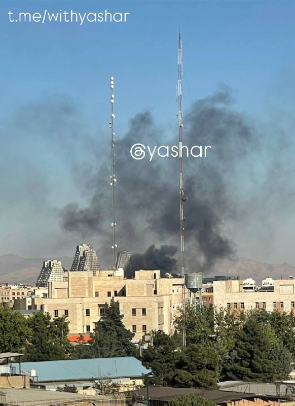

همین الان آتش‌سوزی غرب تهران سمت ستاری
@withyashar

## WithYashar — post 13041

## WithYashar — post 13040

## WithYashar — post 13039

سی‌ن‌ان: ایران ۵۰ ورودی از ۶۹ ورودی تونل‌های تاسیسات هدف قرارگرفته موشکی را باز کرده است
@withyashar

## WithYashar — post 13038

سی‌ان‌ان: برای وارد کردن آسیب به تاسیسات موشکی ایران باید از سلاح‌های بسیار پیچیده و بسیار گران‌قیمت استفاده کرد، اما عملیات بازیابی با فناوری بسیار ساده‌ای انجام می‌شود، فقط با بولدوزر
@withyashar

## WithYashar — post 13037

متن چکیده نسخه ۲

بیانیه جمعی از ایرانیان داخل و خارج کشور خطاب به شاهزاده رضا پهلوی

شاهزاده گرامی،
این متن جمع‌بندی مجموعه‌ای از دیدگاه‌ها، نگرانی‌ها و پیشنهادهای طیف گسترده‌ای از ایرانیان داخل و خارج کشور است که با هدف تقویت انسجام ملی، افزایش شفافیت و ایجاد مسیر عملی برای آینده ایران ارائه می‌شود.

در شرایط کنونی، جامعه ایران تحت فشارهای شدید اقتصادی، اجتماعی، امنیتی و سیاسی قرار دارد و در کنار آن، یکی از مهم‌ترین چالش‌ها، نبود یک ساختار منسجم و قابل فهم برای سازماندهی ظرفیت عظیم مردمی و تبدیل آن به یک نیروی هماهنگ است.

⸻

1. ضرورت ایجاد ساختار یا پلتفرم سازماندهی ملی

مطالبه گسترده مردم، ایجاد یک ساختار یا پلتفرم منسجم است که بتواند:

نیروهای مردمی داخل و خارج کشور را شبکه‌سازی کند
وظایف و نقش‌ها را مشخص و قابل اجرا نماید
از پراکندگی و موازی‌کاری جلوگیری کند
مسیر فعالیت گروه‌ها و افراد را شفاف و هدفمند سازد
امکان هماهنگی عملی در سطح رسانه‌ای، اجتماعی و میدانی را فراهم کند

⸻

2. انسجام و اتحاد میان جریان‌های مختلف مخالف

درخواست جدی جامعه، ایجاد سازوکاری برای همگرایی و هماهنگی میان گروه‌ها، جریان‌ها و افراد مختلف مخالف حکومت است تا:

اختلافات مانع حرکت مشترک نشود
یک محور هماهنگ‌کننده واحد وجود داشته باشد
انرژی سیاسی و اجتماعی هدر نرود

⸻

3. ضرورت اعلام چارچوب زمانی و نقشه راه عملی

یکی از مهم‌ترین دغدغه‌های مردم، نبود زمان‌بندی روشن برای مراحل مختلف حرکت سیاسی است.
مطالبه عمومی این است که:

سناریوهای مختلف به‌صورت شفاف و مرحله‌بندی‌شده مشخص شوند
برای اقدامات جمعی، چارچوب زمانی تقریبی یا بازه‌های مشخص تصمیم‌گیری و اقدام اعلام شود
مردم بدانند در هر مرحله چه انتظاری باید داشته باشند و نقش آنها چیست

همچنین بخش مهمی از جامعه خواستار آن است که در صورت وجود شرایط مناسب، فراخوان‌های مشخص، هدفمند و زمان‌دار برای اقدامات جمعی و هماهنگ صادر شود تا انرژی اجتماعی به‌صورت پراکنده و فرسایشی از بین نرود.

⸻

4. آمادگی میدانی و سازوکارهای حمایتی در شرایط بحران

بخش قابل توجهی از پیام‌ها بر ضرورت ایجاد سازوکارهایی برای حمایت از مردم در شرایط بحرانی تأکید دارد؛ به‌گونه‌ای که:

شبکه‌های حمایتی و سازمانی امن شکل گیرد
هماهنگی میان نیروهای مردمی افزایش یابد
آمادگی اجتماعی و مدنی برای شرایط حساس تقویت شود
هزینه انسانی تحولات احتمالی کاهش یابد

⸻

5. شفافیت در ساختار مشاوران و تیم تصمیم‌سازی

یکی از مطالبات مهم، شفاف‌تر شدن ساختار مشاوران و نقش افراد در حلقه تصمیم‌گیری است تا:

جایگاه افراد مشخص باشد
اعتماد عمومی تقویت شود
از ابهام و چندصدایی غیرسازنده جلوگیری گردد

⸻

6. معیشت و وضعیت اقتصادی مردم

در کنار موضوعات سیاسی، بحران معیشتی یکی از اصلی‌ترین فشارهای روزمره مردم است.
درخواست عمومی این است که در کنار برنامه‌های کلان، راهکارهایی برای کاهش فشار اقتصادی و حمایت از اقشار آسیب‌پذیر در دوره گذار نیز در نظر گرفته شود.

⸻

7. ارتباط مستقیم‌تر با جامعه و گروه‌های مختلف

مردم خواستار ارتباط فعال‌تر، مستقیم‌تر و مستمرتر میان رهبری اپوزیسیون و بدنه اجتماعی هستند تا:

ابهامات کاهش یابد
اعتماد افزایش پیدا کند
و امکان هماهنگی واقعی میان گروه‌ها فراهم شود

⸻

جمع‌بندی

در مجموع، پیام مشترک این مجموعه دیدگاه‌ها چنین است:

جامعه ایران آماده تغییر است، اما این مسیر تنها در صورتی به نتیجه می‌رسد که با انسجام، شفافیت، ساختار اجرایی روشن، نقشه راه قابل فهم و ارتباط مستمر با مردم همراه باشد.

⸻

درخواست پایانی (از طرف نماینده جمع)

در پایان، اینجانب یاشار به عنوان نماینده جمعی از این دیدگاه‌ها، با نهایت احترام درخواست دارم امکان ارتباط مستقیم برای انتقال دیدگاه‌ها و هماهنگی بیشتر فراهم شود و پاسخ این پیام برای اینجانب ارسال گردد.

راه‌های ارتباطی جهت پاسخ

پاینده ایران ، جاوید شاه
@withyashar

## WithYashar — post 13036

## WithYashar — post 13035

خودمو یادم رفت 🥲

## WithYashar — post 13034

یاشار چرا درخواست اینکه با خودت حرف بزنن تا اینارو بگی رو نداریم ؟

## WithYashar — post 13033

پس این متن چه اشاره ای به تو داره؟
ما میخایم یاشار با شاهزاده در ارتباط باشه

## mwarmonitor — post 9947

🔴دونالد ترامپ در Truth Social نوشت:

خوشحالم اعلام کنم که سفیر ایالات متحده در ترکیه، تام باراک، که عملکردی outstanding داشته است، به‌عنوان نماینده ویژه ریاست‌جمهوری در امور سوریه و همچنین نماینده ویژه ریاست‌جمهوری در امور عراق منصوب خواهد شد. این انتصاب در راستای پیشبرد همکاری‌های راهبردی ما با دولت‌های سوریه و عراق صورت می‌گیرد و روابط ما با آن‌ها همچنان در حال گسترش است.
تام باراک همچنان سفیر ایالات متحده در ترکیه باقی خواهد ماند و با پشتیبانی کامل وزارت امور خارجه ایالات متحده فعالیت خواهد کرد.
ما قدردان کاری هستیم که تام باراک انجام داده و نیز از آمادگی مستمر او برای خدمت به کشورمان سپاسگزاریم.

از توجه شما به این موضوع متشکریم.

@mwarmonitor

## mwarmonitor — post 9946

  <a href="telegram/content/mwarmonitor_9946_1780240529.mp4" target="_blank">🎬 Download video</a>

📝 آه، چقدر دلمان کباب شد برای این ماده خرس گریزلی تلویزیون که دوباره پیدایش شده تا با فلسفه‌بافی درباره «مطلوبات و مقدورات»، روی زخم ملت نمک بپاشد! راست می‌گویی؛ مطلوبِ قلبی یک انگل و حرومیِ جاخوش‌کرده در بدنه این کشور هم این است که پروانه باشد و پرواز کند، اما مقدوراتِ ذاتِ کثیفش اجازه نمی‌دهد چیزی غیر از یک تفاله باشد. شما حرومی‌ها که ادعا می‌کردید کنترل اقتصاد دنیا در مرزهای جنوبی در دست‌های معجزه‌گرتان است، چطور شد که وقتِ تامین نیازهای اولیه کشور رسید، زاییدید و ناگهان یاد مقدورات افتادید؟ سناریوی سیاهی است؛ در ادعا حاکم اقیانوس‌ها و در واقعیت عاجز از تامین پیاز و پوشک! شما مطلوبتان این بود که قهرمان باشید، ولی مقدوراتِ وقاحت‌تان ثابت کرد که فقط انگل‌هایی هستید که به مکیدن خون مردم ادامه می‌دهید؛ پس دست‌کم ژست فیلسوفان را نگیرید که قاب تلویزیون از این همه کثافت ترک برمی‌دارد.

@mwarmonitor

## mwarmonitor — post 9945

  <a href="telegram/content/mwarmonitor_9945_1780240531.mp4" target="_blank">🎬 Download video</a>

🔸اسرائیل در حال شخم زدن لبنان

@mwarmonitor

## mwarmonitor — post 9944

  <a href="telegram/content/mwarmonitor_9944_1780240533.mp4" target="_blank">🎬 Download video</a>

📝 این کمدی که می‌بینید تماشایی‌ترین سقوط تاریخ است؛ جماعتی ذلیل که شب ها با جیپ‌های صورتی و فاحشه‌های وارداتیِ پمپاژکننده انرژی به پاسداران، ادعای فتح جهان و صدور اسلام را دارید، اما حالا به چنان خفتی افتاده‌اید که حتی جرعت چال کردن لاشه موشعلی را هم ندارید و از ترس سایه خودتان، جنازه‌اش را مخفیانه در یخچال نگهداری می‌کنید! حقارت‌بارتر و مضحک‌تر از این تصویر وجود ندارد که در اتاق‌های مخفی در اعماق زمین ، کورکورانه و از روی تخیلات مقلدانه، برای توله مجتبی صلوات می‌فرستید که هیچ‌کدام از شما مفلوکانِ توی سر زن حتی او را از نزدیک ندیده‌اید.

🔸 شما دقیقاً کپی برابر اصل همان پیروان جاهل ۱۴۰۰ سال پیش هستید که بر اساس توهمات و افسانه‌های بافته‌شده، زنجیر بندگی و حماقت به گردن آویختند و از روی عکسِ ندیده، مقلد شدند. این ضربه مهلک و کتلت شدنِ بزرگ‌ترتان چنان ابهت پوشالی، توخالی و مافیایی این فرقه تبهکار را در هم کوبیده که ملت آزاده و سربلند ایران باید سالیان سال بر روی ویرانه‌های این جهل، ترس و بزدلیِ شما، به جشن، سرور و پایکوبی بپردازند و زوال این سیرک مذهبی را به تماشا بنشینند.

@mwarmonitor

## mwarmonitor — post 9943

... ما مجبور نیستیم از، می‌دانید، سلاح‌های بزرگ استفاده کنیم؛ ما می‌توانیم آن‌ها را از طریق هوا، همان‌طور که داشتیم انجام می‌دادیم، شکست دهیم. اما ما حدود تقریباً دو ماه زمان را در این مذاکرات از دست داده‌ایم. و آن‌ها، آن‌ها این را به عنوان... و آن‌ها به بلند‌نظری…

## mwarmonitor — post 9942

🔴مارک لوین: «به برنامه خوش آمدید، آمریکا. همیشه مایه خرسندی است که مرد دانا و خردمندِ آمریکا را در برنامه داشته باشیم؛ "ویکتور دیویس هنسون". او یک دوست خوب، پژوهشگر ارشد اندیشکده "هوور" است و پادکست بسیار موفقی هم دارد. ویکتور، ممنون که به برنامه آمدی. خب،…

## mwarmonitor — post 9941

🔴مارک لوین: «به برنامه خوش آمدید، آمریکا. همیشه مایه خرسندی است که مرد دانا و خردمندِ آمریکا را در برنامه داشته باشیم؛ "ویکتور دیویس هنسون". او یک دوست خوب، پژوهشگر ارشد اندیشکده "هوور" است و پادکست بسیار موفقی هم دارد.
ویکتور، ممنون که به برنامه آمدی. خب، بگذار این سوال را از تو بپرسم: اگر بتوانی خودت را جای رژیم ایران بگذاری، فکر می‌کنی آن‌ها در حال حاضر چطور به این وضعیت نگاه می‌کنند؟»
🔵 ویکتور دیویس هنسون:
«خب، ما دقیقاً نمی‌دانیم، چون این یک جنگ بسیار غیرمعمول است. ما هیچ نیروی زمینی در آنجا نداریم و هیچ خبرنگار مستقری هم نیست؛ بنابراین میزان دقیق خسارت‌ها را نمی‌دانیم. اما به نظر من، آن‌ها از نظر اقتصادی به شدت آسیب دیده‌اند و ۹۰ درصد از توان نظامی‌شان بی‌تحرک و منفعل شده است.
اما آن‌ها فکر می‌کنند هنوز به اندازه کافی موشک در اختیار دارند. همچنین گمان می‌کنند که کشورهای حوزه خلیج [فارس] بسیار آسیب‌پذیر هستند و معتقدند که تردد در تنگه هرمز، جریان شکننده‌ای است که می‌توانند در آن آشوب و هرج‌ومرج ایجاد کنند. با این کار، فرآیندها را به تاخیر بیندازند، شاید به رکود اقتصادی جهانی دامن بزنند و وضعیت را تا زمان انتخابات میان‌دوره‌ای کش بدهند.
آن‌ها همچنین در حال انجام بازی بسیار عجیبی هستند. آن‌ها سیگنال‌هایی می‌فرستند مبنی بر اینکه افرادی که با ما گفتگو می‌کنند — یعنی همان به‌اصطلاح "رهبران منتخب" — با سپاه پاسداران اختلاف نظر دارند. ما به دلیل اینکه افراد زیادی را حذف کرده‌ایم، دقیقاً نمی‌دانیم این ادعا تا چه حد درست است، اما این شک و شبهه به وجود می‌آید که این گفتگوکنندگان نقش "پلیس خوب" را بازی می‌کنند و سپاه پاسداران و حکومت مذهبی که هر از گاهی تلاش می‌کنند به یک ناو حمله‌ور شوند یا به کویتی‌ها یا دیگران ضربه بزنند، نقش "پلیس بد" را دارند؛ در حالی که آن‌ها در واقع با یکدیگر هماهنگ و همسو هستند.
سپس مذاکره‌کنندگان به ما می‌گویند: "خب، ما نمی‌توانیم این افراد را کنترل کنیم، ما متاسفیم، ما نمی‌دانیم آن‌ها در خلیج [فارس] چه کار می‌کنند، مین‌گذاری می‌کنند و غیره... اما مذاکرات را خراب نکنید." و این رویکرد به هر کدام از آن‌ها در رقابت برای کسب قدرت، نوعی اعتبار می‌دهد.
اما در یک مقطعی، ما باید این روند را متوقف کنیم. و راه‌های زیادی برای متوقف کردن آن وجود دارد مارک؛ زیرا این موضوع از نظر نظامی مشکلی نیست، بلکه یک مسئله سیاسی است که با اقتصاد جهانی، انتخابات میان‌دوره‌ای و مسائل دیگر گره خورده است. اما من فکر می‌کنم رئیس‌جمهور می‌تواند راهی برای حل این معادله پیچیده پیدا کند، اگر به طور غیررسمی به آن‌ها بگوید که این حماقت‌ها یک ضرب‌الاجل و پایان مشخصی دارد و پشیمان خواهید شد. و اینکه ما آن‌قدر به اقتصاد و نیروی نظامی شما آسیب خواهیم زد که بهبود و بازسازی آن برای شما یک ربع قرن (۲۵ سال) طول بکشد؛ و ما یک نیروی باقی‌مانده را در آنجا حفظ خواهیم کرد که به همراه متحدانمان، آن تنگه را باز نگه دارد.
من فکر می‌کنم او (رئیس‌جمهور) می‌تواند این را به آن‌ها بگوید، چون ما نمی‌توانیم به این وضعیت ادامه دهیم. چرا که آن‌ها "بقاء" و دوام آوردن خود را به معنای "پیروزی" تفسیر می‌کنند. می‌دانم این حرف شبیه به دنیای رمان‌های اورول (تخیلی و عجیب) به نظر می‌رسد، اما واقعاً همین‌طور فکر می‌کنند. هر روزی که آن‌ها همچنان پابرجا هستند، می‌گویند: "ببینید، ما در برابر ابرقدرتِ تاریخ تمدن ایستادگی کردیم و هنوز اینجا هستیم و آن‌ها نتوانستند ما را متوقف کنند." آن‌ها این واقعیت را در نظر نمی‌گیرند که تمام خویشتن‌داری ما، در واقع محدودیتی است که خودمان بر خودمان اعمال کرده‌ایم؛ این خویشتن‌داری دلایل انسان‌دوستانه و سیاسی دارد، اما دلیل نظامی ندارد. و...»

@mwarmonitor

## mwarmonitor — post 9940

🔸ترامپ در سوشال تروث @mwarmonitor

## mwarmonitor — post 9939

  

🔸ترامپ در سوشال تروث

@mwarmonitor

## mwarmonitor — post 9938

انفجار در قشم

## mwarmonitor — post 9937

انفجار در قشم

## mwarmonitor — post 9936

🔸وزیر خارجه فرانسه: باز کردن تنگه هرمز یک اولویت اصلی است، چون ما قصد نداریم بهای جنگی را که جنگ ما نیست همچنان بپردازیم.

@mwarmonitor

## mwarmonitor — post 9935

🔴متحدان آمریکا در همه‌جا نگران هستند که ایالات متحده در ایستادگی در برابر استبداد، بیش از حد سکوت کرده است. بلومبرگ

@mwarmonitor

## mwarmonitor — post 9934

🔴ترامپ می‌گوید برای امضای توافق با ایران «عجله‌ای ندارد»: «هیچ سلاح هسته‌ای وجود نخواهد داشت». نیویورک پست

@mwarmonitor

## mwarmonitor — post 9933

🔹تری اینگست (خبرنگار فاکس نیوز در تل‌آویو):
«بله بچه‌ها، صبح بخیر. گزارش‌ها حاکی از آن است که رئیس‌جمهور ترامپ در مذاکرات با ایران بر مواضع خود پافشاری می‌کند و در جریان جلسه اواخر هفته گذشته در اتاق وضعیت (Situation Room)، خواستار چندین اصلاحیه در توافق پیشنهادی شده است. اکنون، رئیس‌جمهور در آخر هفته با فاکس نیوز گفتگو کرده و اشاره داشته که ایالات متحده به یک توافق خوب بسیار نزدیک است.»
🔸 دونالد ترامپ (رئیس‌جمهور آمریکا):
«بنابراین، ما داریم چیزی را که می‌خواهیم به آرامی به دست می‌آوریم. آن‌ها مذاکره‌کنندگان بسیار سرسختی هستند؛ زمان زیادی طول می‌کشد. من عجله‌ای ندارم. دوست دارم بگویم عجله دارم چون می‌دانید، قیمت بنزین به شدت کاهش خواهد یافت، اما اگر بخواهید عجله کنید، توافق خوبی به دست نخواهید آورد. و... آهسته اما مطمئن، فکر می‌کنم داریم به آنچه می‌خواهیم می‌رسیم. و اگر آنچه را که می‌خواهیم به دست نیاوریم، آن را به شکل دیگری پایان خواهیم داد.»
🔹تری اینگست :
«رئیس‌جمهور ترامپ به وضوح نشان داد که اگر ایران توافق او را امضا نکند، گزینه نظامی همچنان روی میز باقی می‌ماند. وزیر جنگ، پیت هگست به سنگاپور سفر کرد؛ جایی که او نیز خواسته رئیس‌جمهور ترامپ برای دستیابی به توافق با ایران را تکرار نمود و افزود که توانمندی‌های نظامی ایالات متحده، قوی‌ترین انگیزه برای ایران است تا از جاه‌طلبی‌های هسته‌ای خود دست بکشد.»
📌 پیت هگست (وزیر جنگ آمریکا):
«بنابراین ایران به وضوحِ هرچه تمام‌تر می‌داند که انتظارات ما چیست و این بر عهده تیم مذاکره‌کننده است که آن را محقق کند. آن‌ها دارند به سمت ما می‌آیند (به مواضع ما نزدیک می‌شوند)، گفتگوها سازنده بوده است. فکر می‌کنم آن‌ها... آن‌ها می‌دانند که این روند باید به کدام سمت برود.»
🔹تری اینگست:
«علاوه بر ایران، ما همچنین تحولات مربوط به درگیری میان اسرائیل و بزرگترین گروه نیابتی ایران، یعنی حزب‌الله را رصد می‌کنیم. پهپادها و راکت‌ها در طول آخر هفته آسمان شمال اسرائیل را در نوردیدند، در حالی که اسرائیل حملات هوایی جدیدی را آغاز کرد و نیروهای زمینی را به عمق بیشتری در جنوب لبنان فرستاد.»
🔸 بنیامین نتانیاهو (نخست‌وزیر اسرائیل):
«از اینجا، نبرد علیه حزب‌الله در شمال مدیریت می‌شود. و باید به شما بگویم که نتایج بسیار چشمگیری در اینجا به دست آمده است. نیروهای ما از (رودخانه) لیتانی عبور کرده‌اند؛ آن‌ها به سمت موقعیت‌های تحت کنترل پیشروی کرده‌اند.»
🔹 تری اینگست :
«بر باور اینجاست که اگر توافقی میان ایالات متحده و ایران حاصل شود، می‌تواند به درگیری‌ها در امتداد مرزهای شمالی اسرائیل پایان دهد. حتی در پنج دقیقه گذشته، آژیرهای خطر در بخش‌های شمالی این کشور در میان حملات جدید حزب‌الله به صدا درآمدند. بچه‌ها؟»
🔹 مجری استودیو فاکس نیوز:
«بسیار خب، تری اینگست، به صورت زنده از تل‌آویو. تری، ازت ممنونم.»

@mwarmonitor

## mwarmonitor — post 9932

  <a href="telegram/content/mwarmonitor_9932_1780240537.mp4" target="_blank">🎬 Download video</a>

🎬 Video

## mwarmonitor — post 9931

📌ارتش اوکراین اعلام کرد که پالایشگاه نفت «ساراتوف» متعلق به شرکت روس‌نفت (Rosneft PJSC) در جنوب‌غربی روسیه و همچنین یک واحد پمپاژ نفت در منطقه‌ای دیگر را هدف حمله قرار داده است، در حالی که مقام‌های محلی از وقوع آتش‌سوزی‌های ناشی از حمله پهپادی در طول شب خبر دادند. بلومبرگ

@mwarmonitor

## mwarmonitor — post 9930

  

🔸بردِ درگیری دوباره در حال گسترش است، آتش بی‌وقفه در شمال: ارتش اسرائیل (IDF) در حال حمله به اهداف حزب‌الله در جنوب لبنان است. کانال ۱۳ اسرائیل

@mwarmonitor

## mwarmonitor — post 9929

🔴یکی از مهم‌ترین شبه‌نظامیان مورد حمایت ایران در عراق (کتائب حزب الله) پیشنهاد داده است که «پهپادها و موشک‌ها را» از سایر گروه‌های شبه‌نظامی که «تصمیم گرفته‌اند سلاح‌های خود را زمین بگذارند» خریداری کند. جوروزالم پست

@mwarmonitor

## FoxNewsTwitter — post 342446

  

Fox News (Twitter/X)

America's next economic powerhouse takes shape in Texas as companies abandon the Bay Area in California.

A new report shows Texas attracted 230 corporate relocations between 2018 and 2025, with Dallas, Austin and Houston leading the charge.

Meanwhile, California suffered the nation's steepest corporate losses, with more than 160 companies moving their headquarters out of the San Francisco Bay Area, citing taxes, labor regulations and soaring costs.

## FoxNewsTwitter — post 342445

  <a href="telegram/content/FoxNewsTwitter_342445_1780240541.mp4" target="_blank">🎬 Download video</a>

Fox News (Twitter/X)

An anti-ICE rioter is arrested for threatening to kill federal agents and their families during violent demonstrations outside New Jersey's Delaney Hall. The FBI caught the suspect within 24 hours after using facial recognition technology to identify him.

"Touch a cop and this FBI will put you down," FBI Director Kash Patel said.

## FoxNewsTwitter — post 342444

  <a href="telegram/content/FoxNewsTwitter_342444_1780240543.mp4" target="_blank">🎬 Download video</a>

Fox News (Twitter/X)

Hasan Piker denied having any personal contact with American Marxist Neville Roy Singham but said he knows some "wonderful people" tied to the tech tycoon's network when Fox News Digital asked about a federal subpoena.

"None of it is actually hidden or illegal in any way, shape, or form," Piker said.

## FoxNewsTwitter — post 342443

  

Fox News (Twitter/X)

HAPPY BIRTHDAY! American film icon Clint Eastwood turns 96 today!

## pm_afshaa — post 91948

  <a href="telegram/content/pm_afshaa_91948_1780240547.webm" target="_blank">🎬 Download video</a>

🔴رئیس کمیته نظامی ناتو:
احتمال عملیات برای بازگشایی تنگه هرمز وجود داره؛ حضور نظامی متحدان برای مقابله با مسدودسازی مسیرهای بین‌المللی رو افزایش دادیم.

💧 Rainbet.com the #1 Non-KYC Crypto Casino & Sportsbook @rainbetcom

😁 @Pm_Afshaa

## pm_afshaa — post 91947

  <a href="telegram/content/pm_afshaa_91947_1780240548.webm" target="_blank">🎬 Download video</a>

🔴سی‌ان‌ان: برای آسیب به تاسیسات موشکی ایران از سلاح‌های بسیار پیچیده و بسیار گران‌قیمت استفاده میشه، اما عملیات بازیابی با فناوری بسیار ساده‌ای انجام میشه: بولدوزر.

ایران 50 ورودی از 69 ورودی تونل‌های تاسیسات هدف قرار گرفته موشکی رو باز کرده.

💧 Rainbet.com the #1 Non-KYC Crypto Casino & Sportsbook @rainbetcom

😁 @Pm_Afshaa

## pm_afshaa — post 91946

  <a href="telegram/content/pm_afshaa_91946_1780240549.webm" target="_blank">🎬 Download video</a>

🔴اسکات بسنت وزیر خزانه داری آمریکا: اطمینان از باز بودن تنگه هرمز، دریافت اورانیوم بسیار غنی شده و اینکه ایران سلاح هسته‌ای نداره، این کار رو تمام میکنه.

این اولین باره که ایرانی‌ها در 47 سال گذشته حاضر شدن در مورد نداشتن سلاح هسته‌ای بحث کنند.

💧 Rainbet.com the #1 Non-KYC Crypto Casino & Sportsbook @rainbetcom

😁 @Pm_Afshaa

## pm_afshaa — post 91945

  <a href="telegram/content/pm_afshaa_91945_1780240549.webm" target="_blank">🎬 Download video</a>

🔴سی‌ان‌ان: ایران پس از خارج کردن سریع زرادخانه‌های موشکی مدفون خود، در موقعیتی قرار گرفته که میتونه تعداد بیشتری موشک دوربرد به سمت اسرائیل و دیگر کشورهای خاورمیانه شلیک کنه؛ موضوعی که به گفته کارشناسان، محدودیت‌های راهبرد بمباران آمریکا رو نشان میده.

💧 Rainbet.com the #1 Non-KYC Crypto Casino & Sportsbook @rainbetcom

😁 @Pm_Afshaa

## pm_afshaa — post 91944

🔴وال استریت ژورنال: سازمان ملل در حال ورشکستگی است، زیرا ایالات متحده و چین میلیاردها دلار را از این نهاد بین‌المللی خارج می‌کنن 
💧 Rainbet.com the #1 Non-KYC Crypto Casino & Sportsbook @rainbetcom 
😁 @Pm_Afshaa

## pm_afshaa — post 91943

🔴وال استریت ژورنال: سازمان ملل در حال ورشکستگی است، زیرا ایالات متحده و چین میلیاردها دلار را از این نهاد بین‌المللی خارج می‌کنن

💧 Rainbet.com the #1 Non-KYC Crypto Casino & Sportsbook @rainbetcom

😁 @Pm_Afshaa

## pm_afshaa — post 91942

وضعیت لبنان بعد از حمله هوایی اسراییل به این کشور 
💧 Rainbet.com the #1 Non-KYC Crypto Casino & Sportsbook @rainbetcom 
😁 @Pm_Afshaa

## pm_afshaa — post 91939

  <a href="telegram/content/pm_afshaa_91939_1780240550.mp4" target="_blank">🎬 Download video</a>

وضعیت لبنان بعد از حمله هوایی اسراییل به این کشور

💧 Rainbet.com the #1 Non-KYC Crypto Casino & Sportsbook @rainbetcom

😁 @Pm_Afshaa

## pm_afshaa — post 91938

  <a href="telegram/content/pm_afshaa_91938_1780240552.webm" target="_blank">🎬 Download video</a>

🔴سی‌بی‌اس: میانجی‌ها هنوز دارن روی توافق بین تهران و واشینگتن کار میکنن.

ترامپ روز جمعه متن توافق رو دوباره اصلاح کرده و نسخه جدیدش رو فرستاده ایران تا تأییدش کنه، ولی تا الان هنوز پاسخی از طرف تهران داده نشده.

💧 Rainbet.com the #1 Non-KYC Crypto Casino & Sportsbook @rainbetcom

😁 @Pm_Afshaa

## pm_afshaa — post 91937

  <a href="telegram/content/pm_afshaa_91937_1780240553.webm" target="_blank">🎬 Download video</a>

🔴وزیر خارجه فرانسه:
باز کردن تنگه هرمز یک اولویت اصلی است چون ما قصد نداریم همچنان بهای جنگی رو بپردازیم که جنگ ما نیست.

💧 Rainbet.com the #1 Non-KYC Crypto Casino & Sportsbook @rainbetcom

😁 @Pm_Afshaa

## pm_afshaa — post 91936

  <a href="telegram/content/pm_afshaa_91936_1780240554.webm" target="_blank">🎬 Download video</a>

🔴اقتصاد نیوز: ایرانسل و همراه اول امکان خرید اقساطی بسته اینترنت رو فعال کردن.

💧 Rainbet.com the #1 Non-KYC Crypto Casino & Sportsbook @rainbetcom

😁 @Pm_Afshaa

## pm_afshaa — post 91935

  <a href="telegram/content/pm_afshaa_91935_1780240555.webm" target="_blank">🎬 Download video</a>

🔴مهاجرانی، سخنگوی دولت:
افزایش تورم و گرانی‌های اخیر، نتیجه محاصره دریایی آمریکاست.

💧 Rainbet.com the #1 Non-KYC Crypto Casino & Sportsbook @rainbetcom

😁 @Pm_Afshaa

## pm_afshaa — post 91934

  <a href="telegram/content/pm_afshaa_91934_1780240556.webm" target="_blank">🎬 Download video</a>

🔴آکسیوس: ترامپ روز جمعه در اتاق وضعیت کاخ سفید متن توافق با جمهوری اسلامی رو بررسی کرد و اصلاحاتی درباره برنامه هسته‌ای ایران و تنگه هرمز به تیمش ارائه داد. حالا تا این تغییرات به دست مقام‌های ارشد جمهوری اسلامی و مجتبی خامنه‌ای برسه و پاسخ تهران برگرده،…

## pm_afshaa — post 91933

  <a href="telegram/content/pm_afshaa_91933_1780240556.webm" target="_blank">🎬 Download video</a>

🔴نتانیاهو: من به ارتش اسرائیل دستور دادم تا دامنه عملیات در لبنان رو گسترش بدن.

💧 Rainbet.com the #1 Non-KYC Crypto Casino & Sportsbook @rainbetcom

😁 @Pm_Afshaa

## pm_afshaa — post 91932

  <a href="telegram/content/pm_afshaa_91932_1780240557.webm" target="_blank">🎬 Download video</a>

🔴آکسیوس به نقل از یک مقام آمریکایی:
ترامپ به خطوط قرمز خود پایبند است و توافقی رو منعقد نخواهد کرد که تضمینی برای نداشتن ایران به سلاح هسته‌ای نباشه.

💧 Rainbet.com the #1 Non-KYC Crypto Casino & Sportsbook @rainbetcom

😁 @Pm_Afshaa

## pm_afshaa — post 91931

🔴الجزیره: روابط روسیه و ایران آنطور که به نظر می‌رسد نیست هدف مسکو تضمین عدم انزوا، فرسایش یا شکست استراتژیک ایران است

💧 Rainbet.com the #1 Non-KYC Crypto Casino & Sportsbook @rainbetcom

😁 @Pm_Afshaa

## pm_afshaa — post 91930

  <a href="telegram/content/pm_afshaa_91930_1780240558.webm" target="_blank">🎬 Download video</a>

🔴قالیباف: تا اطمینان پیدا نکنیم که حقوق ملت رو گرفتیم، توافق نخواهیم کرد.

💧 Rainbet.com the #1 Non-KYC Crypto Casino & Sportsbook @rainbetcom

😁 @Pm_Afshaa

## pm_afshaa — post 91929

  <a href="telegram/content/pm_afshaa_91929_1780240559.webm" target="_blank">🎬 Download video</a>

🔴آکسیوس: ترامپ هنوز توافق با ایران رو نهایی نکرده و خواهان اعمال اصلاحاتی در متن تفاهم، به‌ویژه درباره اورانیوم غنی‌شده ایران و تنگه هرمز شده. به گفته منابع آمریکایی، این درخواست دور جدیدی از مذاکرات رو آغاز کرده و احتمالا پاسخ جمهوری اسلامی چند روز زمان…

## iaghapour — post 2646

  

⭕️ اسکنر IP سفید کلودفلر با نوا رادار

🔹نوا رادار یک اسکنر IP دسکتاپ است که با Wails v3 (بک‌اند گو + فرانت ری‌اکت/تایپ‌اسکریپت) ساخته شده. این برنامه رنج‌های IP کلودفلر را از منابع متعدد اسکن می‌کند، تأیید پروتکل واقعی (TCP + TLS handshake) انجام می‌دهد و IPهای سالم را مرتب‌شده بر اساس سرعت تحویل می‌دهد.

— اسکن چندمنبعی — ۹ منبع IP قابل انتخاب
— تأیید دو مرحله‌ای — اسکن سریع TCP → تست عمیق TLS
— مرتب‌سازی بر اساس سرعت
— قابلیت انتخاب پورت

🔗 اطلاعات بیشتر در گیت‌هاب پروژه

🆔@iAghapour

## DEJradio — post 5184

  <a href="telegram/content/DEJradio_5184_1780240560.webm" target="_blank">🎬 Download video</a>

🔺 در جنگ ۴۰ روزه شماری از شهروندان غیرنظامی کشته و زخمی شدند و منازل، مغازه‌ها و دارایی‌های بسیاری از آنها از بین رفت. علت اصلی این وضعیت استقرار مقرها و پایگاه‌های سـ.ـپاه و بـ.ـسیج و کلانتری‌ها در مناطق مسکونی بود. تعداد زیادی از خانه‌های امن و مخفیگاه‌های فرماندهانی که کشته شدند نیز کنار واحدهای مسکونی مردم عادی بود. حتی بعضی ساکنان خبر نداشتند که در آپارتمان آنها چه کسانی تردد می‌کنند.
بسیاری از شهروندان بی‌خانمان شدند و در هتل‌ها و مسافرخانه‌ها ساکن شده‌اند.
در واقع حکومت با استفاده از سپرانسانی، تلاش کرد برای سرکوبگران پوشش ایجاد کند که حاصل این تاکتیک غیرانسانی، کشته شدن هموطنان و ویرانی منازل آنها بود.
اکنون شورای‌عالی امنیت ملی و شهرداری برای انتقال مراکز سرکوب به خارج از مناطق مسکونی زیر فشار قرار گرفته‌اند.
علیرضا زاکانی شهردار تهران می‌گوید، با شورای عالی امنیت ملی برای انتقال مراکز حساس به خارج از مناطق مسکونی مکاتبه شده است. او به خبرگزاری «مهر» گفت، «تجربه جنگ‌های اخیر نشان داد باید با همکاری مجموعه‌های نظامی و انتظامی، شرایطی فراهم شود تا در آینده اطمینان خاطر بیشتری برای شهروندان ایجاد شود.»

#جنگ_چهل_روزه
@DEJradio

## DEJradio — post 5183

  <a href="telegram/content/DEJradio_5183_1780240561.mp4" target="_blank">🎬 Download video</a>

📢
🔺 یکی از مخاطبان با ارسال ویدیویی از تجمعات شبانه حامیان حکومت نوشت، "یک ملا که وسط خیابان پرچم‌گردانی میکرد وقتی دید چنتا دختر تو ماشینیم افسار پاره کرد."

#پیام_دریافتی
@DEJradio

## DEJradio — post 5182

  <a href="telegram/content/DEJradio_5182_1780240563.mp4" target="_blank">🎬 Download video</a>

👑
🔺 تجمع ایرانیان مقیم مادرید در حمایت از انقلاب شیروخورشید و آگاه‌سازی افکار عمومی از جنایات رژیم در ایران

#همبستگی #مادرید
@DEJradio

## DEJradio — post 5181

⭕️ اسرائیل هیوم: شماری از نفتکش‌های قطری با پرداخت پول به رژیم از تنگۀ هرمز گذر کردند

روزنامۀ اسرائیل هیوم، به نقل از سه منبع دیپلماتیک و اطلاعاتی گزارش داد ده‌ها نفتکش در هفتۀ پیشین از تنگۀ هرمز عبور کرده‌اند.
بنا بر این گزارش برخی ازشناورها پس از تأیید جمهوری اسلامی و سپاه پاسداران، برای عبور پول پرداخت کردند.
بر پایۀ گزارش اسرائیل هیوم، شمار بسیاری از نفتکش‌ها حامل نفت و گاز مایع قطر بودند و به سمت هند، چین و اروپا راهی شدند.
همچنین برخی شناورهای دیگر توانستند با همراهی نیروی دریایی آمریکا گذر کنند.
آمریکا پیش‌تر بارها اعلام کرده بود که با باج‌دهی به جمهوری اسلامی برای عبور از تنگۀ هرمز مخالف است.
وزارت خزانه‌داری آمریکا اعلام کرد شرکت‌ها و نفتکش‌هایی را که برای عبور از آبراه هرمز به تهران باج بدهند، مورد تحریم قرار می‌دهد.

#خبر #دژ #تنگه_هرمز
@DEJradio

## DEJradio — post 5180

  <a href="telegram/content/DEJradio_5180_1780240566.mp4" target="_blank">🎬 Download video</a>

⭕️ وزیر دفاع اسرائیل از تصرف قلعۀ شقیف در لبنان خبر داد

یسرائیل کاتز، وزیر دفاع اسرائیل اعلام کرد ارتش این کشور قلعۀ راهبردی شقیف بوفور در جنوب لبنان را تصرف کرده است.
بنا بر تصاویر منتشر شده، پرچم اسرائیل بر فراز این قلعۀ باستانی برافراشته شد.
یسرائیل کاتز، این منطقه را یکی از مهم‌ترین مناطق راهبردی برای دفاع از شهرک‌های الجلیل و تأمین امنیت نیروهای اسرائیلی عنوان کرد.
قلعۀ شقیف بر بخش‌هایی گسترده از جنوب لبنان اشراف دارد.
اسرائیل بیش از بیست و شش سال پیش در دوران درگیری‌های پیشین با لبنان نیز از این قلعه به عنوان پایگاه استفاده می‌کرد.
#خبر #دژ #اسرائیل
@DEJradio

## DEJradio — post 5179

⭕️ هلال‌احمر جمهوری اسلامی خبر داد بیمارستان ایرانیان دوبی تعطیل و اموالش توقیف شد

پیرحسین کولیوند، رئیس جمعیت هلال‌احمر جمهوری اسلامی گفت بیمارستان ایرانیان دوبی تعطیل شده و دارایی‌ها و اموال نقدی آن با حکم دادگاه بلوکه شده است.
او گفت بیماران این بیمارستان از مرکز درمانی خارج شده‌اند.
به گفتۀ این مقام دولتی، رئیس بیمارستان دوبی نیز ممنوع‌الخروج شده و برای بازجویی و محاکمه احضار شده است.
کولیوند افزود همچنین ویزای کارکنان بیمارستان باطل شده و آن‌ها از خانه‌های سازمانی خارج شده‌اند.
پیش‌تر یک مقام اماراتی گفته بود نهادهای «مرتبط با حکومت جمهوری اسلامی» به دلیل سوءاستفادۀ آنها از موقعیت، تعطیل می‌شود.

#خبر #دژ #امارات
@DEJradio

## DEJradio — post 5178

  <a href="telegram/content/DEJradio_5178_1780240568.mp4" target="_blank">🎬 Download video</a>

👑
🔺 پیام ایرانیان مقیم اوکلند(نیوزلند) به پرزیدنت دونالد ترامپ: میراثی از خود به جا نگذارید که از کارتر و اوباما نیز بدتر باشد!

#همبستگی #اوکلند
@DEJradio

## DEJradio — post 5177

⭕️ ترامپ گفت برای توافق با تهران هیچ عجله‌ای در کار نیست

دونالد ترامپ، رئیس جمهوری آمریکا گفت با این که «یک توافق خیلی خوب» با جمهوری اسلامی نزدیک است، اما برای بازگشت به عملیات نظامی نیز آمادگی دارد.
او گفت اگر عجله داشته باشید، توافق مناسبی به دست نمی‌آورید.
ترامپ یک بار دیگر گفت اگر آمریکا تأسیسات هسته‌ای جمهوری اسلامی را هدف نمی‌گرفت، تهران به سلاح هسته‌ای دست پیدا می‌کرد.

#خبر #دژ #توافق #ترامپ
@DEJradio

## DEJradio — post 5176

  <a href="telegram/content/DEJradio_5176_1780240571.mp4" target="_blank">🎬 Download video</a>

👑
🔺 حمایت ایرانیان مقیم فرانکفورت از انقلاب شیر و خورشید
شنبه ۳۰ مه

#همبستگی #فرانکفورت
@DEJradio

## DEJradio — post 5175

⭕️ خانۀ کارگر بندر شاهپور از موج تازۀ تعدیل نیرو در این بندر و ماهشهر خبر داد

ابراهیم پیرایش، دبیر اجرایی خانۀ کارگر بندر شاهپور، از آغاز موج تازۀ تعدیل نیرو در ماهشهر و بندر شاهپور خبر داد.
به گفتۀ او گفت برخی شرکت‌ها بدون رعایت ضوابط قانونی، کارگران را اخراج می‌کنند.
پیرایش افزود برخی از شرکت‌های پیمانکاری از جمله پتروناد و لوله‌سازی ماهشهر، با وجود ممنوعیت اخراج از سوی شورای کارگری فرمانداری، نیروهای خود را تعدیل می‌کنند.
به گفته پیرایش، برخی شرکت‌ها با این استدلال که پروژه‌ها به پایان رسیده است اقدام به اخراج نیروها می‌کنند، در حالی که کار پایان نیافته است.
او افزود در برخی از واحدها اخراج‌های دسته‌جمعی ۳۰ تا ۴۰ نفره و حتی بالای ۱۰۰ نفر گزارش شده است.

#خبر #دژ #کارگران
@DEJradio

## DEJradio — post 5174

⭕️ ادعای قرارگاه خاتم‌الانبیا: هرگونه مداخلۀ نظامی در مدیریت تنگۀ هرمز، با واکنش روبه‌رو می‌شود

قرارگاه مرکزی خاتم‌الانبیا مدعی شد هرگونه اقدام شناورهای نظامی برای «مداخله» در مدیریت تنگۀ هرمز یا ایجاد اختلال در تردد کشتی‌ها، با واکنش نیروهای مسلح جمهوری اسلامی روبه‌رو می‌شود.
این قرارگاه که مورد تحریم آمریکا قرار دارد، ادعا کرد همۀ کشتی‌، شناور و نفتکش‌ها تنها باید از مسیرهای تعیین‌شده عبور کنند و از نیروی دریایی سپاه پاسداران مجوز بگیرند.
در این بیانیه ادعا شد هرگونه تخلف از این ضوابط، امنیت تردد شناورها را با «مخاطرۀ جدی» روبه‌رو می‌کند.
بر پایۀ برخی گزارش‌های تأییدنشده، شماری از شناورها تلاش کرده‌اند از بخش‌هایی از تنگۀ هرمز که در آب‌های عمان قرار دارد، عبور کنند.

#خبر #دژ #تنگه_هرمز
@DEJradio

## DEJradio — post 5173

⭕️ 
🔥 ارتش آمریکا موتور یک کشتی راهی ایران را با موشک هدف گرفت

ستاد فرماندهی مرکزی ارتش آمریکا اعلام کرد با شلیک یک موشک هلفایر به موتورخانۀ کشتی لیان استار، با پرچم گامبیا، مانع ادامۀ حرکت آن به سمت یکی از بنادر ایران شده است.
به گزارش سنتکام، پیش از حمله بیش از ۲۰ بار به این کشتی هشدار داده شد که در حال نقض محاصرۀ دریایی آمریکا علیه جمهوری اسلامی است.
به گفتۀ ارتش آمریکا، از آغاز محاصرۀ دریایی دستکم ۱۱۵ کشتی مرتبط با جمهوری اسلامی ناگزیر به تغییر مسیر شدند.

#خبر #دژ #محاصره_دریایی
@DEJradio

## DEJradio — post 5172

  <a href="telegram/content/DEJradio_5172_1780240574.webm" target="_blank">🎬 Download video</a>

⭕️
🚨 ترامپ بندهایی از توافق‌نامۀ پیشنهادی را برای جمهوری اسلامی دشوارتر کرد

نیویورک‌تایمز گزارش داد دونالد ترامپ تغییراتی را تفاهم‌نامۀ پیشنهادی اعمال وشرایط را برای جمهوری اسلامی دشوارتر کرده است.
بنا بر گزارش رسانه‌های آمریکایی، نسخۀ اصلاح‌شدۀ تفاهم‌نامه برای بررسی دوباره به تهران فرستاده شد.
بر اساس این گزارش، در تغییرات مدنظر ترامپ، جمهوری اسلامی حتا حق خرید تجهیزات برای سلاح هسته‌ای را هم ندارد.
همچنین وبسایت آکسیوس گزارش داد یکی از محورهای اصلی تغییرات، تأکید بیشتر بر تعیین تکلیف ذخایر هسته‌ای جمهوری اسلامی است.
بنا بر گزارش‌ها روند گفت‌وگوها برای دستیابی احتمالی به توافق میان واشینگتن و تهران، همچنان ادامه می‌یابد.

#خبر #دژ #مذاکرات #توافق #ترامپ
@DEJradio

## DEJradio — post 5171

  <a href="telegram/content/DEJradio_5171_1780240575.mp4" target="_blank">🎬 Download video</a>

👑
🔺 پرفورمنس اعتراضی ایرانیان مقیم دوسلدورف علیه کشتار و اعدام مخالفان جمهوری‌اسلامی
شنبه ۳۰ مه

#همبستگی #دوسلدورف
@DEJradio

## DEJradio — post 5170

⭕️ ترامپ: ارتش جمهوری اسلامی را عامدانه هدف نگرفتیم تا اشتباه عراق تکرار نشود

دونالد ترامپ گفت آمریکا عامدانه از هدف قرار دادن کامل ارتش جمهوری اسلامی خودداری کرده است.
به گفتۀ رئیس جمهوری اسالات متحده، = نابود کردن کامل ساختارهای نظامی یک کشور می‌تواند پیامدهای بلندمدت داشته باشد.
او در گفت‌وگو با فاکس‌نیوز گفت این که در جنگ‌ همه چیز را نابود کنی اشتباه است، چون آن را به کشوری تبدیل می‌کنی که تا ۴۰ سال بعد هم توان بازسازی خود را ندارد.
ترامپ با اشاره به عراق گفت عملکرد آمریکا در آن جنگ «یک اشتباه بزرگ» بود.
رئیس جمهوری آمریکا افزود واشینگتن ارتش جمهوری اسلامی را «تا حدی به حال خود گذاشت.
ترامپ گفت ارتش به نسبت دیگر نیروهای مسلح جمهوری اسلامی، تا اندازه‌ای «میانه‌رو» محسوب می‌شود.
رئیس‌جمهوری آمریکا از سویی تکرار کرد توان دریایی و نیروی هوایی جمهوری اسلامی کاملا نابود شده‌ است.

#خبر #دژ #ترامپ
@DEJradio

## VahidOnline — post 75816

  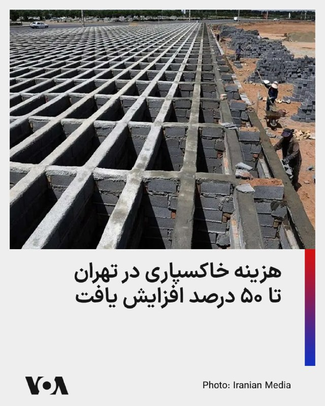

بر اساس مصوبه جدید شورای شهر تهران، هزینه خدمات مرتبط با خاکسپاری در بهشت‌زهرا به‌طور میانگین حدود ۴۰ درصد افزایش یافته و در برخی موارد رشد تعرفه‌ها به ۵۰ درصد رسیده است.

روزنامه دنیای اقتصاد گزارش داد نرخ خدماتی از جمله حمل متوفی، تغسیل، تکفین، تدفین و برگزاری مراسم افزایش یافته است. بر اساس این مصوبه، هزینه انتقال هر متوفی از سطح شهر تهران تا شعاع ۱۰ کیلومتری ۵۰ درصد افزایش داشته است.
@VahidHeadline

📡 @VahidOnline

## VahidOnline — post 75815

  

سایت هرانا گزارش داد زهرا شهباز طبری، زندانی سیاسی محبوس در زندان لاکان رشت، پس از نقض حکم پیشین در دیوان عالی کشور، بار دیگر از سوی شعبه دوم دادگاه انقلاب رشت به ریاست محمدعلی درویش‌گفتار، به اتهام «بغی از طریق عضویت و فعالیت در سازمان مجاهدین خلق» به اعدام محکوم شد.
این زندانی سیاسی ۶۸ ساله، در فروردین ۱۴۰۴ در منزل شخصی خود در رشت بازداشت شده بود.
@VahidOOnLine

📡 @VahidOnline

## VahidOnline — post 75814

  

نیروی دریایی سپاه پاسداران روز یک‌شنبه اعلام کرد‌ «طی شبانه‌روز گذشته ۲۸ فروند کشتی اعم از نفتکش، کانتینربَر و سایر کشتی‌های تجاری پس از کسب مجوز با هماهنگی و تأمین امنیت نیروی دریایی سپاه از تنگه هرمز عبور کردند.»

ساعتی پیشتر روزنامه اسرائیلی «اسرائیل هیوم» نوشته بود که ده‌ها نفتکش حامل نفت و گاز طبیعی مایع در هفتهٔ گذشته با اجازه آمریکا و پرداخت عوارض به ایران از تنگهٔ هرمز عبور کرده‌اند.

این در حالی است که دولت آمریکا بارها اعلام کرده است با پرداخت عوارض به ایران برای عبور از تنگه هرمز مخالف است.
@VahidHeadline

📡 @VahidOnline

## VahidOnline — post 75812

  <a href="telegram/content/VahidOnline_75812_1780240579.mp4" target="_blank">🎬 Download video</a>

جلسه مجازی صحن مجلس شورای اسلامی به ریاست محمدباقر قالیباف و مشارکت آنلاین ۱۸۷ نماینده و حضور ۱۴ نماینده برگزار شد.
در این جلسه که اولین جلسه از سومین سال مجلس دوازدهم بود، اعضای جدید هیئت رئیسه مجلس سوگند یاد کردند.
جلسه روز یک‌شنبه، دهم خردادماه، همچون جلسات معدود گذشته در مکانی مخفی برگزار شد.
محمدباقر قالیباف در همین جلسه تأکید کرد که «تا اطمینان پیدا نکنیم که حقوق ملت ایران را گرفته‌ایم، هیچ توافقی تأیید نمی‌شود».
قالیباف که از او به عنوان رئیس هیئت مذاکره‌کننده ایران نیز یاد می‌شود در این جلسه بیانیه‌ای را قرائت کرد و در آن ادعا کرد که «در حال عقب نشاندن دشمن در یک جنگ تاریخ‌ساز هستیم».
@VahidHeadline
محمدباقر قالیباف، رییس مجلس شورای اسلامی گفت: «سومین سال مجلس دوازدهم را در حالی آغاز می‌کنیم که یاد و خاطره رهبر شهید با ماست و هنوز فقدان رهبر و پدر امت را باور نمی‌کنیم.»
او ادامه داد: «رهبرمان به ما آموخت مقابل زورگویی و تهدید، ذره‌ای سر خم نکنیم و با مشت‌های گره کرده مقابل خصم تا آخرین قطره خون مبارزه کنیم.»
قالیباف اضافه کرد: «دیدن جای خالی رهبری برایمان جانکاه است، ولی دلگرم به مدیریت و رهبری جدید هستیم.»
@VahidOOnLine

📡 @VahidOnline

## VahidOnline — post 75810

  <a href="telegram/content/VahidOnline_75810_1780240580.mp4" target="_blank">🎬 Download video</a>

نیروی انتظامی تهران کافه‌ای در خیابان ولیعصر را که در آن برنامه‌های موسیقی اجرا می‌شد، به بهانه آن چه «فعالیت‌های مروج فرقه‌های انحرافی» خواند، پلمب کرد.

مرکز اطلاع‌رسانی پلیس جمهوری اسلامی در اطلاعیه‌ای نوشت: «این کافه با برگزاری برنامه‌هایی با ظاهر موسیقی غربی، بستری برای حرکات نابهنجار، و آنچه که ماموران توصیف کرده‌اند "تحرکات شیطانی" فراهم آورده بود.»

نیروی انتظامی جمهوری اسلامی نام این کافه را ذکر نکرد اما ادعا کرد که «مشتریان این کافه، شامل دختران و پسران جوان، در وضعیتی غیرطبیعی و با حرکاتی عجیب و غریب، که از آن به عنوان “شیطانی” یاد شده، مشاهده گردیدند.»

پیشتر نیز بسیاری از کافه‌ها و اماکن کسب و کار به اتهام‌های مشابه پلمب شده‌ بودند اما جمهوری اسلامی سرکوب‌ شهروندان را از زمان اعتراضات دی‌ماه گذشته تاکنون شدت بیشتری داده است.

موج تازه اعدام‌ها، صدور احکام سنگین و بازداشت‌ها نگرانی فعالان و نهادهای حقوق بشری را برانگیخته است.
@VahidHeadline
ویدیوی بالا رو هم به عنوان "تحرکات شیطانی" در اون کافه منتشر کردند!
📡 @VahidOnline

## IranIntlTV — post 339903

  

سی‌ان‌ان گزارش داد تهران پس از خارج کردن سریع زرادخانه‌های موشکی مدفون خود، در موقعیتی قرار گرفته که می‌تواند تعداد بیشتری موشک دوربرد به سمت اسرائیل و دیگر کشورهای خاورمیانه شلیک کند؛ موضوعی که به گفته کارشناسان، محدودیت‌های راهبرد بمباران آمریکا را نشان می‌دهد.

بر اساس این گزارش، حملات آمریکا و اسرائیل در هفته‌های گذشته با هدف تخریب جاده‌ها و مسدود کردن ورودی تونل‌ها انجام شد تا دسترسی تهران به سایت‌های زیرزمینی موشکی محدود شود.

تصاویر ماهواره‌ای بررسی‌شده توسط سی‌ان‌ان نشان می‌دهد جمهوری اسلامی با استفاده از تجهیزات ساده‌ای مانند بولدوزر و کامیون‌های حمل‌ونقل توانسته این مسیرها را دوباره بازسازی کند. کارشناسان می‌گویند این موضوع نشان می‌دهد توان موشکی ایران تنها با هدف قرار دادن ورودی تونل‌ها قابل از بین بردن نیست.
https://iranintl.com/202605315236

## IranIntlTV — post 339902

  <a href="telegram/content/IranIntlTV_339902_1780240582.mp4" target="_blank">🎬 Download video</a>

در ادامه گزارش‌ها از موج گسترده بیکاری در ایران، سایت کاریابی «جاب‌ ویژن» اعلام کرد نیمی از مخاطبان یک نظرسنجی در این سایت بیکار شده‌اند. بر اساس این نظرسنجی، ۵۲ درصد از کارجویان اعلام کردند در پی جنگ شغل خود را از دست داده‌اند.
خبرگزاری ایلنا نیز از اخراج گسترده کارگران در مجتمع‌های پتروشیمی ماهشهر و بندر امام گزارش داد.

گفت‌وگو با فواد کیخسروی، فعال کارگری
@iranintltv

## IranIntlTV — post 339900

  <a href="telegram/content/IranIntlTV_339900_1780240584.mp4" target="_blank">🎬 Download video</a>

همزمان با تورم سنگین خوراکی‌ها و تشدید بحران معیشت در ایران، مقام‌های حوزه بهداشت و سلامت درباره پیامدهای کاهش مصرف خوراکی‌های مغذی برای سلامت خانوارها هشدار دادند.

گفت‌وگو با کیارش آرامش، پزشک و متخصص پزشکی اجتماعی و اخلاق زیستی
@iranintltv

## IranIntlTV — post 339899

  

مسعود پزشکیان با بیان اینکه «محدودیت‌ها و فشارهای خارجی در حوزه اقتصادی پیچیدگی‌های خاصی را برای اداره کشور ایجاد کرده است» گفت: شرایط کشور عادی و ساده نیست.

او با اشاره به ضرورت تقویت «تاب‌آوری» مردم گفت: واقعیت‌های موجود باید با جامعه در میان گذاشته شود تا آنها بتوانند نقش خود را در مواجهه با چالش‌ها ایفا کنند.

پزشکیان اضافه کرد: «جامعه باید نسبت به الزامات و هزینه‌های مقاومت آگاه باشد».
https://iranintl.com/202605313966

## IranIntlTV — post 339898

  <a href="telegram/content/IranIntlTV_339898_1780240587.mp4" target="_blank">🎬 Download video</a>

سرخط خبرهای یکشنبه ۱۰ خرداد
@iranintltv

## IranIntlTV — post 339897

  

دونالد ترامپ در تروث‌سوشال اعلام کرد که تام باراک، سفیر ایالات متحده در ترکیه، به عنوان فرستاده ویژه ریاست‌جمهوری در امور عراق و سوریه منصوب شده است.

ترامپ افزود: همزمان با پیشبرد همکاری راهبردی ما با دولت‌های سوریه و عراق، روابط ما با آن‌ها همچنان در حال گسترش است.
https://iranintl.com/202605311800

## IranIntlTV — post 339896

  

اسماعیل کوثری، عضو کمیسیون امنیت ملی مجلس، با تاکید بر اینکه «پرونده هسته‌ای از روی میز مذاکره با آمریکا برداشته شده است»، گفت: «مذاکرات برای پایان دادن به جنگ در حال انجام است اما به توافق نهایی نرسیده‌ایم و می‌دانیم که نتیجه‌ای نخواهند داشت.»

او افزود: «جمهوری اسلامی اکنون در حال مذاکره در مورد جلوگیری از تکرار جنگ، پرداخت غرامت، خروج نیروهای آمریکایی از منطقه و لغو محاصره دریایی است.»

کوثری اضافه کرد: «بسیاری از کشورها کنترل ایران بر تنگه را پذیرفته‌اند.»
https://iranintl.com/202605310064

## IranIntlTV — post 339895

  <a href="telegram/content/IranIntlTV_339895_1780240590.mp4" target="_blank">🎬 Download video</a>

در حالی که تورم سنگین خوراکی‌ها موجب تشدید بحران معیشت در ایران شده است، علیرضا نوری قزلجه، وزیر جهاد کشاورزی، گفت کالاهای اساسی با «قیمت‌های متعادل» در کشور عرضه می‌شوند.

گفت‌وگو با اشکان نظام‌آبادی، روزنامه‌نگار اقتصادی
@iranintltv

## IranIntlTV — post 339894

  <a href="telegram/content/IranIntlTV_339894_1780240592.mp4" target="_blank">🎬 Download video</a>

قهرمانی پاری‌سن‌ژرمن در لیگ قهرمانان اروپا با ناآرامی در خیابان‌های پاریس همراه شد. پلیس فرانسه اعلام کرد بیش از ۴۰۰ نفر در جریان درگیری‌های پس از جشن هواداران بازداشت شدند و نیروهای امنیتی در اطراف شانزه‌لیزه و مرکز شهر از گاز اشک‌آور استفاده کردند.
@iranintltv

## IranIntlTV — post 339893

  <a href="telegram/content/IranIntlTV_339893_1780240594.mp4" target="_blank">🎬 Download video</a>

در حالی که مذاکرات جمهوری اسلامی و آمریکا برای تمدید آتش‌بس ادامه دارد، رسانه‌های آلمان می‌گویند گره اصلی گفت‌وگوها دیگر فقط برنامه هسته‌ای نیست، بلکه میلیاردها دلار دارایی بلوکه‌شده ایران در خارج از کشور است.

علی حسن‌پور، خبرنگار ایران‌اینترنشنال، گزارش می‌دهد
@iranintltv

## IranIntlTV — post 339892

  

🔻رئال مادرید بار دیگر در صدر فهرست ارزشمندترین باشگاه‌های فوتبال جهان از نگاه فوربس قرار گرفت؛ پس از آن‌که در فصل ۲۵-۲۰۲۴ به رکورد درآمد سالانه ۱.۲۷ میلیارد دلار رسید. این رقم از درآمد ۱.۲۳ میلیارد دلاری تیم دالاس کابویز در NFL در سال ۲۰۲۴ نیز بیشتر است.

🔹بر اساس محاسبات فوربس (بدون در نظر گرفتن تورم)، یک رکورد جدید درآمد سالانه برای یک تیم ورزشی محسوب می‌شود.

🔹رئال مادرید در پنج سال اخیر و در مجموع ۱۰ سال از ۱۳ سال گذشته، ارزشمندترین باشگاه فوتبال جهان بوده است.

🔹با وجود قهرمانی پیاپی بارسلونا در لالیگا و پاری‌سن‌ژرمن در لیگ قهرمانان اروپا، اما در خارج از زمین، رئال مادرید همچنان معیار فوتبال جهان و حتی ورزش جهان به‌شمار می‌رود؛ با ارزشی معادل ۹.۵ میلیارد دلار، یعنی ۲ میلیارد دلار بیشتر از رقیب سنتی، بارسلونا.

🔹رتبه بندی ارزشمندترین باشگاه‌های فوتبال دنیا در سایت ببینید.

@iranintltvsport

## IranIntlTV — post 339891

  

سی‌بی‌اس نیوز گزارش داد میانجی‌ها تا صبح یکشنبه همچنان درباره یک یادداشت تفاهم میان جمهوری اسلامی و آمریکا در حال گفت‌وگو هستند.

یک منبع آگاه اعلام کرد دونالد ترامپ روز جمعه اصلاحاتی در متن این یادداشت ایجاد کرده و نسخه ویرایش‌شده برای تایید به تهران ارسال شده اما تاکنون پاسخی دریافت نشده است.

این سومین دور اصلاحاتی است که ترامپ در پیشنهاد آمریکا اعمال کرده؛ پیشنهادی که از طریق میانجی‌ها میان واشینگتن و تهران رد و بدل شده و این روند تحت هدایت پاکستان انجام می‌شود.

این منبع اعلام کرد تغییرات آمریکا تا حدی قابل توجه بوده، هرچند جزئیات آن هنوز منتشر نشده و برای نهایی شدن توافق نیز ضرب‌الاجل مشخصی وجود ندارد.
https://iranintl.com/202605318495

## IranIntlTV — post 339890

  <a href="telegram/content/IranIntlTV_339890_1780240599.mp4" target="_blank">🎬 Download video</a>

در پی راه‌اندازی کارزار مردمی رشت از سوی ایران‌اینترنشنال، ویدیوهایی به دست ما رسیده که خودروهای زیادی را در آرامستان شهر در ۲۰ دی ۱۴۰۴ نشان می‌دهد. به گفته شاهدان، جمعیت زیادی برای خاکسپاری جاویدنام خود در این روز به آرامستان آمدند.

## IranIntlTV — post 339889

🗣کارزار مردمی ایران اینترنشنال درباره جاوید‌نامان رشت - یکشنبه ۱۰ خرداد

🔹جمعیت عظیم معترضین از خیابان رودباری حرکت کردند و با شعار «رشت رو گرفتیم» به خیابان معلم و سپس استانداری رسیدند. گاز اشک‌آور شیمیایی و ازدحام شدید، باعث خفگی و بیهوشی برخی شد. حوالی ساعت ۱۰ شب تیراندازی گسترده نیروهای امنیتی آغاز شد و مردم را به رگبار بستند.

🔹در جاده تهران بین باغ رضوان و سراوان یک سوله هست که با پرچم قرمز، سفید و سبز رنگ شده و هیچ علامتی ندارد. پیکرهای جوانان رشت را در تاریخ ۱۸ و ۱۹ دی به آنجا انتقال می‌دادند.

🔹یکی از محل‌های کشتار استانداری رشت بود، به‌طوریکه نیروهای بسیج و سپاه مردم را به سمت استانداری هدایت کردند و با باز شدن در استانداری به مردم شلیک می‌کردند.

🔹شب ۱۸ دی‌ماه شاهد بودیم که در محله‌ای مابین دانای علی و سام، یگان ویژه به تابلو بالای مغازه شلیک کردند و همین اتفاق منجر به اتصال برق شد و مغازه آتش گرفت. چون خودم در رشته برق سررشته دارم، مطمئنم که آتش گرفتن مغازه به‌دلیل همان شلیک به تابلو و اتصال برق بود.

🔹صبح ۱۹ دی‌ماه دوستم زنگ زد و گفت در شهرداری فاجعه اتفاق افتاده و رفتیم. اولین چیزی که دیدم حجم دود و آتشی بود که هنوز زبانه می‌کشید. وانت‌ها و مأمورین شهرداری گوشه‌گوشه خیابان از خستگی نشسته بودند. چند وانت شهرداری را دیدم که از خیابان شهرداری بیرون می‌آمدند با دو رفتگر که عقبش نشسته بودند. عقب وانت پر بود ولی رویش را پارچه کشیده بودند. بعدها فهمیدم آن‌ها جنازه بچه‌هایمان بود. روی دیوار آثار دست‌های خونی بود که بعد پاک کردند.

🔹در میدان شهرداری رشت، دقیقا در همان خیابانی که ۱۸ و ۱۹ دی چندین نفر کشته دادیم، یک ون گشت ارشاد گذاشته‌اند و دوباره به حجاب‌ها گیر می‌دهند.

🔹در شهرداری رشت، اینقدر خون روی زمین بود که هنوز وقتی یادم میاد، تمام وجودم مالامال درد میشه، مثلا رد دست‌های خونی که روی دیوارها نقش بسته بود.

🔹 به پدرومادرهای جاویدنامان رشت می‌گفتن باید برای تحویل جنازه هم پول پرداخت کنید که بسته به شرایط مالی خانواده مبلغ تعیین میشد (اگر وضع مالی خوب بود، بالای یک میلیارد، ولی در غیراینصورت حدود ۵۰۰ میلیون تومان.) جاویدنام‌های عزیزمون رو نمیذاشتن حتی غسل بدن و بشورن. پیکرها رو در حالی که غرق خون بودند و با لباس دفن می‌کردند.

## IranIntlTV — post 339888

  <a href="telegram/content/IranIntlTV_339888_1780240602.mp4" target="_blank">🎬 Download video</a>

بر اساس اطلاعات رسیده به ایران‌اینترنشنال، مجید فرخزاد ممشلی، ۳۷ ساله و پدر یک کودک ۵ ساله، شامگاه ۱۸ دی‌ماه در خیابان پیروزی تهران هدف شلیک مستقیم قرار گرفت و به دلیل خون‌ریزی شدید و تاخیر در انتقال به بیمارستان جان باخت. پیکر او سحرگاه بیست‌ودوم دی‌ماه، حدود ساعت چهار صبح، تحت تدابیر شدید امنیتی و به‌صورت مخفیانه در مینودشت به خاک سپرده شد.

گفت‌وگو با فرنوش فرجی، عضو تحریریه ایران‌اینترنشنال
@iranintltv

## IranIntlTV — post 339887

  <a href="telegram/content/IranIntlTV_339887_1780240604.mp4" target="_blank">🎬 Download video</a>

در پی راه‌اندازی کارزار مردمی رشت از سوی ایران‌اینترنشنال، ویدیوهایی به دست ما رسیده که جمعیت گسترده مردم معترض این شهر را در ۱۸ دی ۱۴۰۴ نشان می‌دهد.

## IranIntlTV — post 339886

  <a href="telegram/content/IranIntlTV_339886_1780240606.mp4" target="_blank">🎬 Download video</a>

مروری بر روزنامه‌های ایران، یکشنبه ۱۰ خرداد، با مجتبی هاشمی، روزنامه‌نگار

@iranintltv

## IranIntlTV — post 339885

ویدیوهای رسیده به ایران‌اینترنشنال، مراسم چهلم ماهان و امیررضا حیدری، دو پسرعموی جاویدنام را نشان می‌دهد که در ۱۸ دی‌ماه در محله پاسداران تهران به ضرب گلوله کشته شدند.
امیررضا، ۳۰ ساله و ماهان هم ۲۱ سال سن داشت. مادر ماهان در مراسم چهلم آنها خطاب به پسرش فریاد زد: «خوشت باشد که در این راه رفتی. من ناراحت نیستم که در این راه کشته شدی.»

## IranIntlTV — post 339884

  <a href="telegram/content/IranIntlTV_339884_1780240609.mp4" target="_blank">🎬 Download video</a>

گزارش‌ها از پرداخت نشدن مطالبات کشاورزان از سوی دولت و قاچاق گندم از ایران به کشورهای همسایه خبر می‌دهد.

گفت‌وگو با آرش آزرمی، دبیر بخش اقتصادی ایران‌اینترنشنال
@iranintltv

## IranIntlTV — post 339883

  

سایت هرانا گزارش داد یک زن ترنس ۲۶ ساله ساکن سنندج، در محله گلشن این شهر، بر اثر ضربات چاقو توسط افراد ناشناس کشته شده است و هنوز انگیزه و هویت عاملان مشخص نیست.
هرانا نوشت: «احتمالا او روز جمعه به‌دست افراد ناشناس و با ضربات چاقو به قتل رسیده و مهاجمان جسد را هم مثله کرده‌اند.»
https://iranintl.com/202605315624

## Shin_Persian — post 6325

↩️ Quoted tweet: ImmortalGuard 🦸🏻 @ZuperZ3R0 Sun, 31 May 2026 12:11:07 UTC @hey_itsmyturn This is starting to sound like the jet activity over Baghdad. All hype and no results ↩️ توییت نقل‌قول شده — برای پاسخ، پست زیر را ببینید. فارسی @hey_itsmyturn این…

## Shin_Persian — post 6324

↩️ Quoted tweet:
ImmortalGuard 🦸🏻 @ZuperZ3R0
Sun, 31 May 2026 12:11:07 UTC

@hey_itsmyturn This is starting to sound like the jet activity over Baghdad. All hype and no results

↩️ توییت نقل‌قول شده — برای پاسخ، پست زیر را ببینید.

فارسی

@hey_itsmyturn این داره شبیه فعالیت جت‌ها برفراز بغداد به نظر می‌رسه. همه‌اش هیاهو و بدون هیچ نتیجه‌ای.

𝕏 · @shin_persian

## Shin_Persian — post 6323

  

Shin ✓ @hey_itsmyturn
Sun, 31 May 2026 10:49:34 UTC

State-owned Mehr News reports an explosion in Qeshm island, Hormozgan Province, #Iran

فارسی

خبرگزاری دولتی مهر از وقوع انفجاری در جزیره قشم، استان هرمزگان، #Iran گزارش می‌دهد.

𝕏 · @shin_persian

## FarsiVOA — post 219176

  <a href="telegram/content/FarsiVOA_219176_1780240613.mp4" target="_blank">🎬 Download video</a>

فرماندهی مرکزی ایالات متحده، سنتکام، با انتشار ویدیویی از داخل یک ناو هواپیمابر نیروی دریایی آمریکا، آن را شهری خودکفا در دریا توصیف کرد.

سنتکام می‌گوید این ناو که طول آن تقریبا به اندازه سه زمین فوتبال است، بیش از پنج هزار نفر را در خود جای داده و برای ادامه عملیات، به همکاری همه نیروها در عرشه و بخش‌های زیرین ناو متکی است.

@FarsiVOA

## FarsiVOA — post 219175

🔺زهرا شهباز طبری پس از نقض حکم پیشین بار دیگر به اعدام محکوم شد

◾️زهرا شهباز طبری، زندانی سیاسی محبوس در زندان لاکان رشت، پس از نقض حکم اعدام پیشین در دیوان عالی کشور، بار دیگر از سوی شعبه دوم دادگاه انقلاب رشت به اعدام محکوم شده است.

⬇️ بیشتر بخوانید:

https://ir.voanews.com/a/political-prisoner-sentenced-to-death/8155775.html

## FarsiVOA — post 219174

پیروزی پاری‌سن‌ژرمن در لیگ قهرمانان اروپا شامگاه شنبه ۹ خرداد پاریس را شعله‌ور کرد و هواداران خیابا‌ن‌ها را تسخیر و شادی کردند.

## FarsiVOA — post 219173

روزنامه تایمز به نقل از اسناد تازه دادگاه آمریکا گزارش داده که یک فرد متهم به نقش داشتن در حملات علیه اهداف یهودی در بریتانیا و اروپا گفته است سه روز پیش از آغاز اقدام نظامی آمریکا و اسرائیل علیه جمهوری اسلامی، با علی خامنه‌ای دیدار کرده بود.

## FarsiVOA — post 219172

  <a href="telegram/content/FarsiVOA_219172_1780240614.mp4" target="_blank">🎬 Download video</a>

ارتش دفاعی اسرائیل ویدیویی به زبان فارسی به مناسبت هفتاد و هشتمین سال تاسیس این ارتش منتشر کرده است. سخنگوی فارسی زبان ارتش اسرائیل در این ویدیو از ارزش‌های نهادینه این ارتش مانند اصل «طهارت سلاح» گفته و آن را با رویکرد جمهوری اسلامی مقایسه می‌کند که از سلاح برای گسترش ترور و آسیب رساندن به غیرنظامیان بی‌گناه استفاده می‌کند.

## FarsiVOA — post 219171

  <a href="telegram/content/FarsiVOA_219171_1780240616.mp4" target="_blank">🎬 Download video</a>

حسن شریعتمداری در عمق میدان: پدرم، آیت‌الله شریعتمداری می‌دانست که آمدنِ خمینی فاجعه است اما کسی صدای او را نشنید

## FarsiVOA — post 219170

🔺وزیر دفاع اسرائیل درباره تصرف قلعه بوفور: این نتیجه تهدید کردن شهروندان اسرائیلی است

◾️وزیر دفاع اسرائیل می‌گوید تصرف یک قلعه تاریخی و راهبردی در شمال رود لیتانی در لبنان به دلیل تهدید کردن شهروندان اسرائیلی رقم خورده است.

⬇️ بیشتر بخوانید:

https://ir.voanews.com/a/beaufort-castle-israeli-army-israeli-defense-minister-israel-katz/8155777.html

## FarsiVOA — post 219169

تجمع پرشمار هواداران باشگاه پاری سن‌ژرمن در روز ۹ خرداد در پاریس، برای جشن قهرمانی این تیم در اروپا، به درگیری و خشونت کشیده شد.

این تیم فرانسوی با پیروزی بر باشگاه آرسنال، یرای دومین سال پیاپی در لیگ قهرمانان اروپا قهرمان شد.

خبرگزاری آسوشیتدپرس می‌گوید تنها در خیابان شانزه‌لیزه بیش از ۲۰ هزار نفر برای این جشن آمده بودند.

@FarsiVOA

## FarsiVOA — post 219168

🔺ارتش اسرائیل: انبارهای تسلیحاتی حماس را منفجر کردیم

◾️ارتش دفاعی اسرائیل یکشنبه ۱۰ خرداد، با انتشار پیامی در شبکه ایکس در این‌باره نوشت: «نیروهای ارتش اسرائیل تحت فرماندهی جنوب، با استفاده از نیروی هوایی، در طول هفته سه انبار تسلیحاتی متعلق به سازمان تروریستی حماس را در چندین منطقه در نوار غزه هدف قرار داده و منهدم کردند.»

⬇️ بیشتر بخوانید:

https://ir.voanews.com/a/weapons-depot-israel-hamas-destroy/8155765.html

## FarsiVOA — post 219167

🔺تداوم بی‌خبری از جواد علیکردی، وکیل محبوس در زندان وکیل‌آباد مشهد

◾️گزارش‌های منتشرشده از نزدیکان جواد علیکردی، وکیل دادگستری و استاد دانشگاه، از تداوم بی‌خبری از وضعیت او در زندان وکیل‌آباد مشهد حکایت دارد. بر اساس این گزارش‌ها، خانواده و نزدیکان علیکردی طی بیش از ۱۵ روز گذشته امکان تماس منظم و اطلاع دقیق از وضعیت جسمی و حقوقی او را نداشته‌اند.

⬇️ بیشتر بخوانید:

https://ir.voanews.com/a/javad-alikordi-held-incommunicado-again/8155766.html

## FarsiVOA — post 219166

  <a href="telegram/content/FarsiVOA_219166_1780240618.mp4" target="_blank">🎬 Download video</a>

تصاویری از حملات هوایی امروز ارتش اسرائیل به مواضع حزب‌الله در منطقه صور لبنان؛

جنگ میان حزب‌الله و ارتش اسرائیل به رغم تمدید آتش‌بس همچنان ادامه دارد و در همین راستا، در روزهای اخیر ارتش اسرائیل چندین هشدار تخلیه برای مناطق مختلف لبنان صادر کرد. نتانیاهو نیز بر گسترش عملیات اسرائیل در جنوب لبنان تأکید کرد.

## FarsiVOA — post 219165

  <a href="telegram/content/FarsiVOA_219165_1780240620.mp4" target="_blank">🎬 Download video</a>

ارتش اسرائیل ویدیویی از انهدام انبارهای تسلیحاتی حماس منتشر و اعلام کرد در طول هفته سه انبار تسلیحاتی متعلق به سازمان تروریستی حماس را در چند منطقه در نوار غزه هدف قرار داده است.

در این انبارها مواد انفجاری، سلاح‌های سبک، تفنگ‌های تک‌تیراندازی، خودرو و تجهیزات رزمی دیگر نگهداری می‌شد. انفجارهای ثانویه بعد از حملات نشان‌دهنده وجود تسلیحات در داخل این انبارها بود.

ارتش اسرائیل در ادامه اعلام کرد این تسلیحات برای آسیب رساندن به نیروهایش که در منطقه خط زرد فعالیت می‌کنند و همچنین شهروندان اسرائیل در نظر گرفته شده بود و به‌منظور رفع این تهدید منهدم شدند.

ارتش اسرائیل تاکید کرد پیش از این حملات، اقداماتی برای کاهش آسیب به غیرنظامیان، از جمله استفاده از مهمات دقیق و رصد هوایی انجام شد.

## FarsiVOA — post 219164

  <a href="telegram/content/FarsiVOA_219164_1780240622.mp4" target="_blank">🎬 Download video</a>

گروهی از بازنشستگان تامین اجتماعی در شوش، در ادامه اعتراضات هفتگی، روز یکشنبه، ۱۰ خرداد ۱۴۰۵، با شعار «گرانی، تورم، بلای جان مردم» در اعتراض به شرایط دشوار معیشتی تجمع کردند.

## FarsiVOA — post 219163

  <a href="telegram/content/FarsiVOA_219163_1780240625.mp4" target="_blank">🎬 Download video</a>

ویدیوی منتشرشده از سوی وزارت جنگ آمریکا در روز یکشنبه ۱۰ خرداد، ورود پیت هگست، وزیر جنگ ایالات متحده، به پایگاه اندروز در ایالت مریلند را نشان می‌دهد.

@FarsiVOA

## FarsiVOA — post 219162

  <a href="telegram/content/FarsiVOA_219162_1780240626.mp4" target="_blank">🎬 Download video</a>

ارتش اسرائیل ویدیویی از ادامه حملات هوایی در صور منتشر و تاکید کرد حملات به مقرهای فرماندهی سازمان تروریستی حزب‌الله در منطقه صور همچنان در حال انجام است.

جنگ میان حزب‌الله و ارتش اسرائیل به رغم تمدید آتش‌بس همچنان ادامه دارد و در همین راستا، در روزهای اخیر ارتش اسرائیل چندین هشدار تخلیه برای مناطق مختلف لبنان صادر کرد. نتانیاهو نیز بر گسترش عملیات اسرائیل در جنوب لبنان تأکید کرد.

## FarsiVOA — post 219161

🔺نتانیاهو بر گسترش عملیات اسرائیل در جنوب لبنان تأکید کرد

▪️بنیامین نتانیاهو، نخست‌وزیر اسرائیل، تصرف قلعه تاریخی بوفور (شقیف) و ارتفاعات راهبردی اطراف آن در جنوب لبنان را «یک تغییر دراماتیک» در سیاست اسرائیل توصیف کرد.

▪️او تصریح کرد که دستور داده عملیات در مناطقی که تحت کنترل حزب‌الله بوده «تعمیق و گسترش» یابد.

▪️تصرف بوفور پس از روزها نبرد شدید در روستاهای اطراف و عبور نیروهای اسرائیلی از رودخانه لیتانی انجام شد؛ عمیق‌ترین پیشروی اسرائیل در لبنان طی ۲۶ سال گذشته.

▪️همزمان با اعلام تصرف بوفور، ارتش اسرائیل دستور تخلیه اجباری همه ساکنان جنوب رودخانه زهرانی را صادر کرد و به آنها هشدار داد هر کس در منطقه بماند جان خود را به خطر می‌اندازد.

⬇️ بیشتر بخوانید:
https://ir.voanews.com/a/8155763.html

## FarsiVOA — post 219160

  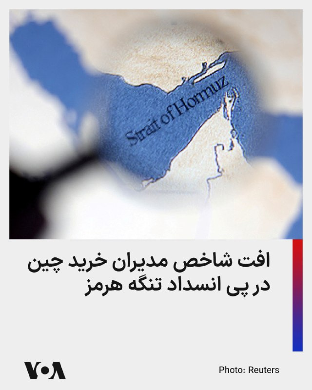

شاخص مدیران خرید بخش تولید چین در ماه مه به ۵۰ واحد کاهش یافت که ۰.۳ درصد کمتر از ماه گذشته است. این شاخص وضعیت اقتصادی بخش‌های تولیدی و خدماتی را از دیدگاه مدیران خرید نشان می‌دهد و عدد بالاتر از ۵۰ نشان‌دهنده رشد و عدد پایین‌تر از ۵۰ بیانگر انقباض است.

بدین ترتیب، وضعیت رشد در بخش‌های تولیدی چین طی ماه جاری متوقف شده است.

بر اساس گزارش رسمی دولت چین، علت افت این شاخص مربوط به کاهش سفارش‌های جدید صادراتی و افزایش هزینه نهاده‌های تولید است. این وضعیت نگرانی‌ها را درباره از دست رفتن شتاب رشد اقتصادی چین، با وجود برخی نشانه‌های مثبت در بخش خدمات و صنایع پیشرفته، افزایش داده است.
@FarsiVOA

## FarsiVOA — post 219159

  

گزارش‌های منتشرشده از نزدیکان جواد علیکردی، وکیل دادگستری محبوس در زندان وکیل‌آباد مشهد، از بیش از ۱۵ روز بی‌خبری از وضعیت او حکایت دارد.

بر اساس این گزارش‌ها، علیکردی که حدود شش ماه پیش پس از شرکت در مراسم یادبود برادرش، خسرو علیکردی، و اعتراض به نحوه برخورد با این مراسم بازداشت شد، همچنان بدون دسترسی منظم به خانواده در زندان نگهداری می‌شود.

نزدیکان او می‌گویند علیکردی پس از دوره‌ای بازجویی در سلول‌های انفرادی اداره اطلاعات مشهد، به بند ۶/۱ زندان وکیل‌آباد منتقل شده، اما همچنان با محدودیت تماس تلفنی و ملاقات روبه‌روست.

در همین گزارش‌ها، خبر صدور حکم ۱۰ سال زندان برای او رد شده و گفته شده تاکنون دادگاهی برای رسیدگی به پرونده‌اش برگزار نشده است.

جواد علیکردی برادر خسرو علیکردی، وکیل حقوق بشری است که آذر ۱۴۰۴ در مشهد جان باخت. خانواده و فعالان حقوق بشر مرگ او را مشکوک دانسته‌اند.
@FarsiVOA

## FarsiVOA — post 219158

  

رئیس جمعیت هلال‌احمر ایران می‌گوید بیمارستان این نهاد در دبی «به زور» تعطیل شده و اموال نقدی و دارایی‌های آن با حکم دادگاه بلوکه شده است.

پیرحسین کولیوند گفت بیماران این بیمارستان، به گفته او، «برخلاف قوانین و مقررات» از مرکز درمانی خارج شده‌اند. او همچنین اعلام کرد رئیس بیمارستان پس از تعطیلی ممنوع‌الخروج شده و هر روز برای محاکمه و بازجویی احضار می‌شود.

رئیس جمعیت هلال‌احمر ایران افزود ویزای کارکنان بیمارستان ایرانیان دبی نیز باطل شده و از خانه‌های سازمانی خود بیرون رانده شده‌اند.

این اظهارات در ادامه اختلاف بر سر تعطیلی بیمارستان ایرانیان در دبی مطرح می‌شود؛ بیمارستانی وابسته به هلال‌احمر ایران که سال‌ها به ایرانیان مقیم و دیگر بیماران در امارات خدمات درمانی ارائه می‌کرد.

در اواخر ماه مارس یک مقام اماراتی گفته بود نهادهایی که «مستقیماً با حکومت ایران مرتبط» هستند، به دلیل آنچه «سوءاستفاده برای پیشبرد دستورکارهایی مغایر با قوانین امارات» خوانده، تعطیل می‌شوند.
@FarsiVOA

## FarsiVOA — post 219157

🔺کاتس می‌گوید اسرائیل کنترل قلعه راهبردی جنوب لبنان را حفظ می‌کند

▪️یسرائیل کاتس، وزیر دفاع اسرائیل اعلام کرد که نیروهای این کشور به‌عنوان بخشی از «منطقه امنیتی جدید» ارتش اسرائیل در جنوب لبنان، در قلعه راهبردی شقیف (بوفور) مستقر باقی خواهند ماند.

▪️وزیر دفاع اسرائیل تأکید کرد که «تصرف بوفور و گسترش مانور زمینی، پیام روشنی به دشمنان ماست: هر کس شهروندان اسرائیل را تهدید کند، دارایی‌های استراتژیک خود را یکی پس از دیگری از دست خواهد داد.»

▪️قلعه‌ شقیف در دوران جنگ‌های صلیبی و بر فراز یک کوه ساخته شده و تصرف آن از سوی نیروهای اسرائیلی، عمیق‌ترین نفوذ اسرائیل به خاک لبنان در بیش از ربع قرن گذشته است.

⬇️ بیشتر بخوانید:
https://ir.voanews.com/a/katz-troops-will-remain-in-beaufort-as-part-of-israel-s-security-zone-in-lebanon/8155758.html

## DW_Farsi — post 125347

🔶 انجمن پرواز۷۵۲ از اصلاح قوانین هوانوردی پس از شش سال خبر داد
 
انجمن خانواده‌های جان‌باختگان پرواز پی‌اس۷۵۲ امروز یکشنبه ۱۰ خرداد (۳۱ مه) اعلام کرد که پس از شش سال و نیم پیگیری و رایزنی، اصلاحاتی در ضمیمه ۱۳ کنوانسیون شیکاگو، یکی از مهم‌ترین اسناد ناظر بر تحقیقات سوانح هوایی، به تصویب رسیده است؛ اصلاحاتی که به گفته این انجمن، در واکنش به کاستی‌هایی شکل گرفته که در روند رسیدگی به سرنگونی هواپیمای اوکراینی در تهران آشکار شد.
 
پرواز پی‌اس۷۵۲ خطوط هوایی بین‌المللی اوکراین بامداد ۱۸ دی ۱۳۹۸ تنها چند دقیقه پس از برخاستن از فرودگاه تهران، با شلیک دو موشک سپاه پاسداران سرنگون شد و تمامی ۱۷۶ سرنشین آن جان باختند. بخش بزرگی از قربانیان، ایرانیان شهروند یا ساکن کانادا بودند.
 
انجمن خانواده‌های جان‌باختگان این هواپیما، در بیانیه خود اعلام کرده است که بر اساس ضمیمه ۱۳ کنوانسیون شیکاگو، مسئولیت هدایت تحقیقات ایمنی در یک سانحه هوایی بر عهده کشوری است که حادثه در قلمرو آن رخ داده است.
 
به گفته این انجمن، همین قاعده باعث شد که تحقیقات ایمنی درباره سرنگونی هواپیمای اوکراینی به جمهوری اسلامی ایران واگذار شود؛ وضعیتی که خانواده‌ها آن را مصداق سپردن "پرونده تحقیقات درباره یک قتل جمعی به دست عاملان آن" توصیف کرده‌اند.
 
به گفته انجمن، اصلاحات جدید پس از سال‌ها دیدار با تصمیم‌گیران بین‌المللی و رایزنی دولت کانادا، در نهادهایی از جمله سازمان بین‌المللی هوانوردی غیرنظامی (ایکائو)، به تصویب رسیده است.
@dw_farsi

## DW_Farsi — post 125346

  

🔶 رییس کمیته نظامی ناتو: اعضای ناتو می‌توانند در بازگشایی تنگه هرمز نقش داشته باشند
 
جوزپه کاوو دراگونه، رییس کمیته نظامی ناتو، گفت این پیمان دفاعی در شرایط کنونی مستقیما در حل‌وفصل مسائل مربوط به تنگه هرمز دخالت ندارد، اما کشورهای عضو این پیمان در حال نزدیک کردن نیروهای خود به منطقه هستند و اگر شرایط لازم فراهم شود، قادر خواهند بود نقش ایفا کنند.
 
کاوو دراگونه گفت ناتو به‌عنوان یک ائتلاف در این مرحله نقشی مستقیم ندارد، اما کشورهای عضو آن چنین نقشی دارند. او افزود این کشورها در حال جابه‌جایی و استقرار نیروهای خود در نزدیکی منطقه هستند تا در صورت مهیا شدن شرایط، بتوانند وارد عمل شوند.
 
او در توضیح بیشتر گفت آنچه در حال شکل‌گیری است، نه یک ماموریت رسمی ناتو، بلکه "ائتلافی از کشورهای مایل" است؛ یعنی مجموعه‌ای از کشورهای عضو ناتو و شریکانی همسو که از هم‌اکنون در حال آماده‌سازی و برنامه‌ریزی هستند تا اگر شرایط مداخله فراهم شد، بتوانند وارد عمل شوند.
@dw_farsi

## DW_Farsi — post 125345

🔶 تعلیق میان ربایش و پهپاد؛ پناهجویان سیاسی ایرانی در عراق
 
🔻گزارشی از آتفه چهارمحالیان

نزدیک به چهار سال از آغاز جنبش"زن، زندگی، آزادی" می‌گذرد، اما آثار آن کماکان بر زندگی بسیاری از معترضان، فعالان سیاسی و خانواده‌های آنان سنگینی می‌کند. شماری از این افراد در سال‌های اخیر ناچار شدند از مسیرهای غیرقانونی مرزی، ایران را ترک کنند و به اقلیم کردستان عراق پناه ببرند؛ منطقه‌ای که برای دهه‌ها یکی از اصلی‌ترین مقاصد پناهجویان سیاسی ایرانی بوده است.
 
روایت کسانی که امروز در اردوگاه‌ها و شهرهای اقلیم زندگی می‌کنند، حاکی از آن است که خروج از ایران برای این پناهجویان به معنای پایان خطر نبوده است.
 
حملات پهپادی و موشکی به اردوگاه‌های محل استقرار پناهجویان و خانواده‌های وابسته به احزاب کرد ایرانی در جنگ اخیر، مشکلات اقامتی، دشواری دسترسی به درمان، نبود امکان کار و هراس از بازگردانده شدن به ایران، تنها بخشی از مشکلاتی است که پناهجویان سیاسی ایرانی از آن سخن می‌گویند.
 
در این میان، روایت اردلان مامه، شهین عبدالقادری، محمد محمدی و علی برزنجی، تصویری از سرنوشت نسلی است که از سرکوب گریخته اما در ناامنی‌های دیگری گرفتار شده است.
@dw_farsi

## DW_Farsi — post 125344

  

🔶 سه سکوی فراساحلی پارس جنوبی پس از جنگ به مدار تولید بازگشتند
 
تورج دهقانی، مدیرعامل شرکت نفت و گاز پارس، گفت روند بازیابی ظرفیت تولید و فرآورش گاز در میدان مشترک پارس جنوبی پس از حملات امریکا و اسرائیل ادامه دارد و تاکنون سه سکوی فراساحلی این میدان دوباره وارد مدار تولید شده‌اند.
 
دهقانی گفت در جریان حملات آمریکا و اسرائیل به برخی تاسیسات پالایشی پارس جنوبی، بخشی از ظرفیت دریافت و فرآورش گاز در نوار ساحلی استان بوشهر با محدودیت روبه‌رو شد.
 
به گفته او، در نتیجه این وضعیت، تعدادی از سکوهای فراساحلی متناظر با پالایشگاه‌های آسیب‌دیده، با وجود آمادگی کامل عملیاتی و بدون آن‌که خود سکوها آسیب دیده باشند، ناچار به توقف تولید شدند، زیرا امکان دریافت و فرآورش گاز تولیدی آن‌ها در بخش خشکی وجود نداشت.
 
مدیرعامل شرکت نفت و گاز پارس گفت با اجرای برنامه‌های فنی و عملیاتی در بخش پایین‌دست و استفاده حداکثری از ظرفیت پالایشگاه‌های فعال، امکان دریافت و فرآورش بخشی از گاز تولیدی این سکوها دوباره فراهم شد.
 
@dw_farsi

## DW_Farsi — post 125343

  

🔶 زهرا شهباز طبری بار دیگر به اعدام محکوم شد
 
به گزارش هرانا، زهرا شهباز طبری، زندانی سیاسی ۶۸ ساله، پس از آن‌که حکم اعدام پیشین او در دیوان عالی کشور نقض شده بود، بار دیگر از سوی شعبه دوم دادگاه انقلاب رشت به ریاست محمدعلی درویش‌گفتار به اعدام محکوم شده است. این حکم با اتهام "بغی" از طریق عضویت و فعالیت در سازمان مجاهدین خلق ایران صادر شده و در تاریخ سه‌شنبه (۲۵ فروردین ۱۴۰۵) علیه او صادر و به‌تازگی ابلاغ شده است.
 
زهرا شهباز طبری پیش‌تر در آبان ۱۴۰۴ از سوی شعبه اول دادگاه انقلاب رشت در ارتباط با همین اتهام به اعدام محکوم شده بود. آن حکم بعدتر در دیوان عالی کشور نقض شد و پرونده برای رسیدگی دوباره به شعبه دوم دادگاه انقلاب رشت فرستاده شد.
 
با این حال، رسیدگی مجدد نیز بار دیگر به صدور حکم اعدام منتهی شده است.
 
هرانا نوشته است زهرا شهباز طبری پیش‌تر در نامه‌ای از زندان، روند رسیدگی به پرونده خود را "فاقد مبنای حقوقی و نشانه‌ای از نبود دادرسی عادلانه" توصیف کرده بود.
 
@dw_farsi

## DW_Farsi — post 125342

  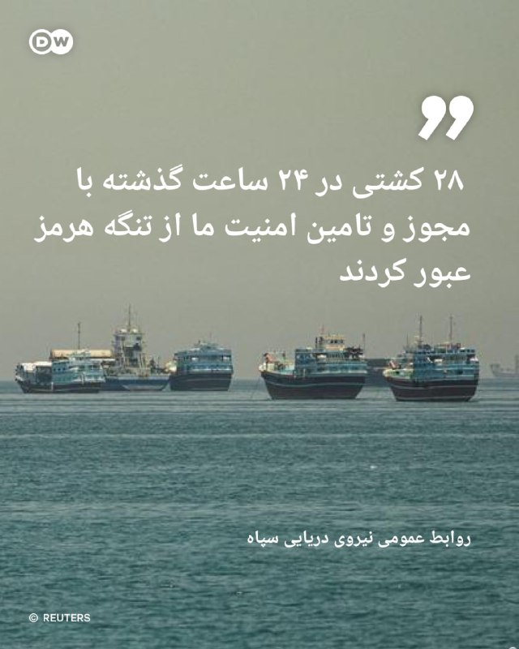

🔶 سپاه: ۲۸ کشتی در ۲۴ ساعت گذشته با مجوز و تامین امنیت ما از تنگه هرمز عبور کردند
 
روابط عمومی نیروی دریایی سپاه در اطلاعیه‌ای اعلام کرد طی ۲۴ ساعت گذشته ۲۸ فروند کشتی، شامل نفتکش، کانتینربر و دیگر کشتی‌های تجاری، پس از دریافت مجوز و با هماهنگی و تامین امنیت نیروی دریایی سپاه از تنگه هرمز عبور کرده‌اند.
 
در این اطلاعیه آمده است کنترل "هوشمند" تنگه هرمز به‌طور مستمر و آنچه "صلابت و اقتدار" خوانده شده، در حال انجام است.
 
سپاه در این بیانیه عبور کشتی‌ها را در چارچوب مجوزدهی و نظارت مستقیم خود توصیف کرده است.
 
روابط عمومی نیروی دریایی سپاه همچنین خلیج فارس را پهنه‌ای آبی متعلق به کشورهای مسلمان منطقه خواند و اعلام کرد "تجاوز و شرارت‌های ارتش تروریست آمریکایی" مهم‌ترین دلیل ناامنی این منطقه در روزهای اخیر بوده است.
@dw_farsi

## DW_Farsi — post 125341

🔶 اسرائیل قلعه راهبردی بوفور در جنوب لبنان را تصرف کرد
 
ارتش اسرائیل امروز یکشنبه ۳۱ مه (۱۰ خرداد) اعلام کرد که نیروهایش در جنوب لبنان قلعه راهبردی بوفور (شقیف) را تصرف کرده‌اند. این عمیق‌ترین پیشروی نیروهای اسرائیلی در خاک لبنان در بیش از ربع قرن گذشته به شمار می‌رود.
 
یسرائیل کاتس، وزیر دفاع اسرائیل، گفت ارتش این کشور به رهبری نخست‌وزیر بنیامین نتانیاهو «عملیات خود در لبنان را گسترش داده، از رود لیتانی عبور کرده و ارتفاعات بوفور را به تصرف درآورده است.»
 
کاتس افزود که این اقدام در راستای دفاع از شهرک‌های منطقه جلیل در شمال اسرائیل و تأمین امنیت سربازان اسرائیلی انجام شده است.
 
آویخای ادرعی، سخنگوی عرب‌زبان ارتش اسرائیل، نیز در شبکه ایکس عکس‌هایی را منتشر کرده که نیروهای اسرائیلی را در حال حرکت در برابر این قلعه نشان می‌دهد.
 
این نخستین بار در ۲۶ سال گذشته است که نیروهای اسرائیلی در این محل مستقر می‌شوند. قلعه بوفور، در ارتفاع تقریبی ۶۵۰ متری بالاتر از سطح رودخانه لیتانی در جنوب لبنان، علاوه بر اهمیت استراتژیک، از اهمیت نمادین بالایی برخوردار است.
 
در دوران اشغال جنوب لبنان توسط اسرائیل از سال ۱۹۸۲ تا ۲۰۰۰، این قلعه ابتدا مدت‌ها صحنه درگیری بود و سپس برای سال‌ها به یک پایگاه پیشروی ارتش اسرائیل تبدیل شد.
 
@dw_farsi

## DW_Farsi — post 125340

🔶 قالیباف می‌گوید ایران "هیچ اعتمادی" به وعده‌های آمریکا ندارد

محمدباقر قالیباف، رئیس مجلس شورای اسلامی در جلسه مجازی مجلس، در نطق پیش از دستور سومین سال مجلس دوازدهم با اشاره به کشته شدن علی خامنه‌ای، در روز آغاز جنگ آمریکا و اسرائیل علیه جمهوری اسلامی، گفت که مجلس "به مدیریت و رهبری" مجتبی خامنه‌ای، فرزند علی خامنه‌ای دلگرم است و "پیام‌ها و رهنمودهای" او را "نقشه‌ راه" مجلس توصیف کرد.

قالیباف همچنین با اشاره به مذاکرات جاری بین جمهوری اسلامی و آمریکا بر سر ادامه آتش‌بس و توافق هسته‌ای، با بیان این که جمهوری اسلامی "هیچ اعتمادی" به وعده‌های آمریکا ندارد گفت: «کار دیپلماسی تبدیل پیروزی‌های کسب شده در میدان نظامی به دستاوردهای سیاسی و حقوقی است.»

رئیس مجلس شورای اسلامی در ادامه، مذاکره‌کنندگان جمهوری اسلامی را "سربازان میدان مبارزه‌ دیپلماسی" توصیف کرد و گفت مذاکره‌کنندگان جمهوری اسلامی "هیچ اعتمادی به حرف ها و وعده‌های دشمن ندارند".

قالیباف افزود: «آنچه برای ما ملاک است دستاوردهای عینی است که باید کسب کنیم تا در مقابل آن دست به انجام تعهدات خود بزنیم و تا اطمینان پیدا نکنیم که حقوق ملت ایران را گرفته ایم، هیچ توافقی را تأیید نخواهیم کرد.»

رئیس مجلس شورای اسلامی همچنین بدون اشاره به پیامدهای وخیم جنگ و تحریم و محاصره دریایی برای اقتصاد ایران مدعی شد که مسئولان نظام برای کاهش مشکلات اقتصادی و معیشتی مردم تلاش می‌کنند. قالیباف همچنین گفت که اطمینان دارد که جمهوری اسلامی از این جنگ بزرگ "با پیروزی" خارج خواهد شد.

@dw_farsi

## DW_Farsi — post 125339

🔶 سفارت ایران در دانمارک گزارش جدید سازمان امنیت این کشور را رد کرد

سفارت جمهوری اسلامی در کپنهاگ با انتشار بیانیه‌ای ضمن رد گزارش سازمان اطلاعات و امنیت دانمارک (PET) گفت که حکومت ایران همواره و رسما هرگونه دخالت در فعالیت‌های ادعایی در خاک دانمارک را رد کرده است.

سفارت جمهوری اسلامی در بیانیه خود همچنین ادعا کرده که گزارش‌های سازمان اطلاعات و امنیت دانمارک "طی سال‌های گذشته تصویری تکراری و نادرست از تهدید ایران ارائه کرده‌اند، بدون آنکه اسناد قانع‌کننده‌ای برای اثبات این ادعاها منتشر کنند".

سازمان اطلاعات و امنیت دانمارک در ارزیابی جدید خود گزارش کرده است که جمهوری اسلامی در خلال تحولات اخیر، نقشی پررنگ‌تر در "تهدیدهای امنیتی علیه دانمارک" بازی می‌کند.

سفارت جمهوری اسلامی بدون ارائه هیچ مدرکی گزارش سازمان امنیت دانمارک را رد کرده و مدعی شده که "میان ادعاهای مطرح‌شده و مدارک ارائه‌شده فاصله قابل توجهی وجود دارد و همین امر اعتبار نتیجه‌گیری‌های PET را زیر سؤال می‌برد".

در این بیانیه با اشاره به دو پرونده ذکر شده در گزارش سازمان امنیت دانمارک ادعا شده که "هیچ‌یک از این پرونده‌ها مدارک مستندی که دخالت دولت ایران را اثبات کند ارائه نشده است".

این دو مورد، یک پرونده سال ۲۰۱۸ و تلاش برای ترور یکی از رهبران گروه الاحوازیه در دانمارک و دیگری پرونده حمله به سفارت اسرائیل در کپنهاگ در سال ۲۰۲۴ را شامل می‌شوند.

سفارت جمهوری اسلامی در عین حال مدعی شده که "خود گروه الاحوازیه بعدها به دریافت حمایت خارجی، فعالیت‌های جاسوسی و ارتباط با عملیات خشونت‌آمیز، متهم و محکوم شده است".

در این بیانیه همچنین به پرونده حمله به سفارت اسرائیل در کپنهاگ اشاره شده و آمده که در این مورد "نه تنها هیچ مدرک مستندی ارائه نشده، بلکه افراد محکوم نیز در جریان دادگاه خود در کپنهاگ، ادعایی را در مورد ارتباط با ایران مطرح نکردند".

در گزارش جدید سازمان امنیت دانمارک، سطح کلی تهدید از سوی جمهوری اسلامی برای دانمارک در سطح ۴ از ۵ باقی مانده اما مقام‌های اطلاعاتی این کشور می‌گویند سرشت این تهدیدها در سال‌های اخیر دگرگون شده و پیچیده‌تر شده است.

@dw_farsi

## DW_Farsi — post 125338

🔶 آژانس اتمی خواستار بازدید از نیروگاه هسته‌ای زاپوریژیا شد

آژانس بین‌المللی انرژی اتمی خواستار دسترسی به سالن توربین نیروگاه هسته‌ای زاپوریژیا شده است؛ سالنی که در جریان جنگ روسیه علیه اوکراین، اخیراً مورد اصابت یک پهپاد قرار گرفت.

این نهاد نظارتی سازمان ملل در شبکه ایکس اعلام کرد که از حمله‌ای مطلع شده که در نتیجه آن سوراخی در دیوار این سالن ایجاد شده است. به گفته آژانس، این نخستین حمله پهپادی در محوطه نیروگاه زاپوریژیا از آوریل ۲۰۲۴ به این سو بوده است.

نیروگاه زاپوریژیا با شش راکتور و ظرفیت اسمی شش هزار مگاوات، بزرگ‌ترین نیروگاه هسته‌ای اروپا به شمار می‌رود. این نیروگاه متعلق به اوکراین است، اما از مارس ۲۰۲۲ تحت کنترل روسیه قرار دارد.

این نیروگاه در حال حاضر برق تولید نمی‌کند و چندین تلاش اوکراین برای بازپس‌گیری آن نیز تاکنون ناکام مانده است.

@dw_farsi

## DW_Farsi — post 125337

  

🔶 بازداشت دو نفر در ارومیه به اتهام "ارتباط با اسرائیل"

اطلاعات سپاه با صدور بیانیه‌ای مدعی شد که دو فرد "مرتبط با اسرائیل" را در ارومیه شناسایی و دستگیر کرده است.

خبرگزاری دولتی ایرنا با انتشار این خبر ادعا کرد که افراد دستگیرشده "اقدام به ارسال اطلاعات و مختصات برخی اماکن از جمله مدارس، مساجد و حوزه‌های مقاومت بسیج از طریق پیام‌رسان تلگرام کرده بودند".

در بیانیه اطلاعات سپاه آمده است که این افراد، "پس از حملات صورت‌گرفته، از محل‌های آسیب‌دیده تصویربرداری کرده و تصاویر را برای عوامل مرتبط ارسال می‌کردند".

ارتباط با اسرائیل یا جاسوسی از جمله عناوین اتهامی رایج در جریان جنگ ۱۲ روزه و جنگ اخیر میان جمهوری اسلامی و آمریکا بوده است. محافل رسمی حکومت ایران، به رغم وجود صدها عکس و فیلم و سند از حمله به شهروندان، اعتراضات ۱۸ و ۱۹ دی ۱۴۰۴ و حتی کشتار هزاران نفر از شهروندان را نیز اغلب به اسرائیل و موساد نسبت می‌دهند.

@dw_farsi

## Persian_Trend_Official — post 15400

  <a href="telegram/content/Persian_Trend_Official_15400_1780240635.mp4" target="_blank">🎬 Download video</a>

صداوسیما به شدت عصبانیه که چرا اینترنت وصل شده !
به قول اون پیرمرد معروف، یک یکتون ...

📌 @persian_trend_official
پرشین ترند | متفاوت‌ترین کانال نظامی

## Persian_Trend_Official — post 15399

بنیامین نتانیاهو، نخست وزیر اسرائیل: من به ارتش اسرائیل دستور دادم که مانور را در لبنان گسترش دهد.

نیروهای ما از موانع قدرتمند عبور کردند. آنها زمین های فرماندهی را تصرف کردند و خط الراس بوفورت را تصرف کردند و اکنون دستور من این است که تسلط خود را بر مناطقی که تحت کنترل حزب الله بودند، عمیق تر و گسترش دهیم.

ما در حال آغاز اقدام هستیم، ما در همه جبهه ها عمل می کنیم در سوریه، غزه و لبنان. زمان می برد، اما ما ماموریت را کامل خواهیم کرد.

📝 Amir

📌 @persian_trend_official
پرشین ترند | متفاوت‌ترین کانال نظامی

## Persian_Trend_Official — post 15398

  

نباید از حضور سامانه های راداری و پدافندی ایرانی در ارمنستان تعجب کرد.

در اواسط دهه 2000 میلادی زمانی که ایران به تازگی به زمینه ساخت سیستم های راداری وارد شده بود پژوهشکده ارتباطات ایروان (ErNIISS) کمک های شایانی به ایران در جهت توسعه سیستم های راداری کرد.

یکی از این سیستم ها که با مشارکت ارمنی ها ساخته شده رادار آرایه فازی فعال نجم-802 است که در سیستم پدافندی صیاد نقش رادار کنترل آتش را دارد.

📝 Amir

📌 @persian_trend_official
پرشین ترند | متفاوت‌ترین کانال نظامی

## Persian_Trend_Official — post 15396

یک سوخت رسان آسیب دیده دیگر امریکایی در پایگاه هوایی میلدنهال توسط عکاسان ثبت شد.

عکاسان هوانوردی در اطراف پایگاه هوایی میلدنهال انگلیس تصاویری از یک هواپیمای سوخت رسان KC-135R آسیب دیده منتشر کردند، این سوخت رسان در فرودگاه بن گوریون در اثر اصابت موشک ایرانی در جریان جنگ 40 روزه آسیب دیده است.

این هواپیمای سوخت رسان پس از پشت سر گذاشتن تعمیرات و اورهال خود، هفته گذشته از فرودگاه بن گوریون برخواسته و وارد پایگاه میلدنهال انگلیس شده و روز گذشته نیز به امریکا برگشته است.

📝 Amir

📌 @persian_trend_official
پرشین ترند | متفاوت‌ترین کانال نظامی

## Persian_Trend_Official — post 15395

دونالد ترامپ: ما به یک توافق عالی خواهیم رسید، وگرنه برمی‌گردیم و آن را از طریق نظامی تمام می‌کنیم.

آنها در ابتدا گفتند: ما سلاح هسته‌ای تولید نخواهیم کرد. من گفتم: خب، اگر سلاح هسته‌ای بخرید چه اتفاقی می‌افتد؟

بنابراین اکنون گفته می‌شود: ما سلاح نظامی تولید نخواهیم کرد یا به هیچ وجه خریداری نخواهیم کرد. این یک تفاوت بزرگ است.

📌 @persian_trend_official
پرشین ترند | متفاوت‌ترین کانال نظامی

## Persian_Trend_Official — post 15394

ترامپ در مصاحبه با فاکس نیوز: ببینید، دو چیز لازم است، تنگه هرمز باید فوراً باز شود و باید آزاد باشد، آن هم بدون عوارض

و دوم اینکه آنها نمی‌توانند سلاح هسته‌ای داشته باشند. همین است؛ خیلی ساده است. بعد ما از آنجا خارج خواهیم شد.

📌 @persian_trend_official
پرشین ترند | متفاوت‌ترین کانال نظامی

## Persian_Trend_Official — post 15392

  <a href="telegram/content/Persian_Trend_Official_15392_1780240638.mp4" target="_blank">🎬 Download video</a>

تصاویری بیشتر از بمباران شهر صور توسط ارتش اسرائیل

همچنین وزارت بهداشت لبنان اعلام کرد که در جریان حملات هوایی روز گذشته اسرائیل، 16 نفر از شهروندان این کشور کشته و 35 نفر زخمی شدند.

📝 Amir

📌 @persian_trend_official
پرشین ترند | متفاوت‌ترین کانال نظامی

## Persian_Trend_Official — post 15391

یسرائیل کاتز، وزیر دفاع اسرائیل: نیرو‌های نظامی ما به عنوان بخشی از منطقه امنیتی جدید تا اطلاع ثانوی در قلعه بوفور خواهند ماند! 📝 Amir 📌 @persian_trend_official پرشین ترند | متفاوت‌ترین کانال نظامی

## Persian_Trend_Official — post 15389

حملات هوایی گسترده ارتش اسرائیل به شهر صور لبنان

📝 Amir

📌 @persian_trend_official
پرشین ترند | متفاوت‌ترین کانال نظامی

## RadioFarda — post 157746

سی‌ان‌ان: ایران چندین ورودی تأسیسات موشکی زیرزمینی خود را بازگشایی کرده است

🔸شبکه خبری سی‌ان‌ان روز یکشنبه ۱۰ خرداد با استناد به تصاویر ماهواره‌ای اعلام کرد ایران توانسته از زمان توقف جنگ شماری از زرادخانه‌های موشکی مدفون خود بر اثر حملات هوایی آمریکا و اسرائیل را از زیر خاک بیرون بیاورد.

🔸حملات آمریکا و اسرائیل با تخریب جاده‌ها و مسدود کردن ورودی تونل‌ها، دسترسی ایران به پایگاه‌های موشکی زیرزمینی را محدود کرده بود.

🔸سی‌ان‌ان ادعا کرده است که ایران تاکنون ۵۰ مورد از ۶۹ ورودی تونلی را که در ۱۸ تأسیسات موشکی زیرزمینی توسط آمریکا و اسرائیل هدف قرار گرفته بودند، بازگشایی کرده است، از جمله در پایگاه‌هایی در خارج از اصفهان و در اطراف خمین.

🔸بر اساس گزارش این شبکه خبری، ایران همچنین بخش‌های دیگری از این پایگاه‌ها را نیز ترمیم کرده است؛ از جمله جاده‌هایی که آمریکا و اسرائیل برای جلوگیری از تردد پرتابگرهای موشکی بمباران کرده بودند. تصاویر ماهواره‌ای نشان می‌دهند که تقریباً تمامی گودال‌های ناشی از بمباران اکنون پر شده‌اند و در دو پایگاه، این جاده‌ها حتی دوباره آسفالت شده‌اند.

🔸ایران شبکه پایگاه‌های زیرزمینی خود را در عمق خاک و در مواردی زیر کوه‌ها ساخته است تا در برابر حملات هوایی مصون باشند، به همین دلیل آمریکا و اسرائیل بسیاری از ورودی‌های این تأسیسات را بمباران کردند؛ اقدامی که در کنار تلاش برای شناسایی و نابود کردن پرتابگرهای موشکی، باعث شد توان ایران برای شلیک موشک به‌طور قابل توجهی محدود شود.

🔸این حملات خسارت سنگینی به پایگاه‌ها وارد کرد؛ به‌گونه‌ای که بیشتر ورودی‌های تونل‌ها زیر حجم عظیمی از آوار مدفون شدند و جاده‌های منتهی به این سایت‌ها نیز به‌شدت تخریب شدند.

🔸سی‌ان‌ان می‌گوید باز کردن ورودی تأسیسات موشکی زیرزمینی می‌تواند به ایران این قابلیت را دهد که در صورت وقوع دور جدیدی از درگیری‌ها، موشک‌های بالستیک بیشتری نسبت به اواخر جنگ ۴۰ روزه به سمت اسرائیل و کشورهای دیگر شلیک کند.

@RadioFarda

## RadioFarda — post 157745

🔸مرمت‌گران کاخ گلستان سر مجسمه فرشته تخت مرمر را پیدا کردند.

🔸کاخ گلستان در جریان حملات هوایی آمریکا و اسرائیل در اسفند ماه آسیب دیده بود.

🔸تخت مرمر کاخ‌موزه گلستان به دستور فتحعلی‌شاه قاجار از ۶۵ قطعه مرمر زرد ساخته شده است.

@RadioFarda

## RadioFarda — post 157744

  <a href="https://t.me/radiofarda/157744" target="_blank">📎 Download file</a>

📻بشنوید: ساعت ۱۴ با رادیوفردا، دهم خرداد ۱۴۰۵‌

@Radiofarda

## RadioFarda — post 157743

  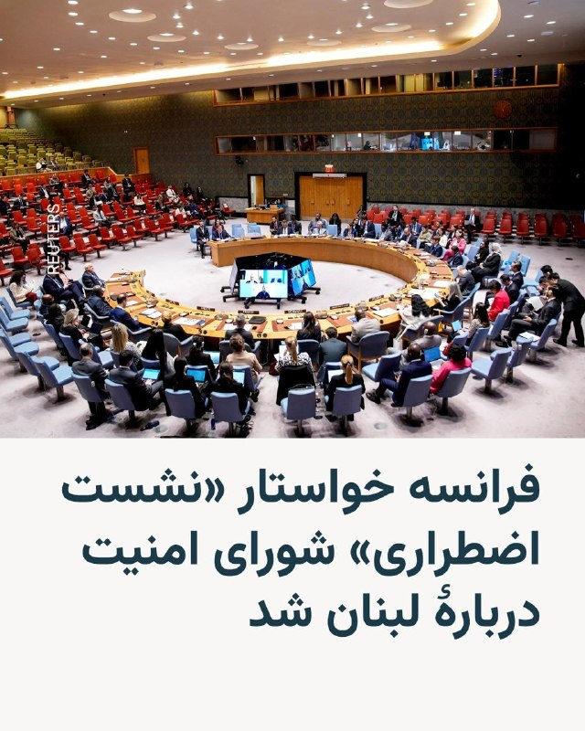

🔸وزیر خارجهٔ فرانسه روز یک‌شنبه اعلام کرد که پاریس پس از تصرف قلعهٔ قرون‌وسطایی شَقیف (بوفور) در لبنان از سوی نیروهای اسرائیلی، خواستار برگزاری نشست اضطراری شورای امنیت سازمان ملل متحد شده است.

🔸ژان نوئل بارو در گفت‌وگو با شبکهٔ ب‌اف‌ام‌تی‌وی فرانسه گفت: «من خواستار نشست اضطراری شورای امنیت سازمان ملل متحد شده‌ام، زیرا هرچند ما حق اسرائیل را، مانند همهٔ کشورها، برای دفاع از خود به رسمیت می‌شناسیم، هیچ چیز نمی‌تواند ادامهٔ عملیات نظامی اسرائیل در لبنان و اشغال هرچه عمیق‌تر خاک لبنان را توجیه کند.»

🔸ارتش اسرائیل می‌گوید عملیات زمینی خود در جنوب لبنان را گسترش داده و نیروهایش از رود لیتانی عبور کرده‌اند. همزمان، وزیر دفاع اسرائیل از تصرف قلعهٔ راهبردی شقیف و برافراشتن پرچم این کشور بر فراز آن خبر داد؛ قلعه‌ای که اسرائیل پیشتر تا سال ۲۰۰۰ از آن به‌عنوان پایگاه در جنوب لبنان استفاده می‌کرد.

@RadioFarda

## RadioFarda — post 157742

پیگیری خانواده‌های جان‌باختگان پرواز ۷۵۲ به اصلاح مقررات هوایی بین‌المللی انجامید

🔸انجمن خانواده‌های جان‌باختگان پرواز پی‌اس۷۵۲ اعلام کرد که پس از شش سال و نیم پیگیری و رایزنی، ضمیمهٔ ۱۳ کنوانسیون شیکاگو، مربوط به تحقیقات ایمنی سوانح هوایی، اصلاح می‌شود، تغییری که به گفتهٔ این انجمن می‌تواند مانع تکرار وضعیتی شود که در آن کشور متهم یا دارای تضاد منافع، خود مسئول هدایت تحقیقات ایمنی شود.

🔸پرواز پی‌اس۷۵۲ هواپیمایی اوکراین بامداد ۱۸ دی ۱۳۹۸، دقایقی پس از برخاستن از فرودگاه تهران، با شلیک دو موشک سپاه پاسداران سرنگون شد و همهٔ ۱۷۶ سرنشین آن جان باختند.

🔸بر اساس مقررات موجود در ضمیمهٔ ۱۳ کنوانسیون شیکاگو، مسئولیت اصلی تحقیقات ایمنی بر عهدهٔ کشوری قرار گرفت که سانحه در قلمرو آن رخ داده بود؛ یعنی جمهوری اسلامی ایران.

🔸انجمن خانواده‌های جان‌باختگان در بیانیهٔ خود نوشت که این چارچوب حقوقی، که طی دهه‌ها برای رسیدگی به فجایع هوانوردی به کار می‌رفت، در پروندهٔ سرنگونی پرواز پی‌اس۷۵۲ «اَلکن و ناکافی» بود و عملاً «پروندهٔ تحقیقات دربارهٔ قتلی جمعی به دست قاتلان افتاد».

🔸بر اساس نامه‌ای که به گفتهٔ انجمن از سوی وزیر ترابری کانادا دریافت شده، اصلاحیهٔ تازه ایکائو برای نخستین بار به مسئله تضاد منافع در تحقیقات ایمنی پس از سرنگونی هواپیما پرداخته است.

🔸این اصلاحیه همچنین راهکارهایی برای حفظ استقلال تحقیقات پیشنهاد می‌دهد؛ از جمله واگذاری تحقیقات ایمنی به دولتی دیگر و ارائهٔ به‌موقع اطلاعات واقعی و تأییدشده به افکار عمومی.

🔸 گزارش کامل را در وب‌سایت رادیوفردا بخوانید.

@RadioFarda

## RadioFarda — post 157741

  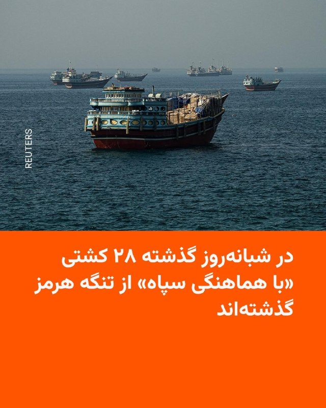

🔸نیروی دریایی سپاه پاسداران روز یک‌شنبه اعلام کرد که ۲۸ کشتی «با هماهنگی» این نیروی نظامی حکومت ایران از تنگه هرمز عبور کرده‌اند.

🔸این آمار عبور کشتی‌ها از این تنگه استراتژیک در یک شبانه‌روز گذشته است.

🔸در بیانیه سپاه آمده است:‌ «طی شبانه‌روز گذشته ۲۸ فروند کشتی اعم از نفتکش، کانتینربَر و سایر کشتی‌های تجاری پس از کسب مجوز با هماهنگی و تأمین امنیت نیروی دریایی سپاه از تنگه هرمز عبور کردند.»

🔸ساعتی پیشتر روزنامه اسرائیلی «اسرائیل هیوم» نوشته بود که ده‌ها نفتکش حامل نفت و گاز طبیعی مایع در هفتهٔ گذشته با اجازه آمریکا و پرداخت عوارض به ایران از تنگهٔ هرمز عبور کرده‌اند.

🔸این در حالی است که دولت آمریکا بارها اعلام کرده است با پرداخت عوارض به ایران برای عبور از تنگه هرمز مخالف است.

@RadioFarda

## RadioFarda — post 157740

🔸جلسه مجازی صحن مجلس شورای اسلامی به ریاست محمدباقر قالیباف و مشارکت آنلاین ۱۸۷ نماینده و حضور ۱۴ نماینده برگزار شد. 🔸در این جلسه که اولین جلسه از سومین سال مجلس دوازدهم بود، اعضای جدید هیئت رئیسه مجلس سوگند یاد کردند. 🔸جلسه روز یک‌شنبه، دهم خردادماه، همچون…

## RadioFarda — post 157739

  

🔸جلسه مجازی صحن مجلس شورای اسلامی به ریاست محمدباقر قالیباف و مشارکت آنلاین ۱۸۷ نماینده و حضور ۱۴ نماینده برگزار شد.

🔸در این جلسه که اولین جلسه از سومین سال مجلس دوازدهم بود، اعضای جدید هیئت رئیسه مجلس سوگند یاد کردند.

🔸جلسه روز یک‌شنبه، دهم خردادماه، همچون جلسات معدود گذشته در مکانی مخفی برگزار شد.

🔸محمدباقر قالیباف در همین جلسه تأکید کرد که «تا اطمینان پیدا نکنیم که حقوق ملت ایران را گرفته‌ایم، هیچ توافقی تأیید نمی‌شود».

🔸قالیباف که از او به عنوان رئیس هیئت مذاکره‌کننده ایران نیز یاد می‌شود در این جلسه بیانیه‌ای را قرائت کرد و در آن ادعا کرد که «در حال عقب نشاندن دشمن در یک جنگ تاریخ‌ساز هستیم».

@RadioFarda

## IranianMinds — post 21146

  <a href="telegram/content/IranianMinds_21146_1780240643.mp4" target="_blank">🎬 Download video</a>

🔴 حملات جدید اسرائیل به لبنان.

@IranianMinds

## IranianMinds — post 21145

  

حمید رسایی قبل از جنگ :
مجلس رو تعطیل کنیم بودجه‌اش رو بدیم به مردم.

بعد از جنگ :
مجلس باید باز شود ، اقدامات تقنینی و نظارتی صورت بگیرد

@IranianMinds

## IranianMinds — post 21144

امروز 31 May
روز جهانی لبخنده
چیزی که خیلی وقته ما ایرانیا یادمون رفته
این روز رو به همه جز ایرانیا تبریک میگیم

و لعنت بر باعثو بانیش

@IranianMinds

## IranianMinds — post 21143

  <a href="telegram/content/IranianMinds_21143_1780240646.mp4" target="_blank">🎬 Download video</a>

درود به شرفت.

@IranianMinds

## IranianMinds — post 21142

🔴 ناتو:

ممکن است در موضوع بازگشایی تنگه هرمز مداخله کنیم

@IranianMinds

## IranianMinds — post 21141

  <a href="telegram/content/IranianMinds_21141_1780240649.mp4" target="_blank">🎬 Download video</a>

جان‌فدایی را با فرم و ثبت‌نام ثبت نمی‌کنند، جان‌فدایی را با ایستادگی، زندان، زخم و خون می‌نویسند.

@IranianMinds

## IranianMinds — post 21140

  

دسترسی دیتاسنتر همراه اول به اینترنت برقرار شد

اولین نشانه بازگشت اینترنت به دیتاسنتر ها باید منتظر باشیم و وضعیت بقیه دیتاسنتر ها رو هم ببینیم

@IranianMinds

## IranianMinds — post 21138

  

🔴 کمپین جدید خبرگزاری فارس :

قطع داوطلبانه اینترنت !!

@IranianMinds

## IranianMinds — post 21137

  

اشک شوق لاک‌پشت، نمی‌دونستم که سرعت من از سرعت اینترنت در ایران بیشتره.

@IranianMinds

## IranianMinds — post 21136

صدا سیما:
صداهای شنیده‌شده در قشم و بندرعباس ناشی از امحای مهمات باقی‌مانده از جنگ است

@IranianMinds

## IranianMinds — post 21126

  <a href="telegram/content/IranianMinds_21126_1780240652.mp4" target="_blank">🎬 Download video</a>

🔴عملیات ارتش اسرائیل در رشته کوه بوفور و منطقه وادی سلوکی در جنوب لبنان.

@IranianMinds

## IranianMinds — post 21125

  <a href="telegram/content/IranianMinds_21125_1780240655.mp4" target="_blank">🎬 Download video</a>

🔴قالیباف:
دشمن بعد از شکست نظامی، با فشارهای اقتصادی و جنگ رسانه‌ای به دنبال ایجاد تفرقه و وارد کردن ایران به تسلیم شدن است، اما مردم ما با اتحاد نقشه‌هایشان را خنثی کردند.

ای حرومزاده جنایتکار.

@IranianMinds

## BBCPersian — post 282504

  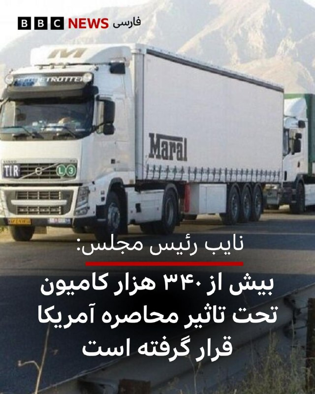

🔻حمیدرضا حاجی بابایی امروز در جلسه مجازی مجلس گفت: «با ایجاد اختلال در تامین کالا به‌ویژه در بنادر جنوب، بیش از ۳۴۰ هزار کسب‌وکار مرتبط با کامیون‌ها و تریلرها و بارکش‌ها تحت تاثیر قرار گرفته است.»

او همچنین گفت که محاصره دریایی باعث اختلال در «۸۰ درصد از ۴۰ تا ۴۵ میلیون تن واردات سالانه» شده است، از این رو «واردات حداقل ۵۰ درصد از نیاز وارداتی کالاهای اساسی از طریق بنادر شمالی شروع شده است و باید حتما با قدرت ادامه پیدا کند.»

محمدرضا رضایی کوچی، رئیس کمیسیون عمران، هم گفت: «۴۰۰ هزار راننده در کشور وجود دارد که متاسفانه به دلیل مشخص نبودن مبدا کالاها، در تامین معیشت دچار مشکل شده‌اند.»

او همچنین گفت: «بیش از ۳۰ هزار راننده در کشور وجود دارند که فاقد پوشش بیمه هستند و باید به مسائل معیشتی آنها توجه شود.»

📸IRNA
https://trib.al/MdcHYqS
@BBCPersian

## BBCPersian — post 282503

  <a href="https://t.me/bbcpersian/282503" target="_blank">📎 Download file</a>

📻 تازه‌ترین خبرهای جهان یکشنبه ۱۰ خرداد ۱۴۰۵ از رادیو بی‌بی‌سی در لندن

@BBCPersian

## BBCPersian — post 282502

🔻وزارت بهداشت لبنان: در حمله اسرائیل به بیمارستانی در صور، ۱۳ نفر از کارکنان زخمی شدند

وزارت بهداشت لبنان اعلام کرد در حمله هوایی اسرائیل به نزدیکی یک بیمارستان در شهر صور در جنوب لبنان، «۱۳ نفر» از کارکنان این مرکز درمانی زخمی شده‌اند.

این در حالیست که ارتش اسرائیل به پیشروی در عمق خاک لبنان ادامه می‌دهد.

وزارت بهداشت لبنان در بیانیه‌ای گفت: «دشمن اسرائیلی در اطراف بیمارستان حیرام در صور اقدام به حمله هوایی کرد که در نتیجه آن ۱۳ نفر از کارکنان بیمارستان زخمی شدند و خسارات قابل توجهی به این مرکز وارد شد.»

این بیانیه از جامعه بین‌المللی خواست برای جلوگیری از «گسترش و تشدید حملات اسرائیل» اقدام کند.

https://trib.al/GzhNERS
@BBCPersian

## BBCPersian — post 282501

🔻سخنگوی دولت: افزایش مبلغ کالابرگ در صورت فراهم بودن شرایط مالی اجرا می‌شود

سخنگوی دولت ایران گفت که افزایش مبلغ کالابرگ از برنامه‌های دولت است اما تصمیم‌گیری در این زمینه باید با توجه به ظرفیت‌های مالی کشور انجام شود.

فاطمه مهاجرانی با تاکید بر ضرورت هم‌خوانی برنامه‌ها با منابع موجود گفت که وزارتخانه‌های مرتبط در حال بررسی شرایط هستند.

او همچنین گفت: «وضعیت مناطق مرزی جنوبی و حوزه دریایی هم بر درآمدهای کشور اثر گذاشته و در نهایت هدف دولت، تحقق این افزایش در صورت فراهم شدن امکان آن است.»

طی ماه‌های اخیر به‌ویژه پس از جنگ، روند افزایش قیمت کالاهای اساسی، بازنگری در مبلغ کالابرگ را به یکی از مطالبات جدی خانوارها و کارشناسان اقتصادی تبدیل کرده است.

مبلغ کالابرگ ثابت و یکسان نیست و به عوامل مختلفی مثل دهک درآمدی خانوار و تصمیم‌های دوره‌ای دولت بستگی دارد.

https://trib.al/dMeO03K
@BBCPersian

## BBCPersian — post 282500

🔻نتانیاهو تصرف قلعه استراتژیک در لبنان را «تغییری چشمگیر» در جنگ با حزب‌الله خواند

بنیامین نتانیاهو گفت که تصرف قلعه شقیف (بوفور) در جنوب لبنان «تغییری چشمگیر» در کارزار علیه حزب‌الله محسوب می‌شود.

او در پیامی ویدئویی گفت: «امروز ما به شکلی متفاوت به بوفور بازگشتیم، ما متحد، مصمم و قوی‌تر از همیشه بازگشته‌ایم.»

نخست وزیر اسرائیل افزود: «تصرف قلعه بوفور یک مرحله و یک تغییر اساسی در سیاستی است که در پیش گرفته‌ایم. ما مانع ترس را از میان برداشته‌ایم. ما ابتکار عمل را در دست داریم و در همه جبهه‌ها، در سوریه، غزه و لبنان در حال عملیات هستیم.»

https://trib.al/iXdrBex
@BBCPersian

## BBCPersian — post 282499

🔻انجمن داروسازان ایران: کمبود کدئين ناشی از محدودیت در کشت خشخاش است نه تحریم

سخنگوی هیئت‌مدیره انجمن داروسازان ایران گفت که کمبود برخی داروها از جمله کدئین «الزاما ناشی از تحریم‌ها نیست، بلکه مشکل اصلی به تأمین ماده اولیه این دارو بازمی‌گردد.»

هادی احمدی گفت: «ممنوعیت کشت خشخاش و محدودیت‌های اعمال‌شده در حوزه مواد مخدر، تولید ماده اولیه کدئین در افغانستان را کاهش داده و در زنجیره تأمین این دارو در ایران اختلال ایجاد کرده است.»

او گفت «حدود ۲۵ مرکز دارویی و کارخانه» مستقیم و غیرمستقیم در طول جنگ هدف حملات آمریکا و اسرائيل قرار گرفت و آسیب به صنایع پتروشیمی و فولاد باعث اختلال در زنجیره تأمین شده که آن هم به صنعت داروسازی هم ضربه زده است.

به گفته آقای احمدی صنعت دارو از نظر بسته‌بندی محصولات دارویی کاملا به مواد پتروشیمی و فولاد وابسته است.

https://trib.al/GYChrgO
@BBCPersian

## BBCPersian — post 282498

🔻فرانسه خواستار نشست اضطراری شورای امنیت پس از تصرف قلعه تاریخی در لبنان شد

وزیر امور خارجه فرانسه گفت که پس از تصرف قلعه تاریخی شقیف (بوفور) در لبنان به دست نیروهای اسرائیل، خواستار برگزاری نشست اضطراری شورای امنیت سازمان ملل شده است.

ژان نوئل بارو به شبکه «بی‌اف‌ام تی‌وی» گفت: «من درخواست برگزاری نشست اضطراری شورای امنیت سازمان ملل را مطرح کرده‌ام. با وجود آنکه حق دفاع مشروع اسرائیل را مانند هر کشوری به رسمیت می‌شناسیم، هیچ چیز نمی‌تواند ادامه عملیات نظامی اسرائیل و پیشروی هرچه بیشتر در خاک لبنان را توجیه کند.»

او از گسترش حضور نظامی اسرائیل در خاک لبنان ابراز نگرانی کرد و خواستار بررسی این موضوع در شورای امنیت شد.

وزیر دفاع اسرائیل امروز اعلام کرد که قلعه تاریخی و استراتژيک شقیف (بوفور) به تصرف نیروهایش درآمده است.

او در پستی در شبکه تلگرام گفت: «چهل‌وچهار سال پس از نبرد قهرمانانه بوفور و در روزی که یادآور سربازان کشته‌ شده در جنگ اول لبنان (۱۹۸۲) است، نیروهای ما بار دیگر به این قلعه بازگشتند و پرچم اسرائیل را برافراشتند.»

این قلعه ۹۰۰ ساله دید وسیعی بر جنوب لبنان دارد و از نظر نظامی بسیار مهم محسوب می‌شود.

https://trib.al/6WSTBOw
@BBCPersian

## BBCPersian — post 282497

🔻مدیرعامل شرکت نفت و گاز پارس: تولید گاز سه سکوی پارس جنوبی از سرگرفته شد

مدیرعامل شرکت نفت و گاز پارس «از بازگشت سه سکوی فراساحلی میدان مشترک پارس جنوبی به مدار تولید» خبر داد.

تورج دهقانی با اشاره به «پیشرفت در عملیات احیای تولید گاز در میدان مشترک پارس جنوبی» گفت: با کمک متخصصان داخلی تاکنون سه سکوی فراساحلی این میدان دوباره وارد مدار بهره‌برداری شده‌اند.

او گفت که در پی آسیب به برخی تأسیسات پالایشی پارس جنوبی در جریان جنگ، «بخشی از ظرفیت فرآورش گاز در نوارساحلی استان بوشهر محدود شد و به همین دلیل تعدادی از سکوهای فراساحلی، با وجود آمادگی کامل و بدون آسیب‌دیدگی، موقتاً از مدار تولید خارج شدند، زیرا امکان دریافت و فرآورش گاز تولیدی در بخش خشکی فراهم نبود.»

پارس جنوبی که بزرگ‌ترین میدان گازی جهان در خلیج فارس است در جریان جنگ هدف حملات آمریکا و اسرائیل قرار گرفت.

پارس جنوبی در اختیار ایران است و بخش شمالی آن به قطر تعلق دارد که بزرگ‌ترین تولیدکننده گاز در منطقه محسوب می‌شود. قطر حدود ۲۰ درصد گاز مایع جهان را تامین می‌کند.
https://trib.al/6iC7acL
@BBCPersian

## BBCPersian — post 282496

  <a href="telegram/content/BBCPersian_282496_1780240659.mp4" target="_blank">🎬 Download video</a>

یک گروه نجات تایلندی، شنبه ۹ خرداد، خبر داد که چهار مرد دیگر که به مدت ۱۰ روز در غار آب‌گرفته‌ای در لائوس گیر افتاده بودند، نجات یافتند. روز قبل آن (جمعه ۸ خرداد) هم یک نفر دیگر نجات پیدا کرده بود.
 
این چهار نفر، بخشی از هفت مرد روستایی بودند که در جست و جوی طلا وارد تونل‌های بسیار باریک شده بودند، اما پس از وقوع سیلاب‌های ناگهانی در منطقه کوهستانی و دورافتاده استان زایسومبون در مرکز لائوس در تاریخ ۳۰ اردیبهشت (۲۰ مه)، دیگر نتوانستند از غار خارج شوند.
 
به گفته امدادگران، این مجموعه غار که تا اعماق زمین امتداد دارد، بسیار تنگ است و عرض برخی از تالارهای آن تنها حدود ۵۰ سانتی‌متر است. عملیات نجات این مردان، با دادن آموزش غواصی با تجهیزات اسکوبا به آنها انجام شد تا بتوانند با شنا کردن و غواصی، از غار خارج شوند.
 
دو مرد دیگر از این گروه هفت نفره همچنان مفقود هستند.

@bbcpersian

## BBCPersian — post 282493

  <a href="telegram/content/BBCPersian_282493_1780240661.mp4" target="_blank">🎬 Download video</a>

🔻محمد باقر قالیباف در نطق پیش از دستور آغاز سومین سال مجلس گفت پیام رهبر جمهوری اسلامی به نمایندگان مجلس «چراغ راه آینده و نقشه راه مجلس دوازدهم» است.
رئیس مجلس گفت «هم‌افزایی با دولت و سایر دستگاه‌ها در عین استقلال قوه‌ مقننه» وظیفه مجلس است و اقدامات مجلس باید «نسبت مستقیم و مشهود» با مسائل اصلی کشور و نیازهای مردم داشته باشد.
او تاکید کرد که «ما چک سفید امضا به کسی نمی دهیم اما در تله‌ درگیری‌های فرسایشی نیز نباید بیفتیم.»
او همچنین گفت که «هیچ اعتمادی به حرف‌ها و وعده‌های دشمن» نیست و «آنچه برای ما ملاک است دستاوردهای عینی است که باید کسب کنیم.»
رئیس مجلس تاکید کرد که «تا اطمینان پیدا نکنیم که حقوق ملت ایران را گرفته‌ایم، هیچ توافقی را تأیید نخواهیم کرد.»
جلسه مجازی صحن مجلس امروز برگزار شد و اعضای هیئت رئیسه سوگند خوردند. در این جلسه «۱۸۷ نماینده برخط و ۱۴ نماینده حضوری» شرکت کردند.

https://trib.al/IVF8y7w
@BBCPersian

## BBCPersian — post 282492

  <a href="telegram/content/BBCPersian_282492_1780240664.mp4" target="_blank">🎬 Download video</a>

هشت دانش‌آموز دبیرستانی از یک ترن هوایی که بیش از دو ساعت متوقف شده بود، نجات داده شدند. 

آنها همراه اردوی مدرسه به اسکله «پلژر پیر» در شهر ساحلی گالوستون در ایالت تگزاس آمریکا رفته بودند که دچار این حادثه شدند. 

این ترن هوایی در ارتفاع ۳۰ متری پرشیب‌ترین بخش ریل متوقف شد. نیروهای امدادی با استفاده از یک بالابر متحرک، هر هشت دانش‌آموز را نجات دادند. 

هیچ مصدومیتی از این حادثه گزارش نشد.

@bbcpersian

## idfinfarsi — post 11685

  <a href="telegram/content/idfinfarsi_11685_1780240666.mp4" target="_blank">🎬 Download video</a>

‼️با هدف رفع تهدید علیه نیروهای ما: ارتش اسرائیل انبارهای تسلیحاتی سازمان تروریستی حماس را منهدم کرد

⭕️نیروهای ارتش اسرائیل تحت فرماندهی جنوب، با استفاده از نیروی هوایی، در طول هفته سه انبار تسلیحاتی متعلق به سازمان تروریستی حماس را در چندین منطقه در نوار غزه هدف قرار داده و منهدم کردند. در این انبارها مواد انفجاری، سلاح‌های سبک، تفنگ‌های تک‌تیراندازی و تجهیزات رزمی دیگر نگهداری می‌شد. در یکی از این انبارها حدود ۱۰ وانت که توسط سازمان تروریستی حماس برای فعالیت‌های نظامی استفاده می‌شد، منهدم شد.

⭕️این تسلیحات برای آسیب رساندن به نیروهای ارتش اسرائیل که در منطقه خط زرد فعالیت می‌کنند و همچنین شهروندان اسرائیل در نظر گرفته شده بود و به‌منظور رفع این تهدید منهدم شدند.

⭕️پس از این حملات، انفجارهای ثانویه‌ای شناسایی شد که نشان‌دهنده وجود تسلیحات در داخل این انبارها بود.

‼️ پیش از این حملات، اقداماتی برای کاهش آسیب به غیرنظامیان انجام شد، از جمله استفاده از مهمات دقیق و رصد هوایی.

⭕️نیروهای ارتش اسرائیل تحت فرماندهی جنوب مطابق با توافق در منطقه مستقر هستند و به فعالیت خود برای رفع هرگونه تهدید فوری ادامه خواهند داد.

## idfinfarsi — post 11684

  <a href="telegram/content/idfinfarsi_11684_1780240669.mp4" target="_blank">🎬 Download video</a>

مستند از حملات ارتش اسرائیل در صور: نیروی هوایی در این لحظات مقرهای سازمان تروریستی حزب‌الله را هدف قرار می‌دهد

## Dirty_Kids — post 390648

  <a href="telegram/content/Dirty_Kids_390648_1780240670.mp4" target="_blank">🎬 Download video</a>

🔴 انگاری تو این مدت انقلاب شده و ما خبر نداشتیم.

@Dirty_Kids 👻

## Dirty_Kids — post 390647

  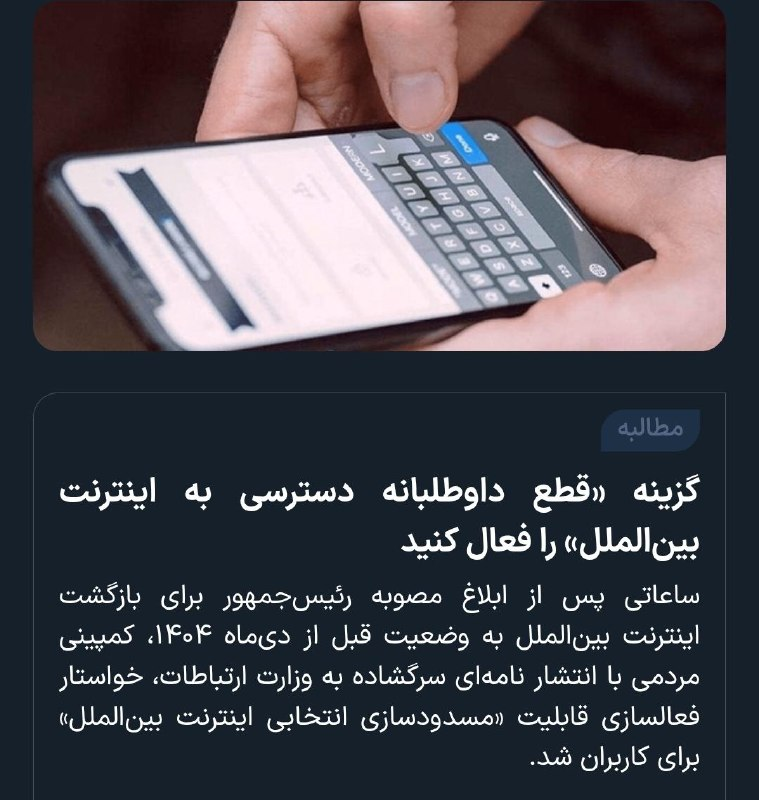

🔴 بعد از وصل شدن اینترنت، حالا خبرگزاری فارس یه کمپینی رو پوشش داده تحت عنوان "قطع داوطلبانه‌ی اینترنت بین‌الملل" و حرف‌شون اینه که:

"چرا اینترنت مارو وصل کردید؟ یه گزینه بذارید که خودمون بتونیم اینترنت بین‌الملل خودمونو قطع کنیم."

+ اینا سیمکارت سفید‌هایی هستن که از قطع اینترنت کاسبی میکنن تا دیروز جق میزدن فیلمش پخش میشد حالا رو شیشه هستن کمپین راه میندازن کاسبی کنن

@Dirty_Kids 👻

## Dirty_Kids — post 390646

  <a href="telegram/content/Dirty_Kids_390646_1780240672.mp4" target="_blank">🎬 Download video</a>

نیویورک پست یه گزارش تهیه کرده از دغدغه‌های ذهنی این روزهای آمریکاییا. واقعا آدم کله‌ش خراب میشه🤦🏻‍♂

@Dirty_Kids 👻

## Dirty_Kids — post 390645

  <a href="telegram/content/Dirty_Kids_390645_1780240675.mp4" target="_blank">🎬 Download video</a>

لیلاکامرانی: اروپا زندگی میکند،یکی ازهزاران پرستوی جمهوری اسلامی ،میگه هتل روزدن فقط من زنده موندم بالباس راحتی و بدون حجاب و برای باور پذیرتر بودن سوتین هم نپوشیده و پریده بیرون کولی بازی در میاره که وای کل هتل رو کشتن!
در طی جنگ ۱۲ روزه و ۳۸ روزه هیچ هتلی در تهران و در مل در ایران حتی آسیب هم ندیده چه برسه به هدف قرار گرفتن!

@Dirty_Kids 👻

## Dirty_Kids — post 390644

  

حالا من به تعدادش کاری ندارم
به سیس‌شم کاری ندارم
ناموسا شوهر فرد اعلا چیه؟ 😂😂

@Dirty_Kids 👻

## Dirty_Kids — post 390643

میدونید بدشانسی و بدبختی ما کجاست

فقط آخوند نیست که باید باهاش بجنگیم

چپ کسمغز و اروپایی نفهم و پاکستانی جاکش و عمانی بیناموس و دموکرات حروم زاده

همه وایسادن جلوی مردم ایران و به جمهوری اسلامی حرومزاده تر از خودشون کمک میکنند

@Dirty_Kids 👻

## Dirty_Kids — post 390642

  

چقدر جنده داره این مملکت؟

@Dirty_Kids 👻

## Dirty_Kids — post 390641

  

پسرا وقتی یه پسر دیگه قد بلند تر از خودشون میبینن:

@Dirty_Kids 👻

## Dirty_Kids — post 390640

‏- بوی یخچال می‌ده، من نمی‌خورم.

[کرم خاکی، سر میز شام، بعد از دفن مقام معظم رهبری]

@Dirty_Kids 👻

## Dirty_Kids — post 390639

  

خیلی قیافه کصکشی داره ازش خوشم میاد.

@Dirty_Kids 👻

## Dirty_Kids — post 390638

‏میری میپرسی اقا این عن چند میگه خانوم گرون شده پتروشیمی رو زدن دیگه عن تولید نمیشه.
قبلا بهانه دلار بود الان ‌پتروشیمی.

@Dirty_Kids 👻

## Dirty_Kids — post 390637

  <a href="telegram/content/Dirty_Kids_390637_1780240679.mp4" target="_blank">🎬 Download video</a>

عادل فردوسی‌پور اینجوری گزارشِ فینال چمپیونزلیگ رو شروع کرد:

فوتبال و تماشاش، تنها یک لحظه توقفه، نه نقطه فراموشی؛ فراموش نمی‌کنیم که بیرون از زمین در این چند ماه ، چه روزهای سختی بر مردم عزیز ما گذشت و میگذره؛ و چه جان های عزیز و بی‌گناهی از دست رفتن...

گزارش این بازی رو به همه مردم عزیزی که مظلومانه از بین ما رفتن و میتونستن تماشاگر پرشور این بازی باشن، تقدیم میکنم

پ‌ن: نظرات اینشکلی که؛ خیلیا میگن باهوش، خطرناک و شدیدا وسطباز به‌نفع رژیم بموقعش حرکت میزنه
بعضیا هم میگن خب بغل گوش آخوند چیکار کنه

@Dirty_Kids 👻

## Dirty_Kids — post 390636

حمله خبرگزاری دانشجو به همکاری امیرحسین قیاسی با دیجی کالا برای ساخت برنامه جام جهانی

+ بیننده ندارن جنگ زرگری راه انداختن

@Dirty_Kids 👻

## Dirty_Kids — post 390635

  <a href="telegram/content/Dirty_Kids_390635_1780240682.mp4" target="_blank">🎬 Download video</a>

مجتبی خامنه‌ای درحال نوشتن بیانیه جدید:

@Dirty_Kids 👻

## Dirty_Kids — post 390634

  <a href="telegram/content/Dirty_Kids_390634_1780240683.mp4" target="_blank">🎬 Download video</a>

هوش دستشویی از زجر الله معین

دوباره اینترنت وصل شد سموم اینستا پیداشون شد😂😂 داداش تو بنویس شاید خطت بهتر باشه.

@Dirty_Kids 👻

## Dirty_Kids — post 390632

‏شما با این حجم از شجاعت موافقید؟ یجور حرف میزنه انگار بی‌حجابی اجباریه و این دل شیر داشته که با چادر رفتی کافه، عقب مونده @Dirty_Kids 👻

## Dirty_Kids — post 390631

  <a href="telegram/content/Dirty_Kids_390631_1780240685.mp4" target="_blank">🎬 Download video</a>

🔴 دیشب عرزشیای حکومتی داشتن شعارِ "با قاتلین رهبر، مذکره نداریم | جان امام در خطره ، مذاکره بی‌ثمره" میدادن که آخرش یکی از مسئولین امنیت اومد بیرونشون کرد:

@Dirty_Kids 👻

## Dirty_Kids — post 390627

🔴 مسعود پزشکیان اینطوری و با پوشیدن تی‌شرت رفته تو یه جلسه رسمی :

اصلاحطلبا خیس کردن، عرزشی دارن میرن بهش، ماهم میگیم کصخاره جفتتون

@Dirty_Kids 👻

## Hranews — post 113280

اعتراضات دی‌ماه ۱۴۰۴؛ سه تن از بازداشت‌شدگان مجموعا به ۹ سال و ۳ ماه حبس محکوم شدند

❗️
❗️
❗️
❗️
❗️– محمدامین شمسی، امیر امرایی و کامیار امرایی، از بازداشت شدگان اعتراضات سراسری ۱۴۰۴، توسط مراجع قضایی مجموعا به ۹ سال و سه ماه حبس تعزیری محکوم شدند.

ادامه مطلب

#محمدامین_شمسی #امیر_امرایی #کامیار_امرایی

↘️
@hranews_bot تماس ✉️ - @Hranews کانال هرانا 🆑

## Hranews — post 113279

خوزستان؛ ۵۷ کارگر در سال ۱۴۰۴ قربانی حوادث کار شدند

❗️
❗️
❗️
❗️
❗️– مدیرکل پزشکی قانونی خوزستان اعلام کرد که طی سال ۱۴۰۴، دستکم ۵۷ #کارگر در این استان بر اثر حوادث ناشی از کار جان خود را از دست داده‌اند.

ادامه مطلب

↘️
@hranews_bot تماس ✉️ - @Hranews کانال هرانا 🆑

## Hranews — post 113278

  

مهدی انصاری، وکیل دادگستری به ۵ سال حبس محکوم شد

❗️
❗️
❗️
❗️
❗️ – مهدی انصاری، عضو کانون وکلای استان فارس و از بازداشت شدگان اعتراضات سراسری ۱۴۰۴، توسط دادگاه انقلاب شیراز به پنج سال #حبس و دو سال منع خروج از کشور محکوم شد.

به گزارش خبرگزاری هرانا، ارگان خبری مجموعه فعالان حقوق بشر در ایران، مهدی انصاری، وکیل دادگستری به حبس محکوم شد.

بر اساس اطلاعات دریافتی هرانا، یکی از شعب دادگاه انقلاب شیراز، آقای انصاری را بابت اتهام «اجتماع و تبانی به قصد بر هم زدن امنیت کشور»، به پنج سال حبس و دو سال منع خروج از کشور محکوم کرده است.

ادامه مطلب

#مهدی_انصاری

↘️
@hranews_bot تماس ✉️ -  @Hranews  کانال هرانا 🆑

## Hranews — post 113277

  

زندان اوین؛ غزل مرزبان ۷ روز است که در اعتصاب به سر می‌برد

❗️
❗️
❗️
❗️
❗️ – غزل مرزبان، نوکیش مسیحی محبوس در زندان اوین، از روز دوشنبه ۴ خردادماه، در اعتراض به صدور حکم بیش از ۹ سال حبس علیه خود، دست به #اعتصاب زده است.

به گزارش خبرگزاری هرانا، ارگان خبری مجموعه فعالان حقوق بشر در ایران، غزل مرزبان، نوکیش مسیحی، در هفتمین روز از اعتصاب غذای خود بسر می‌برد.

یک منبع مطلع از وضعیت این نوکیش مسیحی، ضمن تایید این خبر به هرانا گفت: “خانم مرزبان در اعتراض به حکم ۹ سال و هشت ماه حبس خود که اخیرا توسط  قاضی ایمان افشاری علیه وی صادر شده است، از تاریخ ۴ خرداد ۱۴۰۵، دست به اعتصاب غذا زده است. با گذشت هفت روز از آغاز اعتصاب غذا، وضعیت جسمانی او نامناسب است.”

ادامه مطلب

#غزل_مرزبان

↘️
@hranews_bot تماس ✉️ -  @Hranews  کانال هرانا 🆑

## Hranews — post 113276

  

اتهام «جاسوسی»؛ حسن و حسین امیری، برادران ۲۰ ساله به اعدام محکوم شدند

❗️
❗️
❗️
❗️
❗️ – حسن و حسین امیری، برادران دوقلوی ۲۰ ساله محبوس در زندان قزلحصار کرج، توسط شعبه ۲۶ دادگاه انقلاب تهران به ریاست قاضی ایمان افشاری به #اعدام محکوم شدند. این حکم بر اساس اتهام «#جاسوسی برای اسرائیل» علیه این افراد صادر شده است.

به گزارش خبرگزاری هرانا، ارگان خبری مجموعه فعالان حقوق بشر در ایران، حسن و حسین امیری به اعدام محکوم شدند.

بر اساس اطلاعات دریافتی هرانا، این حکم اخیرا توسط شعبه ۲۶ دادگاه انقلاب تهران، به ریاست قاضی ایمان افشاری علیه این برادران دوقلو صادر شده است. اتهام «جاسوسی برای اسرائیل»، مبنای صدور این رای قرار گرفته است.
یک منبع مطلع از وضعیت این دو جوان ۲۰ ساله، به هرانا گفت: «در کیفرخواست صادر شده علیه این افراد، مشاهده تصاویری از ساختمان‌های آسیب‌دیده، مبنای طرح اتهام «جاسوسی به نفع اسرائیل» در پرونده قرار گرفته بود. حسن و حسین امیری به دستور بازپرس پرونده به‌صورت جداگانه در زندان قزلحصار نگهداری می‌شوند و از حق ملاقات با یکدیگر محروم هستند. این دو زندانی در حال حاضر در سوئیت ۳۵ این زندان محبوس هستند.»

ادامه مطلب

#حسن_امیری
#حسین_امیری

↘️
@hranews_bot تماس ✉️ -  @Hranews  کانال هرانا 🆑

## Hranews — post 113275

  

سخنگوی کمیسیون بهداشت مجلس از کمبود حدود هزار قلم #دارو در کشور خبر داد و اعلام کرد که این وضعیت ناشی از مواردی همچون سو مدیریت، ترک فعل و مشکلات در تخصیص به‌موقع ارز است. به گفته سلمان اسحاقی، تاخیر در پرداخت مطالبات داروخانه‌ها و شرکت‌های پخش نیز فشار مضاعفی بر زنجیره #تامین_دارو وارد کرده و می‌تواند دسترسی بیماران به داروهای ضروری را با اختلال مواجه کند.

وی همچنین با اشاره به فعالیت «مافیای دارو» و ضرورت ورود دستگاه قضایی به این حوزه، نسبت به تداوم وضعیت موجود هشدار داد. سلمان اسحاقی تاکید کرد که نابرابری در توزیع دارو میان استان‌ها، ضعف عملکرد بیمه‌ها و ناکارآمدی در مدیریت نظام دارویی، می‌تواند منجر به نقض #حق_سلامت، کاهش دسترسی برابر به خدمات درمانی و افزایش خطرات جانی برای بیماران شود.

↘️
@hranews_bot تماس ✉️ -  @Hranews  کانال هرانا 🆑

## Hranews — post 113274

  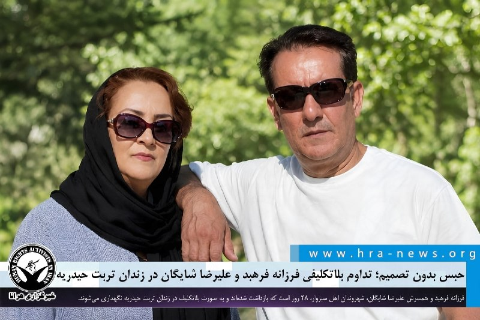

تداوم بازداشت و بلاتکلیفی فرزانه فرهبد و علیرضا شایگان در زندان تربت حیدریه

❗️
❗️
❗️
❗️
❗️ – فرزانه فرهبد، شاعر و مجری اهل سبزوار و همسرش علیرضا شایگان، معلم بازنشسته، در تاریخ ۲۵ فروردین‌ماه سال جاری، پس از احضار به اداره اطلاعات این شهرستان #بازداشت شدند. این شهروندان از آن زمان تاکنون به صورت بلاتکلیف در زندان تربت حیدریه نگهداری می‌شوند.

به گزارش خبرگزاری هرانا، ارگان خبری مجموعه فعالان حقوق بشر در ایران، فرزانه فرهبد و علیرضا شایگان، ۴۸ روز است که در بازداشت به‌ سر می‌برند.

بر اساس اطلاعات دریافتی هرانا، فرزانه فرهبد و همسرش، علیرضا شایگان، روز ۲۵ فروردین ۱۴۰۵ پس از احضار به اداره اطلاعات سبزوار بازداشت شدند. این زوج از زمان بازداشت تاکنون در زندان تربت حیدریه نگهداری می‌شوند و با گذشت بیش از دو ماه، همچنان در بلاتکلیفی قضایی به سر می‌برند.

ادامه مطلب

#فرزانه_فرهبد
#علیرضا_شایگان

↘️
@hranews_bot تماس ✉️ -  @Hranews  کانال هرانا 🆑

## Hranews — post 113273

بوکان؛ عثمان ذاکری، روحانی اهل سنت به خلع لباس روحانیت محکوم شد

❗️
❗️
❗️
❗️
❗️ – عثمان ذاکری، روحانی اهل سنت اهل بوکان، توسط دادگاه‌ ویژه روحانیت، به خلع لباس روحانیت محکوم شد.

ادامه مطلب

#عثمان_ذاکری

↘️
@hranews_bot تماس ✉️ -  @Hranews  کانال هرانا 🆑

## Hranews — post 113272

  

دادگاه تجدیدنظر؛ نیما حسن‌خانی به حبس و دیگر مجازات‌ها محکوم شد

❗️
❗️
❗️
❗️
❗️– نیما حسن‌خانی، یکی از بازداشت‌شدگان اعتراضات سراسری ۱۴۰۴، محبوس در زندان شیبان اهواز، توسط شعبه ۱۴ دادگاه تجدید نظر استان خوزستان به دو سال حبس و دیگر مجازات‌ها محکوم شد. یک سال از این محکومیت به حالت تعلیق درآمده است.

به گزارش خبرگزاری هرانا، ارگان خبری مجموعه فعالان حقوق بشر در ایران، نیما حسن‌خانی توسط دادگاه تجدیدنظر به حبس و دیگر مجازات‌ها محکوم شد.

بر اساس حکمی که توسط ۱۴ دادگاه تجدید نظر استان خوزستان صادر و به حسین‌علی حاتمی، وکیل مدافع این شهروند ابلاغ شده، آقای حسن‌خانی از بابت اتهامات تبلیغ علیه نظام و اخلال در نظم و آسایش از طریق شرکت در اعتراضات، به دو سال حبس، دو سال ممنوعیت خروج از کشور و یک سال حضور در ستاد امر به معروف و نهی از منکر است. یک سال از این محکومیت به حالت تعلیق درآمده است.

ادامه مطلب

#نیما_حسن‌خانی

↘️
@hranews_bot تماس ✉️ - @Hranews کانال هرانا 🆑

## Hranews — post 113271

  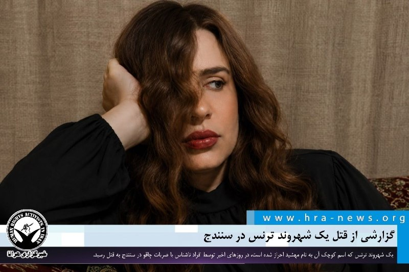

یک زن ترنس در سنندج به قتل رسید

❗️
❗️
❗️
❗️
❗️ – مهشید، یک زن #ترنس ۲۶ ساله، چند روز پیش در سنندج بر اثر ضربات چاقو توسط افراد ناشناس به قتل رسید.

به گزارش خبرگزاری هرانا، ارگان خبری مجموعه فعالان حقوق بشر در ایران، مهشید، زن ترنس و ساکن محله گلشن سنندج، جان خود را در پی حمله افراد ناشناس از دست داد.

یک منبع مطلع در این خصوص به هرانا گفت: «احتمالاً او روز جمعه توسط افراد ناشناس با ضربات چاقو به قتل رسیده است. مهاجمان پس از قتل، جسد مهشید را نیز مثله کرده‌اند.»
انگیزه و هویت عاملان این قتل تاکنون مشخص نشده است. با این حال، این منبع مطلع محلی در ادامه به هرانا گفت: «با توجه به نحوه وقوع این قتل و شرایط پیرامون آن، به نظر می‌رسد این جنایت با انگیزه نفرت صورت گرفته باشد. همچنین خانواده مهشید نیز برای پیگیری پرونده و اطلاع‌رسانی درباره این قتل تحت فشار و تهدید قرار گرفته‌اند؛ به‌طوری‌که تاکنون حتی آگهی ترحیمی نیز برای او منتشر نکرده‌اند.»

ادامه مطلب

#مهشید

↘️
@hranews_bot تماس ✉️ -  @Hranews  کانال هرانا 🆑

## Hranews — post 113270

تداوم بازداشت و بی‌خبری از وضعیت مجتبی ایروی در بیجار

❗️
❗️
❗️
❗️
❗️ – مجتبی ایروی، معلم بازنشسته اهل بیجار، ۹۰ روز است که توسط نیروهای امنیتی در بیجار #بازداشت شده و کماکان از وضعیت و محل نگهداری وی اطلاعی کسب نشده است. بی‌خبری از سرنوشت این شهروند، منجر به افزایش نگرانی‌های خانواده و بستگان وی شده است.

ادامه مطلب

#مجتبی_ایروی

↘️
@hranews_bot تماس ✉️ -  @Hranews  کانال هرانا 🆑

## Hranews — post 113269

  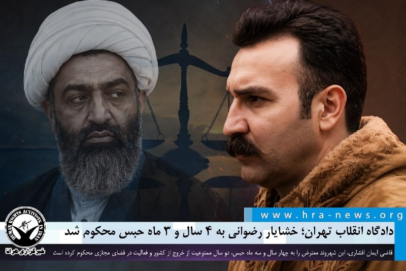

اعتراضات سراسری ۱۴۰۴؛ خشایار رضوانی به ۴ سال و ۳ ماه حبس محکوم شد

❗️
❗️
❗️
❗️
❗️– خشایار رضوانی، از بازداشت شدگان اعتراضات سراسری ۱۴۰۴، توسط شعبه ۲۶ دادگاه انقلاب تهران به چهار سال و سه ماه #حبس، دو سال ممنوعیت از خروج از کشور و فعالیت در فضای مجازی محکوم شد.

به گزارش خبرگزاری هرانا، ارگان خبری مجموعه فعالان حقوق بشر در ایران، خشایار رضوانی به حبس و مجازات‌های تکمیلی محکوم شد.

این حکم اخیرا توسط شعبه ۲۶ دادگاه انقلاب تهران، علیه آقای رضوانی صادر شده است. قاضی ایمان افشاری، خشایار رضوانی را از بابت اتهام «اجتماع و تبانی علیه امنیت داخلی و خارجی کشور» به سه سال و هفت ماه حبس تعزیری و از بابت اتهام «تبلیغ علیه نظام» به هشت ماه حبس تعزیری محکوم کرده است. بر اساس رای صادره، وی از بابت مجازات‌های تکمیلی، به دو سال منع خروج از کشور و فعالیت در فضای مجازی نیز محکوم شده است.

ادامه مطلب

#خشایار_رضوانی

↘️
@hranews_bot تماس ✉️ -  @Hranews  کانال هرانا 🆑

## Hranews — post 113268

امروز یکشنبه ۱۰ خردادماه، جمعی از بازنشستگان تامین اجتماعی در مقابل ساختمان این سازمان در شهرستان شوش دست به راهپیمایی و #تجمع اعتراضی زدند.

این بازنشستگان خواستار اجرای کامل ماده ۵۴ قانون تامین اجتماعی و ارتقای درمانگاه این شهر به پلی کلینیک، بازگشت امتیاز خلع شده تامین اجتماعی و رسیدگی به مشکلات معیشتی هستند.

↘️
@hranews_bot تماس ✉️ -  @Hranews  کانال هرانا 🆑

## Hranews — post 113267

  

جلسه دادگاه رسیدگی به اتهامات ۴ فعال ترک (آذربایجانی) برگزار شد

❗️
❗️
❗️
❗️
❗️ – جلسه رسیدگی به اتهامات عباس لسانی، علی خیرجو، یوسف کاری و بهزاد دشتی، فعالان ترک (آذربایجانی) روز گذشته در شعبه ۲۸ دادگاه انقلاب برگزار شد.

به گزارش خبرگزاری هرانا، ارگان خبری مجموعه فعالان حقوق بشر در ایران، روز شنبه ۹ خرداد ۱۴۰۵، جلسه دادگاه رسیدگی به اتهامات عباس لسانی، علی خیرجو، یوسف کاری و بهزاد دشتی، فعالان ترک (آذربایجانی) برگزار شد.

این جلسه در شعبه ۲۸ دادگاه انقلاب تهران به ریاست قاضی عموزاده برگزار شد و آقایان لسانی، خیرجو و کاری در اعتراض به آنچه «روند دادرسی غیرعادلانه» عنوان کرده‌اند، از حضور در جلسه خودداری کردند.

ادامه مطلب

#عباس_لسانی
#علی_خیرجو
#یوسف_کاری
#بهزاد_دشتی

↘️
@hranews_bot تماس ✉️ -  @Hranews  کانال هرانا 🆑

## Hranews — post 113266

اجرای حکم اعدام ۵ زندانی در زندان عادل آباد شیراز

❗️
❗️
❗️
❗️
❗️– سحرگاه امروز، حکم #اعدام پنج زندانی که پیشتر از بابت جرائم غیر سیاسی از جمله اتهامات مرتبط با جرائم مواد مخدر به اعدام محکوم شده بودند، در زندان عادل‌آباد شیراز به اجرا در آمد.

ادامه مطلب

↘️
@hranews_bot تماس ✉️ -  @Hranews  کانال هرانا 🆑

## Hranews — post 113265

  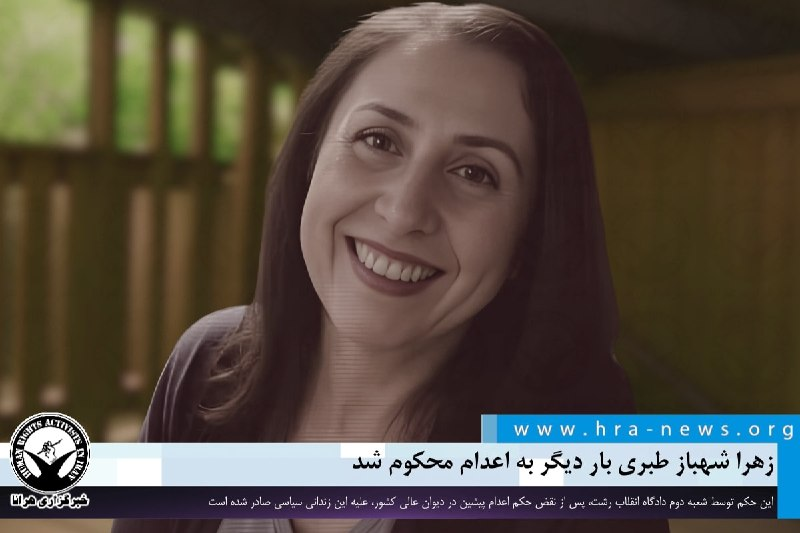

در پی نقض حکم؛ زهرا شهباز طبری مجددا به اعدام محکوم شد

❗️
❗️
❗️
❗️
❗️ – زهرا شهباز طبری، زندانی سیاسی محبوس در زندان لاکان رشت، پس از نقض حکم اعدام پیشین در دیوان عالی کشور، بار دیگر توسط شعبه دوم دادگاه انقلاب این شهر به #اعدام محکوم شد.

به گزارش خبرگزاری هرانا، ارگان خبری مجموعه فعالان حقوق بشر در ایران، زهرا شهباز طبری مجددا به اعدام محکوم شد.

شعبه دوم دادگاه انقلاب رشت به ریاست محمدعلی درویش‌گفتار، مجددا وی را با اتهام بغی از طریق عضویت و فعالیت در سازمان مجاهدین خلق ایران، به اعدام محکوم کرده است. این حکم در تاریخ ۲۵ فروردین‌ماه ۱۴۰۵ علیه این زندانی سیاسی صادر و اخیرا به او ابلاغ شده است.

ادامه مطلب

#زهرا_شهباز_طبری

↘️
@hranews_bot تماس ✉️ -  @Hranews  کانال هرانا 🆑

## alonews — post 123983

  <a href="telegram/content/alonews_123983_1780240690.webm" target="_blank">🎬 Download video</a>

👈خبرنگار الجزیره: دو حمله هوایی اسرائیل به شهرهای کفرسیر و شوکین در جنوب لبنان

✅ @AloNews خبر جنگ

## alonews — post 123982

  <a href="telegram/content/alonews_123982_1780240690.webm" target="_blank">🎬 Download video</a>

👈گروسی: حملات به تأسیسات هسته‌ای غیرقابل قبول است

✅ @AloNews خبر جنگ

## alonews — post 123981

  <a href="telegram/content/alonews_123981_1780240691.webm" target="_blank">🎬 Download video</a>

👈سی ان ان: ایران ۷۰ درصد سایت‌های موشکی خود که بمباران شده بود را باز کرد

🔴ترامپ نگرانی خود را از میزان سود مالی که ممکن است ایران در چارچوب توافق به دست آورد، ابراز کرد

🔴ترامپ بر عبارت‌های سختگیرانه‌تری در مورد تعهدات هسته‌ای ایران و وعده‌هایش برای بازگشایی تنگه هرمز اصرار دارد

✅ @AloNews خبر جنگ

## alonews — post 123980

  <a href="telegram/content/alonews_123980_1780240691.webm" target="_blank">🎬 Download video</a>

👈جدیدترین کمپین در خبرگزاری فارس با عنوان قطع داوطلبانه نت بین الملل!

✅ @AloNews خبر جنگ

## alonews — post 123979

  <a href="telegram/content/alonews_123979_1780240691.webm" target="_blank">🎬 Download video</a>

👈سی‌بی‌اس نیوز به نقل از یک منبع:
در حال حاضر هیچ ضرب‌الاجل یا چارچوب زمانی مشخصی برای دستیابی به توافق در مورد ایران وجود ندارد

✅ @AloNews خبر جنگ

## alonews — post 123978

  <a href="telegram/content/alonews_123978_1780240691.webm" target="_blank">🎬 Download video</a>

👈 پزشکیان: خدمات‌رسانی دولت در هر شرایطی ادامه خواهد داشت

🔴دولت با تمام توان و ظرفیت خود مسیر خدمت به مردم را ادامه خواهد داد و ادارۀ امور کشور با قدرت و صلابت دنبال خواهد شد.

🔴بخشی از مشکلات اقتصادی کشور ناشی از محدودیت‌های بیرونی و بخشی نیز ناشی از فشارهایی است که در نتیجه شرایط خاص کشور ایجاد شده است.

🔴دولت و تمامی دستگاه‌های اجرایی با تمام توان در تلاش هستند تا کشور با کمترین هزینه و آسیب از این شرایط عبور کند.

✅ @AloNews خبر جنگ

## alonews — post 123977

  <a href="telegram/content/alonews_123977_1780240692.mp4" target="_blank">🎬 Download video</a>

👈وزیر خزانه‌داری ایالات متحده اسکات بسنت درباره ایران: اطمینان از باز بودن تنگه هرمز، دریافت اورانیوم بسیار غنی‌شده، و اینکه ایران سلاح هسته‌ای نداشته باشد — این پایان دادن به کار است.

🔴این اولین بار است که ایرانی‌ها در ۴۷ سال گذشته حاضر به بحث درباره نداشتن سلاح هسته‌ای شده‌اند.

✅ @AloNews خبر جنگ

## alonews — post 123976

  <a href="telegram/content/alonews_123976_1780240694.webm" target="_blank">🎬 Download video</a>

⚫
🏆 به دنیای هیجان‌انگیز فوتبال خوش اومدی!

⭐️اینجا قراره باهم لحظه‌به‌لحظه‌ی جام جهانی رو زندگی کنیم؛
از بازی‌های حساس و نتایج داغ گرفته تا حاشیه‌ها، کری‌خونی‌ها و اتفاقاتی که همه درباره‌ش حرف میزنن! 
🔥
🔥

✅ پوشش کامل مسابقات

💀ترول تیم‌ها و بازیکن‌ها

🎥ویدیوها و لحظه‌های فان فوتبالی

📊آمار، ترکیب‌ها و اخبار فوری

🌍حواشی جذاب از سراسر جام جهانی

📢اینجا فقط یک کانال خبری نیست؛
یک جمع فوتبالیه برای کسایی که فوتبال رو با هیجان، شوخی و احساس واقعی دنبال میکنن 
📛
💟

🆘
🔞 آماده باش چون قراره جام جهانی رو متفاوت تجربه کنیم!

⚡ @Vaarzesh_Plus

⚡ @Vaarzesh_Plus

## alonews — post 123975

  <a href="telegram/content/alonews_123975_1780240695.webm" target="_blank">🎬 Download video</a>

👈منابع خبری مدعی حمله موشکی به حزب ضد «پاک» در کردستان عراق شدند.

🔴یک مقام حزب آزادی کردستان به روداو گفت که روز یکشنبه پایگاه مهم وابسته به این گروه مخالف ایران نزدیک اربیل هدف حمله موشکی قرار گرفت.

✅ @AloNews خبر جنگ

## alonews — post 123974

  <a href="telegram/content/alonews_123974_1780240695.webm" target="_blank">🎬 Download video</a>

👈شبکه LBCI لبنان: روبیو دو روز دیگر آتش‌بس فراگیر در لبنان را اعلام می‌کند

✅ @AloNews خبر جنگ

## alonews — post 123973

  <a href="telegram/content/alonews_123973_1780240695.webm" target="_blank">🎬 Download video</a>

👈 ترامپ: با کمال خرسندی اعلام می‌کنم که تام باراک، سفیر ایالات متحده در ترکیه، که عملکرد فوق‌العاده‌ای داشته است، به عنوان فرستاده ویژه ریاست جمهوری در سوریه و عراق منصوب خواهد شد، و ما همکاری استراتژیک خود را با هر دو دولت پیش خواهیم برد.

🔴تام با حمایت کامل وزارت امور خارجه، سفیر ایالات متحده در ترکیه باقی خواهد ماند.


✅ @AloNews خبر جنگ

## alonews — post 123972

  <a href="telegram/content/alonews_123972_1780240695.webm" target="_blank">🎬 Download video</a>

👈حزب‌الله با پهپاد FPV مستقیم به کابین یه خودروی امدادی اسرائیلی حمله کرد

✅ @AloNews خبر جنگ

## alonews — post 123971

  <a href="telegram/content/alonews_123971_1780240696.webm" target="_blank">🎬 Download video</a>

👈سی‌بی‌اس: میانجی‌ها به مذاکرات توافق تهران-واشنگتن ادامه می‌دهند؛ ترامپ متن توافق را جمعه بازبینی کرد و آن را برای تأیید به ایران فرستاد، پاسخ هنوز در انتظار است

✅ @AloNews خبر جنگ

## alonews — post 123970

  <a href="telegram/content/alonews_123970_1780240696.webm" target="_blank">🎬 Download video</a>

👈رویترز: جمع‌آوری سلاح توسط اهالی گرینلند از ترس حمله احتمالی آمریکا

🔴برخی از اهالی گرینلند به رویترز گفته‌اند که برای مقابله با حمله احتمالی ایالات متحده، اقدام به جمع‌آوری اسلحه و مهمات کرده‌اند. یکی از مدیران معدن با یادآوری اینکه پسرش گفته بود برای آمادگی در برابر تهاجم قصد خرید مهمات دارد، به گریه افتاد.

✅ @AloNews خبر جنگ

## alonews — post 123969

  <a href="telegram/content/alonews_123969_1780240696.webm" target="_blank">🎬 Download video</a>

👈وزارت جنگ آمریکا قصد دارد در ماه ژوئن، برنامه‌های مشخصی برای خروج بخشی از نیروهای خود از اروپا را در بروکسل، مقر ناتو ارائه دهد

✅ @AloNews خبر جنگ

## alonews — post 123967

  <a href="telegram/content/alonews_123967_1780240696.webm" target="_blank">🎬 Download video</a>

👈یک راکت حزب‌الله بین منازل مسکونی در روستای مسیحی نشین رمیچ جنوب لبنان سقوط کرد. که تلفات جانی نداشت.

✅ @AloNews خبر جنگ

## alonews — post 123966

  <a href="telegram/content/alonews_123966_1780240697.webm" target="_blank">🎬 Download video</a>

👈مدیر عامل پارس جنوبی: بازگشت سه سکوی فراساحلی میدان مشترک پارس جنوبی به مدار تولید

🔴 مدیرعامل شرکت نفت و گاز پارس از بازگشت سه سکوی فراساحلی میدان مشترک پارس جنوبی به مدار تولید پس از جنگ‌ تحمیلی سوم خبر داد.

✅ @AloNews خبر جنگ

## alonews — post 123965

  <a href="telegram/content/alonews_123965_1780240697.webm" target="_blank">🎬 Download video</a>

👈جروزالم پست: درخواست فرانسه برای نشست اضطراری شورای امنیت درباره لبنان

🔴ژان نوئل بارو، وزیر امور خارجه فرانسه، اعلام کرد که در واکنش به عملیات نظامی جاری اسرائیل در لبنان، خواستار تشکیل جلسه اضطراری شورای امنیت سازمان ملل متحد شده است

✅ @AloNews خبر جنگ

## alonews — post 123964

  <a href="telegram/content/alonews_123964_1780240697.webm" target="_blank">🎬 Download video</a>

👈قائم مقام معاونت راهبردی رئیس جمهور: تراکنش مالی وابسته به تنگه هرمز حدود ۲۰۰۰ میلیارد دلار در سال است

✅ @AloNews خبر جنگ

<!-- MSG END -->

<!-- NAV START -->

<a href="https://github.com/HypoIReMIA/aio-downloader/blob/main/telegram/content/archive_1.md" style="display:inline-block; padding:6px 12px; margin:0 4px; background-color:#2ea44f; color:white; text-decoration:none; border-radius:4px; font-weight:bold;">صفحه بعد</a>

<!-- NAV END -->
